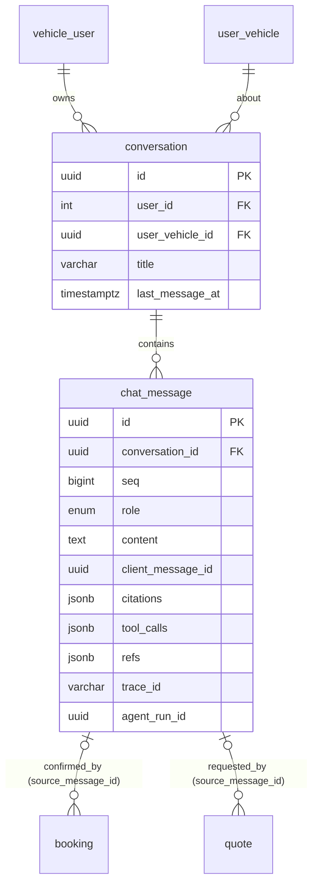

# Entity Specification — Hội thoại & tin nhắn chat (F4)

> **Cập nhật phạm vi (02/10/2026):** các phần dưới đây trong tài liệu này không còn áp dụng.
>
> - Báo giá / duyệt báo giá (`quote`, `quote_item`, us-049): **đã bỏ**. Đặt lịch không gắn báo giá; mọi con số chi phí là ước tính (F5), chi phí cuối cùng do xưởng xác nhận khi kiểm tra xe.

> Đặc tả dữ liệu cho `FEAT-CHAT-001` (PRD F4, US-025 → US-030).
>
> **Nguồn nghiệp vụ:** [Functional Spec](../feature-functional/us-025-sprint-2-spec.ff.md) · **API:** [API Spec](../api/us-025-sprint-2-spec.api.md) · **Agent:** [AI-001](../../ai-agent/ai-001-sprint-2-spec.agent.md)
>
> Thay thế các bảng `conversation` / `message` đang **PROVISIONAL** trong code (`backend/src/common/core/conversation/`) — xem §Migration. Điểm chưa chốt đánh dấu `[Đề xuất]`.

---

# 0. Tổng quan

## 0.1 Entity của tài liệu này

| Entity ID | Entity | Table | Trạng thái | Vai trò |
| --- | --- | --- | --- | --- |
| `ENT-421` | `Conversation` | `conversation` | Mới (thay bản PROVISIONAL) | Một hội thoại giữa chủ xe và Agent về một xe |
| `ENT-422` | `ChatMessage` | `chat_message` | Mới (thay bảng `message` PROVISIONAL) | Một tin nhắn: của chủ xe, của trợ lý, hoặc kết quả tool |

## 0.2 Thay đổi trên entity đã có

| Entity | Thay đổi | Lý do |
| --- | --- | --- |
| `booking` (ENT-402) | Thêm cột `source_message_id uuid NULL` FK → `chat_message.id` `ON DELETE SET NULL` | AC-F4-06: truy ngược booking về tin nhắn xác nhận (BR-ENT-460) |
| `quote` (ENT-410) | Thêm cột `source_message_id uuid NULL` FK → `chat_message.id` `ON DELETE SET NULL` | Chủ xưởng xem đoạn hội thoại dẫn tới báo giá (BR-ENT-460) |

> Cần cập nhật [booking.entity.md](../../entity/maintenance/booking.entity.md), [quote.entity.md](../../entity/maintenance/quote.entity.md) và [core.entity.md](../../entity/core.entity.md) (bảng chỉ mục §14) khi spec này được duyệt. Chưa sửa trong lần viết này.

## 0.3 Bảng do thư viện quản lý (không phải entity của EV Care)

LangGraph Postgres checkpointer tự tạo và quản lý các bảng lưu trạng thái Agent (`checkpoints`, `checkpoint_blobs`, `checkpoint_writes`, `checkpoint_migrations`). Khoá liên kết: `thread_id = conversation.id` (dạng chuỗi).

- Backend **không** đọc/ghi trực tiếp; chỉ qua API của thư viện.
- Khi xoá hội thoại phải xoá theo `thread_id` (BR-ENT-462).
- Không đặt FK giữa các bảng này và `conversation` (thư viện sở hữu schema); tính nhất quán do `ConversationService.delete` bảo đảm và job dọn quét bản ghi mồ côi.

## 0.4 ER

---

# ENT-421, ENT-422 — Định nghĩa tại entity nền tảng

Hội thoại và tin nhắn là **entity nền tảng dùng chung**, nên được định nghĩa ở thư mục entity theo domain (không thuộc riêng F4):

| Entity ID | Entity | Table | Spec |
| --- | --- | --- | --- |
| `ENT-421` | `Conversation` | `conversation` | [conversation.entity.md](../../entity/conversation/conversation.entity.md) |
| `ENT-422` | `ChatMessage` | `chat_message` | [chat_message.entity.md](../../entity/conversation/chat_message.entity.md) |
| `ENT-423` | `VectorEmbedding` | `vector_embedding` | [vector_embedding.entity.md](../../entity/conversation/vector_embedding.entity.md) (lập chỉ mục ngữ nghĩa, tuỳ chọn) |

Phần dưới của tài liệu này chỉ giữ những gì **riêng cho F4**: thay đổi trên `booking`/`quote` (§0.2), bảng do checkpointer quản lý (§0.3) và bảng chuyển đổi từ bản PROVISIONAL.

---

# Migration từ bảng PROVISIONAL

Hiện trạng: `backend/src/common/core/conversation/{conversation,message}.py`, migration `b7e1c2f34d58_add_conversation_and_vector_store.py` (chưa commit).

| Hạng mục | Hiện tại | Theo spec này |
| --- | --- | --- |
| Tên bảng tin nhắn | `message` | `chat_message` |
| `conversation.user_id` | `varchar(64)`, không FK | `integer` FK → `vehicle_user.user_id` |
| `conversation.user_vehicle_id` | không có | thêm (bắt buộc) |
| `conversation.last_message_at` | không có | thêm |
| `message.role` | `system / user / assistant` | `user / assistant / tool` |
| `message.metadata` (JSONB tự do) | có | thay bằng cột có cấu trúc: `citations`, `tool_calls`, `refs`, `intent`, `agent_run_id`, `trace_id` |
| `message.embedded` + vector hoá tin nhắn | có, luôn bật | giữ `embedded` nhưng **tuỳ chọn** (cờ `CONVERSATION_SEMANTIC_INDEX_ENABLED`, mặc định tắt cho F4 — Q-604); F4 tìm bằng `search_vector` |
| Thứ tự | `created_at` | `seq` |
| Chống trùng | không | `client_message_id` + unique một phần |
| Realtime | Redis Pub/Sub + WebSocket | SSE trực tiếp từ luồng của lượt xử lý (Q-606) |
| Xác thực | không (`TODO(auth)`) | Firebase ID token + kiểm tra sở hữu |

Vì bảng chưa lên môi trường thật, `[Đề xuất]` **sửa lại migration `b7e1c2f34d58` cho phần chat** thay vì thêm migration đổi tên.

---

# Open Questions

| ID | Question | Owner | Status |
| --- | --- | --- | --- |
| `Q-611` | `booking.source_message_id` / `quote.source_message_id` thêm vào ENT-402/410 hay dùng bảng liên kết riêng? | Backend | `[Đề xuất]` cột FK — đơn giản, cùng transaction (BR-ENT-460) |
| `Q-612` | Có cần `chat_message.card` không, hay thẻ UI tính lại từ `refs`? | AI Team | `[Đề xuất]` giữ `card` để hiển thị lại đúng như lúc trả lời |
| `Q-613` | Cấu hình từ điển tìm kiếm tiếng Việt: `simple` + bỏ dấu đủ chưa, hay cần tách từ? | Backend | `[Đề xuất]` `simple` + bỏ dấu cho MVP |
| `Q-614` | Có cần cột `token_usage` (chi phí LLM theo tin nhắn) không? | AI Team | `[Đề xuất]` để trace/observability, không thêm cột |
| Tham chiếu | Q-601, Q-604, Q-606 | — | Xem [FF §24](../feature-functional/us-025-sprint-2-spec.ff.md#24-open-questions) |

---

# Change Log

| Version | Date | Author | Changes |
| --- | --- | --- | --- |
| `v1.0` | `2026-09-28` | Team 4 Người | Initial version — ENT-421 `conversation`, ENT-422 `chat_message`; thêm `source_message_id` cho booking/quote (đề xuất); ghi nhận bảng checkpointer |

# Approval

| Role | Name | Status | Date |
| --- | --- | --- | --- |
| Product / Business | Lê Đức Tùng | Pending | |
| Technical Owner | Tech Lead | Pending | |
| Data Owner | Backend Team | Pending | |
