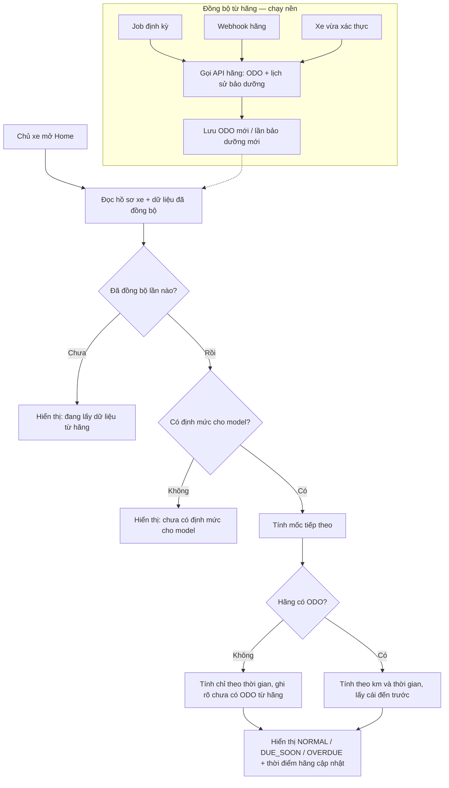
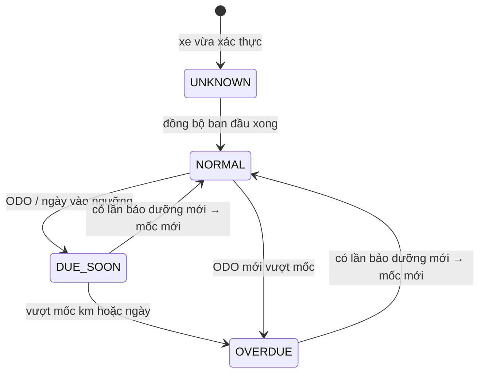

# Functional Specification — Hồ sơ xe & Trạng thái đến hạn bảo dưỡng

> Tài liệu đặc tả chức năng/nghiệp vụ cho Feature **F3 — Hồ sơ xe & trạng thái đến hạn** trong [PRD EV Care MVP](../../../product/PRD_EV_Care_MVP.md#f3--hồ-sơ-xe--trạng-thái-đến-hạn).
>
> **Ghi chú:** Điểm nghiệp vụ PRD chưa chốt được đánh dấu `[Đề xuất]` (có giá trị mặc định để triển khai) hoặc `[Cần xác nhận]`, và được liệt kê lại ở mục 24 — Open Questions.

---

# 1. Document Information

| Field | Value |
|---|---|
| Feature ID | `FEAT-VEH-001` |
| Feature Name | `Hồ sơ xe & Trạng thái đến hạn bảo dưỡng` |
| PRD Feature | `F3` (Must, S1–S2) |
| Document Version | `v1.1` |
| Status | `Draft` |
| Product / Project | EV Care — AI Agent Chăm sóc sau bán & lịch bảo dưỡng xe điện |
| Business Owner | Lê Đức Tùng (PO) |
| Author | Team 4 Người |
| Reviewer | Tech Lead |
| Stakeholders | Product, Frontend, Backend, AI Team, Hệ thống hãng xe |
| Created Date | `2026-09-28` |
| Updated Date | `2026-09-28` |
| Related PRD | [PRD_EV_Care_MVP.md §F3](../../../product/PRD_EV_Care_MVP.md) (v3.3) |
| Related Frontend Spec | [us-017-sprint-2-spec.fe.md](../frontend/us-017-sprint-2-spec.fe.md) |
| Related API Spec | [us-017-sprint-2-spec.api.md](../api/us-017-sprint-2-spec.api.md) |
| Related Entity Spec | [us-017-sprint-2-spec.entity.md](../entity/us-017-sprint-2-spec.entity.md) |
| Related Design / Figma | [wireframe.md](../../../design/wireframe.md) |
| Related GitHub Issue | `[Cần điền]` |

---

# 2. Feature Overview

## 2.1 Feature Description

Sau khi onboarding thành công (FEAT-AUTH-001), chủ xe có một **hồ sơ xe** gồm thông tin đã được hãng xác thực (model, phiên bản, VIN, biển số, thông số pin/động cơ, bảo hành theo hạng mục), **ODO hiện tại** và **lần bảo dưỡng gần nhất**. Từ hồ sơ này, hệ thống tính **mốc bảo dưỡng tiếp theo** và **trạng thái đến hạn** (`NORMAL` / `DUE_SOON` / `OVERDUE`) theo định mức của hãng (`maintenance_rule`).

**Nguồn dữ liệu trạng thái xe:** ODO do **hãng thu thập từ xe**; lịch sử bảo dưỡng do **hãng ghi nhận**. EV Care nhận các dữ liệu này về bằng hai cơ chế:

1. **Đồng bộ định kỳ** — job của EV Care gọi API hãng theo lịch.
2. **Webhook** — hãng gọi sang EV Care khi có dữ liệu mới; EV Care đồng bộ ngay xe đó.

Chủ xe **không nhập, không sửa** ODO hay lịch sử bảo dưỡng. Màn hình và AI Agent đọc bản đã đồng bộ, không gọi hãng mỗi lần xem. Mọi phép tính do backend thực hiện; AI Agent chỉ đọc kết quả và diễn giải.

## 2.2 Business Objective

Giải quyết PP-01 (áp lực tuân thủ lịch bảo dưỡng định kỳ) — mục tiêu G1: chủ xe biết xe đang ở trạng thái nào và mốc tiếp theo cần làm gì. Trạng thái đến hạn là đầu vào cho F4 (chat RAG), F5 (dự toán), F6 (đặt lịch), F7 (nhắc mốc).

## 2.3 User Objective

Mở app là thấy ngay: xe đang Bình thường / Sắp đến hạn / Quá hạn, còn bao nhiêu km hoặc bao nhiêu ngày tới mốc, mốc đó gồm những hạng mục nào — không phải tự khai số km.

## 2.4 Business Value

- Chủ xe không phải tự nhớ mốc bảo dưỡng và không phải tự khai báo số km.
- Số km lấy từ dữ liệu chính thức của hãng nên đáng tin hơn số khai tay.
- UI, AI Agent và job nhắc dùng chung một kết quả tính.

---

# 3. Scope

## 3.1 In Scope

- Xem hồ sơ xe đã xác thực: định danh, thông số kỹ thuật, bảo hành theo hạng mục.
- Đồng bộ ODO và lịch sử bảo dưỡng từ hãng: định kỳ, qua webhook, và một lần ngay sau khi xác thực xe.
- Hiển thị ODO hiện tại kèm thời điểm hãng cập nhật.
- Xác định lần bảo dưỡng gần nhất (lịch sử của hãng, lần hoàn tất qua EV Care; chưa có thì dùng ngày mua).
- Tính mốc tiếp theo và trạng thái đến hạn theo quy tắc "km hoặc thời gian, cái nào đến trước".
- Xử lý xe hãng chưa có ODO (chỉ tính theo thời gian).
- Cung cấp kết quả tính cho AI Agent qua tool đọc.

## 3.2 Out of Scope

- **Chủ xe nhập / sửa ODO hoặc lịch sử bảo dưỡng** — không có trong sản phẩm.
- Chủ xe bấm "đồng bộ ngay" — dữ liệu được đồng bộ tự động.
- Dự toán chi phí theo mốc (F5): F3 trả tên hạng mục và cờ bảo hành, **không** trả giá.
- Gửi nhắc mốc (F7) — F7 dùng lại kết quả tính của F3.
- Nhiều xe/tài khoản, chuyển nhượng, gỡ liên kết xe.
- SOH pin, telematics chi tiết, ODO realtime (theo từng giây).

---

# 4. Actors & Stakeholders

## 4.1 Actors

| Actor | Type | Responsibility |
|---|---|---|
| Chủ xe | User | Xem hồ sơ xe và trạng thái đến hạn |
| Hệ thống hãng xe | System / Partner | Thu thập ODO từ xe; ghi lịch sử bảo dưỡng; cung cấp API đọc; gọi webhook khi có dữ liệu mới |
| Job đồng bộ EV Care | System | Kéo ODO và lịch sử bảo dưỡng từ hãng theo lịch và khi nhận webhook |
| Backend EV Care | System | Lưu dữ liệu đồng bộ, tính mốc và trạng thái |
| AI Agent | System | Gọi tool đọc trạng thái để diễn giải trong chat (F4) |

## 4.2 Stakeholders

| Stakeholder | Organization / Team | Interest / Responsibility |
|---|---|---|
| Product Owner | Product | Chốt ngưỡng `DUE_SOON` (PQ-01), tần suất đồng bộ, các quy tắc `[Đề xuất]` |
| Backend Team | Engineering | Job đồng bộ, webhook, service tính trạng thái, API |
| Frontend Team | Engineering | Home, màn hồ sơ xe |
| AI Team | Engineering | Tool `get_maintenance_status` |
| Hệ thống hãng | Partner | Hợp đồng API đọc + webhook |

---

# 5. User Story

## US-017

**As a** chủ xe đã hoàn tất onboarding

**I want to** thấy trạng thái đến hạn bảo dưỡng và mốc tiếp theo của xe ngay trên Home

**So that** tôi không bỏ lỡ mốc bảo dưỡng và biết cần làm gì tiếp theo.

### Additional User Stories

- `US-018`: As a chủ xe, I want to xem hồ sơ xe gồm thông số, bảo hành, số km và lần bảo dưỡng gần nhất do hãng ghi nhận, so that tôi biết xe mình được hãng ghi nhận những gì.
- `US-019`: As a hệ thống EV Care, I want to tự đồng bộ ODO và lịch sử bảo dưỡng từ hãng (định kỳ và qua webhook), so that trạng thái đến hạn luôn tính trên dữ liệu mới của hãng mà chủ xe không phải khai báo.
- `US-020`: As a AI Agent, I want to lấy trạng thái đến hạn đã được backend tính sẵn, so that tôi trả lời chủ xe mà không phải hỏi lại model/ODO và không tự tính.

---

# 6. Use Case

## UC-301 — Xem trạng thái đến hạn trên Home

### 6.1 Use Case Description

Chủ xe mở Home; hệ thống hiển thị thẻ xe với trạng thái đến hạn, mốc tiếp theo, khoảng cách còn lại (km, ngày) và thời điểm hãng cập nhật ODO.

### 6.2 Primary Actor

Chủ xe

### 6.3 Supporting Actors / Systems

Backend EV Care (đọc dữ liệu đã đồng bộ)

### 6.4 Trigger

Chủ xe mở Home hoặc kéo để tải lại màn hình.

### 6.5 Preconditions

- Tài khoản `ACTIVE`; xe `verified` + `link_status = active`.

### 6.6 Postconditions

Chủ xe thấy trạng thái đến hạn tính trên dữ liệu hãng đã đồng bộ gần nhất. Không có dữ liệu nào bị thay đổi.

## UC-302 — Đồng bộ dữ liệu xe từ hãng

### 6.1 Use Case Description

EV Care lấy ODO hiện tại và lịch sử bảo dưỡng của xe từ hãng và lưu lại.

### 6.2 Primary Actor

Job đồng bộ EV Care

### 6.3 Supporting Actors / Systems

Hệ thống hãng xe

### 6.4 Trigger

Một trong các sự kiện:

| Trigger | Khi nào | Phạm vi |
|---|---|---|
| Đồng bộ định kỳ | Mỗi 120 phút (Q-309) | Mọi xe `verified` + `active` |
| Webhook của hãng | Hãng báo có ODO mới hoặc có lần bảo dưỡng mới | Xe được nêu trong webhook |
| Đồng bộ ban đầu | Ngay sau khi xe xác thực thành công (FEAT-AUTH-001) | Xe vừa xác thực |

### 6.5 Preconditions

Xe có mã xe của hãng (`external_vehicle_id`).

### 6.6 Postconditions

- ODO mới (nếu có) và lần bảo dưỡng mới (nếu có) được lưu.
- Thời điểm đồng bộ thành công được ghi nhận cho xe.
- Lần tính trạng thái tiếp theo dùng dữ liệu mới.

---

# 7. User Flow

## 7.1 Main User Flow



## 7.2 Flow Description

| Step | Actor | Action / Event | System Response | Result |
|---|---|---|---|---|
| 1 | System | Job định kỳ / webhook / xe vừa xác thực | Gọi API hãng lấy ODO + lịch sử bảo dưỡng; lưu phần mới (BR-011) | Dữ liệu đồng bộ mới |
| 2 | Chủ xe | Mở Home | Đọc xe đang liên kết | Có `userVehicleId` |
| 3 | System | Lấy ODO hiện tại | Từ dữ liệu đã đồng bộ (BR-004) | ODO hoặc không có ODO |
| 4 | System | Lấy mốc gốc | Lần bảo dưỡng gần nhất / ngày mua (BR-005) | Mốc gốc |
| 5 | System | Tính mốc tiếp theo | BR-006, BR-007 | Mốc km + ngày đến hạn |
| 6 | System | Tính trạng thái | BR-001, BR-002 | `NORMAL` / `DUE_SOON` / `OVERDUE` |

---

# 8. Screen / UI Flow

> UI minh hoạ **nghiệp vụ**. Chi tiết component, loading/empty/error state thuộc Frontend Spec.

## 8.1 Screen Flow

```text
[SCR-301 Home — thẻ xe + trạng thái đến hạn]
    |
    +----> [SCR-302 Hồ sơ xe chi tiết]
    |
    +----> [Chat F4 / Dự toán F5]  (CTA theo trạng thái — ngoài phạm vi F3)
```

## 8.2 Screen List

| Screen ID | Screen Name | Purpose | Entry From | Exit To |
|---|---|---|---|---|
| `SCR-301` | Home — thẻ xe | Trạng thái đến hạn, mốc tiếp theo | Đăng nhập thành công | SCR-302, Chat |
| `SCR-302` | Hồ sơ xe | Thông tin xe, bảo hành, ODO, lần bảo dưỡng gần nhất | SCR-301 | SCR-301 |

## 8.3 Screen / UI Reference

### SCR-301 — Home: thẻ xe

**Main UI**

- Tên xe: model + phiên bản, biển số.
- Nhãn trạng thái: **Bình thường** / **Sắp đến hạn** / **Quá hạn**.
- Mốc tiếp theo: "Mốc 12.000 km / 12 tháng".
- Khoảng cách: "Còn 400 km · 17 ngày" hoặc "Quá 300 km" / "Quá 10 ngày".
- ODO hiện tại + "Hãng cập nhật lúc 09:00 28/09".
- Ghi chú khi cần: "Hãng chưa có dữ liệu số km — trạng thái tính theo thời gian" (AF-001), hoặc "Số km được hãng cập nhật lần cuối ngày …" khi dữ liệu cũ (BR-009).
- Danh sách hạng mục của mốc (rút gọn), đánh dấu hạng mục trong bảo hành.

**User Action:** Xem; mở hồ sơ xe; chuyển sang chat. **Không có** nút nhập/cập nhật số km.

**System Behavior:** Hiển thị đúng giá trị backend trả về; FE không tự tính.

### SCR-302 — Hồ sơ xe

**Main UI**

- Định danh: model, phiên bản, màu, năm sản xuất, VIN (che giữa), biển số.
- Thông số: dung lượng pin (kWh), công suất động cơ (kW).
- Bảo hành theo hạng mục: ngày hết hạn, giới hạn km, còn hiệu lực hay không.
- ODO hiện tại và thời điểm hãng cập nhật.
- Lần bảo dưỡng gần nhất (ngày, km, nơi làm) hoặc "Chưa có lịch sử — tính từ ngày mua".
- Dòng nguồn dữ liệu: "Dữ liệu do hãng cung cấp".

**User Action:** Chỉ xem. Mọi thông tin đều do hãng cung cấp; sai lệch thì liên hệ hãng/xưởng.

---

# 9. Main Flow

## 9.1 Happy Path

1. Hãng thu thập ODO từ xe VF6 (mua 15/10/2025, chưa bảo dưỡng lần nào): 11.600 km.
2. Job đồng bộ của EV Care (hoặc webhook của hãng) lấy về và lưu ODO 11.600 km.
3. Chủ xe mở Home ngày 28/09/2026.
4. Không có lịch sử bảo dưỡng → mốc gốc là ngày mua 15/10/2025, km 0.
5. Định mức VF6: mốc đầu 12.000 km / 12 tháng → ngày đến hạn 15/10/2026.
6. Còn 400 km, còn 17 ngày → 400 ≤ 500 km ⇒ `DUE_SOON`, lý do: km.
7. Home hiển thị "Sắp đến hạn · Mốc 12.000 km / 12 tháng · Còn 400 km · 17 ngày · Hãng cập nhật lúc …" (AC-001).

---

# 10. Alternative Flow

## AF-001 — Hãng chưa có ODO của xe

**Condition:** API hãng không có dữ liệu ODO cho xe.

**Flow:**

1. Tính mốc tiếp theo và trạng thái **chỉ theo thời gian** (EDGE-001 của core).
2. Home ghi "Hãng chưa có dữ liệu số km — trạng thái tính theo thời gian".

**Expected Result:** Chủ xe vẫn thấy trạng thái. Khi hãng có ODO, lần đồng bộ tiếp theo cập nhật và trạng thái tính theo cả km lẫn thời gian (AC-002, AC-003).

## AF-002 — Hãng gửi webhook có dữ liệu mới

**Condition:** Hãng gọi webhook báo ODO mới hoặc lần bảo dưỡng mới của một xe.

**Flow:**

1. EV Care xác thực webhook đến từ hãng (BR-012), ghi nhận và trả lời ngay.
2. EV Care đồng bộ xe đó bằng API đọc của hãng (không phụ thuộc thứ tự webhook đến).
3. Lần mở Home tiếp theo dùng dữ liệu mới.

**Expected Result:** Dữ liệu mới có hiệu lực trong vòng 1 phút kể từ khi hãng gọi webhook `[Đề xuất]`.

## AF-003 — Xe đã bảo dưỡng trước đó

**Condition:** Có ít nhất một lần bảo dưỡng (lịch sử hãng hoặc hoàn tất qua EV Care).

**Flow:** Lấy lần gần nhất làm mốc gốc; xác định mốc đã hoàn thành và mốc tiếp theo theo BR-006.

**Expected Result:** Không lặp lại mốc đã làm.

## AF-004 — Xe đã qua hết các mốc trong bảng định mức

**Condition:** Mốc cuối trong `maintenance_rule` của model đã hoàn thành.

**Flow:** Tạo mốc lặp theo chu kỳ (BR-007).

## AF-005 — Xe vừa xác thực, chưa đồng bộ xong

**Condition:** Chủ xe mở Home ngay sau onboarding, lần đồng bộ ban đầu chưa hoàn tất.

**Flow:** Không tính trạng thái; hiển thị "Đang lấy dữ liệu từ hãng". Lần đồng bộ ban đầu hoàn tất thì màn hình hiển thị trạng thái khi tải lại.

**Expected Result:** Không hiển thị trạng thái sai do thiếu lịch sử bảo dưỡng.

---

# 11. Exception Flow

## EF-001 — Hệ thống hãng không phản hồi khi đồng bộ

**Condition:** Lần đồng bộ (định kỳ hoặc sau webhook) bị timeout / lỗi.

**System Behavior:** Giữ nguyên dữ liệu đã đồng bộ trước đó; ghi nhận lỗi; thử lại ở lần đồng bộ sau. Việc xem trạng thái **không** bị ảnh hưởng vì chỉ đọc dữ liệu đã lưu.

**User Experience:** Trạng thái vẫn hiển thị kèm thời điểm hãng cập nhật; nếu dữ liệu đã cũ thì có ghi chú (BR-009).

**Recovery:** Tự động ở lần đồng bộ sau. Lỗi liên tiếp nhiều lần ⇒ cảnh báo cho team vận hành (không báo cho chủ xe).

## EF-002 — Webhook không hợp lệ

**Condition:** Webhook sai chữ ký, quá hạn thời gian, hoặc trùng sự kiện đã xử lý.

**System Behavior:** Sai chữ ký / quá hạn ⇒ từ chối, không đồng bộ. Trùng sự kiện ⇒ chấp nhận nhưng không xử lý lại (BR-012).

**User Experience:** Không ảnh hưởng chủ xe.

## EF-003 — Model chưa có định mức bảo dưỡng

**Condition:** `maintenance_rule` không có dòng nào cho model của xe.

**System Behavior:** Trả trạng thái `UNKNOWN` (Q-305); không dùng định mức của model khác.

**User Experience:** "Chưa có lịch bảo dưỡng cho mẫu xe này — vui lòng liên hệ xưởng". Hồ sơ xe vẫn xem được.

## EF-004 — Xe không còn liên kết / chưa xác thực

**Condition:** Xe `link_status = unlinked` hoặc `verification_status ≠ verified`.

**System Behavior:** Không trả hồ sơ, không tính trạng thái, không đồng bộ.

**User Experience:** Điều hướng về luồng onboarding xe (FEAT-AUTH-001).

---

# 12. Business Rules

## BR-001 — Mốc đến trước được áp dụng

**Rule:** Xe đến hạn một mốc khi **ODO ≥ mốc km** **hoặc** **ngày hiện tại ≥ ngày đến hạn theo tháng**, cái nào đến trước (BR-ENT-401).

**Expected Behavior:** Trạng thái lấy mức nặng hơn giữa hai điều kiện; kết quả cho biết điều kiện quyết định (`KM`, `TIME`, `BOTH`).

**Priority:** High

## BR-002 — Phân loại trạng thái đến hạn

**Rule:** Với mốc tiếp theo có mốc km `K` và ngày đến hạn `D`; `remainingKm = K − ODO`, `remainingDays = D − hôm nay` (ngày lịch, Asia/Ho_Chi_Minh):

| Trạng thái | Điều kiện |
|---|---|
| `OVERDUE` | `remainingKm < 0` **hoặc** `remainingDays < 0` |
| `DUE_SOON` | Không `OVERDUE`, và `remainingKm ≤ 500` **hoặc** `remainingDays ≤ 14` |
| `NORMAL` | Còn lại |

- Ngưỡng `DUE_SOON_KM` / `DUE_SOON_DAYS` là **cấu hình trong `.env`**, **không hard-code**. Giá trị mặc định khi chưa chốt: 500 km / 14 ngày (PQ-01).
- Logic tính nhận ngưỡng qua tham số (không đọc `.env` trực tiếp trong thuật toán), để sau này thay nguồn ngưỡng mà không sửa thuật toán: mặc định từ `.env` → ghi đè theo chủ xưởng / theo gói bảo hành. Ngoài phạm vi MVP: chưa có bảng lưu ngưỡng theo xưởng/gói.
- Đúng bằng mốc (`= 0`) là `DUE_SOON` `[Đề xuất]`.
- Không có ODO: chỉ xét `remainingDays`.

**Priority:** High

## BR-003 — Hãng là nguồn duy nhất của ODO và lịch sử bảo dưỡng

**Rule:** ODO và lịch sử bảo dưỡng chỉ đến từ hệ thống hãng (qua đồng bộ định kỳ, webhook, đồng bộ ban đầu). Ngoại lệ duy nhất: lần hoàn tất bảo dưỡng qua EV Care (F8) được ghi làm lịch sử bảo dưỡng phía EV Care.

**Expected Behavior:** Không có API, màn hình hay tool AI nào cho chủ xe nhập/sửa ODO hoặc lịch sử bảo dưỡng. Nếu chủ xe nói trong chat "xe tôi đi 13.000 km rồi", AI không ghi nhận số đó, chỉ giải thích số km lấy từ hãng và thời điểm cập nhật.

**Priority:** High

## BR-004 — ODO hiện tại

**Rule:** ODO hiện tại là **số lớn nhất** trong các số ODO đã đồng bộ từ hãng. ODO không bao giờ giảm.

**Condition:** Hãng gửi số nhỏ hơn số đã ghi nhận trước đó (lỗi dữ liệu, thay đồng hồ…).

**Expected Behavior:** Vẫn lưu số đó để truy vết, ghi nhận bất thường cho team vận hành, nhưng ODO hiện tại giữ số lớn hơn.

**Priority:** High

## BR-005 — Mốc gốc (lần bảo dưỡng gần nhất)

**Rule:**

1. Lần bảo dưỡng **định kỳ** (`is_periodic = true`) có ngày muộn nhất trong: lịch sử bảo dưỡng đồng bộ từ hãng, và các lần hoàn tất qua EV Care. Lần sửa chữa ngoài định kỳ (`is_periodic = false`) vẫn được lưu và hiển thị nhưng **không** làm mốc gốc (Q-304).
2. Chưa có lần nào: **ngày mua**, km = 0. Ngày mua lấy từ ngày bắt đầu bảo hành sớm nhất; không có thì ngày xuất xưởng `[Đề xuất]`.

**Priority:** High

## BR-006 — Xác định mốc tiếp theo

**Rule:**

- Các mốc của model là các cặp (mốc km, mốc tháng) khác nhau trong `maintenance_rule`, tăng dần theo km. Mốc tháng tính **từ ngày mua**.
- Một lần bảo dưỡng tại (ngày `d`, km `k`) **hoàn thành** mốc M nếu `k ≥ M.km` **hoặc** `d ≥ ngày đến hạn M`. Chưa có "cửa sổ làm sớm" (làm sớm hơn mốc một chút): hoãn, xem [pending-questions.md](../pending-questions.md) (Q-302).
- Mốc tiếp theo = mốc đầu tiên **sau** mốc lớn nhất đã hoàn thành bởi lần bảo dưỡng gần nhất. Chưa bảo dưỡng ⇒ mốc đầu tiên.

**Priority:** High

## BR-007 — Mốc lặp sau bảng định mức

**Rule:** Mốc cuối trong bảng định mức đã hoàn thành ⇒ mốc tiếp theo = mốc cuối + bước cố định `MAINTENANCE_RECURRING_KM` km (mặc định 12.000) và `MAINTENANCE_RECURRING_MONTHS` tháng (mặc định 12), hạng mục theo mốc đầu tiên. Bước cố định là tạm thời; sẽ dựa trên rule bảo hành, xem [pending-questions.md](../pending-questions.md) (Q-301).

**Priority:** Medium

## BR-008 — Tính toán tất định ở backend

**Rule:** Trạng thái, mốc tiếp theo, khoảng cách còn lại chỉ do backend tính. FE hiển thị; AI Agent đọc qua tool và diễn giải, không tự tính (PRD §7).

**Priority:** High

## BR-009 — Minh bạch độ mới của dữ liệu

**Rule:** Luôn hiển thị thời điểm hãng cập nhật ODO. Nếu ODO được hãng cập nhật **quá `ODO_STALE_DAYS` ngày** (cấu hình, mặc định 30 — Q-306), hiển thị ghi chú "số km có thể chưa phản ánh hiện tại" và trạng thái vẫn tính trên số đó.

**Priority:** Medium

## BR-010 — Chỉ xe hợp lệ

**Rule:** Chỉ xe `verified` + `link_status = active` của tài khoản `ACTIVE` mới có hồ sơ, trạng thái đến hạn và được đồng bộ.

**Priority:** High

## BR-011 — Lịch đồng bộ

**Rule:**

- Đồng bộ định kỳ mỗi **120 phút** (cấu hình `OEM_SYNC_INTERVAL_SECONDS=7200`) cho mọi xe hợp lệ.
- Đồng bộ ngay khi nhận webhook hợp lệ của hãng cho xe đó.
- Đồng bộ ban đầu ngay sau khi xe xác thực thành công.
- Mỗi lần đồng bộ lấy cả ODO lẫn lịch sử bảo dưỡng; chỉ lưu phần mới (không tạo bản ghi trùng).

**Priority:** High

## BR-012 — Webhook tin cậy

**Rule:** Chỉ chấp nhận webhook có chữ ký hợp lệ của hãng và thời điểm gửi trong vòng 5 phút. Mỗi sự kiện chỉ được xử lý một lần. Webhook chỉ là **tín hiệu**: EV Care luôn đọc lại dữ liệu từ API hãng thay vì tin nội dung webhook.

**Priority:** High

---

# 13. State / Status

## 13.1 State List

Trạng thái đến hạn là **giá trị tính tại thời điểm xem**, không lưu.

| State | Tên hiển thị | Meaning | Entry Condition |
|---|---|---|---|
| `NORMAL` | Bình thường | Còn xa mốc tiếp theo | BR-002 |
| `DUE_SOON` | Sắp đến hạn | Trong ngưỡng 500 km hoặc 14 ngày | BR-002 |
| `OVERDUE` | Quá hạn | Đã vượt mốc km hoặc ngày đến hạn | BR-002 |
| `UNKNOWN` | Chưa xác định | Chưa đồng bộ lần nào (AF-005), hoặc model chưa có định mức (EF-003) — đã chốt Q-305 | |

## 13.2 State Transition

Trạng thái thay đổi theo thời gian và theo dữ liệu hãng đồng bộ về.



---

# 14. Data Requirements

## 14.1 Required Data

| Data | Type | Required | Description | Source |
|---|---|---:|---|---|
| Model của xe | string | Yes | `model_id` của hãng | `user_vehicle.external_model_id` |
| ODO hiện tại | integer (km) | No | Có thể không có (AF-001) | Hãng `VehicleUsage` → đồng bộ |
| Thời điểm hãng cập nhật ODO | datetime | No | BR-009 | Hãng `VehicleUsage.last_updated_at` |
| Lần bảo dưỡng gần nhất | date + km | No | Mốc gốc; chỉ lần định kỳ (`is_periodic = true`) | Hãng `ServiceHistory` → đồng bộ; lần hoàn tất qua EV Care (F8) |
| Ngày mua | date | Yes | Mốc gốc khi chưa bảo dưỡng | `vehicle_warranty.start_date` sớm nhất / `user_vehicle.manufacture_date` |
| Định mức | list | Yes | Mốc km, mốc tháng, hạng mục | `maintenance_rule` |

## 14.2 Data Dependency

| Data / Entity | Why Needed | Read / Write | Owner |
|---|---|---|---|
| `user_vehicle` (ENT-003) | Hồ sơ xe, model | Read | Backend |
| `vehicle_warranty` (ENT-004) | Bảo hành, ngày mua | Read | Backend |
| `maintenance_rule` (ENT-401) | Định mức | Read | Backend |
| `vehicle_odometer_reading` (ENT-414, **mới**) | ODO đồng bộ từ hãng | Write (đồng bộ) / Read | Backend |
| `vehicle_service_record` (ENT-415, **mới**) | Lịch sử bảo dưỡng: hãng + EV Care | Write (đồng bộ, F8) / Read | Backend |
| `vehicle_oem_sync` (ENT-416, **mới**) | Trạng thái đồng bộ theo xe | Write / Read | Backend |
| Hãng: `VehicleUsage`, `ServiceHistory` | Nguồn dữ liệu | Read (API) + webhook | Hệ thống hãng |

---

# 15. Business Error & Edge Cases

| Case ID | Scenario | Expected Business Behavior | User Outcome |
|---|---|---|---|
| `EDGE-301` | Hãng chưa có ODO | Tính chỉ theo thời gian (AF-001) | Thấy trạng thái + ghi chú chưa có số km |
| `EDGE-302` | Hãng gửi ODO nhỏ hơn số đã ghi nhận | Lưu truy vết, ODO hiện tại giữ số lớn (BR-004), cảnh báo vận hành | Không bị "lùi" km |
| `EDGE-303` | Hãng không phản hồi khi đồng bộ | Giữ dữ liệu cũ, thử lại lần sau (EF-001) | Thấy trạng thái + thời điểm cập nhật |
| `EDGE-304` | ODO hãng cập nhật quá 30 ngày | Vẫn tính, ghi chú dữ liệu cũ (BR-009) | Biết số km có thể chưa mới |
| `EDGE-305` | Xe vừa xác thực, chưa đồng bộ xong | `UNKNOWN` — "Đang lấy dữ liệu từ hãng" (AF-005) | Tải lại sau vài giây |
| `EDGE-306` | Model chưa có định mức | `UNKNOWN` (EF-003) | Gợi ý liên hệ xưởng |
| `EDGE-307` | Đã qua hết bảng định mức | Mốc lặp (BR-007) | Luôn có mốc tiếp theo |
| `EDGE-308` | Bảo dưỡng rất trễ, vượt nhiều mốc | Tính từ mốc lớn nhất đã hoàn thành (BR-006) | Không thấy mốc cũ |
| `EDGE-309` | Km `NORMAL` nhưng thời gian `OVERDUE` | Lấy mức nặng hơn (BR-001) | Thấy `OVERDUE`, lý do "theo thời gian" |
| `EDGE-310` | Webhook trùng hoặc đến sai thứ tự | Xử lý một lần; luôn đọc lại API hãng (BR-012) | Không ảnh hưởng |
| `EDGE-311` | Webhook sai chữ ký | Từ chối (EF-002) | Không ảnh hưởng |
| `EDGE-312` | Webhook cho xe không liên kết với EV Care | Bỏ qua | Không ảnh hưởng |
| `EDGE-313` | Chủ xe báo số km khác trong chat | AI không ghi nhận; nêu số của hãng và thời điểm cập nhật (BR-003) | Biết số km lấy từ hãng |
| `EDGE-314` | Cùng một lần bảo dưỡng có ở cả EV Care (F8) và lịch sử hãng | Cả hai đều được lưu; mốc gốc lấy lần muộn nhất nên kết quả không đổi | Không ảnh hưởng |

---

# 16. Permissions & Access

## 16.1 Access Matrix

| Role / Actor | View | Create | Update | Delete | Notes |
|---|---:|---:|---:|---:|---|
| Chủ xe | ✅ | ❌ | ❌ | ❌ | Chỉ xe của mình; không nhập ODO |
| Chủ xưởng | ❌ | ❌ | ❌ | ❌ | Xem xe qua booking ở F8 |
| Hệ thống hãng | ❌ | ✅ (webhook) | ❌ | ❌ | Chỉ gửi tín hiệu có dữ liệu mới |
| Job đồng bộ EV Care | ✅ | ✅ | ✅ | ❌ | Ghi dữ liệu đồng bộ |
| AI Agent | ✅ | ❌ | ❌ | ❌ | Đọc qua tool, xe của phiên chat |

## 16.2 Business Authorization Rules

- Chủ xe chỉ xem xe thuộc tài khoản của mình; không tiết lộ xe của người khác có tồn tại hay không.
- Webhook chỉ được chấp nhận khi xác minh được đến từ hãng (BR-012).
- Không đưa VIN đầy đủ vào prompt của AI (PRD §7 Privacy).

---

# 17. Acceptance Criteria

## AC-001 — Hiển thị `DUE_SOON` theo km (AC-F3-01)

**Given** xe VF6 có ODO từ hãng 11.600 km, mốc tiếp theo 12.000 km / 12 tháng, ngày đến hạn còn hơn 14 ngày

**When** chủ xe mở Home

**Then** hiển thị `DUE_SOON`, còn 400 km, lý do `KM`, tên mốc "Mốc 12.000 km / 12 tháng", và thời điểm hãng cập nhật ODO.

## AC-002 — Hãng chưa có ODO (AC-F3-02)

**Given** hãng không có dữ liệu ODO của xe

**When** hệ thống tính trạng thái

**Then** trạng thái chỉ dựa trên thời gian, `remainingKm` để trống, ghi rõ chưa có dữ liệu số km từ hãng.

## AC-003 — ODO mới từ hãng được áp dụng (AC-F3-03)

**Given** ODO đã đồng bộ là 11.600 km (`DUE_SOON`), sau đó hãng có ODO 12.300 km

**When** lần đồng bộ định kỳ tiếp theo chạy **hoặc** hãng gọi webhook, rồi chủ xe mở Home

**Then** ODO hiện tại là 12.300 km, trạng thái `OVERDUE` (quá 300 km), thời điểm cập nhật là thời điểm hãng đo.

## AC-004 — `OVERDUE` theo thời gian

**Given** ODO 8.000 km, mốc 12.000 km / 12 tháng, ngày đến hạn đã qua 10 ngày

**When** chủ xe mở Home

**Then** hiển thị `OVERDUE`, lý do `TIME`, quá 10 ngày.

## AC-005 — Không có chức năng nhập ODO

**Given** chủ xe ở Home hoặc hồ sơ xe

**When** chủ xe tìm cách thay đổi số km

**Then** không có màn hình, nút hay API nào cho phép; hồ sơ ghi "Dữ liệu do hãng cung cấp".

## AC-006 — ODO không lùi

**Given** ODO đã đồng bộ 12.300 km, sau đó hãng trả 12.100 km

**When** chủ xe mở Home

**Then** ODO hiện tại vẫn là 12.300 km; bất thường được ghi log cho vận hành.

## AC-007 — Mốc tiếp theo sau khi đã bảo dưỡng

**Given** lịch sử hãng có lần bảo dưỡng tại 12.100 km; định mức VF6 có mốc 12.000 và 24.000 km

**When** tính trạng thái

**Then** mốc tiếp theo là 24.000 km.

## AC-008 — Không truy cập xe của người khác

**Given** chủ xe A đăng nhập

**When** A yêu cầu hồ sơ hoặc trạng thái xe của chủ xe B

**Then** hệ thống từ chối như thể xe không tồn tại.

## AC-009 — AI dùng đúng kết quả backend

**Given** trạng thái backend là `DUE_SOON`, còn 400 km

**When** chủ xe hỏi trong chat "Xe tôi sắp phải bảo dưỡng chưa?"

**Then** AI nêu đúng `DUE_SOON` và 400 km, không hỏi lại model/ODO (AC-F4-03).

## AC-010 — Webhook

**Given** hãng gọi webhook hợp lệ báo xe có lần bảo dưỡng mới

**When** EV Care xử lý webhook

**Then** trong vòng 1 phút lần bảo dưỡng mới được lưu và mốc tiếp theo được tính lại; gửi lại cùng webhook không tạo bản ghi trùng; webhook sai chữ ký bị từ chối.

## AC-011 — Đồng bộ ban đầu

**Given** chủ xe vừa xác thực xe thành công

**When** mở Home trước khi đồng bộ ban đầu xong

**Then** hiển thị "Đang lấy dữ liệu từ hãng" thay vì một trạng thái đến hạn có thể sai.

---

# 18. Non-functional Expectations

| Requirement | Expected Behavior |
|---|---|
| Response Experience | Home hiện trạng thái ≤ 500 ms (p90) — chỉ đọc dữ liệu đã lưu (PRD §8) |
| Freshness | ODO không cũ hơn chu kỳ đồng bộ (120 phút) so với dữ liệu của hãng khi hãng khả dụng; ≤ 1 phút khi hãng dùng webhook |
| Resilience | Hãng lỗi không làm Home lỗi |
| Consistency | UI, AI Agent, job nhắc F7 dùng chung một service tính |
| Language / Units | Tiếng Việt; km; ngày theo Asia/Ho_Chi_Minh |

---

# 19. Dependencies

| Dependency | Purpose | Owner | Required | Related Document |
|---|---|---|---:|---|
| FEAT-AUTH-001 | Xe đã xác thực + bảo hành; kích hoạt đồng bộ ban đầu | Backend | Yes | [us-001 FF](../../sprint-1/feature-functional/us-001-sprint-1-spec.ff.md) |
| Hệ thống hãng — API đọc | ODO, lịch sử bảo dưỡng | Hãng / mock | Yes | [proposed_erd.latest.md](../../mock-system/proposed_erd.latest.md) |
| Hệ thống hãng — webhook | Báo dữ liệu mới | Hãng | No (đồng bộ định kỳ đủ cho MVP; mock đã gửi webhook để demo AC-010) | API Spec |
| Seed `maintenance_rule` | Định mức theo model | Backend | Yes | [maintenance_rule.entity.md](../../entity/maintenance/maintenance_rule.entity.md) |
| F8 — Workshop Board | Ghi lần hoàn tất bảo dưỡng qua EV Care | Backend | No (S3) | PRD §F8 |

---

# 20. Assumptions

- Mỗi tài khoản có đúng một xe đang liên kết trong MVP.
- Hãng thu thập ODO từ xe (telematics hoặc khi xe vào xưởng) và cung cấp qua API; mock tăng ODO theo thời gian để mô phỏng.
- Mốc tháng tính từ ngày mua; ngày bắt đầu bảo hành sớm nhất xấp xỉ ngày giao xe.
- Lịch sử dịch vụ của hãng có thể lẫn sửa chữa ngoài định kỳ; hãng (mock) trả cờ `is_periodic` cho mỗi lần để phân biệt (Q-304).

---

# 21. Business Constraints

- Chủ xe không nhập/sửa ODO và lịch sử bảo dưỡng (BR-003).
- LLM không tự tính trạng thái (PRD §7).
- ODO không bao giờ giảm (BR-004).

---

# 22. Terminology / Glossary

| Term ID | Term | Vietnamese Name | Definition | Example / Notes |
|---|---|---|---|---|
| `TERM-301` | Due status | Trạng thái đến hạn | Kết quả BR-002 cho mốc tiếp theo | `DUE_SOON` |
| `TERM-302` | Milestone | Mốc bảo dưỡng | Cặp (mốc km, mốc tháng) trong định mức | 12.000 km / 12 tháng |
| `TERM-303` | Next milestone | Mốc tiếp theo | Mốc đầu tiên sau mốc đã hoàn thành (BR-006) | |
| `TERM-304` | Baseline | Mốc gốc | Lần bảo dưỡng gần nhất hoặc ngày mua (BR-005) | |
| `TERM-305` | Effective ODO | ODO hiện tại | Số ODO lớn nhất đã đồng bộ từ hãng (BR-004) | 12.300 km |
| `TERM-306` | OEM sync | Đồng bộ dữ liệu hãng | Lấy ODO + lịch sử bảo dưỡng từ API hãng về EV Care | Định kỳ / webhook / ban đầu |
| `TERM-307` | Webhook | Webhook hãng | Lời gọi HTTP hãng gửi sang EV Care báo có dữ liệu mới | |

### Important Terminology Rules

- "Quá hạn" chỉ dùng cho `OVERDUE`; không dùng "hết hạn" (dễ nhầm với bảo hành).
- "ODO" luôn là số km trên đồng hồ tổng do hãng ghi nhận.
- Không dùng "cập nhật số km" cho hành động của chủ xe.

---

# 23. Partner / Stakeholder Notes

## 23.1 Confirmed

- Mốc km **hoặc** thời gian, cái nào đến trước (PRD §F3).
- ODO do hãng thu thập từ xe; EV Care nhận về bằng đồng bộ định kỳ hoặc webhook; chủ xe không nhập ODO (PRD v3.3).

## 23.2 Pending Confirmation

- Giá trị ngưỡng `DUE_SOON` (mặc định 500 km / 14 ngày, đặt trong `.env`) — PQ-01: PO chưa chốt con số.
- Hãng thật có hỗ trợ webhook không và định dạng chữ ký (Q-310).
- Các quy tắc `[Đề xuất]` còn lại ở BR-005 (ngày mua), BR-007 (bước mốc lặp tạm thời, Q-301).

---

# 24. Open Questions

| ID | Question | Owner | Status | Decision / Due Date |
|---|---|---|---|---|
| `PQ-01` | Ngưỡng `DUE_SOON` | PO | **Resolved (cách làm)** | Không hard-code: `DUE_SOON_KM`, `DUE_SOON_DAYS` trong `.env`, logic nhận ngưỡng qua tham số để sau này ghi đè theo xưởng / gói bảo hành (BR-002). Mặc định 500 km / 14 ngày cho tới khi PO chốt số |
| `Q-301` | Sau mốc cuối của bảng định mức, mốc kế tiếp là gì? | PO | **Hoãn (tạm triển khai)** | Tạm: bước cố định +12.000 km / +12 tháng (`.env`, BR-007). Chính thức sẽ dựa trên rule bảo hành — PO nghiên cứu, ghi ở [pending-questions.md](../pending-questions.md) |
| `Q-302` | Cửa sổ "làm sớm" khi bảo dưỡng sớm hơn mốc | PO | **Hoãn** | Không triển khai ở MVP vì phức tạp logic; ghi ở [pending-questions.md](../pending-questions.md) |
| `Q-303` | Ngày mua dùng để tính mốc tháng | PO | **Resolved** | Dùng ngày bắt đầu bảo hành sớm nhất; không có thì ngày xuất xưởng (BR-005) |
| `Q-304` | `ServiceHistory` của hãng có thể lẫn sửa chữa ngoài định kỳ (thay lốp, va chạm…) — nếu tính như bảo dưỡng định kỳ thì mốc gốc bị sai | Backend (mock) | **Resolved** | Thêm cờ `is_periodic` vào `ServiceHistory` của hãng/mock; chỉ bản ghi `is_periodic = true` làm mốc gốc (BR-005) |
| `Q-305` | Thêm trạng thái `UNKNOWN` ngoài 3 trạng thái của PRD | PO | **Resolved** | Chấp nhận; cập nhật PRD F3 |
| `Q-306` | Ngưỡng coi ODO là cũ | PO | **Resolved** | Cấu hình `ODO_STALE_DAYS` trong `.env`, mặc định 30 ngày (BR-009); PO chỉnh số khi cần |
| `Q-309` | Chu kỳ đồng bộ định kỳ | PO + Backend | **Resolved** | 120 phút (BR-011) |
| `Q-310` | Hãng có gửi webhook không; nếu có, có bổ sung vào mock để demo không? | Backend | **Resolved** | Bổ sung vào mock (API Spec C.8) |

---

# 25. Traceability

| Item | Reference |
|---|---|
| PRD | F3 (v3.3), G1, PP-01, AC-F3-01 → AC-F3-03 |
| User Story | `US-017` → `US-020` |
| Use Case | `UC-301`, `UC-302` |
| Business Rules | `BR-001` → `BR-012` |
| Acceptance Criteria | `AC-001` (AC-F3-01), `AC-002` (AC-F3-02), `AC-003` (AC-F3-03), `AC-004` → `AC-011` |
| API Specification | [us-017-sprint-2-spec.api.md](../api/us-017-sprint-2-spec.api.md) |
| Entity Specification | [us-017-sprint-2-spec.entity.md](../entity/us-017-sprint-2-spec.entity.md) |

---

# 26. Related Documents

- [PRD EV Care MVP](../../../product/PRD_EV_Care_MVP.md)
- [API Specification](../api/us-017-sprint-2-spec.api.md)
- [Entity Specification](../entity/us-017-sprint-2-spec.entity.md)
- [Core entity](../../entity/core.entity.md)
- [FEAT-AUTH-001 — Onboarding chủ xe](../../sprint-1/feature-functional/us-001-sprint-1-spec.ff.md)

---

# 27. Change Log

| Version | Date | Author | Change |
|---|---|---|---|
| `v1.0` | `2026-09-28` | Team 4 Người | Initial version từ PRD v3.2 §F3 |
| `v1.1` | `2026-09-28` | Team 4 Người | ODO và lịch sử bảo dưỡng chỉ đến từ hãng (đồng bộ định kỳ + webhook + đồng bộ ban đầu); bỏ chủ xe nhập ODO (UC-302, SCR-303, BR-003 cũ); thêm BR-011, BR-012, AF-002, AF-005, AC-010, AC-011 |
| `v1.2` | `2026-09-28` | Team 4 Người | Chốt Q-303; Q-301 tạm bước cố định 12.000 km; Q-302 hoãn (bỏ cửa sổ làm sớm); chốt PQ-01 (ngưỡng trong `.env`, tham số hoá), Q-304 (cờ `is_periodic`), Q-305 (`UNKNOWN`), Q-306, Q-309 (120 phút); giải thích Q-301/302/303 |

---

# 28. Approval

| Role | Name | Status | Date |
|---|---|---|---|
| Product Owner | Lê Đức Tùng | Pending | |
| Technical Owner | Tech Lead | Pending | |
