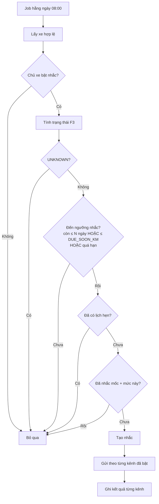
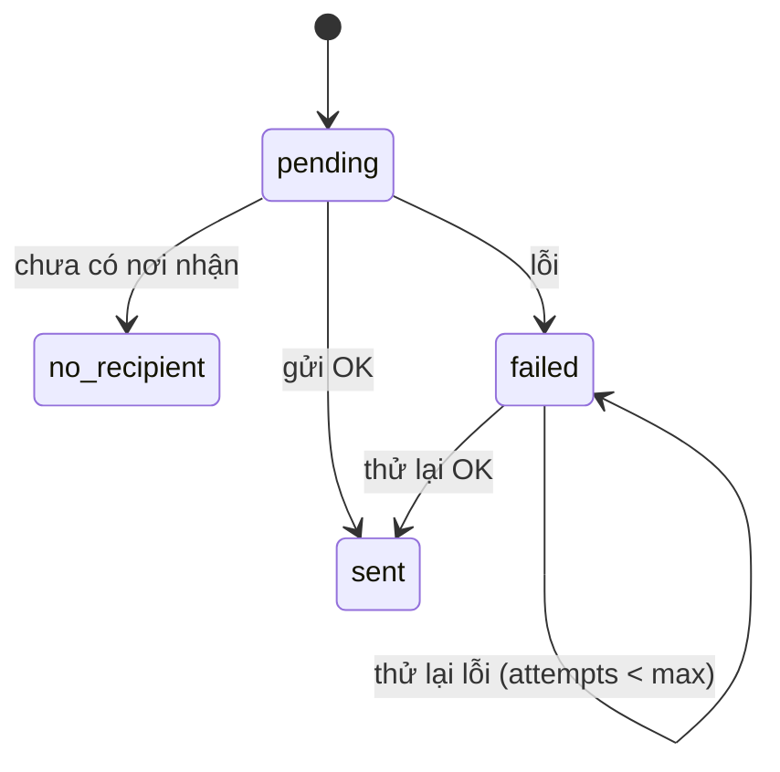

# Functional Specification — Nhắc mốc bảo dưỡng & cấu hình thông báo

> **Cập nhật phạm vi (02/10/2026):** các phần dưới đây trong tài liệu này không còn áp dụng.
>
> - Kết nối Discord (`user_discord_link`, ENT-417): **đã bỏ**. Nhắc bảo dưỡng, nhắc lịch hẹn và hỏi thăm hiện trong mục **Thông báo** của app; danh sách kênh ngoài (Zalo / Telegram / SMS / Email) vẫn có nhưng đều "Sắp có", bật nhắc không bắt buộc chọn kênh.

> Đặc tả nghiệp vụ cho Feature **F7 (phần nhắc mốc bảo dưỡng)** trong [PRD EV Care MVP](../../../product/PRD_EV_Care_MVP.md#f7--nhắc). Dùng kết quả tính của [F3 — us-017](us-017-sprint-2-spec.ff.md).
>
> **Phạm vi tài liệu này:** nhắc chủ xe khi mốc bảo dưỡng **sắp đến**, thời điểm bắt đầu nhắc và kênh nhận do chủ xe cấu hình. **Không** gồm nhắc lịch hẹn 24h (booking) và hỏi thăm sau dịch vụ (F9).
>
> Điểm chưa chốt đánh dấu `[Đề xuất]`, liệt kê ở mục 24.

---

# 1. Document Information

| Field | Value |
|---|---|
| Feature ID | `FEAT-NOTI-001` |
| Feature Name | `Nhắc mốc bảo dưỡng & cấu hình thông báo` |
| PRD Feature | `F7` (Should) — phần nhắc mốc; `NOTI-01` — phần cấu hình kênh (kéo về sớm hơn PRD v3.5) |
| Document Version | `v1.0` |
| Status | `Draft` |
| Business Owner | Lê Đức Tùng (PO) |
| Author | Team 4 Người |
| Created Date | `2026-09-28` |
| Related Frontend Spec | [us-021-sprint-2-spec.fe.md](../frontend/us-021-sprint-2-spec.fe.md) |
| Related API Spec | [us-021-sprint-2-spec.api.md](../api/us-021-sprint-2-spec.api.md) |
| Related Entity Spec | [us-021-sprint-2-spec.entity.md](../entity/us-021-sprint-2-spec.entity.md) |
| Related Specs | [F3 FF](us-017-sprint-2-spec.ff.md) · [reminder.entity.md](../../entity/maintenance/reminder.entity.md) · [user_discord_link.entity.md](../../entity/identity/user_discord_link.entity.md) |

---

# 2. Feature Overview

## 2.1 Feature Description

Mỗi ngày hệ thống kiểm tra các xe hợp lệ. Khi mốc bảo dưỡng tiếp theo của xe **sắp đến hạn**, hệ thống gửi một thông báo cho chủ xe qua kênh họ đã chọn. Mặc định:

- Bắt đầu nhắc **trước ngày đến hạn 2 ngày**; chủ xe đổi được số ngày này (0–30).
- Kênh nhận là **Discord**; chủ xe có thể bật/tắt các kênh khác khi các kênh đó được hỗ trợ (Zalo, Telegram, SMS, Email — tương lai).

Việc tính "sắp đến hạn" dùng lại `MaintenanceStatusService` của F3 (mốc tiếp theo, ngày đến hạn, km còn lại). F7 không tự tính lại.

## 2.2 Business Objective

Giải quyết PP-01: chủ xe không phải tự nhớ mốc bảo dưỡng; được nhắc đúng lúc để đặt lịch (G1).

## 2.3 Business Value

- Giảm bỏ lỡ mốc bảo dưỡng ảnh hưởng quyền lợi bảo hành.
- Chủ xe kiểm soát: nhắc sớm hay muộn, qua kênh nào, hoặc tắt hẳn.
- Thêm kênh mới (Zalo, Telegram, SMS, Email) không đổi logic nhắc.

---

# 3. Scope

## 3.1 In Scope

- Job nhắc mốc bảo dưỡng chạy hằng ngày.
- Cấu hình của chủ xe: bật/tắt nhắc, số ngày nhắc trước, danh sách kênh nhận (mặc định Discord).
- `NotificationService` dùng chung với adapter theo kênh; **adapter Discord** là adapter đầu tiên.
- Ghi nhận kết quả gửi theo từng kênh; thử lại khi lỗi tạm thời.
- Dừng nhắc khi chủ xe đã có lịch hẹn.

## 3.2 Out of Scope

- Nhắc lịch hẹn 24h và hỏi thăm sau dịch vụ (dùng chung `NotificationService`, đặc tả riêng).
- Adapter Zalo, Telegram, SMS, Email — chỉ chuẩn bị cấu trúc (BR-506); triển khai từng kênh ở phase sau.
- Xác minh địa chỉ nhận của kênh mới (OTP email/SMS, `/start` Telegram…): thuộc từng kênh khi triển khai.
- Bật/tắt theo loại thông báo, kênh dự phòng khi kênh chính lỗi.
- Quy trình kết nối Discord (OAuth2, bot tạo kênh): theo `user_discord_link` (ENT-417), đặc tả riêng.
- Cài đặt thông báo cho chủ xưởng.

---

# 4. Actors

| Actor | Type | Responsibility |
|---|---|---|
| Chủ xe | User | Cấu hình nhắc; nhận thông báo |
| Job nhắc mốc | System | Chạy hằng ngày, tạo và gửi nhắc |
| `NotificationService` | System | Gửi qua adapter theo kênh, ghi kết quả |
| Adapter Discord | System | Gửi vào kênh riêng của chủ xe |
| F3 `MaintenanceStatusService` | System | Cung cấp mốc tiếp theo và trạng thái |

---

# 5. User Story

## US-021

**As a** chủ xe đã hoàn tất onboarding

**I want to** được nhắc trước khi đến mốc bảo dưỡng, với thời điểm và kênh tôi chọn

**So that** tôi kịp đặt lịch mà không phải tự nhớ.

### Additional User Stories

- `US-022`: As a chủ xe, I want to đổi số ngày nhắc trước và tắt/bật nhắc, so that lời nhắc phù hợp thói quen của tôi.
- `US-023`: As a chủ xe, I want to chọn kênh nhận thông báo (mặc định Discord), so that tôi nhận ở nơi tôi dùng.
- `US-024`: As a hệ thống, I want to gửi thông báo qua `NotificationService` có adapter theo kênh, so that thêm kênh mới không đổi logic nhắc.

---

# 6. Use Case

## UC-501 — Nhắc mốc bảo dưỡng sắp đến

**Primary Actor:** Job nhắc mốc. **Trigger:** lịch chạy hằng ngày lúc 08:00 (Asia/Ho_Chi_Minh, cấu hình). **Preconditions:** xe `verified` + `active`, tài khoản `ACTIVE`.

**Postconditions:** xe đủ điều kiện có một lần nhắc được tạo và gửi qua mọi kênh chủ xe đã bật; kết quả từng kênh được ghi lại.

## UC-502 — Cấu hình nhắc và kênh

**Primary Actor:** Chủ xe. **Trigger:** mở màn Cài đặt thông báo. **Postconditions:** cấu hình được lưu, áp dụng từ lần chạy job kế tiếp.

---

# 7. User Flow

Cấu hình: chủ xe mở Cài đặt → sửa số ngày / kênh / bật-tắt → lưu.

---

# 8. Screen / UI

## SCR-501 — Cài đặt thông báo

- Công tắc **Bật nhắc bảo dưỡng**.
- Ô **Nhắc trước hạn** (số ngày, 0–30, mặc định 2). Chú thích: "0 = nhắc đúng ngày đến hạn".
- Danh sách kênh: Discord (mặc định bật), Zalo / Telegram / SMS / Email hiển thị "Sắp có" và không chọn được (BR-506). Mỗi kênh có nhãn trạng thái: Đã kết nối / Chưa kết nối.
- Discord chưa kết nối: nút **Kết nối Discord**.

## SCR-301 (F3, Home) — bổ sung

Khi lần nhắc gần nhất ở trạng thái "chưa có nơi nhận" (BR-507): banner mời kết nối Discord.

**Nội dung thông báo** (BR-509): "Xe VF6 biển 30A-***45 sắp đến mốc bảo dưỡng 12.000 km / 12 tháng — còn 2 ngày (15/10/2026). Đặt lịch: <link>". Quá hạn: "…đã quá hạn 3 ngày…".

---

# 9. Main Flow

1. Job chạy 08:00 ngày 13/10/2026. Xe VF6 có mốc 12.000 km / 12 tháng, đến hạn 15/10/2026; chủ xe dùng cấu hình mặc định (2 ngày, Discord).
2. F3 trả `remaining_days = 2` ⇒ chạm ngưỡng.
3. Xe chưa có lịch hẹn, chưa có nhắc mốc này ⇒ tạo nhắc mức `early`.
4. Chủ xe có liên kết Discord `active` ⇒ gửi vào kênh riêng.
5. Ghi nhận `sent`. Các ngày sau job không gửi lại (BR-502).
6. Nếu chủ xe không đặt lịch và mốc quá hạn ⇒ một nhắc mức `expired` (BR-502).

---

# 10. Alternative Flow

## AF-501 — Chủ xe đặt `lead_days = 0`
Nhắc đúng ngày đến hạn (`remaining_days ≤ 0` hoặc `remaining_km ≤ DUE_SOON_KM`).

## AF-502 — Đến ngưỡng theo km trước
`remaining_km ≤ DUE_SOON_KM` (cấu hình F3, mặc định 500) ⇒ nhắc dù `remaining_days` còn lớn hơn số ngày cấu hình (BR-501).

## AF-503 — Chủ xe bật nhiều kênh
Gửi song song tới mọi kênh đã bật; kết quả ghi riêng từng kênh (BR-505).

## AF-504 — Chủ xe tắt nhắc
Job bỏ qua xe; không tạo nhắc.

---

# 11. Exception Flow

## EF-501 — Chủ xe chưa có nơi nhận
**Condition:** kênh đã bật nhưng không gửi được vì thiếu địa chỉ (Discord chưa `active`).
**Behavior:** delivery ghi `no_recipient`, không thử kênh khác, không thử lại tự động. Khi chủ xe kết nối xong, nhắc **không** gửi bù (mốc đã ghi nhận); lần nhắc ở mức kế tiếp (nếu có) vẫn gửi.

## EF-502 — Kênh trả lỗi tạm thời
**Condition:** timeout / 5xx / 429.
**Behavior:** delivery `failed`, `attempts += 1`; lần chạy job kế tiếp thử lại, tối đa 3 lần (BR-508). Không dùng exponential backoff hay circuit breaker: chu kỳ job đủ dài (cùng lập luận Q-312 của F3).

## EF-503 — Kênh mất quyền gửi
**Condition:** Discord `403`/`404`. **Behavior:** delivery `failed` với `error_code = DELIVERY_FORBIDDEN`, không thử lại; liên kết chuyển `revoked` (BR-ENT-442), Home mời kết nối lại.

## EF-504 — Không tính được trạng thái
F3 trả `UNKNOWN` ⇒ bỏ qua xe, không nhắc.

---

# 12. Business Rules

## BR-501 — Điều kiện nhắc
**Rule:** Với mốc tiếp theo do F3 trả về, xe **đến ngưỡng nhắc** khi một trong ba điều kiện đúng:
- `remaining_days ≤ reminder_lead_days` của chủ xe (mặc định 2);
- `remaining_km ≤ DUE_SOON_KM` (chỉ khi có ODO);
- `due_status = OVERDUE`.

Mức nhắc: `early` khi chưa quá hạn; `expired` khi `OVERDUE`. (Các mức `warning`, `urgent` của enum dành cho mở rộng, chưa dùng.) `[Đề xuất]`

## BR-502 — Mỗi mốc, mỗi mức nhắc một lần
**Rule:** Mỗi (xe, mốc km, mức) chỉ tạo **một** nhắc. Tối đa 2 thông báo cho một mốc (`early`, `expired`). Đáp ứng ràng buộc tối đa 1 lần/xe/tuần của PRD (PQ-04) vì hai mức cách nhau tối thiểu 1 ngày và job không gửi lại.
**Ghi chú:** mức `expired` độc lập với `early`: xe chưa từng có nhắc `early` (ví dụ mới bật nhắc khi đã quá hạn) vẫn nhận đúng một nhắc `expired`.

## BR-503 — Dừng khi đã có lịch hẹn
**Rule:** Xe có booking chưa hoàn tất và chưa huỷ (ngày hẹn từ hôm nay trở đi) ⇒ không tạo nhắc mới; nhắc đang mở được đóng (`is_resolved = true`) (BR-ENT-407).

## BR-504 — Cấu hình nhắc
**Rule:** `reminder_lead_days` là số nguyên `0..30`. Giá trị mặc định khi chủ xe chưa cấu hình lấy từ `.env` (`REMINDER_DEFAULT_LEAD_DAYS=2`). `reminders_enabled` mặc định `true`. Đổi cấu hình áp dụng từ lần chạy job kế tiếp, không sinh nhắc bù.

## BR-505 — Kênh nhận
**Rule:** Kênh nhận = các kênh chủ xe đã bật. Chủ xe chưa từng cấu hình ⇒ mặc định **chỉ Discord**. Gửi tới **mọi** kênh đã bật; không chuyển sang kênh khác khi một kênh lỗi (PRD F7). Bật nhắc mà không kênh nào được bật là không hợp lệ.

## BR-506 — Kênh khả dụng
**Rule:** Chỉ kênh có adapter được triển khai mới bật được. MVP: **Discord**. `zalo`, `telegram`, `sms`, `email` có trong danh sách nhưng chưa bật được (API từ chối `CHANNEL_NOT_AVAILABLE`). Thêm kênh = thêm adapter + đăng ký; không đổi job, không đổi luật nhắc.

## BR-507 — Chỉ gửi khi có nơi nhận
**Rule:** Discord chỉ gửi khi liên kết `active` (BR-ENT-441). Ngược lại ghi `no_recipient` (EF-501).

## BR-508 — Thử lại
**Rule:** Lỗi tạm thời được thử lại ở lần chạy job kế tiếp, tối đa 3 lần gửi (cấu hình `REMINDER_MAX_ATTEMPTS`). Quá số lần ⇒ `failed` cuối cùng, ghi log mức `error` + metric cho vận hành (không báo chủ xe).

## BR-509 — Nội dung an toàn
**Rule:** Không chứa VIN, SĐT, email, CCCD; biển số che một phần; có link mở app. Nội dung do backend dựng từ kết quả F3, AI không tự soạn số liệu (PRD §7).

## BR-510 — Xe hợp lệ
**Rule:** Chỉ xe `verified` + `link_status = active` của tài khoản `ACTIVE` (BR-ENT-406).

## BR-511 — Thời gian
**Rule:** "Ngày" và giờ chạy job theo Asia/Ho_Chi_Minh. Job chạy lại trong ngày không tạo nhắc trùng (BR-502).

---

# 13. State / Status

Delivery (theo kênh):

| State | Meaning |
|---|---|
| `pending` | Đã tạo, chưa gửi |
| `sent` | Gửi thành công |
| `failed` | Lỗi; còn lượt thử lại nếu `attempts < max` và lỗi tạm thời |
| `no_recipient` | Kênh bật nhưng chưa có nơi nhận |

---

# 14. Data Requirements

| Data / Entity | Why Needed | Read / Write |
|---|---|---|
| `MaintenanceStatusService` (F3) | Mốc tiếp theo, `remaining_*`, `due_status` | Read |
| `user_notification_setting` (ENT-418, mới) | Bật/tắt nhắc, số ngày nhắc trước | Read / Write |
| `user_notification_channel` (ENT-419, mới) | Kênh chủ xe đã bật | Read / Write |
| `reminder` (ENT-405, mở rộng) | Nhắc theo (xe, mốc, mức) | Write |
| `reminder_delivery` (ENT-420, mới) | Kết quả gửi theo kênh | Write |
| `user_discord_link` (ENT-417) | Nơi nhận Discord | Read |
| `booking` (ENT-402) | Phát hiện đã có lịch hẹn | Read |

---

# 15. Business Error & Edge Cases

| Case ID | Scenario | Expected Behavior |
|---|---|---|
| `EDGE-501` | Job chạy hai lần trong ngày | Không gửi trùng (BR-502) |
| `EDGE-502` | Chủ xe đổi `lead_days` từ 2 lên 7 khi còn 5 ngày | Lần chạy kế tiếp thấy `5 ≤ 7` ⇒ nhắc |
| `EDGE-503` | Chủ xe đổi từ 7 xuống 2 khi nhắc `early` đã gửi | Không gửi lại (đã có nhắc mốc + mức) |
| `EDGE-504` | Job không chạy nhiều ngày (sự cố) | Lần chạy sau vẫn nhắc nếu còn chưa qua mốc/đã quá hạn thì gửi `expired`; không bù nhiều thông báo |
| `EDGE-505` | Ngưỡng theo km chạm trước ngày | Nhắc theo km (AF-502) |
| `EDGE-506` | Xe không có ODO (chỉ tính thời gian) | Chỉ điều kiện ngày và quá hạn theo ngày |
| `EDGE-507` | Vừa hoàn tất bảo dưỡng, mốc đổi | Mốc mới ⇒ khoá nhắc mới, nhắc cũ không liên quan |
| `EDGE-508` | Chủ xe bật Discord nhưng chưa kết nối | `no_recipient` (EF-501) |
| `EDGE-509` | Chủ xe tắt hết kênh | API từ chối khi đang bật nhắc (BR-505) |
| `EDGE-510` | Chủ xe bật kênh chưa hỗ trợ (SMS) | API từ chối `CHANNEL_NOT_AVAILABLE` (BR-506) |

---

# 16. Permissions & Access

| Role | Xem cấu hình | Sửa cấu hình | Nhận nhắc |
|---|---:|---:|---:|
| Chủ xe | ✅ (của mình) | ✅ (của mình) | ✅ |
| Chủ xưởng | ❌ | ❌ | ❌ (ngoài phạm vi) |
| Job / `NotificationService` | ✅ | ❌ | — |

---

# 17. Acceptance Criteria

## AC-501 — Nhắc trước 2 ngày mặc định
**Given** chủ xe chưa cấu hình gì, mốc 12.000 km đến hạn 15/10, hôm nay 13/10, chưa có lịch hẹn
**When** job chạy
**Then** một thông báo mức `early` được gửi qua Discord; delivery `sent`.

## AC-502 — Cấu hình số ngày
**Given** chủ xe đặt `reminderLeadDays = 5`
**When** job chạy khi còn 5 ngày
**Then** nhắc được gửi; khi còn 6 ngày thì không.

## AC-503 — Không gửi trùng
**Given** đã gửi nhắc `early` cho mốc
**When** job chạy lại cùng ngày hoặc ngày sau
**Then** không gửi thêm nhắc `early` cho mốc đó.

## AC-504 — Quá hạn
**Given** mốc quá hạn, chưa có nhắc `expired`
**When** job chạy
**Then** đúng một nhắc `expired` được gửi.

## AC-505 — Đã có lịch hẹn
**Given** xe có booking chưa huỷ
**When** job chạy
**Then** không tạo nhắc; nhắc đang mở được đóng.

## AC-506 — Tắt nhắc
**Given** `remindersEnabled = false`
**When** job chạy
**Then** không tạo nhắc cho xe.

## AC-507 — Chưa có nơi nhận
**Given** kênh Discord bật nhưng liên kết chưa `active`
**When** job chạy
**Then** delivery `no_recipient`; không gửi kênh khác; Home hiện lời mời kết nối.

## AC-508 — Lỗi tạm thời được thử lại
**Given** Discord timeout lần đầu
**When** job chạy lần sau
**Then** thử lại; sau tối đa 3 lần thất bại thì `failed` cuối và có log `error`.

## AC-509 — Cấu hình mặc định
**Given** chủ xe chưa từng lưu cấu hình
**When** gọi `GET /notification-settings`
**Then** `remindersEnabled = true`, `reminderLeadDays = 2`, kênh Discord bật.

## AC-510 — Kênh chưa hỗ trợ
**Given** chủ xe bật SMS
**When** gọi `PUT /notification-settings`
**Then** lỗi `CHANNEL_NOT_AVAILABLE`, cấu hình không đổi.

## AC-511 — Nội dung an toàn
**Given** thông báo được gửi
**Then** không chứa VIN, SĐT, email, CCCD; biển số che một phần; có link mở app.

---

# 18. Non-functional Expectations

| Requirement | Expected Behavior |
|---|---|
| Idempotency | Chạy job nhiều lần không gửi trùng (unique khoá nhắc + unique delivery) |
| Resilience | Một xe/kênh lỗi không làm hỏng các xe khác; job xử lý từng xe độc lập |
| Extensibility | Thêm kênh chỉ cần adapter mới đăng ký với `NotificationService` |
| Observability | Metric `reminder_total{level, result}`, `notification_delivery_total{channel, status}` |
| Privacy | Không log nội dung thông báo và địa chỉ nhận ở mức info |

---

# 19. Dependencies

| Dependency | Purpose | Required |
|---|---|---:|
| F3 `MaintenanceStatusService` | Mốc, trạng thái | Yes |
| `user_discord_link` (ENT-417) + bot Discord | Nơi nhận Discord | Yes (để gửi thật) |
| Celery beat | Lịch chạy job | Yes |
| `booking` (F6) | Phát hiện đã có lịch hẹn | Yes |

---

# 20. Assumptions

- Mỗi tài khoản có một xe đang liên kết (MVP).
- Số ngày nhắc trước là **theo lịch** (ngày), không theo giờ.
- Nhắc theo km dùng chung ngưỡng `DUE_SOON_KM` của F3, chưa cấu hình riêng theo chủ xe.

---

# 21. Business Constraints

- Không gửi dữ liệu nhạy cảm qua kênh thông báo.
- Không chuyển kênh khi một kênh lỗi.
- Logic nhắc không phụ thuộc kênh cụ thể.

---

# 22. Terminology

| Term | Định nghĩa |
|---|---|
| Nhắc (reminder) | Một yêu cầu thông báo cho (xe, mốc, mức) |
| Delivery | Kết quả gửi của một nhắc qua một kênh |
| Lead days | Số ngày nhắc trước ngày đến hạn |
| Nơi nhận | Địa chỉ đích của kênh (kênh Discord riêng, email, số điện thoại…) |

---

# 23. Impact lên tài liệu khác

- **PRD F7 / Phụ lục B (NOTI-01):** cấu hình số ngày nhắc và danh sách kênh (khung + Discord) được đưa vào MVP; kênh Zalo/Telegram/SMS/Email vẫn chưa triển khai.
- **reminder.entity.md:** BR-ENT-408 đổi từ "`channel` luôn `discord`" sang kênh theo cấu hình; thêm `zalo` vào enum; delivery theo kênh ở ENT-420.
- **user_discord_link.entity.md:** không đổi; là nguồn nơi nhận của adapter Discord.

---

# 24. Open Questions

| ID | Question | Owner | Status |
|---|---|---|---|
| `Q-501` | Đây có đúng là "nhắc mốc bảo dưỡng sắp đến" (không phải nhắc lịch hẹn 24h)? | PO | Open — đang giả định đúng |
| `Q-502` | Nhắc theo km dùng chung `DUE_SOON_KM` (500 km); có cần chủ xe cấu hình riêng? | PO | Open |
| `Q-503` | Hai mức `early` + `expired`, mỗi mức một lần — đủ? Hay nhắc lặp mỗi N ngày cho tới khi đặt lịch (PQ-04: ≤ 1 lần/tuần)? | PO | Open |
| `Q-504` | Giờ gửi cố định 08:00 hay chủ xe chọn giờ? | PO | Open — đề xuất cố định 08:00 |
| `Q-505` | Chủ xe kết nối Discord sau khi nhắc `no_recipient`: có gửi bù không? | PO | Open — đề xuất không bù |
| `Q-506` | Khi thêm kênh mới, kênh nào bật mặc định cho người dùng cũ? | PO | Open — đề xuất không tự bật, chủ xe chủ động chọn |

---

# 25. Traceability

| Item | Reference |
|---|---|
| PRD | F7, NOTI-01, PP-01, PQ-04, PQ-11, AC-F7-01 |
| User Story | `US-021` → `US-024` |
| Use Case | `UC-501`, `UC-502` |
| Business Rules | `BR-501` → `BR-511` |
| Acceptance Criteria | `AC-501` → `AC-511` |
| API / Entity | [API](../api/us-021-sprint-2-spec.api.md) · [Entity](../entity/us-021-sprint-2-spec.entity.md) |
| Frontend Specification | [us-021-sprint-2-spec.fe.md](../frontend/us-021-sprint-2-spec.fe.md) |

---

# 26. Change Log

| Version | Date | Author | Change |
|---|---|---|---|
| `v1.0` | `2026-09-28` | Team 4 Người | Initial version |

---

# 27. Approval

| Role | Name | Status | Date |
|---|---|---|---|
| Product Owner | Lê Đức Tùng | Pending | |
| Technical Owner | Tech Lead | Pending | |
