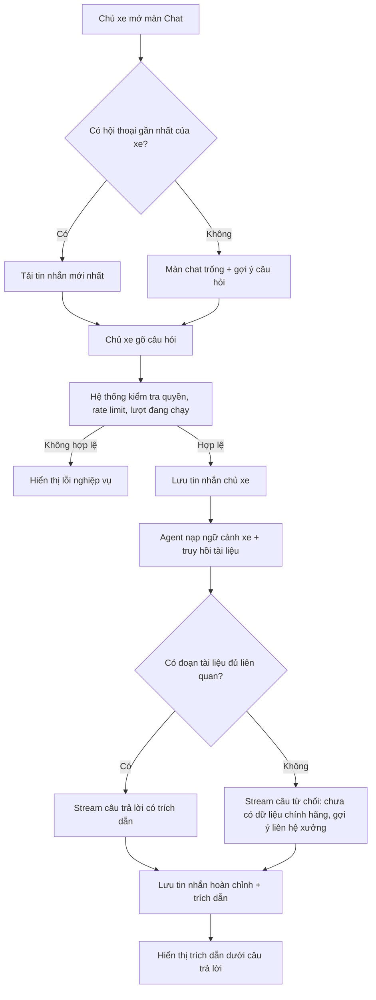
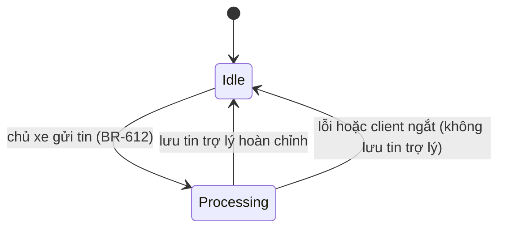

# Functional Specification — Chat RAG có trích nguồn & lưu trữ hội thoại

> Đặc tả nghiệp vụ cho Feature **F4** trong [PRD EV Care MVP](../../../product/PRD_EV_Care_MVP.md#f4--chat-rag-có-trích-nguồn), gồm cả phần **lưu & truy vấn hội thoại** (dùng chung cho F4, F5, F6).
>
> **Phạm vi tài liệu này:** trải nghiệm chat của chủ xe, quy tắc lưu/đọc/xoá hội thoại, quyền xem của chủ xưởng. **Không** mô tả cách Agent suy luận, truy hồi tài liệu và viết prompt — xem [AI-001](../../ai-agent/ai-001-sprint-2-spec.agent.md), [AI-002](../../ai-agent/ai-002-sprint-2-spec.agent.md). **Không** gồm dự toán chi phí (F5) và đặt lịch (F6), chỉ gồm phần chúng dùng chung hội thoại.
>
> Điểm chưa chốt đánh dấu `[Đề xuất]`, liệt kê ở mục 24.

---

# 1. Document Information

| Field | Value |
|---|---|
| Feature ID | `FEAT-CHAT-001` |
| Feature Name | `Chat RAG có trích nguồn & lưu trữ hội thoại` |
| PRD Feature | `F4` (Must, Sprint 2); AC-F4-01 … AC-F4-06; PQ-09, PQ-10 (ADR-01) |
| Document Version | `v1.0` |
| Status | `Draft` |
| Product / Project | EV Care — AI Agent Chăm sóc sau bán & lịch bảo dưỡng xe điện |
| Business Owner | Lê Đức Tùng (PO) |
| Author | Team 4 Người |
| Reviewer | Tech Lead |
| Stakeholders | PO, Backend, Frontend, AI Team |
| Created Date | `2026-09-28` |
| Updated Date | `2026-09-28` |
| Related PRD | [PRD_EV_Care_MVP.md §F4, §7, §8, §9.1](../../../product/PRD_EV_Care_MVP.md) |
| Related API Spec | [us-025-sprint-2-spec.api.md](../api/us-025-sprint-2-spec.api.md) |
| Related Entity Spec | [us-025-sprint-2-spec.entity.md](../entity/us-025-sprint-2-spec.entity.md) |
| Related Agent Spec | [AI-001 Orchestrator](../../ai-agent/ai-001-sprint-2-spec.agent.md) · [AI-002 Knowledge Advisor](../../ai-agent/ai-002-sprint-2-spec.agent.md) · [AI-008 Ingestion](../../ai-agent/ai-008-sprint-2-spec.agent.md) |
| Related Frontend Spec | [us-025-sprint-2-spec.fe.md](../frontend/us-025-sprint-2-spec.fe.md) |
| Related Entity (đã có) | [official_document](../../entity/knowledge/official_document.entity.md) · [document_chunk](../../entity/knowledge/document_chunk.entity.md) · [user_vehicle](../../entity/vehicle/user_vehicle.entity.md) |

---

# 2. Feature Overview

## 2.1 Feature Description

Chủ xe hỏi bằng tiếng Việt về hạng mục bảo dưỡng, bảo hành, cách dùng xe. Hệ thống trả lời **chỉ dựa trên tài liệu chính hãng đã ingest** và luôn kèm trích dẫn (tên tài liệu, phiên bản, đoạn/trang). Hệ thống đã biết xe của chủ xe (model, ODO, bảo hành, trạng thái đến hạn) nên không hỏi lại. Nếu tài liệu không có thông tin, hệ thống nói rõ là chưa có dữ liệu chính hãng và gợi ý liên hệ xưởng — không bịa số liệu.

Mọi trao đổi được lưu thành **hội thoại** gồm các **tin nhắn**. Chủ xe đóng app rồi mở lại vẫn thấy đủ lịch sử và tiếp tục đúng ngữ cảnh. Hội thoại cũng là nơi F5 (dự toán) và F6 (đặt lịch) diễn ra, và là bằng chứng truy ngược khi có booking/báo giá tạo từ chat.

## 2.2 Business Objective

Giải quyết PP-03 và PP-04: chủ xe không có nơi tra hạng mục, chi phí, điều kiện bảo hành theo đúng xe của mình từ nguồn chính hãng. Giảm tải cho chủ xưởng khỏi các cuộc gọi hỏi đáp (PP-05).

## 2.3 User Objective

- Chủ xe: hỏi một lần, nhận câu trả lời đúng theo xe của mình, biết nguồn để tin.
- Chủ xưởng: khi nhận booking/báo giá tạo từ chat, xem được đoạn hội thoại dẫn tới yêu cầu đó.

## 2.4 Business Value

- Tin cậy: mọi khẳng định kỹ thuật có nguồn kiểm chứng được.
- An toàn pháp lý: không hứa hẹn ngoài tài liệu hãng (PQ-07).
- Truy vết: biết booking/báo giá xuất phát từ lời xác nhận nào của chủ xe.
- Đo lường: dữ liệu hội thoại ẩn danh làm bộ eval RAG (PRD §10).

---

# 3. Scope

## 3.1 In Scope

- Tạo hội thoại, gửi tin nhắn, nhận câu trả lời **streaming** kèm trích dẫn.
- Lưu tin nhắn của chủ xe, của trợ lý, kết quả tool call; lưu trích dẫn, tool đã gọi, id booking/báo giá được tạo, trace id.
- Tải lại hội thoại gần nhất (phân trang), danh sách hội thoại theo xe, tìm theo từ khoá trong lịch sử của chính chủ xe.
- Chủ xưởng xem (chỉ đọc) đoạn hội thoại dẫn tới một booking/báo giá của xưởng mình.
- Chủ xe xoá hội thoại (kèm trạng thái Agent).
- Giới hạn tốc độ chat theo người dùng.
- Thời gian lưu giữ 180 ngày (PQ-09) và xuất dữ liệu ẩn danh cho eval.

## 3.2 Out of Scope

- Cách Agent phân loại ý định, truy hồi, viết câu trả lời → AI-001/002.
- Dự toán chi phí (F5), đặt lịch (F6) — chỉ dùng chung hội thoại.
- Ingest tài liệu → AI-008.
- Chat người–người giữa chủ xe và chủ xưởng (ADR-01: xem lại Firestore khi có).
- Đính kèm ảnh/file trong chat; chẩn đoán lỗi qua ảnh (PRD out of scope).
- Gửi tin nhắn chat sang Discord; chat qua kênh khác ngoài Web App.
- Chủ xưởng chat với Agent.
- Sửa hay thu hồi tin nhắn đã gửi.

---

# 4. Actors & Stakeholders

## 4.1 Actors

| Actor | Type | Responsibility |
|---|---|---|
| Chủ xe | User | Hỏi đáp, xem lại/tìm/xoá lịch sử của mình |
| Chủ xưởng | User | Xem đoạn hội thoại dẫn tới booking/báo giá của xưởng mình (chỉ đọc) |
| Orchestrator Agent (AI-001) | System | Nhận tin nhắn, nạp ngữ cảnh xe, điều phối, tạo câu trả lời |
| Knowledge Advisor (AI-002) | System | Truy hồi tài liệu chính hãng, tạo câu trả lời có trích dẫn |
| Backend Conversation Service | System | Nơi **duy nhất** ghi tin nhắn; kiểm soát quyền, rate limit, stream |
| Job dọn dữ liệu | System | Xoá hội thoại quá hạn lưu giữ; xuất bản ẩn danh cho eval |

## 4.2 Stakeholders

| Stakeholder | Team | Interest |
|---|---|---|
| PO | Product | AC-F4-01 … 06, chỉ số RAG (PRD §10) |
| AI Team | AI | Chất lượng trả lời, bộ eval, trace |
| Backend | Engineering | Lưu trữ, phân quyền, stream |
| Frontend | Engineering | Màn hình chat, hiển thị trích dẫn |

---

# 5. User Story

## US-025

**As a** chủ xe
**I want to** hỏi về hạng mục bảo dưỡng và điều kiện bảo hành ngay trong chat và nhận câu trả lời kèm nguồn chính hãng
**So that** tôi biết xe mình cần làm gì, được miễn phí gì, mà không phải gọi xưởng hay tìm trên forum.

### Additional User Stories

- `US-026`: Là chủ xe, tôi muốn hệ thống tự biết xe, số ODO và tình trạng bảo hành của tôi, để khỏi phải nhập lại trong chat.
- `US-027`: Là chủ xe, tôi muốn đóng app rồi mở lại vẫn thấy cuộc trò chuyện và tiếp tục đang dở (ví dụ đang chờ xác nhận đặt lịch).
- `US-028`: Là chủ xe, tôi muốn xem danh sách, tìm theo từ khoá và xoá lịch sử chat của mình, để kiểm soát dữ liệu cá nhân.
- `US-029`: Là chủ xưởng, tôi muốn xem đoạn hội thoại dẫn tới một booking/báo giá của xưởng mình, để hiểu khách cần gì trước khi xử lý.
- `US-030`: Là PO/AI Team, tôi muốn xuất dữ liệu hội thoại ẩn danh theo khoảng thời gian, để đo chất lượng RAG.

---

# 6. Use Case

## UC-601 — Hỏi đáp có trích nguồn

### 6.1 Use Case Description

Chủ xe gửi một câu hỏi trong hội thoại; hệ thống trả lời streaming kèm trích dẫn hoặc nói rõ chưa có nguồn.

### 6.2 Primary Actor

Chủ xe.

### 6.3 Supporting Actors / Systems

- Orchestrator Agent (AI-001), Knowledge Advisor (AI-002)
- Kho tài liệu chính hãng (`official_document`, `document_chunk`)
- Dữ liệu xe đã đồng bộ từ hãng (F3)

### 6.4 Trigger

Chủ xe gửi tin nhắn.

### 6.5 Preconditions

- Chủ xe đã đăng nhập, đã xác thực xe với hãng, xe ở trạng thái `active` (F1).
- Hội thoại thuộc chủ xe và thuộc xe đó.
- Chưa vượt giới hạn tốc độ chat; hội thoại không có lượt xử lý khác đang chạy.

### 6.6 Postconditions

- Tin nhắn của chủ xe và tin nhắn hoàn chỉnh của trợ lý đã được lưu, đúng thứ tự.
- Tin nhắn trợ lý có danh sách trích dẫn (rỗng nếu là từ chối/xã giao), tool đã gọi, trace id.
- `last_message_at` của hội thoại được cập nhật.

## UC-602 — Mở lại và tiếp tục hội thoại

Chủ xe mở app → tải hội thoại gần nhất của xe → thấy tin nhắn đã hoàn tất → gửi tiếp; Agent tiếp tục từ trạng thái đã lưu.

## UC-603 — Tìm và xoá lịch sử

Chủ xe tìm theo từ khoá trong lịch sử của mình, mở kết quả, hoặc xoá cả hội thoại.

## UC-604 — Chủ xưởng xem đoạn hội thoại dẫn tới booking/báo giá

Từ một booking/báo giá thuộc xưởng mình (tạo từ chat), chủ xưởng mở đoạn hội thoại liên quan ở chế độ chỉ đọc.

## UC-605 — Xuất dữ liệu ẩn danh cho eval

PO/AI Team chạy job xuất theo khoảng thời gian; dữ liệu đã bỏ định danh.

---

# 7. User Flow

## 7.1 Main User Flow



## 7.2 Flow Description

| Step | Actor | Action / Event | System Response | Result |
|---|---|---|---|---|
| 1 | Chủ xe | Mở màn Chat | Trả hội thoại gần nhất của xe và 50 tin nhắn mới nhất (BR-604) | Thấy lịch sử |
| 2 | Chủ xe | Gõ câu hỏi, gửi | Kiểm tra quyền sở hữu, giới hạn tốc độ, lượt đang chạy (BR-601, BR-612, BR-613) | Chấp nhận hoặc từ chối |
| 3 | System | Chấp nhận | Lưu tin nhắn chủ xe (BR-602); báo đã nhận | Tin nhắn hiện ngay |
| 4 | System | Agent xử lý | Nạp ngữ cảnh xe; truy hồi tài liệu; sinh câu trả lời | Chuỗi chữ stream về |
| 5 | System | Hoàn tất | Lưu tin nhắn trợ lý kèm trích dẫn, tool, trace (BR-603) | Có thể đối chiếu nguồn |
| 6 | Chủ xe | Đóng app giữa chừng | Không lưu tin trợ lý dang dở (BR-602) | Lần sau chỉ thấy tin hoàn tất |
| 7 | Chủ xe | Mở lại, gửi tiếp | Tiếp tục từ trạng thái đã lưu (BR-604) | Đúng ngữ cảnh |

---

# 8. Screen / UI Flow

> UI ở đây minh hoạ hành vi nghiệp vụ; chi tiết ở [Frontend Spec](../frontend/us-025-sprint-2-spec.fe.md).

## 8.1 Screen Flow

```text
[Home / Trạng thái đến hạn]
        |
        v
[SCR-601 Chat] ---- mở danh sách ----> [SCR-602 Lịch sử hội thoại]
   |                                         |
   |                                         +--> [SCR-603 Kết quả tìm kiếm] --> [SCR-601 Chat]
   +--> bấm trích dẫn --> [SCR-604 Chi tiết nguồn]
   +--> lỗi/quá tốc độ --> [Error State]

[Workshop Board / Chi tiết booking, báo giá] --> [SCR-605 Đoạn hội thoại liên quan (chỉ đọc)]
```

## 8.2 Screen List

| Screen ID | Screen Name | Purpose | Entry From | Exit To |
|---|---|---|---|---|
| `SCR-601` | Chat | Hỏi đáp, xem câu trả lời và trích dẫn | Home, Lịch sử | SCR-602, SCR-604 |
| `SCR-602` | Lịch sử hội thoại | Danh sách hội thoại theo xe, xoá | SCR-601 | SCR-601, SCR-603 |
| `SCR-603` | Kết quả tìm kiếm | Tìm theo từ khoá trong lịch sử | SCR-602 | SCR-601 |
| `SCR-604` | Chi tiết nguồn | Tên tài liệu, phiên bản, trang, đoạn trích | SCR-601 | SCR-601 |
| `SCR-605` | Đoạn hội thoại liên quan | Chủ xưởng xem chỉ đọc | Workshop Board | Workshop Board |

## 8.3 Screen / UI Reference

### SCR-601 — Chat

**Main UI:** danh sách tin nhắn theo thời gian (cũ trên, mới dưới); ô nhập; câu trả lời hiện dần; dưới mỗi câu trả lời kỹ thuật là các thẻ trích dẫn `[Tên tài liệu · v · trang]`; nhãn "Chi phí ước tính" với số tiền (F5); thẻ tóm tắt và nút Xác nhận đặt lịch (F6).

**Business Meaning:** trích dẫn là bằng chứng của câu trả lời; không có trích dẫn nghĩa là câu trả lời không khẳng định kỹ thuật.

**User Action:** gửi câu hỏi, bấm trích dẫn, cuộn lên tải tin cũ, mở lịch sử.

**System Behavior:** stream câu trả lời; chỉ lưu tin hoàn chỉnh; báo lỗi rõ ràng khi bị giới hạn hoặc khi có lượt khác đang chạy.

### SCR-605 — Đoạn hội thoại liên quan

**Main UI:** các tin nhắn dẫn tới booking/báo giá, chỉ đọc, không có ô nhập.

**Business Meaning:** giúp chủ xưởng hiểu yêu cầu. Chỉ hiện đoạn liên quan, không hiện toàn bộ lịch sử của chủ xe (BR-606).

---

# 9. Main Flow

## 9.1 Happy Path

1. Chủ xe mở Chat, hệ thống tải hội thoại gần nhất của xe.
2. Chủ xe hỏi: *"Mốc 12.000 km cần làm gì, cái nào được miễn phí?"*
3. Hệ thống lưu tin nhắn, nạp ngữ cảnh xe (VF6, ODO 11.600, trạng thái `DUE_SOON`) — không hỏi lại.
4. Agent truy hồi tài liệu bảo dưỡng của đúng model, trả lời streaming.
5. Câu trả lời liệt kê hạng mục, tách miễn phí/tính phí, kèm trích dẫn tài liệu.
6. Tin nhắn hoàn chỉnh được lưu cùng trích dẫn và trace id.

---

# 10. Alternative Flow

## AF-601 — Không có nguồn phù hợp

**Condition:** không có đoạn tài liệu đủ liên quan (AC-F4-02).

**Flow:** Agent không khẳng định; nói rõ chưa có dữ liệu chính hãng; gợi ý liên hệ xưởng. Lưu tin nhắn với trích dẫn rỗng.

**Expected Result:** chủ xe không nhận số liệu bịa.

## AF-602 — Câu hỏi ngoài phạm vi bảo dưỡng định kỳ

**Condition:** va chạm, độ xe, chẩn đoán lỗi…

**Flow:** Agent nói rõ ngoài phạm vi, gợi ý liên hệ xưởng.

## AF-603 — Hội thoại chuyển sang dự toán / đặt lịch

**Condition:** chủ xe hỏi chi phí hoặc muốn đặt lịch.

**Flow:** cùng hội thoại; Agent điều phối sang F5/F6 (AI-001). Booking/báo giá tạo ra lưu liên kết về tin nhắn xác nhận (BR-607).

## AF-604 — Chủ xe chưa có hội thoại

**Flow:** hệ thống tạo hội thoại mới khi chủ xe gửi tin nhắn đầu tiên; tiêu đề lấy từ câu hỏi đầu.

## AF-605 — Chủ xe bắt đầu chủ đề mới

**Flow:** chủ xe bấm "Cuộc trò chuyện mới" → tạo hội thoại mới cho cùng xe; hội thoại cũ giữ nguyên trong lịch sử.

---

# 11. Exception Flow

## EF-601 — Mất kết nối khi đang stream

**Condition:** client ngắt khi câu trả lời chưa xong.

**System Behavior:** dừng lượt xử lý; **không lưu** tin nhắn trợ lý dang dở. Tin nhắn của chủ xe đã lưu.

**User Experience:** mở lại thấy tin nhắn của mình chưa có phản hồi kèm nút "Gửi lại".

**Recovery:** gửi lại cùng tin nhắn không tạo bản sao (BR-611).

## EF-602 — Agent/LLM lỗi hoặc quá thời gian

**System Behavior:** báo lỗi nghiệp vụ; không lưu tin nhắn trợ lý; ghi trace lỗi. Tin nhắn chủ xe giữ nguyên.

**User Experience:** thông báo "Trợ lý tạm thời không trả lời được", nút Gửi lại.

## EF-603 — Xe chưa đồng bộ dữ liệu hãng

**System Behavior:** vẫn trả lời câu hỏi kỹ thuật chung của model từ tài liệu; ghi rõ chưa có ODO/bảo hành của xe nên không đánh giá theo xe (F3 `UNKNOWN`).

## EF-604 — Vượt giới hạn tốc độ

**System Behavior:** từ chối lượt mới, báo thời gian chờ (BR-613). Không lưu tin nhắn bị từ chối.

## EF-605 — Gửi tin khi lượt trước còn đang xử lý

**System Behavior:** từ chối lượt mới (BR-612). Không lưu.

---

# 12. Business Rules

## BR-601 — Hội thoại thuộc chủ xe và xe

**Rule:** Mỗi hội thoại thuộc đúng một chủ xe và gắn với một xe `active` của họ.

**Condition:** tạo hội thoại / gửi tin nhắn.

**Expected Behavior:** xe không thuộc chủ xe hoặc không `active` → từ chối. Không có hội thoại cho xe chưa xác thực với hãng.

**Priority:** High

## BR-602 — Backend là nơi duy nhất ghi tin nhắn; chỉ lưu tin hoàn chỉnh

**Rule:** Client không ghi tin nhắn. Tin nhắn chủ xe được lưu khi lượt được chấp nhận; tin nhắn trợ lý chỉ lưu khi đã hoàn chỉnh. Không lưu bản dang dở.

**Priority:** High

## BR-603 — Tin nhắn trợ lý lưu đủ bằng chứng

**Rule:** Mỗi tin nhắn trợ lý lưu: trích dẫn nguồn (**bản chụp** tên tài liệu, phiên bản, trang, đoạn trích tại thời điểm trả lời), tool đã gọi, id booking/báo giá đã tạo (nếu có), trace id.

**Expected Behavior:** trích dẫn còn đọc được ngay cả khi tài liệu sau đó được ingest lại.

**Priority:** High

## BR-604 — Tải lại và tiếp tục ngữ cảnh

**Rule:** Mở lại app → thấy đủ tin nhắn hoàn tất, sắp theo thời gian (tải mới nhất trước, phân trang). Agent tiếp tục từ trạng thái đã lưu (ví dụ đang chờ xác nhận đặt lịch).

**Priority:** High

## BR-605 — Chủ xe chỉ đọc hội thoại của mình

**Rule:** Mọi thao tác đọc/gửi/tìm/xoá chỉ trên hội thoại của chính chủ xe.

**Expected Behavior:** chủ xe khác truy cập → bị từ chối, không tiết lộ hội thoại có tồn tại hay không (AC-F4-05).

**Priority:** High

## BR-606 — Chủ xưởng chỉ xem đoạn liên quan, chỉ đọc

**Rule:** Chủ xưởng chỉ xem được đoạn hội thoại dẫn tới booking/báo giá **thuộc xưởng mình**: từ tin nhắn xác nhận trở về trước tối đa `CHAT_EXCERPT_MAX_MESSAGES` tin `[Đề xuất: 20]`. Không xem tin nhắn tool, không xem phần hội thoại khác của chủ xe, không gửi tin.

**Priority:** High

## BR-607 — Truy ngược booking/báo giá về tin nhắn xác nhận

**Rule:** Booking/báo giá tạo từ chat ghi lại tin nhắn xác nhận của chủ xe đã dẫn tới việc tạo (AC-F4-06). Ngược lại, tin nhắn trợ lý ghi id đối tượng vừa tạo.

**Priority:** High

## BR-608 — Xoá theo yêu cầu

**Rule:** Chủ xe xoá hội thoại → xoá toàn bộ tin nhắn và trạng thái Agent của hội thoại đó, không khôi phục. Booking/báo giá đã tạo **không bị xoá**; liên kết về tin nhắn bị gỡ, chủ xưởng không còn xem được đoạn hội thoại đó.

**Priority:** High

## BR-609 — Thời gian lưu giữ

**Rule:** Hội thoại được giữ 180 ngày kể từ tin nhắn cuối (PQ-09). Quá hạn → xoá như BR-608. Bản ẩn danh phục vụ eval giữ lâu hơn (BR-616).

**Priority:** Medium

## BR-610 — Trích dẫn bắt buộc, không nguồn không khẳng định

**Rule:** Câu trả lời có khẳng định kỹ thuật/bảo hành phải có ít nhất 1 trích dẫn hợp lệ (AC-F4-01). Không có nguồn → từ chối khẳng định (AC-F4-02). Không nêu ân hạn, ngưỡng km mất bảo hành nếu tài liệu hãng không ghi (PQ-07). Chi tiết hành vi ở AI-002.

**Priority:** High

## BR-611 — Gửi lại không tạo trùng

**Rule:** Mỗi tin nhắn chủ xe có mã do client sinh. Gửi lại cùng mã trong cùng hội thoại không tạo tin nhắn thứ hai; nếu tin đó chưa có phản hồi hoàn chỉnh thì hệ thống xử lý lại lượt đó.

**Priority:** Medium

## BR-612 — Mỗi hội thoại một lượt xử lý tại một thời điểm

**Rule:** Khi lượt trước chưa xong, lượt mới của cùng hội thoại bị từ chối.

**Priority:** Medium

## BR-613 — Giới hạn tốc độ chat

**Rule:** Giới hạn theo chủ xe: `CHAT_RATE_LIMIT_PER_MINUTE` `[Đề xuất: 10]` tin/phút và `CHAT_RATE_LIMIT_PER_DAY` `[Đề xuất: 200]` tin/ngày (PRD §8 Chi phí).

**Priority:** Medium

## BR-614 — Nội dung tin nhắn

**Rule:** Tin nhắn chủ xe không rỗng, tối đa `CHAT_MESSAGE_MAX_CHARS` `[Đề xuất: 2000]` ký tự.

**Priority:** Low

## BR-615 — Tìm kiếm chỉ trong lịch sử của mình

**Rule:** Tìm theo từ khoá chỉ trong hội thoại của chính chủ xe (có thể lọc theo xe), không phân biệt hoa thường và dấu tiếng Việt. Chỉ tìm nội dung tin nhắn chủ xe và trợ lý, không tìm kết quả tool.

**Priority:** Medium

## BR-616 — Xuất ẩn danh cho eval

**Rule:** Bản xuất theo khoảng thời gian **không** chứa: id chủ xe, VIN, biển số, SĐT, email, CCCD, tên. Id hội thoại/tin nhắn được băm một chiều. Chỉ AI Team/PO chạy; không có API công khai.

**Priority:** Medium

## BR-617 — Không đưa dữ liệu nhạy cảm vào lời của trợ lý

**Rule:** Không đưa VIN, CCCD vào prompt khi không cần (PRD §7 Privacy). Nếu chủ xe tự gõ dữ liệu nhạy cảm, hệ thống vẫn lưu như tin nhắn của chủ xe nhưng bản xuất ẩn danh phải loại khỏi nội dung theo BR-616 `[Đề xuất: che bằng mẫu regex đơn giản]`.

**Priority:** Medium

---

# 13. State / Status

Hội thoại và tin nhắn **không có trạng thái vòng đời**: tin nhắn bất biến sau khi lưu (append-only); hội thoại tồn tại cho đến khi bị xoá (BR-608, BR-609). Không có tin nhắn `draft`/`streaming` trong database (BR-602).

Trạng thái của **lượt xử lý** (đang chạy / xong / lỗi) là trạng thái tạm, do Agent quản lý — xem [AI-001 §18](../../ai-agent/ai-001-sprint-2-spec.agent.md).



---

# 14. Data Requirements

## 14.1 Required Data

| Data | Type | Required | Description | Source |
|---|---|---:|---|---|
| Hội thoại (`conversation`) | entity | Yes | Chủ xe, xe, tiêu đề, thời điểm tin cuối | EV Care — [ENT-421](../entity/us-025-sprint-2-spec.entity.md) |
| Tin nhắn (`chat_message`) | entity | Yes | Vai trò, nội dung, trích dẫn, tool, tham chiếu, trace | EV Care — [ENT-422](../entity/us-025-sprint-2-spec.entity.md) |
| Ngữ cảnh xe | data | Yes | Model, ODO, bảo hành, trạng thái đến hạn | F3 (đã đồng bộ từ hãng) |
| Đoạn tài liệu | data | Yes | Nội dung, trang, tài liệu, phiên bản | `document_chunk`, `official_document` |
| Trạng thái Agent | data | Yes | Điểm lưu giữa các lượt | LangGraph Postgres checkpointer |

## 14.2 Data Dependency

| Data / Entity | Why Needed | Read / Write | Owner |
|---|---|---|---|
| `conversation` | Nhóm tin nhắn theo chủ xe/xe | Read / Write | EV Care |
| `chat_message` | Lịch sử, trích dẫn, truy vết | Read / Write | EV Care |
| `user_vehicle`, `vehicle_user` | Kiểm tra quyền sở hữu; nạp ngữ cảnh | Read | EV Care |
| `official_document`, `document_chunk` | Truy hồi RAG | Read | AI Team |
| `booking`, `quote` | Liên kết ngược tới tin nhắn xác nhận | Read / Write (cột liên kết) | EV Care |

---

# 15. Business Error & Edge Cases

| Case ID | Scenario | Expected Business Behavior | User Outcome |
|---|---|---|---|
| `EDGE-601` | Chủ xe A truy cập hội thoại của chủ xe B | Từ chối, không lộ hội thoại có tồn tại (BR-605) | Thông báo không tìm thấy |
| `EDGE-602` | Hai thiết bị cùng gửi tin vào một hội thoại | Lượt sau bị từ chối khi lượt trước chưa xong (BR-612) | Báo "đang trả lời, vui lòng đợi" |
| `EDGE-603` | Bấm gửi hai lần / gửi lại sau mất mạng | Không tạo tin nhắn trùng (BR-611) | Chỉ một tin nhắn |
| `EDGE-604` | Hội thoại quá dài | Agent chỉ dùng phần gần nhất + tóm tắt; toàn bộ lịch sử vẫn xem được `[Đề xuất: giới hạn do AI-001]` | Lịch sử đầy đủ |
| `EDGE-605` | Chủ xe xoá hội thoại khi đang có lượt xử lý | Huỷ lượt, xoá hội thoại | Hội thoại biến mất |
| `EDGE-606` | Chủ xe xoá hội thoại có booking đang chờ xác nhận | Booking không bị ảnh hưởng; agent mất ngữ cảnh chờ xác nhận | Có thể đặt lại qua UI |
| `EDGE-607` | Booking tạo từ UI (không qua chat) | Không có liên kết tin nhắn; chủ xưởng không có đoạn hội thoại | Không hiện mục xem hội thoại |
| `EDGE-608` | Xe bị gỡ/hết hiệu lực sau khi có hội thoại | Vẫn xem được lịch sử; không gửi tin mới cho xe không `active` (BR-601) | Đọc được, không gửi được |
| `EDGE-609` | Tài liệu bị ingest lại sau khi trả lời | Trích dẫn cũ vẫn hiển thị theo bản chụp (BR-603) | Nguồn không "biến mất" |
| `EDGE-610` | Tìm kiếm không có kết quả | Danh sách rỗng | Thông báo không có kết quả |

---

# 16. Permissions & Access

## 16.1 Access Matrix

| Role / Actor | View | Create | Update | Delete | Notes |
|---|---:|---:|---:|---:|---|
| Chủ xe — hội thoại/tin nhắn của mình | ✅ | ✅ | ❌ | ✅ | Không sửa tin nhắn; xoá theo cả hội thoại |
| Chủ xe — của người khác | ❌ | ❌ | ❌ | ❌ | BR-605 |
| Chủ xưởng — đoạn liên quan booking/báo giá xưởng mình | ✅ | ❌ | ❌ | ❌ | BR-606 |
| Chủ xưởng — hội thoại khác | ❌ | ❌ | ❌ | ❌ | |
| AI Team / PO | ✅ (bản ẩn danh) | ❌ | ❌ | ❌ | Job xuất, BR-616 |

## 16.2 Business Authorization Rules

- Chủ xe chỉ thao tác với hội thoại có `user_id` là mình.
- Chủ xưởng chỉ xem khi `booking.workshop_id`/`quote.workshop_id` là xưởng của họ.
- Không có role Admin/nhân viên xưởng trong MVP.

> Cơ chế xác thực và phân quyền: [API Spec](../api/us-025-sprint-2-spec.api.md).

---

# 17. Acceptance Criteria

## AC-601 — Trích dẫn cho khẳng định kỹ thuật (AC-F4-01)

**Given** chủ xe hỏi về hạng mục hoặc bảo hành có trong tài liệu đã ingest
**When** hệ thống trả lời
**Then** câu trả lời có ít nhất 1 trích dẫn (tên tài liệu, phiên bản, trang/đoạn) và trích dẫn được lưu cùng tin nhắn.

## AC-602 — Từ chối khi không có nguồn (AC-F4-02)

**Given** câu hỏi không có đoạn tài liệu đủ liên quan
**When** hệ thống trả lời
**Then** không nêu số liệu; nói rõ chưa có dữ liệu chính hãng; gợi ý liên hệ xưởng; trích dẫn rỗng.

## AC-603 — Không hỏi lại thông tin xe (AC-F4-03)

**Given** xe VF6, ODO 11.600, có dữ liệu bảo hành
**When** chủ xe hỏi "mốc tới cần làm gì?"
**Then** hệ thống không yêu cầu nhập model hay ODO; câu trả lời dùng đúng model và mốc của xe.

## AC-604 — Đóng app rồi mở lại (AC-F4-04)

**Given** chủ xe đang trong hội thoại có tin nhắn hoàn tất và đang chờ xác nhận đặt lịch
**When** đóng app rồi mở lại
**Then** thấy đủ tin nhắn hoàn tất, không thấy tin trợ lý dang dở; câu xác nhận tiếp theo được Agent hiểu đúng ngữ cảnh.

## AC-605 — Chặn đọc hội thoại người khác (AC-F4-05)

**Given** hội thoại thuộc chủ xe B
**When** chủ xe A gọi API đọc/gửi/tìm/xoá hội thoại đó
**Then** bị từ chối và không lộ nội dung hay sự tồn tại.

## AC-606 — Truy ngược booking về tin xác nhận (AC-F4-06)

**Given** booking được tạo từ chat sau khi chủ xe bấm Xác nhận
**When** tra cứu booking
**Then** xác định được tin nhắn xác nhận của chủ xe; từ tin nhắn trợ lý cũng thấy id booking đã tạo.

## AC-607 — Chủ xưởng xem đoạn liên quan

**Given** booking thuộc xưởng X được tạo từ chat
**When** chủ xưởng X mở đoạn hội thoại; và chủ xưởng Y làm cùng thao tác
**Then** X thấy tối đa 20 tin nhắn dẫn tới xác nhận, chỉ đọc, không thấy tin tool; Y bị từ chối.

## AC-608 — Xoá hội thoại

**Given** chủ xe có hội thoại có booking đã tạo từ đó
**When** chủ xe xoá hội thoại
**Then** tin nhắn và trạng thái Agent bị xoá hoàn toàn; booking vẫn còn; chủ xưởng không còn xem được đoạn hội thoại.

## AC-609 — Phân trang lịch sử

**Given** hội thoại có 200 tin nhắn
**When** chủ xe mở lại
**Then** nhận 50 tin mới nhất theo đúng thứ tự thời gian; cuộn lên nhận tiếp 50 tin cũ hơn, không trùng, không sót.

## AC-610 — Tìm theo từ khoá

**Given** chủ xe từng hỏi về "phanh"
**When** tìm "phanh" hoặc "Phanh"
**Then** thấy hội thoại và tin nhắn chứa từ khoá, chỉ của chính mình.

## AC-611 — Không trùng khi gửi lại

**Given** chủ xe gửi tin nhắn rồi mất mạng trước khi có phản hồi
**When** gửi lại với cùng mã tin nhắn
**Then** chỉ có một tin nhắn của chủ xe trong lịch sử và một câu trả lời.

## AC-612 — Giới hạn tốc độ

**Given** chủ xe đã gửi đủ số tin trong một phút
**When** gửi thêm
**Then** bị từ chối kèm thời gian chờ; tin nhắn không được lưu.

## AC-613 — Hiệu năng

**Given** điều kiện bình thường
**When** chủ xe gửi tin / tải lịch sử
**Then** token đầu ≤ 1,5 s (p50), trả lời đầy đủ ≤ 8 s (p90), tải 50 tin gần nhất ≤ 300 ms (p90) (PRD §8).

---

# 18. Non-functional Expectations

| Requirement | Expected Behavior |
|---|---|
| Response Experience | Chữ hiện dần; token đầu ≤ 1,5 s (p50); đầy đủ ≤ 8 s (p90) |
| Tải lịch sử | 50 tin nhắn gần nhất ≤ 300 ms (p90) |
| Duplicate Handling | Gửi lại cùng mã không tạo trùng (BR-611) |
| Riêng tư | Chỉ lưu dữ liệu cần; xoá được theo yêu cầu; lưu 180 ngày (PQ-09) |
| Quan sát | Trace id cho mỗi phiên chat và tool call; lưu nguồn trích dẫn từng câu trả lời |
| Chi phí | Giới hạn tốc độ theo chủ xe; cảnh báo chi tiêu LLM |
| Ngôn ngữ | Tiếng Việt; km, VNĐ; hiển thị múi giờ Asia/Ho_Chi_Minh (lưu UTC) |

---

# 19. Dependencies

| Dependency | Purpose | Owner | Required | Related Document |
|---|---|---|---:|---|
| F1 — xác thực xe | Xe `active` của chủ xe | Backend | Yes | [us-001](../../sprint-1/feature-functional/us-001-sprint-1-spec.ff.md) |
| F3 — hồ sơ xe & trạng thái đến hạn | Ngữ cảnh xe | Backend | Yes | [us-017](us-017-sprint-2-spec.ff.md) |
| Kho tài liệu chính hãng đã ingest | RAG | AI Team | Yes | [AI-008](../../ai-agent/ai-008-sprint-2-spec.agent.md) (PQ-06) |
| AI-001, AI-002 | Xử lý hội thoại | AI Team | Yes | [AI-001](../../ai-agent/ai-001-sprint-2-spec.agent.md), [AI-002](../../ai-agent/ai-002-sprint-2-spec.agent.md) |
| LLM (Gemini Flash-tier), embedding `bge-m3` | Sinh câu trả lời, truy hồi | AI Team | Yes | PRD §9 |
| Redis | Giới hạn tốc độ, khoá lượt xử lý | Backend | Yes | [redis.md](../../../../backend/guide/redis.md) |
| F5, F6 | Dùng chung hội thoại; tạo booking/báo giá | Backend | No | [AI-003](../../ai-agent/ai-003-sprint-2-spec.agent.md), [AI-004](../../ai-agent/ai-004-sprint-3-spec.agent.md) |

---

# 20. Assumptions

- MVP: mỗi chủ xe một xe, nên thường có một hội thoại đang dùng; mô hình dữ liệu vẫn cho nhiều hội thoại theo xe.
- Kho tài liệu chính hãng đã ingest đủ cho model của xe trước Demo 1 (PQ-06, chốt trước 04/10).
- Chat chỉ qua Web App chủ xe (mobile-first).
- Phải bổ sung xác thực cho route hội thoại trước khi đo AC-605 (hiện chưa có — AI-Q-104).

---

# 21. Business Constraints

- Chỉ Firebase Google Auth; mọi API xác minh ID token (PRD §8).
- Tin nhắn lưu trong Supabase PostgreSQL, stream bằng SSE; **không** dùng Firestore, **không** dùng Supabase Realtime cho chat (ADR-01, PQ-10).
- LLM không tự tính đến hạn, giá, sức chứa (PRD §7) — xem AI-001.
- Không lưu tin nhắn chưa hoàn chỉnh.
- Tiếng Việt là ngôn ngữ duy nhất của MVP.

---

# 22. Terminology / Glossary

| Term ID | Term | Vietnamese Name | Definition | Example / Notes |
|---|---|---|---|---|
| `TERM-601` | Conversation | Hội thoại | Chuỗi tin nhắn giữa một chủ xe và Agent về một xe | Một "cuộc trò chuyện" |
| `TERM-602` | Chat message | Tin nhắn | Một lượt của chủ xe, của trợ lý hoặc kết quả tool | Bất biến sau khi lưu |
| `TERM-603` | Citation | Trích dẫn | Tham chiếu tới đoạn tài liệu chính hãng làm căn cứ | Sổ tay bảo dưỡng VF6 · v2.1 · tr.42 |
| `TERM-604` | Turn | Lượt | Một tin nhắn chủ xe và câu trả lời tương ứng | |
| `TERM-605` | Checkpoint | Điểm lưu trạng thái | Trạng thái Agent giữa các lượt | Chờ xác nhận đặt lịch |
| `TERM-606` | Excerpt | Đoạn hội thoại liên quan | Các tin nhắn dẫn tới một booking/báo giá | Chủ xưởng xem |

### Important Terminology Rules

- "Trích dẫn" luôn là tham chiếu tới tài liệu chính hãng đã ingest; không dùng cho nguồn blog/forum.
- Dùng "hội thoại" cho cả cuộc trò chuyện; dùng "tin nhắn" cho từng lượt; không dùng "session" thay thế.
- Con số chi phí trong chat luôn kèm nhãn "Chi phí ước tính" (F5).

---

# 23. Partner / Stakeholder Notes

## 23.1 Confirmed

- Lưu tin nhắn ở Supabase PostgreSQL; SSE để stream; backend là nơi duy nhất ghi (PRD §9.1).
- Thời gian lưu 180 ngày kể từ tin nhắn cuối (PQ-09).
- Trạng thái Agent lưu cùng database bằng LangGraph Postgres checkpointer.

## 23.2 Pending Confirmation

- PO và Tech Lead chốt ADR-01 (PQ-10).
- Các câu hỏi Q-601 … Q-607 đã có quyết định đề xuất (xem §24); chờ PO/Tech Lead phê duyệt chính thức.
- Ba điểm kỹ thuật hoãn (siết vai trò ghi tin, auth cho route/WS, hội thoại có bắt buộc gắn xe) đã chuyển sang [pending-questions.md](../pending-questions.md) (Q-620 … Q-622).

---

# 24. Open Questions

| ID | Question | Owner | Status | Decision / Due Date |
|---|---|---|---|---|
| `Q-601` | Đoạn hội thoại chủ xưởng xem: bao nhiêu tin nhắn, có gồm tin của trợ lý không, có ẩn thông tin cá nhân chủ xe không? | PO | **Resolved** | Lấy tối đa `CHAT_EXCERPT_MAX_MESSAGES` (mặc định **20**) tin gần nhất tính tới tin xác nhận, **gồm** tin trợ lý, **không** gồm tin tool (BR-606, BR-ENT-464); che PII theo policy khi hiển thị |
| `Q-602` | Hạn mức chat: 10 tin/phút, 200 tin/ngày có phù hợp free tier LLM? | Tech Lead | **Resolved** | Theo BR-613, đặt trong `.env` (`CHAT_RATE_LIMIT_PER_MINUTE=10`, `CHAT_RATE_LIMIT_PER_DAY=200`); triển khai bằng sliding-window trên Redis sorted set (API §3) |
| `Q-603` | Sau khi client ngắt giữa chừng, có nên để Agent chạy nốt và lưu câu trả lời hoàn chỉnh? | AI Team | **Resolved** | **Không** — dừng lượt, không lưu tin trợ lý dang dở, chủ xe gửi lại (EF-601, BR-611); nhất quán với AI-EDGE-106 |
| `Q-604` | Có embed tin nhắn + semantic search trên tin nhắn không? | Tech Lead | **Resolved** | Có, nhưng gông sau cờ config `CONVERSATION_SEMANTIC_INDEX_ENABLED` (env), **mặc định tắt**; bật cả embed lẫn semantic search. F4 dùng tìm từ khoá. Xem [platform API §11, §14](../../platform/conversation-messaging.api.md) |
| `Q-605` | Chủ xe có được tạo nhiều hội thoại song song cho một xe? | PO | **Resolved** | **Có** — nút "Cuộc trò chuyện mới" tạo hội thoại mới cho cùng xe (AF-605); danh sách hội thoại theo xe (API-CONV-002) |
| `Q-606` | Giao thức stream: SSE hay WebSocket (AI-Q-102) | Tech Lead | **Resolved** | **Giữ cả hai**, mỗi kênh một mục đích: WebSocket = chatbot realtime/đa thiết bị (`API-MSG-001`), SSE = stream lượt trả lời + thông báo (`API-CHAT-004`). Xem [platform API §0.4](../../platform/conversation-messaging.api.md#04-sse-và-websocket--mỗi-kênh-một-mục-đích) |
| `Q-607` | Cách che dữ liệu nhạy cảm trong bản xuất ẩn danh (BR-617): regex hay dịch vụ? | AI Team | **Resolved** | **Regex** cho VIN/SĐT/email/CCCD, dùng chung `VectorMetadataPolicy.mask` ([vector_embedding §6.2](../../entity/conversation/vector_embedding.entity.md#6-metadata-contract-policy--builder)); đủ cho MVP, nâng cấp sau nếu cần |

---

# 25. Traceability

| Item | Reference |
|---|---|
| PRD | F4, AC-F4-01 … 06, §7, §8, §9.1 (ADR-01), PQ-07, PQ-09, PQ-10 |
| User Story | US-025 … US-030 |
| Use Case | UC-601 … UC-605 |
| Business Rules | BR-601 … BR-617 |
| Acceptance Criteria | AC-601 … AC-613 (AC-601 ↔ AC-F4-01, AC-602 ↔ AC-F4-02, AC-603 ↔ AC-F4-03, AC-604 ↔ AC-F4-04, AC-605 ↔ AC-F4-05, AC-606 ↔ AC-F4-06) |
| Frontend Specification | [us-025-sprint-2-spec.fe.md](../frontend/us-025-sprint-2-spec.fe.md) |
| API Specification | [us-025-sprint-2-spec.api.md](../api/us-025-sprint-2-spec.api.md) |
| Entity Specification | [us-025-sprint-2-spec.entity.md](../entity/us-025-sprint-2-spec.entity.md) |
| Agent Specification | [AI-001](../../ai-agent/ai-001-sprint-2-spec.agent.md), [AI-002](../../ai-agent/ai-002-sprint-2-spec.agent.md) |
| Test Cases | `[Chưa có]` |

---

# 26. Related Documents

- [PRD EV Care MVP](../../../product/PRD_EV_Care_MVP.md)
- [API Specification](../api/us-025-sprint-2-spec.api.md)
- [Entity Specification](../entity/us-025-sprint-2-spec.entity.md)
- [AI-001 Orchestrator](../../ai-agent/ai-001-sprint-2-spec.agent.md) · [AI-002 Knowledge Advisor](../../ai-agent/ai-002-sprint-2-spec.agent.md) · [AI-008 Ingestion](../../ai-agent/ai-008-sprint-2-spec.agent.md)
- [Đề xuất danh mục AI-Agent](../../ai-agent/00-ai-agents-proposal.md)
- [F3 — Trạng thái đến hạn](us-017-sprint-2-spec.ff.md)

---

# 27. Change Log

| Version | Date | Author | Change |
|---|---|---|---|
| `v1.0` | `2026-09-28` | Team 4 Người | Initial version — F4 Chat RAG và lưu trữ hội thoại |
| `v1.1` | `2026-09-29` | Team 4 Người | Chốt Q-601…Q-607 theo đề xuất; tách nền tảng Conversation & Messaging sang [platform](../../platform/conversation-messaging.api.md); chuyển Q-620…622 sang pending-questions |

---

# 28. Approval

| Role | Name | Status | Date |
|---|---|---|---|
| Product Owner | Lê Đức Tùng | Pending | |
| Business Stakeholder | — | Pending | |
| Technical Owner | Tech Lead | Pending | |
