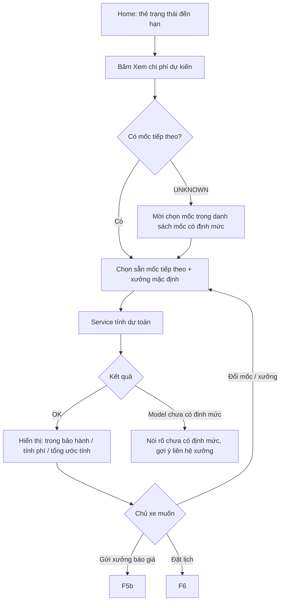

# Functional Specification — Dự toán chi phí bảo dưỡng theo model + mốc

> **Cập nhật phạm vi (02/10/2026):** các phần dưới đây trong tài liệu này không còn áp dụng.
>
> - Báo giá / duyệt báo giá (`quote`, `quote_item`, us-049): **đã bỏ**. Đặt lịch không gắn báo giá; mọi con số chi phí là ước tính (F5), chi phí cuối cùng do xưởng xác nhận khi kiểm tra xe.

> Đặc tả nghiệp vụ cho Feature **F5 — Dự toán chi phí** trong [PRD EV Care MVP](../../../product/PRD_EV_Care_MVP.md#f5--dự-toán-chi-phí).
>
> **Quan hệ tài liệu:** Tầng hội thoại đã đặc tả tại [AI-003 Cost Estimation](../../ai-agent/ai-003-sprint-2-spec.agent.md). Tài liệu này là **nguồn nghiệp vụ chính** cho cả tầng hội thoại (AI-003) lẫn màn hình dự toán trên UI; khi hai bên khác nhau, tài liệu này là chuẩn.
>
> **Quy ước mã:** dải `10xx` (`UC-10xx`, `BR-10xx`, `EDGE-10xx`, `AC-10xx`, `SCR-10xx`, `Q-10xx`) để không trùng các feature khác.
>
> Điểm chưa chốt đánh dấu `[Đề xuất]` (có giá trị mặc định để triển khai) hoặc `[Cần xác nhận]`, liệt kê lại ở mục 24.

---

# 1. Document Information

| Field | Value |
|---|---|
| Feature ID | `FEAT-COST-001` |
| Feature Name | `Dự toán chi phí bảo dưỡng theo model + mốc` |
| PRD Feature | `F5` (Must, S2); là đầu vào của `F5b`, `F6` |
| Document Version | `v1.0` |
| Status | `Draft` |
| Product / Project | EV Care — AI Agent Chăm sóc sau bán & lịch bảo dưỡng xe điện |
| Business Owner | Lê Đức Tùng (PO) |
| Author | Team 4 Người |
| Reviewer | Tech Lead |
| Stakeholders | Product, Frontend, Backend, AI Team, Chủ xưởng |
| Created Date | `2026-09-30` |
| Updated Date | `2026-09-30` |
| Related PRD | [PRD_EV_Care_MVP.md §F5, §7](../../../product/PRD_EV_Care_MVP.md) (v3.6) |
| Related Frontend Spec | [us-045-sprint-2-spec.fe.md](../frontend/us-045-sprint-2-spec.fe.md) |
| Related API Spec | [us-045-sprint-2-spec.api.md](../api/us-045-sprint-2-spec.api.md) |
| Related Entity Spec | [us-045-sprint-2-spec.entity.md](../entity/us-045-sprint-2-spec.entity.md) |
| Related Agent Spec | [ai-003-sprint-2-spec.agent.md](../../ai-agent/ai-003-sprint-2-spec.agent.md) |
| Related Design / Figma | `[Chưa có]` — màn mock hiện có: `frontend/src/features/quotes/pages/MaintenanceEstimate.tsx` (`/estimate`) |
| Related GitHub Issue | `[Cần điền]` |

---

# 2. Feature Overview

## 2.1 Feature Description

Chủ xe xem **dự toán chi phí** cho một mốc bảo dưỡng của chính xe mình tại một xưởng cụ thể. Hệ thống lấy danh sách hạng mục của mốc từ định mức hãng (`maintenance_rule`, theo `model_id` + mốc), ghép với bảng giá của xưởng (`service_price`, theo `model_id` + `item_code`), tách hạng mục **trong bảo hành** và **tính phí**, rồi trả tổng chi phí tính phí.

Hai đường vào dùng **chung một service tính dự toán**:

1. **Qua chat:** chủ xe hỏi "Mốc 12.000 km hết bao nhiêu?" → AI-003 gọi tool `estimate_maintenance_cost` và trình bày đúng kết quả.
2. **Qua UI:** từ Home (thẻ trạng thái đến hạn — F3) bấm "Xem chi phí dự kiến" → màn Dự toán.

Mọi con số đều là **"Chi phí ước tính"**; con số chính thức chỉ có khi chủ xưởng duyệt báo giá (F5b).

## 2.2 Business Objective

Giải quyết **PP-03** (không có nơi tra hạng mục & chi phí theo đúng xe) và một phần **PP-05** (xưởng bị hỏi giá lặp lại) — mục tiêu **G2**.

## 2.3 User Objective

Biết trước lần bảo dưỡng tới gồm những hạng mục nào, hạng mục nào miễn phí theo bảo hành, và tốn khoảng bao nhiêu ở xưởng mình định đến.

## 2.4 Business Value

- Chủ xe: tự tra được chi phí 24/7, đúng model và đúng mốc.
- Xưởng: giảm cuộc gọi hỏi giá; giá hiển thị lấy từ bảng giá của chính xưởng.
- Hệ thống: dự toán là đầu vào cho báo giá HITL (F5b) và chi phí ước tính của booking (F6).

---

# 3. Scope

## 3.1 In Scope

- Dự toán cho **mốc tiếp theo** (mặc định, từ F3) hoặc **một mốc chủ xe chọn** trong các mốc có định mức của model.
- Dự toán tại **xưởng ưa thích** (mặc định), hoặc xưởng chủ xe chọn.
- Nguồn giá: giá xưởng đang hiệu lực, thiếu thì giá tham khảo của hãng (EDGE-004 gốc PRD).
- Tách hạng mục trong bảo hành / tính phí; tổng = tổng các mục tính phí.
- So sánh dự toán tối đa 3 xưởng `[Đề xuất — Q-1003]`.
- Điểm chuyển tiếp: "Gửi xưởng báo giá" (F5b), "Đặt lịch" (F6).

## 3.2 Out of Scope

- Lập báo giá chính thức, duyệt giá — [F5b / us-049](../../sprint-3/feature-functional/us-049-sprint-3-spec.ff.md).
- Chi phí sửa chữa, va chạm, phụ tùng ngoài định mức bảo dưỡng.
- Khuyến mãi, gói dịch vụ, thanh toán / đặt cọc.
- Chi phí thực tế sau khi xưởng kiểm tra xe (do xưởng nhập ở F8).
- Chủ xưởng quản lý bảng giá `service_price` trên Portal — dữ liệu seed/mock trong MVP `[Đề xuất — Q-1005]`.
- Lưu lịch sử các lần dự toán — dự toán **không** được lưu thành bản ghi nghiệp vụ (BR-1007).

---

# 4. Actors & Stakeholders

## 4.1 Actors

| Actor | Type | Responsibility |
|---|---|---|
| Chủ xe | User | Chọn mốc/xưởng, xem dự toán |
| AI Agent (AI-003) | System | Gọi service dự toán qua tool, trình bày đúng kết quả |
| Cost Estimation Service | System | Nguồn duy nhất tính dự toán (dùng chung Agent + UI) |
| Chủ xưởng | User (gián tiếp) | Sở hữu bảng giá `service_price` của xưởng |
| Hệ thống hãng (mock) | Partner | Nguồn định mức (`maintenance_rule`) và thông tin bảo hành xe |

## 4.2 Stakeholders

| Stakeholder | Organization / Team | Interest / Responsibility |
|---|---|---|
| Product Owner | Team 4 | Chốt quy tắc hiển thị giá, xe hết bảo hành |
| Backend | Team 4 | Service tính dự toán tất định, unit test công thức |
| AI Team | Team 4 | Tool TOOL-301, không để LLM tự sửa số |
| Frontend | Team 4 | Màn dự toán, thẻ dự toán trong chat |

---

# 5. User Story

## US-045

**As a** chủ xe đã hoàn tất onboarding

**I want to** xem các hạng mục và chi phí ước tính của mốc bảo dưỡng sắp tới tại xưởng tôi định đến

**So that** tôi biết trước mình phải chuẩn bị bao nhiêu tiền và hạng mục nào được miễn phí.

### Additional User Stories

- `US-046`: As a chủ xe, I want to chọn một mốc khác mốc tiếp theo (ví dụ mốc 24.000 km), so that tôi lên kế hoạch chi phí cho cả năm.
- `US-047`: As a chủ xe, I want to so sánh dự toán giữa 2–3 xưởng, so that tôi chọn được xưởng phù hợp túi tiền.
- `US-048`: As a hệ thống EV Care, I want to tính dự toán bằng một service tất định dùng chung cho Agent và UI, so that con số trong chat và trên màn hình luôn khớp nhau (AC-F5-01).

---

# 6. Use Case

## UC-1001 — Xem dự toán mốc tiếp theo

### 6.1 Use Case Description

Chủ xe xem dự toán của mốc tiếp theo tại xưởng mặc định.

### 6.2 Primary Actor

Chủ xe

### 6.3 Supporting Actors / Systems

- Cost Estimation Service
- `MaintenanceStatusService` (F3) — mốc tiếp theo
- `maintenance_rule`, `service_price`, `vehicle_warranty`, `workshop`

### 6.4 Trigger

Chủ xe bấm "Xem chi phí dự kiến" trên Home, hoặc hỏi chi phí trong chat (intent `ASK_COST`).

### 6.5 Preconditions

- Chủ xe đã onboarding, xe `verified` + `link_status = active`.
- Model của xe có định mức trong `maintenance_rule` (nếu không → EDGE-1001).

### 6.6 Postconditions

- Chủ xe thấy dự toán; **không** có dữ liệu nghiệp vụ nào được ghi (BR-1007).
- Trong chat: kết quả dự toán được lưu trong tin nhắn trợ lý (`chat_message.meta.estimate`) để F5b/F6 dùng lại trong cùng hội thoại (theo [us-025](us-025-sprint-2-spec.ff.md)).

## UC-1002 — Dự toán mốc khác / xưởng khác

### 6.1 Use Case Description

Chủ xe đổi mốc (trong danh sách mốc có định mức của model) hoặc đổi xưởng; hệ thống tính lại.

### 6.4 Trigger

Chủ xe đổi bộ chọn mốc/xưởng trên màn Dự toán, hoặc nêu mốc/xưởng trong chat.

### 6.5 Preconditions

Như UC-1001. Mốc được chọn phải tồn tại trong định mức của model (BR-1002).

### 6.6 Postconditions

Dự toán mới hiển thị; dự toán cũ không còn hiệu lực trên màn hình.

## UC-1003 — So sánh dự toán giữa các xưởng `[Đề xuất — Q-1003]`

### 6.1 Use Case Description

Chủ xe chọn tối đa 3 xưởng `active`; hệ thống trả dự toán cho từng xưởng trên cùng một mốc.

### 6.6 Postconditions

Mỗi xưởng một dự toán độc lập; không xếp hạng "rẻ nhất" bằng LLM — thứ tự do backend sắp theo tổng tính phí tăng dần.

---

# 7. User Flow

## 7.1 Main User Flow



## 7.2 Flow Description

| Step | Actor | Action / Event | System Response | Result |
|---|---|---|---|---|
| 1 | Chủ xe | Bấm "Xem chi phí dự kiến" | Lấy mốc tiếp theo (F3) + xưởng mặc định (BR-1003) | Bộ chọn điền sẵn |
| 2 | System | Tính dự toán | Ghép định mức × giá xưởng (BR-1001, BR-1004) | Danh sách hạng mục có giá |
| 3 | Chủ xe | Xem dự toán | Tách bảo hành / tính phí, gắn nhãn (BR-1005, BR-1006) | Biết tổng ước tính |
| 4 | Chủ xe | Đổi mốc/xưởng (tuỳ chọn) | Tính lại | Dự toán mới |
| 5 | Chủ xe | Chọn bước tiếp theo | Chuyển F5b hoặc F6, mang theo mốc + xưởng | — |

---

# 8. Screen / UI Flow

> UI dùng để minh hoạ nghiệp vụ; chi tiết ở [Frontend Spec](../frontend/us-045-sprint-2-spec.fe.md).

## 8.1 Screen Flow

```text
[Home — thẻ trạng thái (F3)]
    |
    v
[SCR-1001 Dự toán chi phí]
    |
    +----> [SCR-1002 Chọn mốc]      (bottom sheet)
    +----> [SCR-1003 Chọn xưởng]    (bottom sheet, dùng danh sách xưởng gần — us-029 API-BK-01)
    +----> [SCR-1004 So sánh xưởng] (tuỳ chọn, Q-1003)
    +----> [F5b — Gửi xưởng báo giá]
    +----> [F6 — Đặt lịch]
    |
[Chat — thẻ dự toán (card: estimate)]
```

## 8.2 Screen List

| Screen ID | Screen Name | Purpose | Entry From | Exit To |
|---|---|---|---|---|
| `SCR-1001` | Dự toán chi phí | Hiển thị dự toán một mốc tại một xưởng | Home, chat (link "Xem chi tiết") | F5b, F6, SCR-1002/1003/1004 |
| `SCR-1002` | Chọn mốc | Chọn mốc có định mức của model | SCR-1001 | SCR-1001 |
| `SCR-1003` | Chọn xưởng | Chọn xưởng `active` | SCR-1001 | SCR-1001 |
| `SCR-1004` | So sánh xưởng | Dự toán tối đa 3 xưởng cùng mốc | SCR-1001 | SCR-1001 |
| `CARD-EST` | Thẻ dự toán trong chat | Cùng dữ liệu SCR-1001, dạng thẻ | Tin nhắn trợ lý | SCR-1001 |

## 8.3 Screen / UI Reference

### SCR-1001 — Dự toán chi phí

**Main UI**

- Tiêu đề: mốc (ví dụ "Mốc 12.000 km / 12 tháng"), model, xưởng.
- Nhóm **Trong bảo hành (miễn phí)**: tên hạng mục.
- Nhóm **Tính phí**: tên hạng mục + giá; hạng mục giá tham khảo có dấu `*`.
- **Tổng chi phí ước tính** = tổng nhóm Tính phí.
- Nhãn cố định **"Chi phí ước tính"** + chú thích "Chi phí thực tế có thể thay đổi sau khi xưởng kiểm tra xe"; nếu có mục giá tham khảo: "* Xưởng chưa có giá cho hạng mục này; đây là giá tham khảo của hãng".
- Nút: **Gửi xưởng báo giá** (F5b), **Đặt lịch** (F6).

**Business Meaning** — Một dự toán = ảnh chụp tại thời điểm tính của định mức hãng × bảng giá xưởng; không phải cam kết giá.

**System Behavior** — Mọi số liệu lấy nguyên từ service; FE/LLM không tự cộng, làm tròn hay sửa số (BR-1006).

---

# 9. Main Flow

## 9.1 Happy Path

1. Chủ xe VF6, ODO 11.600 km, trạng thái `DUE_SOON`, mốc tiếp theo 12.000 km (F3).
2. Chủ xe bấm "Xem chi phí dự kiến" trên Home.
3. Hệ thống chọn xưởng ưa thích "VinFast Smart City" (BR-1003).
4. Service lấy 5 hạng mục của mốc 12.000 km cho VF6; 4 mục có giá xưởng, 1 mục chỉ có giá tham khảo; 1 mục thuộc bảo hành.
5. Màn hình hiện: Trong bảo hành (1 mục); Tính phí (4 mục, 1 mục gắn `*`); Tổng chi phí ước tính = tổng 4 mục tính phí (AC-1001, AC-1002).
6. Chủ xe bấm "Đặt lịch" → sang F6 với xưởng + mốc đã chọn; `estimated_cost` của booking lấy từ dự toán này (us-029 AF-004).

---

# 10. Alternative Flow

## AF-1001 — Mốc tiếp theo `UNKNOWN`

**Condition** — F3 trả `UNKNOWN` (chưa đồng bộ hãng hoặc model chưa có định mức).

**Flow**

1. Nếu model **có** định mức: hiển thị danh sách mốc có định mức, mời chủ xe chọn (SCR-1002).
2. Nếu model **không có** định mức: EDGE-1001.

**Expected Result** — Chủ xe vẫn xem được dự toán theo mốc tự chọn khi có định mức.

## AF-1002 — Chưa có xưởng ưa thích

**Condition** — `vehicle_user.preferred_workshop_id` trống hoặc xưởng đó không `active`.

**Flow** — Dùng xưởng gần nhất theo mốc vị trí hồ sơ (cùng quy tắc us-029 BR-002/003/004) và **nói rõ** "đang tính theo xưởng gần bạn nhất"; mời chọn xưởng khác.

**Expected Result** — Luôn có một xưởng để tính, hoặc EDGE-1005 nếu không xác định được xưởng nào.

## AF-1003 — Hỏi chi phí trong chat

**Condition** — Intent `ASK_COST` (AI-003).

**Flow** — AI-003 gọi TOOL-301 với cùng service; trả lời theo cấu trúc AI-003 §12.2 hoặc thẻ `CARD-EST`; gợi ý F5b/F6.

**Expected Result** — Tổng trong câu trả lời **bằng đúng** tổng của service (AC-F5-01).

## AF-1004 — Xe hết bảo hành `[Đề xuất — Q-1001]`

**Condition** — Xe được coi là **hết bảo hành** tại ngày tính.

> **Khoảng trống dữ liệu:** `vehicle_warranty.component` chỉ có `battery / motor / chassis / electronics` (ENT-004), không có "bảo hành chung", và `maintenance_rule` không gắn hạng mục với component nào. `[Đề xuất]` MVP: xe **còn bảo hành** khi component `chassis` có `end_date ≥ today`; không có dữ liệu bảo hành ⇒ coi như còn bảo hành và ghi "chưa có dữ liệu bảo hành từ hãng". Phase sau: thêm `maintenance_rule.warranty_component` để xét theo từng hạng mục.

**Flow** — Hạng mục định mức `is_covered_by_warranty = true` **chuyển sang tính phí**, giá theo cùng thứ tự BR-1004; bỏ nhóm "Trong bảo hành" và bỏ mọi nội dung nói về bảo hành (đồng bộ với quy tắc nhắc F7 của PRD).

**Expected Result** — Tổng phản ánh đúng chi phí khi không còn bảo hành; ghi "Xe đã hết thời hạn bảo hành chung".

---

# 11. Exception Flow

## EF-1001 — Service dự toán lỗi / quá thời gian

**Condition** — DB timeout hoặc lỗi hệ thống khi tính.

**System Behavior** — Không trả số liệu một phần; trả lỗi tạm thời. Tool AI-003 thử lại 1 lần rồi báo "tạm thời chưa tính được", **không** đưa số.

**User Experience** — "Tạm thời chưa tính được chi phí, bạn thử lại sau ít phút".

**Recovery** — Nút Thử lại.

## EF-1002 — Xưởng không còn `active`

**Condition** — Xưởng được chọn bị ngừng hoạt động giữa chừng.

**System Behavior** — Từ chối tính cho xưởng đó; gợi ý xưởng khác (AF-1002).

**User Experience** — "Xưởng này hiện không nhận khách, mời bạn chọn xưởng khác".

---

# 12. Business Rules

## BR-1001 — Công thức dự toán tất định

**Rule** — Với xe có `model_id = m`, mốc `k` (`odo_milestone`), xưởng `w`, ngày tính `today` (Asia/Ho_Chi_Minh):

```text
items          = maintenance_rule WHERE model_id = m AND odo_milestone = k
với mỗi item:
  covered      = item.is_covered_by_warranty AND xe còn bảo hành (AF-1004)
  price        = giá theo BR-1004
  price_source = WORKSHOP_PRICE | REFERENCE_PRICE
chargeable_total = Σ price của các item có covered = false
covered_count    = số item có covered = true
```

Mục `covered = true` **không** cộng vào tổng và hiển thị "Miễn phí (bảo hành)".

**Condition** — Mọi lần tính dự toán (UI hoặc Agent).

**Expected Behavior** — Kết quả tất định: cùng đầu vào + cùng dữ liệu ⇒ cùng kết quả. Làm tròn: giữ nguyên `numeric(12,2)` từ DB, hiển thị VNĐ không phần lẻ.

**Priority** — High

## BR-1002 — Mốc hợp lệ

**Rule** — Chỉ tính cho mốc có trong `maintenance_rule` của model. Mốc chủ xe nêu tự do ("khoảng 12 nghìn km") được chuẩn hoá về mốc tồn tại gần nhất **lớn hơn hoặc bằng** giá trị nêu `[Đề xuất — Q-1004]`; không chuẩn hoá được ⇒ liệt kê các mốc hợp lệ để chủ xe chọn.

**Priority** — High

## BR-1003 — Xưởng mặc định

**Rule** — Thứ tự chọn xưởng khi chủ xe chưa chỉ định: (1) xưởng ưa thích `active`; (2) xưởng gần nhất theo us-029 BR-002→BR-004; không có ⇒ EDGE-1005. Chỉ tính cho xưởng `status = active`.

**Priority** — Medium

## BR-1004 — Thứ tự ưu tiên nguồn giá (BR-ENT-411)

**Rule** — Với mỗi hạng mục (`model_id`, `item_code`):

1. `service_price.price` của xưởng đang hiệu lực (`valid_from ≤ today` hoặc `NULL`, và `valid_to ≥ today` hoặc `NULL`) ⇒ `WORKSHOP_PRICE`.
2. Không có ⇒ `maintenance_rule.estimated_cost` ⇒ `REFERENCE_PRICE`, hiển thị kèm nhãn "giá tham khảo" (AC-F5-02).

**Note** — Nếu vì lỗi dữ liệu có nhiều dòng giá hiệu lực chồng lấn (vi phạm BR-ENT-412), lấy dòng có `valid_from` mới nhất và ghi log cảnh báo dữ liệu.

**Priority** — High

## BR-1005 — Nhãn "Chi phí ước tính"

**Rule** — Mọi con số dự toán (từng dòng và tổng) hiển thị dưới nhãn **"Chi phí ước tính"** kèm câu "Chi phí thực tế có thể thay đổi sau khi xưởng kiểm tra xe" (PRD §7 — Estimate label).

**Priority** — High

## BR-1006 — LLM và FE không sửa số

**Rule** — Tổng và giá từng dòng chỉ lấy từ service. LLM không tự cộng, làm tròn, chiết khấu hay đưa khoảng giá; FE không tự tính lại tổng (PRD F5, AI-003 §12.6).

**Priority** — High

## BR-1007 — Dự toán không phải bản ghi nghiệp vụ

**Rule** — Tính dự toán **không** ghi DB nghiệp vụ. Muốn "giữ" con số để xưởng xác nhận ⇒ lập báo giá (F5b), khi đó các dòng dự toán được **snapshot** vào `quote_item`.

**Priority** — Medium

## BR-1008 — Chỉ dự toán xe của chính chủ xe

**Rule** — Chỉ tính cho `user_vehicle` `verified` + `link_status = active` thuộc chủ xe đang đăng nhập. Xe khác ⇒ xử lý như không tồn tại.

**Priority** — High

## BR-1009 — Không đưa số khi thiếu định mức

**Rule** — Model không có định mức cho mốc yêu cầu ⇒ **không** đưa bất kỳ con số nào (kể cả "mẫu xe tương đương"), nói rõ chưa có định mức và gợi ý liên hệ xưởng. Chốt mâu thuẫn EDGE-003 gốc với nguyên tắc no-source-no-claim (AI-Q-304) theo hướng **không đưa số** `[Đề xuất — Q-1002]`.

**Priority** — High

---

# 13. State / Status

Dự toán không có vòng đời (không lưu). Trạng thái hiển thị trên màn:

| State | Meaning | Entry Condition | Exit Condition |
|---|---|---|---|
| `LOADING` | Đang tính | Mở màn / đổi mốc, xưởng | Có kết quả hoặc lỗi |
| `READY` | Có dự toán | Service trả kết quả | Đổi mốc/xưởng |
| `NO_RULE` | Model/mốc chưa có định mức | BR-1009 | Chọn mốc khác |
| `ERROR` | Lỗi tạm thời | EF-1001 | Thử lại |

---

# 14. Data Requirements

## 14.1 Required Data

| Data | Type | Required | Description | Source |
|---|---|---:|---|---|
| Xe của chủ xe | id | Yes | `user_vehicle_id`, `model_id` | `user_vehicle` (ENT-003) |
| Mốc tiếp theo | integer | No | Mốc mặc định | F3 `MaintenanceStatusService` |
| Định mức | list | Yes | Hạng mục, cờ bảo hành, giá tham khảo | `maintenance_rule` (ENT-401) |
| Giá xưởng | list | No | Giá đang hiệu lực | `service_price` (ENT-409) |
| Xưởng | id | Yes | Xưởng `active` | `workshop` (ENT-008) |
| Bảo hành xe | date | No | Còn bảo hành chung hay không (AF-1004) | `vehicle_warranty` (ENT-004) |
| Xưởng ưa thích / vị trí | id / địa chỉ | No | Chọn xưởng mặc định | `vehicle_user`, `user_location` |

## 14.2 Data Dependency

| Data / Entity | Why Needed | Read / Write | Owner |
|---|---|---|---|
| `maintenance_rule` | Hạng mục của mốc | Read | Backend (seed từ hãng) |
| `service_price` | Giá xưởng | Read | Backend (seed/mock) |
| `workshop` | Trạng thái xưởng | Read | Backend |
| `vehicle_warranty` | Bảo hành chung | Read | Backend (đồng bộ hãng) |
| `chat_message.meta` | Lưu kết quả dự toán trong chat | Write (qua MessageService) | Backend |

---

# 15. Business Error & Edge Cases

| Case ID | Scenario | Expected Business Behavior | User Outcome |
|---|---|---|---|
| `EDGE-1001` | Model chưa có định mức cho mốc (gốc EDGE-003) | Không đưa số (BR-1009) | Được gợi ý liên hệ xưởng |
| `EDGE-1002` | Xưởng thiếu giá một số hạng mục (gốc EDGE-004) | Dùng giá tham khảo + nhãn (BR-1004) | Thấy `*` và chú thích |
| `EDGE-1003` | Xưởng không có dòng giá nào cho model | Toàn bộ dùng giá tham khảo, ghi rõ "xưởng chưa công bố bảng giá cho model này" | Vẫn có dự toán tham khảo |
| `EDGE-1004` | Tất cả hạng mục thuộc bảo hành | Tổng = 0; ghi "Mốc này không phát sinh chi phí theo định mức" | Biết mốc miễn phí |
| `EDGE-1005` | Không xác định được xưởng nào | Không tính; mời chọn xưởng / nhập vị trí | Chọn xưởng |
| `EDGE-1006` | Giá xưởng hết hiệu lực (`valid_to` < hôm nay) | Coi như không có giá xưởng (BR-1004 #2) | Thấy giá tham khảo |
| `EDGE-1007` | Mốc nêu không tồn tại ("mốc 13.000 km") | Chuẩn hoá hoặc liệt kê mốc hợp lệ (BR-1002) | Chọn mốc hợp lệ |
| `EDGE-1008` | Xe hết bảo hành | AF-1004 | Tổng gồm cả mục trước đây miễn phí |
| `EDGE-1009` | Chủ xe hỏi chi phí sửa chữa ngoài định mức | Ngoài phạm vi; gợi ý liên hệ xưởng | Không có số |

---

# 16. Permissions & Access

## 16.1 Access Matrix

| Role / Actor | View | Create | Update | Delete | Notes |
|---|---:|---:|---:|---:|---|
| Chủ xe | ✅ | — | — | — | Chỉ xe của mình (BR-1008) |
| AI Agent (AI-003) | ✅ | — | — | — | Dưới danh nghĩa chủ xe của phiên chat |
| Chủ xưởng | ❌ | — | — | — | Xem giá qua báo giá (F5b) |

## 16.2 Business Authorization Rules

- Dự toán chỉ trả cho chủ sở hữu xe đang liên kết.
- Bảng giá xưởng là dữ liệu công khai với chủ xe đã đăng nhập (chỉ giá theo model xe của họ).

---

# 17. Acceptance Criteria

## AC-1001 — Tổng khớp tool (AC-F5-01)

**Given** dự toán có 4 hạng mục tính phí với giá 300.000, 450.000, 200.000, 350.000 và 1 hạng mục bảo hành

**When** chủ xe xem dự toán trên UI hoặc hỏi trong chat

**Then** tổng hiển thị là **1.300.000 VNĐ** ở cả hai nơi, bằng `chargeable_total` của service; mục bảo hành không cộng vào tổng.

## AC-1002 — Giá tham khảo có nhãn (AC-F5-02)

**Given** xưởng không có `service_price` hiệu lực cho `BRAKE_FLUID_REPLACE` của VF6

**When** tính dự toán mốc có hạng mục đó

**Then** hạng mục hiển thị `maintenance_rule.estimated_cost` kèm dấu `*` và chú thích "giá tham khảo của hãng".

## AC-1003 — Nhãn ước tính

**Given** bất kỳ dự toán nào

**When** hiển thị

**Then** có nhãn "Chi phí ước tính" và câu lưu ý chi phí thực tế.

## AC-1004 — Không có định mức thì không có số

**Given** model của xe không có `maintenance_rule` cho mốc được hỏi

**When** chủ xe yêu cầu dự toán

**Then** không có con số nào được hiển thị/nói ra; có gợi ý liên hệ xưởng.

## AC-1005 — Không dự toán xe người khác

**Given** chủ xe A gọi dự toán với `userVehicleId` của chủ xe B

**When** gửi yêu cầu

**Then** bị từ chối như xe không tồn tại.

## AC-1006 — Giá hết hiệu lực không được dùng

**Given** dòng `service_price` có `valid_to` = hôm qua

**When** tính dự toán hôm nay

**Then** hạng mục đó dùng giá tham khảo (EDGE-1006).

---

# 18. Non-functional Expectations

| Requirement | Expected Behavior |
|---|---|
| Response Experience | Dự toán trả ≤ 500 ms (p90) — API nghiệp vụ PRD §8 |
| Correctness | 100% dự toán khớp công thức (unit test service giá — PRD §10) |
| Consistency | UI và chat dùng cùng service ⇒ cùng số |
| Language | Tiếng Việt; tiền VNĐ định dạng `1.250.000` |

---

# 19. Dependencies

| Dependency | Purpose | Owner | Required | Related Document |
|---|---|---|---:|---|
| F3 `MaintenanceStatusService` | Mốc tiếp theo | Backend | Yes | [us-017 FF](us-017-sprint-2-spec.ff.md) |
| Dữ liệu `maintenance_rule` đủ theo model | Hạng mục | Backend / Data | Yes | [maintenance_rule](../../entity/maintenance/maintenance_rule.entity.md) |
| Dữ liệu `service_price` 3–5 xưởng mock | Giá xưởng | Backend / Data | Yes | [service_price](../../entity/workshop/service_price.entity.md) |
| `WorkshopLocationFinder` (us-029) | Xưởng gần nhất khi không có xưởng ưa thích | Backend | No | [us-029 API §3](../../sprint-3/api/us-029-sprint-3-spec.api.md) |
| AI-003 | Tầng hội thoại | AI Team | Yes | [ai-003](../../ai-agent/ai-003-sprint-2-spec.agent.md) |

---

# 20. Assumptions

- Mỗi model hỗ trợ có đủ `maintenance_rule` theo mốc (PRD §13).
- `service_price` của xưởng mock được seed sẵn; chủ xưởng chưa tự quản lý giá trong MVP.
- Tạm dùng component `chassis` của `vehicle_warranty` làm "bảo hành chung" của xe `[Cần xác nhận — Q-1001]`.

---

# 21. Business Constraints

- Không cam kết giá; mọi số là ước tính (PRD §7).
- Không dùng LLM để tính toán.
- Không báo giá sửa chữa ngoài định mức.

---

# 22. Terminology / Glossary

| Term ID | Term | Vietnamese Name | Definition | Example / Notes |
|---|---|---|---|---|
| `TERM-1001` | Cost estimate | Dự toán | Kết quả tính tất định định mức × giá xưởng tại một thời điểm | Không lưu DB |
| `TERM-1002` | Chargeable total | Tổng tính phí | Tổng giá các mục không thuộc bảo hành | `chargeable_total` |
| `TERM-1003` | Workshop price | Giá xưởng | `service_price.price` đang hiệu lực | `WORKSHOP_PRICE` |
| `TERM-1004` | Reference price | Giá tham khảo | `maintenance_rule.estimated_cost` khi xưởng thiếu giá | `REFERENCE_PRICE` |
| `TERM-1005` | Covered item | Hạng mục trong bảo hành | Mục định mức `is_covered_by_warranty = true` khi xe còn bảo hành | Miễn phí |

### Important Terminology Rules

- "Dự toán" ≠ "báo giá": báo giá (F5b) là bản ghi có người duyệt; dự toán thì không.
- Luôn dùng "Chi phí ước tính", không dùng "giá chính thức" cho dự toán.

---

# 23. Partner / Stakeholder Notes

## 23.1 Confirmed

- Nguồn giá: giá xưởng trước, giá tham khảo sau (BR-ENT-411, PRD F5).
- Tổng = tổng các mục tính phí (PRD F5, AC-F5-01).

## 23.2 Pending Confirmation

- Xe hết bảo hành (Q-1001), mâu thuẫn EDGE-003 (Q-1002), so sánh nhiều xưởng (Q-1003).

---

# 24. Open Questions

| ID | Question | Owner | Status | Decision / Due Date |
|---|---|---|---|---|
| `Q-1001` | Xe hết bảo hành: mục `is_covered_by_warranty = true` có tính phí không, lấy giá từ đâu? "Còn bảo hành" xác định từ component nào của `vehicle_warranty` (enum không có "bảo hành chung")? (= AI-Q-302) | PO | Open | `[Đề xuất]` tính phí theo BR-1004; tạm dùng component `chassis`; phase sau thêm `maintenance_rule.warranty_component` |
| `Q-1002` | EDGE-003 gốc ("quy định chung cho mẫu xe tương đương") mâu thuẫn no-source-no-claim (= AI-Q-304) | PO | Open | `[Đề xuất]` không đưa số (BR-1009) |
| `Q-1003` | Có hỗ trợ so sánh nhiều xưởng trong MVP? (= AI-Q-303) | PO | Open | `[Đề xuất]` có, tối đa 3 |
| `Q-1004` | Chuẩn hoá mốc chủ xe nêu tự do: lấy mốc ≥ gần nhất hay gần nhất tuyệt đối? | PO | Open | `[Đề xuất]` mốc ≥ gần nhất |
| `Q-1005` | Chủ xưởng có màn quản lý `service_price` trong MVP không? | PO | Open | `[Đề xuất]` không — seed/mock; phase sau |

---

# 25. Traceability

| Item | Reference |
|---|---|
| PRD | [F5, §7, §10](../../../product/PRD_EV_Care_MVP.md) |
| User Story | `US-045` → `US-048` |
| Use Case | `UC-1001` → `UC-1003` |
| Business Rules | `BR-1001` → `BR-1009`; `BR-ENT-411`, `BR-ENT-412` |
| Acceptance Criteria | `AC-1001` → `AC-1006` (bao AC-F5-01, AC-F5-02) |
| Frontend Specification | [us-045 FE](../frontend/us-045-sprint-2-spec.fe.md) |
| API Specification | [us-045 API](../api/us-045-sprint-2-spec.api.md) |
| Agent Specification | [AI-003](../../ai-agent/ai-003-sprint-2-spec.agent.md) |
| Test Cases | Unit test service giá (PRD §10) — `[Cần điền]` |

---

# 26. Related Documents

- [PRD](../../../product/PRD_EV_Care_MVP.md)
- [Frontend Specification](../frontend/us-045-sprint-2-spec.fe.md)
- [API Specification](../api/us-045-sprint-2-spec.api.md)
- [Entity Specification](../entity/us-045-sprint-2-spec.entity.md)
- [AI-003 Cost Estimation](../../ai-agent/ai-003-sprint-2-spec.agent.md)
- [F3 — us-017 FF](us-017-sprint-2-spec.ff.md) · [F5b — us-049 FF](../../sprint-3/feature-functional/us-049-sprint-3-spec.ff.md) · [F6 — us-029 FF](../../sprint-3/feature-functional/us-029-sprint-3-spec.ff.md)

---

# 27. Change Log

| Version | Date | Author | Change |
|---|---|---|---|
| `v1.0` | `2026-09-30` | Team 4 Người | Bản đầu — bổ sung FF F5 còn thiếu (AI-003 ghi "FF F5 [Chưa có]") |

---

# 28. Approval

| Role | Name | Status | Date |
|---|---|---|---|
| Product Owner | Lê Đức Tùng | Pending | |
| Technical Owner | Tech Lead | Pending | |
