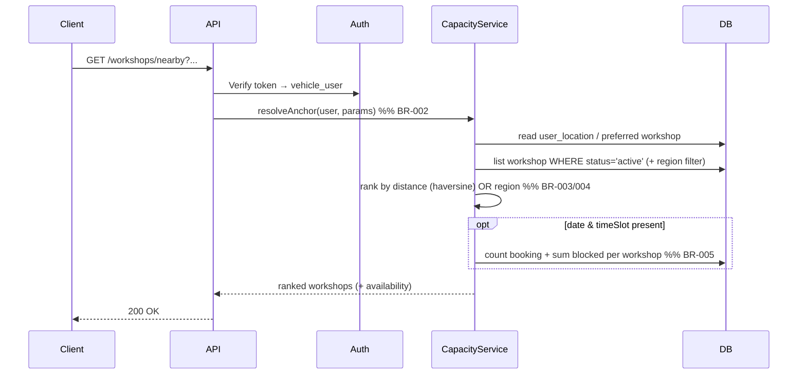
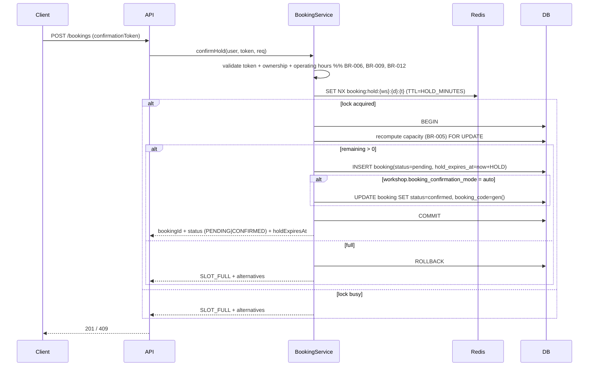

# API Technical Specification — Đặt lịch bảo dưỡng theo sức chứa & vị trí

> Backend cho Feature `FEAT-BOOK-001` — F6 (US-029 → US-032).
>
> **Nguồn nghiệp vụ:** [Functional Spec](../feature-functional/us-029-sprint-3-spec.ff.md) là chuẩn; API **không** định nghĩa lại nghiệp vụ, chỉ trỏ `BR-xxx` / `EF-xxx` / `EDGE-xxx`.
>
> **Entity:** [Entity Spec](../entity/us-029-sprint-3-spec.entity.md) — `workshop_slot_block` (ENT-418, mới) + tái dùng `booking`, `workshop`, `workshop_operating_hour`, `user_location`, `vehicle_user`, `user_vehicle`, `quote`.
>
> **Nguyên tắc chốt (BR-011):** tool đặt lịch của Agent (AI-004) và các API dưới đây gọi **chung một** Booking & Capacity Service. Các endpoint chỉ là lớp vỏ HTTP quanh service đó.

---

# 0. Document Information

| Field | Value |
|---|---|
| Document ID | `API-SPEC-BOOK-001` |
| Feature | `FEAT-BOOK-001` — F6 |
| Version | `v1.0` |
| Status | `Draft` |
| Owner | Backend Team |
| Author | Team 4 Người |
| Base URL | `/api/v1` |
| Auth | Firebase ID token (Bearer) — như mọi API nghiệp vụ (PRD §8) |
| Created Date | `2026-09-29` |
| Updated Date | `2026-09-29` |
| Related Functional Spec | [us-029-sprint-3-spec.ff.md](../feature-functional/us-029-sprint-3-spec.ff.md) |
| Related Entity Spec | [us-029-sprint-3-spec.entity.md](../entity/us-029-sprint-3-spec.entity.md) |
| Related Agent Spec | [ai-004-sprint-3-spec.agent.md](../../ai-agent/ai-004-sprint-3-spec.agent.md) |

---

# 1. Overview

## 1.1 API Group

Nhóm API đặt lịch theo sức chứa & vị trí. Bốn endpoint chính, dùng chung Booking & Capacity Service:

| API ID | Method | Endpoint | Mục đích | Tool AI-004 tương ứng |
|---|---|---|---|---|
| `API-BK-01` | `GET` | `/api/v1/workshops/nearby` | Gợi ý xưởng gần theo vị trí + tình trạng còn chỗ (UC-401) | `find_workshop` (TOOL-401) |
| `API-BK-02` | `GET` | `/api/v1/workshops/{workshopId}/availability` | Kiểm tra khung còn chỗ + phương án thay thế; cấp `confirmationToken` cho slot còn chỗ (UC-402) | `check_availability` (TOOL-402) |
| `API-BK-03` | `POST` | `/api/v1/bookings` | **Chủ xe bấm Xác nhận** → tạo booking `pending` = **giữ chỗ**; nếu xưởng `auto` thì chuyển `confirmed` ngay + Ticket/QR (BR-007, BR-009, BR-014) | `create_booking` (TOOL-403) |
| `API-BK-04` | `DELETE` | `/api/v1/bookings/{bookingId}/hold` | Chủ xe **huỷ giữ chỗ** trong cửa sổ 10 phút (BR-010) | `cancel_booking` (giai đoạn hold) |

> **Xưởng xác nhận/từ chối** booking `pending` (chế độ `manual`, BR-014) và **khoá chỗ** (`workshop_slot_block`) thuộc **F8 — Workshop Board** (API riêng). Job tự huỷ khi xưởng không xác nhận kịp (BR-015) chạy nền. Huỷ/đổi lịch đã `confirmed` thuộc **F6b**.

## 1.2 Scope

**In Scope**

- Gợi ý xưởng theo mốc vị trí (địa điểm chỉ định / hồ sơ / xưởng ưa thích).
- Kiểm tra sức chứa (BR-005), giữ chỗ nguyên tử, xác nhận tạo booking.

**Out of Scope**

- Xưởng xác nhận/từ chối booking `pending` (F8); khoá chỗ (F8); huỷ/đổi lịch đã `confirmed` + nội dung Ticket đầy đủ (F6b); trạng thái sau `confirmed` (F8); dự toán chi phí (F5 — chỉ nhận `quoteId`/estimate).
- Geocoding: MVP chỉ so khớp chuỗi địa điểm (Q-401) — xem note §3.

---

# 2. Authentication & Authorization

## 2.1 Authentication

```http
Authorization: Bearer <firebase_id_token>
```

Backend verify bằng Firebase Admin SDK; suy ra `vehicle_user` theo `firebase_uid`.

## 2.2 Allowed Roles

| Role | Access |
|---|---|
| `VEHICLE_USER` (chủ xe `active`) | ✅ Allowed |
| `WORKSHOP_OWNER` | ❌ Denied (không đặt hộ; khoá chỗ ở F8) |
| `ANONYMOUS` | ❌ Denied |

## 2.3 Authorization Rules

- Tài khoản phải `status = active AND onboarding_status = active` (BR-ENT-004).
- Chủ xe chỉ đặt cho `user_vehicle` `verified` + `link_status = active` thuộc chính mình (BR-012, AC-009).
- Tool của AI-004 gọi service dưới danh nghĩa chủ xe của phiên chat (cùng kiểm tra quyền).

---

# 3. API-BK-01 — `GET /api/v1/workshops/nearby`

## 3.1 Purpose

Trả danh sách xưởng `active` gần **mốc vị trí** (BR-002), kèm tình trạng còn chỗ nếu client truyền `date`/`timeSlot`. Chỉ đọc.

> **⚠️ Q-401 (ưu tiên cao nhất) — tìm xưởng gần đặt sau một interface.** Logic xếp hạng xưởng gần **phải** nằm sau một interface/tool riêng, ví dụ:
> ```text
> WorkshopLocationFinder.find(anchor: LocationAnchor, limit: int) -> RankedWorkshop[]
> ```
> MVP triển khai bản đơn giản: `anchor` là chuỗi địa điểm → **so khớp text** với `workshop.name`/`region` (không geocoding); có toạ độ (chủ xe chia sẻ) thì xếp bằng haversine. Về sau thay implementation (geocoding, khoảng cách thật, định tuyến) **không đổi** endpoint/response này.

## 3.2 Query Parameters

| Field | Type | Required | Description | Constraints |
|---|---|---:|---|---|
| `anchor` | `string` | No | Nguồn mốc vị trí: `SPECIFIED` / `PROFILE` / `PREFERRED`. Bỏ trống ⇒ backend tự chọn theo BR-002 | enum |
| `lat` | `number` | No | Vĩ độ địa điểm chỉ định (khi `anchor=SPECIFIED`) | `-90..90` |
| `lng` | `number` | No | Kinh độ địa điểm chỉ định | `-180..180` |
| `query` | `string` | No | Địa điểm chỉ định dạng text ("Smart City", một địa chỉ) | Max 200 |
| `province` | `string` | No | Khu vực khi không có toạ độ | Max 100 |
| `userVehicleId` | `string` (uuid) | No | Xe để tính còn chỗ theo khung; mặc định xe đang liên kết | Must exist, thuộc user |
| `date` | `date` | No | Ngày muốn xem còn chỗ (ISO `YYYY-MM-DD`) | ≥ hôm nay |
| `timeSlot` | `time` | No | Khung giờ muốn xem (`HH:mm`) | Bội `SLOT_MINUTES` |
| `limit` | `integer` | No | Số xưởng tối đa | 1..10, default `BOOKING_NEARBY_LIMIT=5` |

**Quy tắc chọn mốc vị trí (BR-002):** `SPECIFIED` (lat/lng hoặc query/province) → `PROFILE` (`user_location` primary) → `PREFERRED` (`vehicle_user.preferred_workshop_id`). Không nguồn nào ⇒ `422` (EF-004).

## 3.3 Internal Processing



- Toạ độ đủ ở cả hai phía ⇒ xếp theo khoảng cách (BR-003); thiếu ⇒ lọc `region` khớp `province`, xếp theo khu vực (BR-004).
- Xưởng ưa thích `active` luôn được ghim đầu kèm `isPreferred = true`.
- Nếu có `date`/`timeSlot`: mỗi xưởng kèm `available`, `remaining` theo BR-005.

## 3.4 Success Response `200 OK`

```json
{
  "data": {
    "anchor": { "source": "PROFILE", "province": "Hà Nội", "lat": 21.007, "lng": 105.843, "rankedBy": "DISTANCE" },
    "workshops": [
      {
        "workshopId": "3f1e2d3c-4b5a-6978-8a9b-0c1d2e3f4a5b",
        "name": "VinFast Smart City",
        "address": "Đại lộ Thăng Long, Nam Từ Liêm, Hà Nội",
        "region": "Hà Nội",
        "distanceKm": 3.4,
        "isPreferred": true,
        "operatingHoursToday": { "isClosed": false, "openTime": "08:00", "closeTime": "17:30" },
        "availability": { "date": "2026-10-04", "timeSlot": "09:00", "available": true, "remaining": 5 }
      }
    ]
  }
}
```

`distanceKm` = `null` khi xếp theo khu vực (`rankedBy = "REGION"`). `availability` = `null` khi không truyền `date`/`timeSlot`.

## 3.5 Errors

| Case | Error Code | HTTP |
|---|---|---|
| Không xác định được mốc vị trí (EF-004) | `LOCATION_ANCHOR_REQUIRED` | `422` |
| Không có xưởng khả dụng | `NO_WORKSHOP_AVAILABLE` | `200` (danh sách rỗng + message) hoặc `404` `[Đề xuất: 200 kèm rỗng]` |
| `userVehicleId` không thuộc user | `FORBIDDEN` | `403` |

---

# 4. API-BK-02 — `GET /api/v1/workshops/{workshopId}/availability`

## 4.1 Purpose

Kiểm tra một hoặc nhiều khung còn chỗ của một xưởng theo BR-005; khi khung yêu cầu hết chỗ, trả **phương án thay thế** (BR-008). Chỉ đọc (không tạo booking). Với một khung **cụ thể còn chỗ** (`timeSlot` + `available = true`), trả kèm `confirmationToken` gắn đúng slot để dùng cho bước Xác nhận (API-BK-03).

## 4.2 Path & Query Parameters

| Field | Type | Required | Description | Constraints |
|---|---|---:|---|---|
| `workshopId` (path) | `string` (uuid) | Yes | Xưởng cần kiểm tra | Must exist, `active` |
| `date` | `date` | Yes | Ngày | ≥ hôm nay |
| `timeSlot` | `time` | No | Khung cụ thể; bỏ trống ⇒ trả tất cả khung còn chỗ trong ngày | Trong giờ hoạt động (BR-006) |
| `userVehicleId` | `string` (uuid) | No | Xe để đối chiếu booking trùng | Thuộc user |
| `withAlternatives` | `boolean` | No | Trả phương án khi hết chỗ | default `true` |

## 4.3 Validation

| Validation | Rule | Error |
|---|---|---|
| Workshop tồn tại & active | `workshop.status = active` | `404 WORKSHOP_NOT_FOUND` |
| Ngày hợp lệ | `date ≥ today` (Asia/Ho_Chi_Minh) | `400 INVALID_REQUEST` |
| Giờ hoạt động | Ngày không `is_closed`; `open ≤ slot < close` (BR-006) | `422 SLOT_OUT_OF_HOURS` |

## 4.4 Internal Processing (công thức sức chứa — BR-005)

```text
occupied  = COUNT(booking) WHERE workshop_id=:ws AND booking_date=:d AND time_slot=:t
                 AND status IN ('pending','confirmed','checked_in','in_progress')
blocked   = COALESCE(SUM(workshop_slot_block.blocked_count),0) WHERE (ws,d,t)
capacity  = workshop.total_technicians − workshop.emergency_slots_reserved − blocked
remaining = max(capacity − occupied, 0)
available = remaining > 0
```

Phương án thay thế (BR-008), lấy tối đa 3 theo thứ tự: cùng xưởng khung khác trong ngày → cùng xưởng ngày kế còn chỗ → xưởng khác cùng khu vực cùng khung.

## 4.5 Success Response `200 OK`

```json
{
  "data": {
    "workshopId": "3f1e2d3c-4b5a-6978-8a9b-0c1d2e3f4a5b",
    "date": "2026-10-04",
    "requested": { "timeSlot": "09:00", "available": false, "remaining": 0, "confirmationToken": null },
    "slots": [
      { "timeSlot": "10:00", "available": true, "remaining": 3 },
      { "timeSlot": "14:00", "available": true, "remaining": 5 }
    ],
    "alternatives": [
      { "workshopId": "3f1e...", "name": "VinFast Smart City", "date": "2026-10-04", "timeSlot": "14:00", "remaining": 5 },
      { "workshopId": "7a2b...", "name": "VinFast Mỹ Đình", "date": "2026-10-04", "timeSlot": "09:00", "remaining": 2 },
      { "workshopId": "3f1e...", "name": "VinFast Smart City", "date": "2026-10-05", "timeSlot": "09:00", "remaining": 6 }
    ]
  }
}
```

---

# 5. API-BK-03 — `POST /api/v1/bookings`

## 5.1 Purpose

**Chủ xe bấm Xác nhận.** Kiểm tra sức chứa nguyên tử (BR-001) và tạo `booking` `status = pending` = **giữ chỗ** với `hold_expires_at = now() + HOLD_MINUTES` (BR-007, BR-009). Ngay sau đó áp **chế độ xác nhận của xưởng** (BR-014):

- `workshop.booking_confirmation_mode = auto` ⇒ chuyển `pending → confirmed` **trong cùng call**, sinh `booking_code` + QR, trả `status = CONFIRMED`.
- `= manual` ⇒ giữ `status = PENDING` (chờ xưởng chấp nhận trên Board — F8).

## 5.2 Request Body

```json
{
  "confirmationToken": "cft_9f2a...",
  "userVehicleId": "b2c3...",
  "quoteId": "q_123",
  "milestoneRef": "MS-12000",
  "note": "Bảo dưỡng mốc 12.000 km"
}
```

> `workshopId` / `bookingDate` / `timeSlot` đã được gắn trong `confirmationToken` (cấp ở API-BK-02) nên không nhận lại từ body → chống lệch slot.

## 5.3 Request Fields

| Field | Type | Required | Nullable | Description | Constraints |
|---|---|---:|---:|---|---|
| `confirmationToken` | `string` | Yes | No | Token của slot còn chỗ (từ BK-02), thể hiện chủ xe **Xác nhận** | Chưa dùng, chưa hết hạn, gắn đúng slot (BR-009) |
| `userVehicleId` | `string` (uuid) | Yes | No | Xe được đặt | Thuộc user, `verified`+`active` (BR-012) |
| `quoteId` | `string` | No | Yes | Báo giá đã duyệt gắn vào | `approved` & chưa hết `expires_at` (BR-ENT-426) |
| `milestoneRef` | `string` | No | Yes | Mốc/hạng mục (từ F3) | |
| `note` | `string` | No | Yes | Ghi chú | Max 500 |

Header `Idempotency-Key` khuyến nghị (§13); `confirmationToken` cũng dùng một lần nên retry không tạo trùng.

## 5.4 Internal Processing (nguyên tử — BR-001, BR-014)



- Token hết hạn/đã dùng ⇒ `409 INVALID_CONFIRMATION_TOKEN` / `HOLD_EXPIRED` (EF-001).
- `quoteId` nếu có: kiểm `approved` + còn hạn; hết hạn ⇒ `409 QUOTE_EXPIRED` (EDGE-409) — client có thể đặt lại không kèm quote.
- MVP: mỗi xe tối đa 1 booking mở ⇒ đang có booking mở ⇒ `409 OPEN_BOOKING_EXISTS` (BR-013).
- Chế độ `manual`: booking `pending` chờ xưởng; job BR-015 tự huỷ nếu quá hạn chót.

## 5.5 Success Response `201 Created`

**Xưởng `manual`** (chờ xưởng xác nhận):

```json
{
  "data": {
    "bookingId": "bk_20261004_0012",
    "status": "PENDING",
    "confirmationMode": "MANUAL",
    "workshopId": "3f1e...",
    "bookingDate": "2026-10-04",
    "timeSlot": "14:00",
    "holdExpiresAt": "2026-09-29T02:20:00Z",
    "ownerCancelableUntil": "2026-09-29T02:20:00Z",
    "estimatedCost": 1850000,
    "estimateLabel": "Chi phí ước tính",
    "quoteId": null
  }
}
```

**Xưởng `auto`** (đã thành lịch hẹn): `status = "CONFIRMED"`, `confirmationMode = "AUTO"`, kèm `bookingCode` + `qrUrl` như API-BK-04 cũ.


---

# 6. API-BK-04 — `DELETE /api/v1/bookings/{bookingId}/hold`

## 6.1 Purpose

Chủ xe **huỷ giữ chỗ** khi còn trong cửa sổ 10 phút (BR-010): `pending → cancelled`, giải phóng chỗ ngay. Sau `hold_expires_at`, luồng này không còn dùng được (booking chờ xưởng theo BR-014/BR-015; muốn huỷ lịch đã `confirmed` phải theo F6b).

## 6.2 Path Parameters

| Field | Type | Required | Description | Constraints |
|---|---|---:|---|---|
| `bookingId` (path) | `string` | Yes | Booking đang giữ chỗ | Thuộc user, `status = pending` |

## 6.3 Internal Processing

```text
1. Load booking; phải thuộc user (BR-012), status = pending.
2. Kiểm tra now() ≤ hold_expires_at (còn trong cửa sổ huỷ của chủ xe).
   - Đã quá hạn → 409 HOLD_WINDOW_CLOSED: chủ xe không tự huỷ giữ chỗ nữa (BR-010).
3. UPDATE booking SET status='cancelled'; giải phóng chỗ; xoá Redis lock nếu còn.
4. Nếu có quote gắn tạm: gỡ liên kết.
```

## 6.4 Success Response `200 OK`

```json
{ "data": { "bookingId": "bk_20261004_0012", "status": "CANCELLED" } }
```

## 6.5 Lịch hẹn chính thức đến từ đâu?

- **Xưởng `auto`:** booking đã `CONFIRMED` ngay ở API-BK-03 (kèm `bookingCode` + `qrUrl`).
- **Xưởng `manual`:** chủ xưởng chấp nhận/từ chối trên **Workshop Board (F8)**; khi chấp nhận, booking `pending → confirmed` và phát hành `bookingCode` + QR. Đây là **API của F8**, không thuộc tài liệu này. Ticket đầy đủ: **F6b**.
- **Quá hạn xưởng:** job nền tự huỷ (BR-015).

---

# 7. Response Field Notes

| Field | Type | Nullable | Description |
|---|---|---:|---|
| `status` | `string` | No | `PENDING` / `CONFIRMED` / `CANCELLED` (ENT-402 §8) |
| `confirmationToken` | `string` | No (BK-03) | Dùng một lần, gắn slot (TERM-404) |
| `holdExpiresAt` | `datetime` | No (BK-03) | UTC; hết hạn ⇒ hold huỷ (BR-010) |
| `distanceKm` | `number` | Yes | `null` khi xếp theo khu vực (BR-004) |
| `remaining` | `integer` | No | Số chỗ còn lại của khung (BR-005) |
| `estimateLabel` | `string` | Yes | Luôn "Chi phí ước tính" trừ báo giá đã duyệt (PRD §7) |

---

# 8. Error Handling

## 8.1 Standard Error Format

```json
{ "error": { "code": "SLOT_FULL", "message": "Khung giờ đã đầy.", "details": null, "traceId": "abc-123" } }
```

## 8.2 Error Cases

| Case | Error Code | HTTP | Áp dụng | Ref |
|---|---|---:|---|---|
| Thiếu/sai field | `INVALID_REQUEST` | `400` | tất cả | |
| Ngoài giờ hoạt động | `SLOT_OUT_OF_HOURS` | `422` | BK-02/03 | BR-006, EF-003 |
| Không xác định mốc vị trí | `LOCATION_ANCHOR_REQUIRED` | `422` | BK-01 | EF-004 |
| Chưa xác thực | `UNAUTHORIZED` | `401` | tất cả | |
| Tài khoản chưa `active` | `FORBIDDEN` | `403` | tất cả | BR-ENT-004 |
| Xe không thuộc user | `FORBIDDEN` | `403` | BK-01/03 | BR-012, AC-009 |
| Xưởng không tồn tại/inactive | `WORKSHOP_NOT_FOUND` | `404` | BK-01/02/03 | |
| Booking không tồn tại/không thuộc user | `BOOKING_NOT_FOUND` | `404` | BK-04 | |
| Khung đã đầy (kể cả đồng thời) | `SLOT_FULL` | `409` | BK-03 | BR-001, EF-002, AC-003 |
| Đã có booking mở của xe | `OPEN_BOOKING_EXISTS` | `409` | BK-03 | BR-013 |
| Token thẻ hết hạn khi bấm Xác nhận | `HOLD_EXPIRED` | `409` | BK-03 | EF-001 |
| Token sai/đã dùng | `INVALID_CONFIRMATION_TOKEN` | `409` | BK-03 | BR-009 |
| Báo giá hết hạn | `QUOTE_EXPIRED` | `409` | BK-03 | EDGE-409 |
| Quá cửa sổ huỷ giữ chỗ của chủ xe | `HOLD_WINDOW_CLOSED` | `409` | BK-04 | BR-010, AC-006 |
| Lỗi khoá/DB | `SERVICE_UNAVAILABLE` | `503` | BK-03 | EF-005 |
| Lỗi hệ thống | `INTERNAL_SERVER_ERROR` | `500` | tất cả | |

---

# 9. HTTP Status Codes

| HTTP | When |
|---|---|
| `200 OK` | Đọc thành công (BK-01/02); huỷ giữ chỗ thành công (BK-04) |
| `201 Created` | Chủ xe Xác nhận → tạo booking `pending`/`confirmed` (BK-03) |
| `400 Bad Request` | Request không hợp lệ |
| `401 Unauthorized` | Token invalid |
| `403 Forbidden` | Không có quyền / không sở hữu |
| `404 Not Found` | Xưởng / booking không tồn tại |
| `409 Conflict` | Hết chỗ, hold hết hạn, token sai, báo giá hết hạn, booking mở trùng |
| `422 Unprocessable Entity` | Ngoài giờ hoạt động, thiếu mốc vị trí |
| `503 Service Unavailable` | Redis/DB tạm lỗi |

---

# 10. Business Logic (tham chiếu FF)

| Rule | Nội dung | FF |
|---|---|---|
| Nguyên tử | Redis lock + recompute trong transaction + ràng buộc DB | BR-001 |
| Mốc vị trí | SPECIFIED → PROFILE → PREFERRED | BR-002 |
| Xếp hạng | khoảng cách (haversine) hoặc khu vực | BR-003, BR-004 |
| Sức chứa | `total − emergency − blocked − occupied` | BR-005 |
| Xác nhận rõ | chỉ tạo giữ chỗ với token hợp lệ (chủ xe bấm Xác nhận) | BR-009 |
| Tạo lịch hẹn | `auto` chuyển `confirmed` ngay; `manual` chờ xưởng (F8) | BR-014 |
| Cửa sổ huỷ | chủ xe huỷ giữ chỗ trong 10'; sau đó chờ xưởng / hạn chót | BR-010, BR-015 |
| Chung service | Agent + UI dùng chung service | BR-011 |

---

# 11. Database / Entity Interaction

| Entity / Table | Operation | Purpose |
|---|---|---|
| `vehicle_user` | Read | Chủ xe, `preferred_workshop_id` |
| `user_location` | Read | Mốc vị trí hồ sơ |
| `user_vehicle` | Read | Xe hợp lệ |
| `workshop` | Read | Toạ độ, khu vực, công suất, `active` |
| `workshop_operating_hour` | Read | Giờ hoạt động |
| `workshop_slot_block` | Read | `blocked` trong sức chứa (BR-005) |
| `booking` | Read / Insert / Update | Đếm `occupied`; tạo hold; xác nhận |
| `quote` | Read / Update | Gắn báo giá đã duyệt |

---

# 12. Concurrency / Race Condition

```text
Nhiều phiên (chat + UI) ----> hold/confirm cùng (workshop, date, slot)
```

Backend đảm bảo **đúng ≤ capacity** thành công:

1. **Distributed lock (Redis)** theo khoá `(workshop_id, booking_date, time_slot)`.
2. **Recompute sức chứa trong transaction** với `SELECT ... FOR UPDATE` trên các dòng liên quan.
3. **Ràng buộc ở DB** chống vượt sức chứa (Entity Spec §4.1 / §5, Q-ENT-451) — hàng rào cuối.

⇒ AC-003 (AC-F6-01): 20 yêu cầu đồng thời vào khung còn 1 chỗ → 1 thành công, 19 nhận `SLOT_FULL`.

---

# 13. Idempotency

```text
Required: BK-04 (confirm) — khuyến nghị; BK-03 (hold) — theo confirmationToken/slot
```

- BK-04 nhận `Idempotency-Key`; retry cùng key + cùng booking trả lại kết quả cũ, không tạo trùng.
- `confirmationToken` dùng một lần; lần thứ hai trả `INVALID_CONFIRMATION_TOKEN` hoặc kết quả đã confirm (theo idempotency key).

---

# 14. Ràng buộc DB chống vượt sức chứa

> Chi tiết ở [Entity Spec §4.1](../entity/us-029-sprint-3-spec.entity.md) (Q-ENT-451). Redis lock giảm tranh chấp nhưng **không đủ** (có thể mất lock); DB là hàng rào cuối. `[Đề xuất]`: trigger `BEFORE INSERT/UPDATE` trên `booking` kiểm tra `occupied ≤ capacity(workshop, date, slot)` trong cùng transaction, hoặc exclusion constraint theo `(workshop, date, slot)` với đếm. **Không** thêm cột vào `booking`.

---

# 15. External Dependencies

| Service | Purpose | Required |
|---|---|---:|
| Firebase Auth | Xác thực token | Yes |
| Redis | Lock giữ chỗ, TTL hold | Yes |
| PostgreSQL (Supabase) | Booking, workshop, slot block | Yes |
| Geocoding provider | Phân giải địa điểm chỉ định dạng text → toạ độ | No (`[Cần xác nhận]` Q-401; MVP khớp text với tên/khu vực xưởng) |
| F5 estimate / F5b quote | Chi phí, báo giá | No |

---

# 16. Observability

**Log:** `traceId`, `userId`, `workshopId`, endpoint, `bookingId`, `status` (`held`/`confirmed`/`slot_full`/`hold_expired`), `time_to_confirm_ms`. **Không log:** VIN, CCCD, token, toạ độ chính xác của chủ xe.

**Metrics:** tỉ lệ `SLOT_FULL`, số hold hết hạn, latency `check_availability` (mục tiêu ≤ 500 ms p90), tỉ lệ hoàn tất từ hold → confirm.

---

# 17. Performance Requirements

| Metric | Target |
|---|---|
| `nearby` / `availability` (p90) | `< 500 ms` |
| `hold` + `confirm` (p90) | `< 800 ms` |
| Vượt sức chứa | `0` (AC-003) |

---

# 18. Example — Luồng đủ

```http
GET /api/v1/workshops/nearby?date=2026-10-04&timeSlot=09:00
Authorization: Bearer <token>
```
→ `200` danh sách xưởng gần (Smart City hết chỗ 09:00).

```http
GET /api/v1/workshops/3f1e.../availability?date=2026-10-04&timeSlot=14:00
```
→ `200` `requested.available=true` + `confirmationToken=cft_9f2a...`.

```http
POST /api/v1/bookings
Idempotency-Key: 5f...
{ "confirmationToken":"cft_9f2a...","userVehicleId":"b2c3..." }
```
→ Chủ xe bấm Xác nhận = **giữ chỗ**.
- Xưởng `auto`: `201` `status=CONFIRMED`, `bookingCode=EVC-7K2M`, `qrUrl` (lịch hẹn ngay).
- Xưởng `manual`: `201` `status=PENDING`, `holdExpiresAt`, `ownerCancelableUntil` → chờ xưởng chấp nhận trên Board (F8) mới có `bookingCode`+QR.

```http
DELETE /api/v1/bookings/bk_20261004_0012/hold
```
→ (Trong 10') `200` `status=CANCELLED` — chủ xe đổi ý, giải phóng chỗ.

---

# 19. Open Questions

- [x] Q-401 — **Chốt:** MVP khớp chuỗi địa điểm, đặt sau interface `WorkshopLocationFinder` (§3); nâng cấp geocoding sau. **Ưu tiên cao nhất.**
- [x] Q-402 — **Chốt:** mặc định 5 xưởng, gần→xa, `limit` tuỳ chỉnh.
- [x] Q-403 — **Chốt:** 7 ngày, cấu hình `BOOKING_SEARCH_HORIZON_DAYS`.
- [x] AI-Q-401/402 — **Chốt:** bấm Xác nhận = giữ chỗ (BK-03); lịch hẹn do `auto` (ngay) hoặc xưởng chấp nhận thủ công (F8); huỷ giữ chỗ 10' (BK-04).
- [x] AI-Q-403 — **Chốt:** 1 booking mở/xe (`OPEN_BOOKING_EXISTS`).
- [x] Q-404 — **Chốt:** `BOOKING_WS_CONFIRM_DEADLINE_HOURS = 12` giờ và không muộn hơn giờ hẹn (mốc đến trước) — BR-015.
- [x] Q-405 — **Chốt:** mặc định `booking_confirmation_mode = auto`.
- [ ] Q-ENT-451 — Hình thức ràng buộc DB chống vượt sức chứa (§14).
- [ ] Q-ENT-454 — Cập nhật booking BR-ENT-402 cho hold semantics mới.

---

# 20. References

- Functional Spec: [us-029-sprint-3-spec.ff.md](../feature-functional/us-029-sprint-3-spec.ff.md)
- Entity Spec: [us-029-sprint-3-spec.entity.md](../entity/us-029-sprint-3-spec.entity.md)
- Agent Spec (tool contract): [ai-004-sprint-3-spec.agent.md](../../ai-agent/ai-004-sprint-3-spec.agent.md) §10
- Entity: [booking](../../entity/maintenance/booking.entity.md), [workshop](../../entity/workshop/workshop.entity.md)
- PRD: [§F6](../../../product/PRD_EV_Care_MVP.md)

---

# 21. Change Log

| Version | Date | Author | Changes |
|---|---|---|---|
| `v1.0` | `2026-09-29` | Team 4 Người | Bản đầu: 4 endpoint (nearby, availability, holds, confirm); công thức sức chứa BR-005; nguyên tử hoá; gợi ý theo vị trí |
| `v1.1` | `2026-09-29` | Team 4 Người | Theo quyết định Q-401/402/403 + AI-Q-401/402/403: BK-02 cấp `confirmationToken`; **BK-03 `POST /bookings`** = chủ xe Xác nhận → giữ chỗ + auto-confirm theo `workshop.booking_confirmation_mode` (BR-014); **BK-04 `DELETE /bookings/{id}/hold`** = huỷ giữ chỗ 10' (BR-010); xưởng xác nhận thủ công + Ticket chuyển F8/F6b; thêm note interface `WorkshopLocationFinder` (Q-401, ưu tiên cao nhất); cập nhật error codes, ví dụ, open questions |
