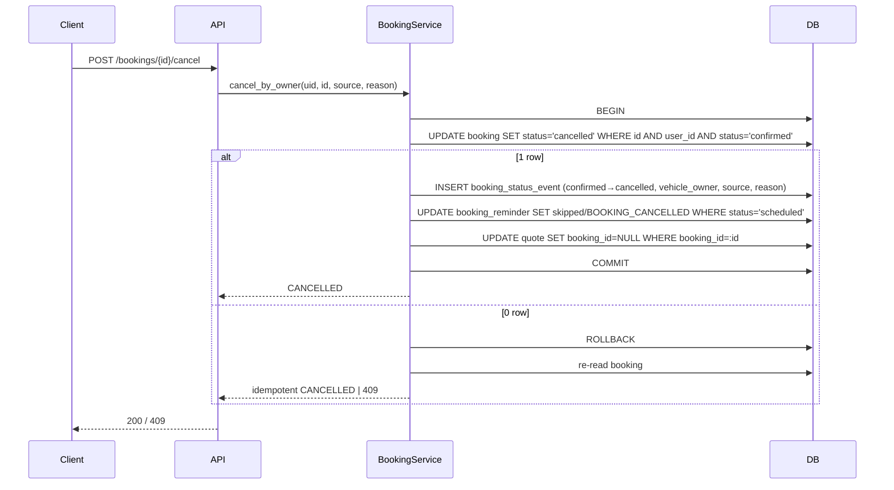

# API Technical Specification — Nhắc lịch hẹn 24h & xử lý từ lời nhắc

> Backend cho Feature `FEAT-NOTI-002` — F7 phần nhắc lịch hẹn (US-033 → US-036).
>
> **Nguồn nghiệp vụ:** [Functional Spec](../feature-functional/us-033-sprint-3-spec.ff.md) là chuẩn; API **không** định nghĩa lại nghiệp vụ, chỉ trỏ `BR-7xx` / `EF-7xx` / `EDGE-7xx`.
>
> **Entity:** [Entity Spec](../entity/us-033-sprint-3-spec.entity.md) — `booking_reminder` (ENT-424), `booking_reminder_delivery` (ENT-425), cột `booking.attendance_confirmed_at`; ghi `booking_status_event` (ENT-426, [us-037](../entity/us-037-sprint-3-spec.entity.md)).
>
> **Tái dùng:** `NotificationService`, adapter Discord, cấu hình kênh và quy tắc retry của [us-021 API](../../sprint-2/api/us-021-sprint-2-spec.api.md). Tài liệu này không lặp lại phần đó.

---

# 0. Document Information

| Field | Value |
|---|---|
| Document ID | `API-SPEC-NOTI-002` |
| Feature | `FEAT-NOTI-002` — F7 (nhắc lịch hẹn) |
| Version | `v1.0` |
| Status | `Draft` |
| Owner | Backend Team |
| Author | Team 4 Người |
| Base URL | `/api/v1` |
| Auth | Firebase ID token (Bearer) — như mọi API nghiệp vụ (PRD §8) |
| Created Date | `2026-09-29` |
| Updated Date | `2026-09-29` |
| Related Functional Spec | [us-033-sprint-3-spec.ff.md](../feature-functional/us-033-sprint-3-spec.ff.md) |
| Related Entity Spec | [us-033-sprint-3-spec.entity.md](../entity/us-033-sprint-3-spec.entity.md) |
| Related Frontend Spec | [us-033-sprint-3-spec.fe.md](../frontend/us-033-sprint-3-spec.fe.md) |

---

# 1. Overview

## 1.1 API Group

| API ID | Method | Endpoint / Trigger | Mục đích | FF |
|---|---|---|---|---|
| `API-BR-01` | `GET` | `/api/v1/bookings/{bookingId}` | Chi tiết lịch hẹn cho màn mở từ lời nhắc (SCR-701) + danh sách hành động hợp lệ | UC-702 |
| `API-BR-02` | `POST` | `/api/v1/bookings/{bookingId}/attendance-confirmation` | Chủ xe **xác nhận sẽ đến** | BR-708 |
| `API-BR-03` | `POST` | `/api/v1/bookings/{bookingId}/cancel` | Chủ xe **huỷ lịch `confirmed`**, giải phóng chỗ ngay | BR-709, AC-F7-02 |
| `JOB-BR-001` | Celery beat | `booking_reminder.send_due` (mỗi 15') | Reconcile + gửi lời nhắc đến hạn + thử lại | UC-701, BR-702 → BR-712 |
| `HOOK-BR-001` | Internal | `BookingReminderScheduler.on_confirmed(booking)` | Lên lịch nhắc khi booking chuyển `confirmed` | BR-702, BR-703 |

> `API-BR-01` và `API-BR-03` là **API booking dùng chung** với F6b (ticket, huỷ/đổi lịch). Nếu F6b triển khai trước, tài liệu này tái dùng; nếu không, triển khai ở đây và F6b tái dùng. Không tạo hai endpoint huỷ khác nhau.

## 1.2 Scope

**In Scope** — xem chi tiết booking của mình, xác nhận đến, huỷ `confirmed`; job gửi nhắc; hook lên lịch.

**Out of Scope** — huỷ giữ chỗ `pending` trong 10' (us-029 `API-BK-04`); đổi lịch (F6b); chuyển trạng thái của xưởng (F8); cấu hình kênh (us-021).

---

# 2. Authentication & Authorization

## 2.1 Authentication

```http
Authorization: Bearer <firebase_id_token>
```

Verify bằng Firebase Admin SDK; suy ra `vehicle_user` theo `firebase_uid`. Job/hook chạy nội bộ, không qua HTTP.

## 2.2 Allowed Roles

| Role | Access |
|---|---|
| `VEHICLE_USER` (chủ xe `active`) | ✅ Allowed — chỉ booking của mình |
| `WORKSHOP_OWNER` | ❌ Denied (xem booking qua API Board — us-037) |
| `ANONYMOUS` | ❌ Denied |

## 2.3 Authorization Rules

- Tài khoản `status = active AND onboarding_status = active`.
- `booking.user_id = currentUser.user_id`; sai ⇒ `404 BOOKING_NOT_FOUND` (không lộ tồn tại — FF BR-713, AC-709).
- Link trong lời nhắc chỉ mang `bookingId`; **không** có token hành động (FF BR-706).

---

# 3. API-BR-01 — `GET /api/v1/bookings/{bookingId}`

## 3.1 Purpose

Trả chi tiết lịch hẹn và **`allowedActions`** tính ở backend để FE không tự suy luận quy tắc thời gian/trạng thái.

## 3.2 Path & Query Parameters

| Field | Type | Required | Description | Constraints |
|---|---|---:|---|---|
| `bookingId` (path) | `string` (uuid) | Yes | Booking | Thuộc user |
| `src` (query) | `string` | No | Nguồn mở màn: `REMINDER_24H` / `APP` — chỉ để log/analytics | enum |

## 3.3 Internal Processing

```text
1. Auth → vehicle_user.
2. Load booking JOIN workshop JOIN user_vehicle WHERE booking.id=:id AND booking.user_id=:uid
   → không có ⇒ 404 BOOKING_NOT_FOUND.
3. appointment_at = to_utc(booking_date + time_slot, 'Asia/Ho_Chi_Minh').
4. Tính allowedActions (bảng §3.4).
5. Log src (không log PII).
```

## 3.4 `allowedActions` — quy tắc

| Action | Điều kiện | FF |
|---|---|---|
| `CONFIRM_ATTENDANCE` | `status = confirmed` ∧ `now < appointment_at` ∧ `attendance_confirmed_at IS NULL` | BR-708 |
| `CANCEL` | `status = confirmed` ∧ `now < appointment_at` | BR-709 |
| `RESCHEDULE` | `status = confirmed` ∧ `now < appointment_at` | BR-710 |
| `CANCEL_HOLD` | `status = pending` ∧ `now ≤ hold_expires_at` (dùng us-029 `API-BK-04`) | us-029 BR-010 |

`rescheduleMode` = `F6B` khi cờ `FEATURE_RESCHEDULE_ENABLED = true`, ngược lại `GUIDE` (FF AF-702, Q-703).

## 3.5 Success Response `200 OK`

```json
{
  "data": {
    "bookingId": "8d2e6f10-3c4b-4a59-8e7d-1f2a3b4c5d6e",
    "bookingCode": "EVC-7K2M",
    "status": "CONFIRMED",
    "bookingDate": "2026-10-04",
    "timeSlot": "14:00",
    "appointmentAt": "2026-10-04T07:00:00Z",
    "workshop": {
      "workshopId": "3f1e2d3c-4b5a-6978-8a9b-0c1d2e3f4a5b",
      "name": "VinFast Smart City",
      "address": "Đại lộ Thăng Long, Nam Từ Liêm, Hà Nội"
    },
    "vehicle": { "userVehicleId": "b2c3...", "modelName": "VF 6", "plateMasked": "30A-***.45" },
    "estimatedCost": 1850000,
    "estimateLabel": "Chi phí ước tính",
    "qrUrl": "/api/v1/bookings/8d2e.../qr",
    "attendanceConfirmedAt": null,
    "allowedActions": ["CONFIRM_ATTENDANCE", "CANCEL", "RESCHEDULE"],
    "rescheduleMode": "GUIDE"
  }
}
```

## 3.6 Response Fields

| Field | Type | Nullable | Description |
|---|---|---:|---|
| `status` | `string` | No | `PENDING` / `CONFIRMED` / `CHECKED_IN` / `IN_PROGRESS` / `COMPLETED` / `CANCELLED` (ENT-402 §8) |
| `appointmentAt` | `datetime` | No | UTC; FE hiển thị giờ VN |
| `bookingCode` | `string` | Yes | `null` khi chưa `confirmed` |
| `qrUrl` | `string` | Yes | Chỉ khi `CONFIRMED` (nội dung QR thuộc F6b) |
| `vehicle.plateMasked` | `string` | Yes | Biển số che một phần; không trả VIN |
| `attendanceConfirmedAt` | `datetime` | Yes | FF BR-708 |
| `allowedActions` | `string[]` | No | §3.4; rỗng khi không còn hành động |
| `rescheduleMode` | `string` | No | `F6B` / `GUIDE` |

---

# 4. API-BR-02 — `POST /api/v1/bookings/{bookingId}/attendance-confirmation`

## 4.1 Purpose

Chủ xe xác nhận sẽ đến (FF BR-708). **Không** đổi `booking.status`.

## 4.2 Request

Không có body.

```http
POST /api/v1/bookings/8d2e.../attendance-confirmation
Authorization: Bearer <token>
```

## 4.3 Validation

| Validation | Rule | Error |
|---|---|---|
| Booking thuộc user | `booking.user_id = uid` | `404 BOOKING_NOT_FOUND` |
| Trạng thái | `status = confirmed` | `409 BOOKING_NOT_CONFIRMED` |
| Thời gian | `now < appointment_at` | `409 APPOINTMENT_STARTED` |

## 4.4 Internal Processing

```sql
UPDATE booking
   SET attendance_confirmed_at = now(), updated_at = now()
 WHERE id = :id AND user_id = :uid AND status = 'confirmed'
   AND attendance_confirmed_at IS NULL;            -- BR-ENT-488 (idempotent)
```

0 dòng cập nhật ⇒ đọc lại: đã có `attendance_confirmed_at` ⇒ trả `200` với giá trị cũ; ngược lại trả lỗi theo §4.3.

## 4.5 Success Response `200 OK`

```json
{ "data": { "bookingId": "8d2e...", "status": "CONFIRMED", "attendanceConfirmedAt": "2026-10-03T07:12:40Z" } }
```

---

# 5. API-BR-03 — `POST /api/v1/bookings/{bookingId}/cancel`

## 5.1 Purpose

Chủ xe huỷ lịch hẹn `confirmed`; chỗ được giải phóng ngay (FF BR-709, AC-704 = AC-F7-02). Chỉ gọi **sau** khi chủ xe bấm xác nhận trong hộp thoại SCR-702.

## 5.2 Request Body

```json
{ "source": "REMINDER_24H", "reason": "Bận việc đột xuất" }
```

## 5.3 Request Fields

| Field | Type | Required | Nullable | Description | Constraints |
|---|---|---:|---:|---|---|
| `source` | `string` | Yes | No | Nơi chủ xe huỷ | `REMINDER_24H` / `APP` |
| `reason` | `string` | No | Yes | Lý do chủ xe nhập | Max 255 ký tự; trim |

Header `Idempotency-Key` khuyến nghị (§13).

## 5.4 Validation

| Validation | Rule | Error |
|---|---|---|
| Body | `source` hợp lệ, `reason` ≤ 255 | `400 INVALID_REQUEST` |
| Booking thuộc user | `booking.user_id = uid` | `404 BOOKING_NOT_FOUND` |
| Trạng thái | `status = confirmed` (đã `cancelled` bởi chính chủ xe ⇒ idempotent `200`) | `409 BOOKING_NOT_CONFIRMED` |
| Thời gian | `now < appointment_at` (Q-702) | `409 APPOINTMENT_STARTED` |

## 5.5 Internal Processing



- Không cần Redis lock: huỷ chỉ **giảm** `occupied`, không thể gây vượt sức chứa.
- Không gọi hãng; không gửi thông báo cho chủ xưởng (Board phản ánh — FF §3.2).
- Sự kiện `booking.cancelled` được publish nội bộ `[Đề xuất]` để các phần khác (Board realtime, analytics) có thể nghe.

## 5.6 Success Response `200 OK`

```json
{
  "data": {
    "bookingId": "8d2e6f10-3c4b-4a59-8e7d-1f2a3b4c5d6e",
    "status": "CANCELLED",
    "cancelledAt": "2026-10-03T07:15:02Z",
    "cancelledBy": "VEHICLE_OWNER",
    "source": "REMINDER_24H"
  }
}
```

---

# 6. JOB-BR-001 — `booking_reminder.send_due`

## 6.1 Schedule

Celery beat mỗi `BOOKING_REMINDER_JOB_INTERVAL_MINUTES` (15). Idempotent, chạy chồng an toàn (BR-ENT-483).

## 6.2 Processing

```text
Phase A — Reconcile (BR-ENT-481)
  SELECT booking confirmed với appointment_at ∈ (now, now + LEAD + 1h]
    và chưa có booking_reminder(kind='before_24h', appointment_at khớp)
  → on_confirmed(booking)   (INSERT ... ON CONFLICT DO NOTHING)

Phase B — Gửi lời nhắc đến hạn
  FOR r IN SELECT ... WHERE status='scheduled' AND scheduled_at <= now()
                     ORDER BY scheduled_at FOR UPDATE SKIP LOCKED LIMIT :batch:
    b = booking(r.booking_id)
    IF b.status <> 'confirmed'                → skipped (BOOKING_CANCELLED | BOOKING_NOT_CONFIRMED)
    ELIF appointment_at(b) <> r.appointment_at → skipped (RESCHEDULED)
    ELIF now() > r.appointment_at − MIN_LEAD   → skipped (TOO_LATE)
    ELSE
      channels = effective_channels(b.user_id) ∩ adapters_available   -- BR-ENT-486
      INSERT booking_reminder_delivery (pending) per channel ON CONFLICT DO NOTHING
      message = build_appointment_message(b)                            -- AI-006 INT-603
      FOR d IN deliveries: result = NotificationService.deliver(d.channel, b.user_id, message)
      cập nhật d; tính trạng thái tổng r (BR-712)
    COMMIT per reminder

Phase C — Thử lại (BR-ENT-485)
  deliveries failed, lỗi tạm thời, attempts < MAX, còn ≥ MIN_LEAD tới giờ hẹn
  → gửi lại (backoff theo attempts), cập nhật r
```

## 6.3 Nội dung (AI-006 INT-603)

```text
📅 Nhắc lịch hẹn: {HH:mm} {Thứ, dd/mm} tại {workshop_name}
Mã lịch hẹn: {booking_code}
Xác nhận / Đổi / Huỷ: {FRONTEND_URL}/bookings/{booking_id}?src=REMINDER_24H
```

Không VIN / SĐT / email / CCCD (FF BR-706). Dựng lại khi thử lại; không lưu.

## 6.4 Output (log một dòng mỗi lần chạy)

`reconciled`, `due`, `sent`, `failed`, `skipped_by_reason{}`, `retried`, `duration_ms`.

---

# 7. HOOK-BR-001 — `BookingReminderScheduler.on_confirmed(booking)`

| Gọi từ | Thời điểm |
|---|---|
| us-029 `API-BK-03` (xưởng `auto`) | Trong transaction chuyển `pending → confirmed` |
| us-037 accept (xưởng `manual`) | Trong transaction chủ xưởng chấp nhận |
| F6b đổi lịch (sau này) | Sau khi giờ hẹn đổi: gọi lại `on_confirmed` cho giờ mới; lời nhắc cũ tự `skipped` (`RESCHEDULED`) ở Phase B |

Logic: Entity Spec BR-ENT-480. Lỗi hook **không** được làm hỏng transaction xác nhận booking — nếu insert lỗi, log cảnh báo và để Phase A (reconcile) tạo lại `[Đề xuất]`.

---

# 8. Error Handling

## 8.1 Standard Error Format

```json
{ "error": { "code": "APPOINTMENT_STARTED", "message": "Đã tới giờ hẹn, không thể huỷ.", "details": null, "traceId": "abc-123" } }
```

## 8.2 Error Cases

| Case | Error Code | HTTP | Áp dụng | Ref |
|---|---|---:|---|---|
| Body sai | `INVALID_REQUEST` | `400` | BR-03 | |
| Chưa xác thực | `UNAUTHORIZED` | `401` | tất cả | |
| Tài khoản chưa `active` / chưa xong onboarding | `ONBOARDING_REQUIRED` | `403` | tất cả | |
| Booking không tồn tại / không thuộc user | `BOOKING_NOT_FOUND` | `404` | tất cả | BR-713, AC-709 |
| Booking không ở `confirmed` | `BOOKING_NOT_CONFIRMED` | `409` | BR-02, BR-03 | EF-704, EDGE-709 |
| Đã tới / qua giờ hẹn | `APPOINTMENT_STARTED` | `409` | BR-02, BR-03 | EDGE-708, AC-708 |
| Lỗi hệ thống | `INTERNAL_SERVER_ERROR` | `500` | tất cả | |
| DB tạm lỗi | `SERVICE_UNAVAILABLE` | `503` | BR-02, BR-03 | |

`details` của `BOOKING_NOT_CONFIRMED` chứa `currentStatus` để FE nêu đúng lý do (EF-704).

---

# 9. HTTP Status Codes

| HTTP | When |
|---|---|
| `200 OK` | Đọc thành công; xác nhận đến; huỷ (kể cả idempotent) |
| `400 Bad Request` | Body không hợp lệ |
| `401 Unauthorized` | Token invalid |
| `403 Forbidden` | Tài khoản chưa active |
| `404 Not Found` | Booking không tồn tại / không thuộc user |
| `409 Conflict` | Sai trạng thái hoặc quá giờ hẹn |
| `503 Service Unavailable` | DB tạm lỗi |

---

# 10. Business Logic (tham chiếu FF)

| Rule | Nội dung | FF |
|---|---|---|
| Thời điểm gửi | `appointment_at − 24h`, không gửi khi < 2h | BR-702 |
| Xác nhận sát giờ | Không nhắc | BR-703 |
| Không trùng | 1 nhắc / (booking, giờ hẹn) | BR-704 |
| Kênh | Theo us-021, không phụ thuộc công tắc nhắc mốc | BR-705 |
| Kiểm tra lại | Trước khi gửi | BR-707 |
| Xác nhận đến | Ghi một lần, không đổi status | BR-708 |
| Huỷ | `confirmed → cancelled`, trả chỗ ngay | BR-709 |
| Quyền | Chỉ chủ booking | BR-713 |

---

# 11. Database / Entity Interaction

| Entity / Table | Operation | Purpose |
|---|---|---|
| `booking` | Read / Update | Chi tiết; `attendance_confirmed_at`; huỷ |
| `workshop`, `user_vehicle` | Read | Hiển thị |
| `booking_reminder` | Insert / Update | Lên lịch, trạng thái, skip khi huỷ |
| `booking_reminder_delivery` | Insert / Update | Kết quả từng kênh |
| `booking_status_event` | Insert | Sự kiện huỷ (ENT-426) |
| `quote` | Update | Gỡ `booking_id` khi huỷ |
| `user_notification_channel`, `user_discord_link` | Read | Kênh, nơi nhận |

---

# 12. Concurrency / Race Condition

| Tình huống | Xử lý |
|---|---|
| Hai request huỷ cùng booking | `UPDATE ... WHERE status='confirmed'` — chỉ một thành công; request sau đọc lại thấy `cancelled` bởi chính chủ xe ⇒ `200` (EF-705) |
| Chủ xe huỷ trong lúc xưởng check-in (F8) | Cả hai là `UPDATE ... WHERE status='confirmed'`; bên commit trước thắng, bên sau `409` |
| Job gửi trong lúc chủ xe huỷ | Job khoá dòng lời nhắc và đọc lại booking (BR-ENT-482); huỷ commit trước ⇒ `skipped`; job gửi trước ⇒ lời nhắc đã gửi, không có gì thêm (EDGE-703) |
| Hai worker job | `FOR UPDATE SKIP LOCKED` + unique delivery (BR-ENT-483) |

---

# 13. Idempotency

```text
Required: API-BR-02 — tự nhiên (ghi một lần); API-BR-03 — theo trạng thái + Idempotency-Key khuyến nghị
```

- `API-BR-03` nhận `Idempotency-Key`; trong 24h cùng key trả lại kết quả cũ. Không có key ⇒ vẫn idempotent theo trạng thái (huỷ lần hai bởi cùng chủ xe ⇒ `200`).
- Job idempotent theo unique `(booking_id, kind, appointment_at)` và `(booking_reminder_id, channel)`.

---

# 14. External Dependencies

| Service | Purpose | Required |
|---|---|---:|
| Firebase Auth | Xác thực token | Yes |
| PostgreSQL (Supabase) | Booking, reminder | Yes |
| Celery + beat (Redis broker) | Chạy JOB-BR-001 | Yes |
| Discord Bot API (qua adapter us-021) | Gửi nhắc | Yes (MVP) |

---

# 15. Observability

**Log:** `traceId`, `userId`, `bookingId`, endpoint, `src`, kết quả (`attendance_confirmed` / `cancelled` / lỗi). Job: số liệu §6.4. **Không log:** VIN, biển số đầy đủ, nội dung Discord, `reason` tự do của chủ xe ở mức INFO.

**Metrics:** tỉ lệ nhắc `sent` / `failed` / `skipped` theo lý do; độ trễ `sent_at − scheduled_at`; tỉ lệ xác nhận đến; tỉ lệ huỷ từ nhắc; tỉ lệ no-show (booking `confirmed` không check-in — đo cùng F8).

---

# 16. Performance Requirements

| Metric | Target |
|---|---|
| `API-BR-01/02/03` (p90) | `< 500 ms` |
| Độ trễ gửi so với `scheduled_at` (p95) | `≤ 15 phút` |
| Nhắc trùng | `0` |

---

# 17. Retry & Timeout

| Dependency | Retry | Max Attempts | Backoff |
|---|---:|---:|---|
| Discord (qua adapter) | Yes | `REMINDER_MAX_ATTEMPTS` (3) | Theo us-021; dừng khi < `MIN_LEAD` |
| Database (API) | No | — | Trả `503` |

---

# 18. Versioning

`/api/v1/...` — thêm field response là non-breaking.

---

# 19. Example — Luồng đủ

```http
GET /api/v1/bookings/8d2e...?src=REMINDER_24H
Authorization: Bearer <token>
```
→ `200` `allowedActions = ["CONFIRM_ATTENDANCE","CANCEL","RESCHEDULE"]`.

```http
POST /api/v1/bookings/8d2e.../cancel
Idempotency-Key: 7c1e...
Content-Type: application/json

{ "source": "REMINDER_24H" }
```
→ `200` `status = CANCELLED`; ngay sau đó `GET /workshops/{id}/availability?date=2026-10-04&timeSlot=14:00` (us-029) thấy `remaining` tăng 1.

```http
POST /api/v1/bookings/8d2e.../cancel
```
(khi đã quá giờ hẹn)

```http
HTTP/1.1 409 Conflict
```
```json
{ "error": { "code": "APPOINTMENT_STARTED", "message": "Đã tới giờ hẹn, không thể huỷ. Vui lòng liên hệ xưởng.", "traceId": "abc-126" } }
```

---

# 20. Open Questions

- [ ] Q-701 — Nhắc hẹn không phụ thuộc công tắc nhắc mốc (`[Đề xuất]` đã áp dụng ở BR-ENT-486).
- [ ] Q-702 — Hạn chót huỷ: `now < appointment_at` (`[Đề xuất]`).
- [ ] Q-703 — `rescheduleMode = GUIDE` khi F6b chưa có.
- [ ] Hook `on_confirmed` lỗi có nên làm hỏng transaction xác nhận booking không (`[Đề xuất]` không — reconcile bù).
- [ ] Endpoint `qrUrl` và nội dung QR — thuộc F6b.

---

# 21. References

- Functional Spec: [us-033-sprint-3-spec.ff.md](../feature-functional/us-033-sprint-3-spec.ff.md)
- Entity Spec: [us-033-sprint-3-spec.entity.md](../entity/us-033-sprint-3-spec.entity.md)
- us-021 API (NotificationService, cấu hình kênh): [us-021-sprint-2-spec.api.md](../../sprint-2/api/us-021-sprint-2-spec.api.md)
- us-029 API (đặt lịch, huỷ giữ chỗ): [us-029-sprint-3-spec.api.md](us-029-sprint-3-spec.api.md)
- us-037 API (Workshop Board, `booking_status_event`): [us-037-sprint-3-spec.api.md](us-037-sprint-3-spec.api.md)
- AI-006: [ai-006-sprint-2-spec.agent.md](../../ai-agent/ai-006-sprint-2-spec.agent.md)

---

# 22. Change Log

| Version | Date | Author | Changes |
|---|---|---|---|
| `v1.0` | `2026-09-29` | Team 4 Người | Initial version: API-BR-01/02/03, JOB-BR-001, HOOK-BR-001 |
