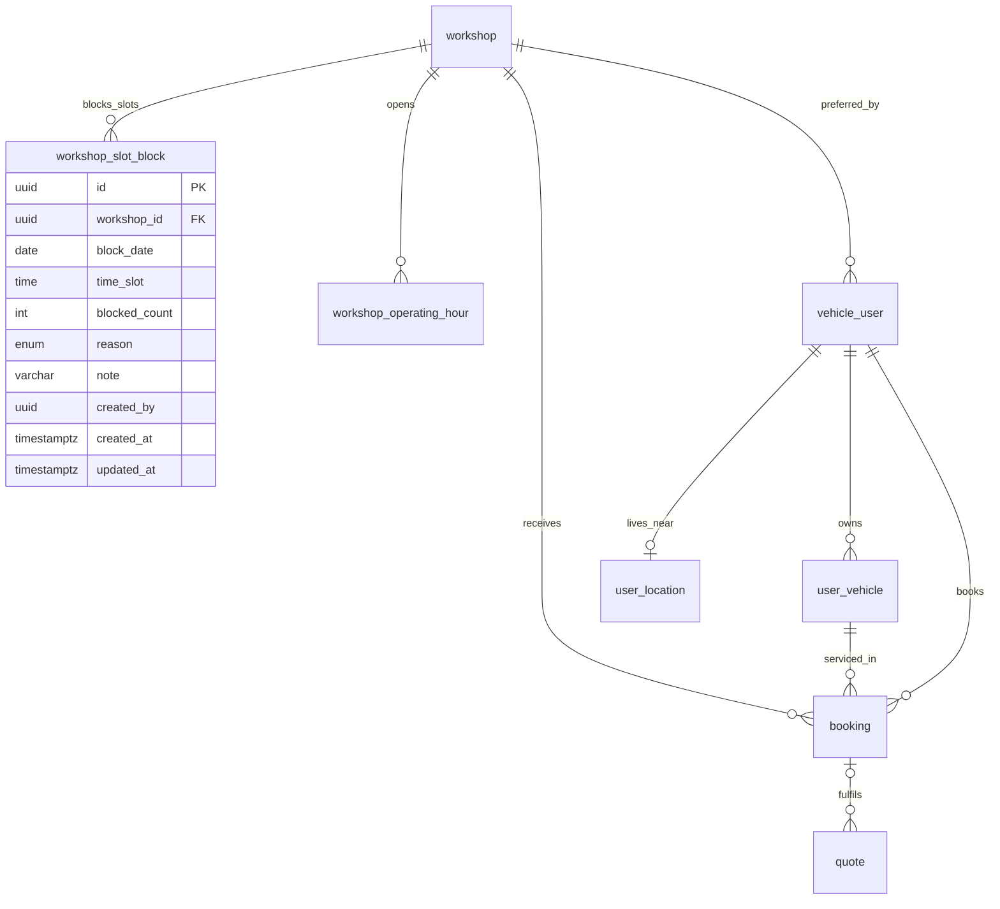
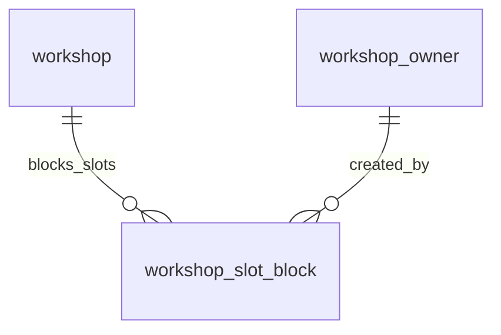

# Entity Specification — Đặt lịch bảo dưỡng theo sức chứa & vị trí

> Đặc tả các entity phục vụ Feature `FEAT-BOOK-001` — F6 (US-029 → US-032).
>
> **Nguồn nghiệp vụ:** [Functional Spec](../feature-functional/us-029-sprint-3-spec.ff.md). Tài liệu này **không định nghĩa lại nghiệp vụ**; mọi rule đều trỏ về `BR-xxx` / `EF-xxx` / `EDGE-xxx` trong Functional Spec.
>
> **Nguyên tắc:** feature này **tái sử dụng** phần lớn entity đã có (`booking`, `workshop`, `workshop_operating_hour`, `user_location`, `vehicle_user`, `user_vehicle`, `quote`) và **không sửa** cấu trúc của chúng. Chỉ có **một entity mới**: `workshop_slot_block` (ENT-418) để lưu số chỗ chủ xưởng khoá tay — thành phần còn thiếu trong công thức sức chứa (BR-005).
>
> **Quy ước đánh dấu:** `[Đề xuất]` = đề xuất kỹ thuật cần review · `[Cần xác nhận]` = chờ Product/Stakeholder.

---

# 0. Document Information

| Field | Value |
|---|---|
| Document ID | `ENT-SPEC-BOOK-001` |
| Feature | `FEAT-BOOK-001` — Đặt lịch bảo dưỡng theo sức chứa & vị trí (F6) |
| Version | `v1.0` |
| Status | `Draft` |
| Owner | Backend Team |
| Author | Team 4 Người |
| Database | PostgreSQL (Supabase), schema `public`, migration bằng Alembic |
| Created Date | `2026-09-29` |
| Updated Date | `2026-09-29` |
| Related Functional Spec | [us-029-sprint-3-spec.ff.md](../feature-functional/us-029-sprint-3-spec.ff.md) |
| Related API Spec | [us-029-sprint-3-spec.api.md](../api/us-029-sprint-3-spec.api.md) |

---

# 1. Entity Catalog

| Entity ID | Entity | Table | Trạng thái | Mục đích trong F6 |
|---|---|---|---|---|
| `ENT-418` | `WorkshopSlotBlock` | `workshop_slot_block` | **Mới** | Số chỗ (thợ) chủ xưởng khoá tay trong một khung giờ (khách gọi điện / vãng lai) — trừ vào sức chứa (BR-005) |
| `ENT-402` | `Booking` | `booking` | **Có sẵn — tái dùng** | Lịch hẹn; tạo `pending` (hold) → `confirmed`; đếm `occupied` (BR-005) |
| `ENT-008` | `Workshop` | `workshop` | **Có sẵn — tái dùng** | Toạ độ (`latitude`/`longitude`), khu vực (`region`), công suất (`total_technicians`, `emergency_slots_reserved`) |
| `ENT-009` | `WorkshopOperatingHour` | `workshop_operating_hour` | **Có sẵn — tái dùng** | Giờ hoạt động theo ngày trong tuần → kiểm tra khung hợp lệ (BR-006) |
| `ENT-002` | `UserLocation` | `user_location` | **Có sẵn — tái dùng** | Địa điểm chính trong hồ sơ → mốc vị trí (BR-002 #2) |
| `ENT-001` | `VehicleUser` | `vehicle_user` | **Có sẵn — tái dùng** | `preferred_workshop_id` (xưởng ưa thích), chủ sở hữu |
| `ENT-003` | `UserVehicle` | `user_vehicle` | **Có sẵn — tái dùng** | Xe hợp lệ để đặt (`verified` + `active`) |
| `ENT-410` | `Quote` | `quote` | **Có sẵn — tái dùng** | Gắn báo giá `approved` còn hạn (BR-ENT-404, BR-ENT-426) |

**Không lưu ở DB (transient / hạ tầng):**

- **Mốc vị trí chỉ định** (BR-002 #1): toạ độ / địa chỉ / tên khu vực chủ xe nêu trong lượt đặt — là **tham số truy vấn**, không persist. Xem API Spec (`nearby` request).
- **Khoá giữ chỗ**: Redis key `booking:hold:{workshop_id}:{date}:{slot}` (TTL = `HOLD_MINUTES`) — hạ tầng, không phải entity DB.
- **`confirmation_token`**: cấp khi render thẻ, gắn slot; lưu ở checkpoint/agent state hoặc bảng token ngắn hạn `[Đề xuất]` — ngoài phạm vi entity này.

### Vì sao chỉ thêm `workshop_slot_block`?

- **Gợi ý theo vị trí không cần entity mới:** `workshop` đã có `latitude`/`longitude`/`region`; `user_location` đã có toạ độ/`province`; `vehicle_user.preferred_workshop_id` đã có. Việc xếp hạng là **truy vấn** trên dữ liệu sẵn có, không phải bảng mới.
- **Sức chứa không cần bảng "slot":** sức chứa được **tính động** từ `booking` + `workshop_slot_block` + cấu hình xưởng (BR-005) nên không dựng bảng slot tĩnh.
- **Chỗ khoá tay thì cần lưu:** công thức BR-005 trừ "số chỗ chủ xưởng đã khoá". Hiện chưa entity nào lưu con số này ⇒ thêm `workshop_slot_block`. (Ghi/quản lý bản ghi này là nghiệp vụ **F8 — Workshop Board**; F6 chỉ **đọc**.)

---

# 2. ER Diagram



---

# 3. Quy ước chung

| Chủ đề | Quy ước |
|---|---|
| Tên bảng / cột | `snake_case`, số ít (theo convention hiện có). |
| Tên field ở API | `camelCase` (mapping ở Pydantic). |
| Primary key | Bảng mới dùng `uuid` (sinh ở app bằng `uuid4`). |
| Enum | Lưu **lowercase** trong DB; API trả **UPPER_SNAKE_CASE**. |
| Thời gian | `timestamptz` lưu UTC; `date` cho ngày hẹn; `time` cho khung giờ (giờ địa phương Asia/Ho_Chi_Minh, khớp `booking.time_slot` và `workshop_operating_hour`). |
| Truy cập DB | Backend kết nối trực tiếp PostgreSQL; bật RLS, không tạo policy (chặn `anon key`) — như các bảng khác. |
| Sức chứa | Không lưu "slot table"; tính động theo BR-005. |

---

# ENT-418 — WorkshopSlotBlock

## 1. Entity Information

| Field | Value |
|---|---|
| Entity ID | `ENT-418` |
| Entity Name | `WorkshopSlotBlock` |
| Business Name | Chỗ khoá thủ công theo khung giờ |
| Table | `workshop_slot_block` |
| Domain | Workshop |
| Version | `v1.0` |
| Status | `Draft` — **Mới** |
| Owner | Backend Team |
| Created Date | `2026-09-29` |
| Updated Date | `2026-09-29` |

## 2. Entity Overview

### 2.1 Description

Số chỗ (đầu thợ) mà **chủ xưởng khoá tay** trong một khung giờ cụ thể để dành cho lịch đến từ **kênh ngoài EV Care** (khách gọi điện, khách vãng lai) hoặc lý do vận hành. Mỗi bản ghi = số chỗ bị khoá của một `(xưởng, ngày, khung giờ)`.

### 2.2 Business Purpose

Là thành phần `blocked` trong công thức sức chứa (BR-005): `capacity = total_technicians − emergency_slots_reserved − blocked`. Nhờ đó lịch đặt qua EV Care không chiếm chỗ chủ xưởng đã giữ cho kênh khác (PP-06, AC-F8-02).

### 2.3 Scope

**In Scope**

- Lưu số chỗ khoá theo `(workshop_id, block_date, time_slot)`, lý do, người khoá.
- F6 **đọc** để tính sức chứa; F8 **ghi** (tạo/sửa/xoá khoá).

**Out of Scope**

- Màn hình và luồng khoá chỗ trên Workshop Board — **F8**.
- Khoá nhiều khung một lần / lặp theo tuần — phase sau.
- Khoá theo hạng mục hoặc theo kỹ thuật viên cụ thể — phase sau.

## 3. Business Meaning

### Definition

Một `workshop_slot_block` giảm sức chứa khả dụng của một khung giờ đi `blocked_count` thợ, độc lập với booking. `blocked` trong BR-005 là **tổng** `blocked_count` của các bản ghi khớp `(workshop, ngày, khung)`.

### Example

VinFast Smart City, 04/10/2026, khung 09:00, `blocked_count = 2`, `reason = phone_booking` — chủ xưởng giữ 2 chỗ cho 2 khách gọi điện. Xưởng có 8 thợ, 1 slot khẩn cấp ⇒ EV Care chỉ nhận `8 − 1 − 2 = 5` chỗ khung này.

### Terminology

- Related term: `TERM-402` Capacity, `TERM-407` Slot block (FF §22).

## 4. Identity & Keys

### 4.1 Primary Key

| Field | Type | Description |
|---|---|---|
| `id` | `uuid` | PK, sinh bằng `uuid4` |

### 4.2 Candidate / Unique Keys

| Field / Composite | Unique | Description |
|---|---:|---|
| `(workshop_id, block_date, time_slot)` | Yes | Mỗi khung của một xưởng có **một** bản ghi khoá; cập nhật `blocked_count` thay vì tạo nhiều bản ghi (`ux_slot_block_ws_date_slot`) |

## 5. Attributes

| Tên trường (Field) | Kiểu dữ liệu (Data Type) | Required | Nullable | Default | Ràng buộc (Constraints) | Mô tả (Description) |
|---|---|---:|---:|---|---|---|
| `id` | `uuid` | Yes | No | `uuid4` | PK | Mã định danh bản ghi khoá |
| `workshop_id` | `uuid` | Yes | No | - | FK → `workshop.id` `ON DELETE CASCADE` | Xưởng khoá chỗ |
| `block_date` | `date` | Yes | No | - | ≥ CURRENT_DATE khi tạo | Ngày áp dụng khoá |
| `time_slot` | `time` | Yes | No | - | Nằm trong giờ hoạt động (BR-006) | Khung giờ bị khoá (khớp `booking.time_slot`) |
| `blocked_count` | `integer` | Yes | No | `1` | `> 0`; `≤ workshop.total_technicians` | Số chỗ (thợ) bị khoá |
| `reason` | `slot_block_reason_enum` | Yes | No | `other` | Xem §6 | Lý do khoá |
| `note` | `varchar(255)` | No | Yes | - | | Ghi chú của chủ xưởng |
| `created_by` | `uuid` | No | Yes | - | FK → `workshop_owner.id` `ON DELETE SET NULL` | Chủ xưởng tạo khoá |
| `created_at` | `timestamptz` | Yes | No | `now()` | | Thời điểm tạo |
| `updated_at` | `timestamptz` | Yes | No | `now()` | `onupdate now()` | Thời điểm cập nhật gần nhất |

## 6. Attribute Details

### `time_slot`

| Property | Value |
|---|---|
| Type | `time` (giờ địa phương Asia/Ho_Chi_Minh) |
| Format | Bội của `SLOT_MINUTES` (60), khớp khung của `booking.time_slot` |

**Constraints** — Phải nằm trong `workshop_operating_hour` của `block_date` (ngày không `is_closed`, `open_time ≤ time_slot < close_time`). Validate ở service khoá (F8).

### `blocked_count`

**Business Meaning** — Số thợ chủ xưởng giữ ngoài EV Care cho khung này. Cùng với `emergency_slots_reserved`, đây là phần **không** dành cho booking qua EV Care.

**Constraints**

- `CHECK (blocked_count > 0)`.
- `blocked + emergency_slots_reserved ≤ total_technicians` được đảm bảo về nghiệp vụ ở service (F8); nếu vượt, sức chứa khả dụng của khung = 0 (không âm — BR-005 dùng `max(..., 0)`).

### `reason`

| Value (DB) | API | Meaning |
|---|---|---|
| `phone_booking` | `PHONE_BOOKING` | Giữ cho khách gọi điện |
| `walk_in` | `WALK_IN` | Giữ cho khách vãng lai |
| `maintenance` | `MAINTENANCE` | Bảo trì thiết bị / lý do kỹ thuật xưởng |
| `other` | `OTHER` | Lý do khác (ghi ở `note`) |

## 7. Relationships

### 7.1 Relationship Overview



### 7.2 Relationship Details

| Related Entity | Relationship | Cardinality | Description |
|---|---|---|---|
| [`workshop`](../../entity/workshop/workshop.entity.md) (ENT-008) | belongs to | N:1 | Khoá thuộc một xưởng |
| `workshop_owner` (ENT-007) | created by | N:0..1 | Chủ xưởng tạo khoá (audit) |

### Relationship Rules

- `workshop_slot_block.workshop_id` phải là xưởng `status = active`.
- Xoá xưởng ⇒ cascade xoá bản ghi khoá.

## 8. Entity Lifecycle / State

Không có vòng đời trạng thái. Bản ghi được **upsert** theo khoá `(workshop_id, block_date, time_slot)`: chủ xưởng đặt `blocked_count`; `blocked_count = 0` ⇒ **xoá** bản ghi (gỡ khoá). Chi tiết thao tác thuộc F8.

## 9. Business Rules & Constraints

### BR-ENT-430 — Khoá trừ vào sức chứa (BR-005, AC-F8-02)

**Rule** — Khi tính sức chứa của `(w, d, t)`, cộng dồn `blocked_count` của các bản ghi khớp và trừ khỏi `total_technicians`.

**Expected Behavior** — Khoá chỗ làm giảm ngay số chỗ EV Care nhận được ở khung đó.

### BR-ENT-431 — Chỉ khoá khung hợp lệ (BR-006)

**Rule** — `block_date` không ở quá khứ và `time_slot` nằm trong giờ hoạt động của xưởng ngày đó.

### BR-ENT-432 — Một bản ghi/khung

**Rule** — Duy nhất `(workshop_id, block_date, time_slot)`; thay đổi số chỗ khoá là cập nhật `blocked_count`, không tạo bản ghi trùng.

## 10. Data Integrity

- `CHECK (blocked_count > 0)`.
- Unique `ux_slot_block_ws_date_slot (workshop_id, block_date, time_slot)`.
- FK `workshop_id` `ON DELETE CASCADE`; FK `created_by` `ON DELETE SET NULL`.
- `time_slot` hợp lệ theo giờ hoạt động — kiểm ở service (không CHECK cross-table).

## 11. Index & Query Requirements

| Query | Fields | Frequency | Required Index |
|---|---|---|---|
| Tính sức chứa khung | `workshop_id`, `block_date`, `time_slot` | Rất cao | `ux_slot_block_ws_date_slot` |
| Khoá của xưởng theo ngày (Board) | `workshop_id`, `block_date` | Cao | Yes (prefix của unique index) |

**Important Query Patterns**

```text
1. SELECT COALESCE(SUM(blocked_count),0)
     FROM workshop_slot_block
    WHERE workshop_id = :ws AND block_date = :d AND time_slot = :t   -- BR-005 blocked
```

## 12. Ownership & Authorization

| Actor / Role | Read | Create | Update | Delete |
|---|---:|---:|---:|---:|
| Chủ xưởng | ✅ (xưởng mình) | ✅ (F8) | ✅ (F8) | ✅ (F8) |
| Hệ thống (service sức chứa) | ✅ | ❌ | ❌ | ❌ |
| Chủ xe | ❌ (chỉ thấy gián tiếp qua "hết chỗ") | ❌ | ❌ | ❌ |

### Ownership Rule

Bản ghi thuộc xưởng của chủ xưởng tạo ra; chủ xưởng chỉ thao tác trên xưởng mình.

## 13. Audit Fields

`created_by`, `created_at`, `updated_at`.

## 14. Data Source & Ownership

| Data | Source System | Owner | Sync Type |
|---|---|---|---|
| Toàn bộ bản ghi | App (Workshop Board — F8) | Chủ xưởng | Real-time |

**Source of Truth** — App DB (Supabase).

## 15. Data Sensitivity & Security

| Field | Classification | Notes |
|---|---|---|
| `note` | Vận hành nội bộ xưởng | Không hiển thị cho chủ xe |

Không chứa PII của chủ xe.

## 16. Retention & Deletion

- Giữ theo vòng đời xưởng; xoá cùng xưởng (cascade).
- Bản ghi quá khứ có thể dọn định kỳ (job) sau `SLOT_BLOCK_RETENTION_DAYS` `[Đề xuất: 90]` để giữ bảng gọn — không bắt buộc cho MVP.

## 17. Example Data

```json
{
  "id": "9c2a1e77-4b6d-4f2a-9d10-3a5b6c7d8e90",
  "workshop_id": "3f1e2d3c-4b5a-6978-8a9b-0c1d2e3f4a5b",
  "block_date": "2026-10-04",
  "time_slot": "09:00:00",
  "blocked_count": 2,
  "reason": "phone_booking",
  "note": "2 khách gọi điện giữ chỗ",
  "created_by": "b1c2d3e4-f5a6-7b8c-9d0e-1f2a3b4c5d6e",
  "created_at": "2026-09-29T02:10:00Z",
  "updated_at": "2026-09-29T02:10:00Z"
}
```

## 18. API References

- `GET /api/v1/workshops/{workshopId}/availability` (đọc — F6) — trừ `blocked` vào sức chứa.
- Ghi (khoá/gỡ) — **F8 Workshop Board** (API riêng, ngoài tài liệu này).

## 19. Related Entities

| Entity | Relationship | Reference |
|---|---|---|
| `workshop` | belongs to | [workshop.entity.md](../../entity/workshop/workshop.entity.md) |
| `booking` | cùng tính sức chứa | [booking.entity.md](../../entity/maintenance/booking.entity.md) |
| `workshop_operating_hour` | ràng buộc khung | [us-009 entity](../../sprint-1/entity/us-009-sprint-1-spec.entity.md#ent-009--workshopoperatinghour) |

## 20. Related Functional Specifications

- [F6 FF](../feature-functional/us-029-sprint-3-spec.ff.md) (đọc — BR-005); F8 (ghi).

---

# 4. Entity tái sử dụng — ghi chú cho F6

> Các entity sau **không đổi cấu trúc**. Bảng dưới nêu cách F6 dùng và các ràng buộc liên quan.

## 4.1 `booking` (ENT-402) — tái dùng

- **Giữ chỗ:** chủ xe bấm Xác nhận ⇒ F6 tạo bản ghi `status = pending`, `hold_expires_at = now() + HOLD_MINUTES` (BR-007, BR-009). Đếm `occupied` gồm `pending | confirmed | checked_in | in_progress` (BR-005) — chỗ đang giữ đã được tính, không double-book.
- **Tạo lịch hẹn (BR-014):** `pending → confirmed` khi xưởng ở chế độ `auto` (ngay) hoặc chủ xưởng chấp nhận thủ công (F8), trong cùng transaction/kiểm tra sức chứa (BR-001).
- **Gắn báo giá:** nếu có `quote` `approved` còn hạn → `booking.estimated_cost = quote.approved_total`, `quote.booking_id = booking.id` (BR-ENT-404).
- **Ràng buộc chống vượt sức chứa:** ngoài Redis lock + kiểm tra lại trong transaction, cần **ràng buộc ở DB** (PRD §8). `[Đề xuất]` dùng exclusion/partial-unique hoặc trigger đếm; chi tiết ở API Spec §14. **Không** thêm cột vào `booking`.

> **⚠️ Cần cập nhật booking BR-ENT-402 (do quyết định AI-Q-402).** Hiện [booking.entity.md](../../entity/maintenance/booking.entity.md) quy định `pending` vượt `hold_expires_at` **bị huỷ**. Theo F6 mới, `hold_expires_at` là **cửa sổ 10 phút để chủ xe huỷ giữ chỗ** (BR-010); khi đang **chờ xưởng xác nhận** (chế độ `manual`) thì booking `pending` **không** tự huỷ lúc hết `hold_expires_at` mà chờ tới hạn chót xưởng (BR-015). Đề nghị Backend cập nhật BR-ENT-402 cho khớp (booking đang `Draft`). Phân biệt hai pha bằng: `hold_expires_at` còn hiệu lực = pha "chủ xe có thể huỷ"; đã qua = pha "chờ xưởng".

## 4.2 `workshop` (ENT-008) — tái dùng + **mở rộng 1 cột**

- Dùng `latitude`, `longitude` (xếp theo khoảng cách — BR-003), `region` (xếp theo khu vực — BR-004), `total_technicians`, `emergency_slots_reserved` (BR-005), `status = active` (lọc).
- `CHECK ((latitude IS NULL) = (longitude IS NULL))` đã có ⇒ toạ độ luôn "cùng có hoặc cùng null" (AF-002).

**Cột bổ sung (mới — theo AI-Q-401, BR-014):**

| Field | Type | Required | Nullable | Default | Constraints | Description |
|---|---|---:|---:|---|---|---|
| `booking_confirmation_mode` | `booking_confirmation_mode_enum` | Yes | No | `auto` | `auto / manual` | Chế độ xác nhận đặt lịch của xưởng: `auto` tự chuyển `pending → confirmed`; `manual` chờ chủ xưởng chấp nhận trên Board (F8) |

- Enum `booking_confirmation_mode_enum` lưu lowercase (`auto`/`manual`); API trả `AUTO`/`MANUAL`.
- Mặc định `auto` (chốt Q-405) để luồng demo mượt; chủ xưởng có thể đổi sang `manual` (màn cài đặt xưởng — F8/AUTH).
- **Không** sửa các cột core khác của `workshop`.

## 4.3 `workshop_operating_hour` (ENT-009) — tái dùng

- Kiểm tra khung hợp lệ (BR-006): ngày không `is_closed`, `open_time ≤ time_slot < close_time`.

## 4.4 `user_location` (ENT-002) — tái dùng

- Lấy bản ghi `is_primary = true` làm mốc vị trí #2 (BR-002). Dùng `latitude`/`longitude` nếu có, nếu không dùng `province` (khớp `workshop.region`).

## 4.5 `vehicle_user` (ENT-001) & `user_vehicle` (ENT-003) — tái dùng

- `vehicle_user.preferred_workshop_id`: xưởng ưa thích, ghim đầu danh sách (BR-002 #3, BR-003).
- `user_vehicle`: chỉ xe `verified` + `link_status = active` của chủ xe mới đặt được (BR-012).

## 4.6 `quote` (ENT-410) — tái dùng

- Chỉ `quote` `approved` và `now() < expires_at` mới gắn được vào booking (BR-ENT-426, EDGE-409).

---

# 5. Kế hoạch migration

Một revision Alembic mới (`down_revision` = revision mới nhất của nhánh core), tên `add_workshop_slot_block`:

1. `CREATE TYPE slot_block_reason_enum AS ENUM ('phone_booking','walk_in','maintenance','other');`
2. `CREATE TYPE booking_confirmation_mode_enum AS ENUM ('auto','manual');`
3. `ALTER TABLE workshop ADD COLUMN booking_confirmation_mode booking_confirmation_mode_enum NOT NULL DEFAULT 'auto';` (AI-Q-401, BR-014).
4. `CREATE TABLE workshop_slot_block (...)` với cột như §5, FK `workshop_id`, `created_by`.
5. `CREATE UNIQUE INDEX ux_slot_block_ws_date_slot ON workshop_slot_block (workshop_id, block_date, time_slot);`
6. `CHECK (blocked_count > 0)`.
7. Ràng buộc DB chống vượt sức chứa cho `booking` — `[Đề xuất]` triển khai ở migration cùng nhánh F6; xem API Spec §14 (không đổi cột `booking`).
8. Cập nhật `seed.sql` (tuỳ chọn): vài bản ghi khoá mẫu để demo AC-F8-02 / EDGE-408; đặt ≥ 1 xưởng `manual` để demo AC-010.

> **Ghi chú (Q-401 — ưu tiên cao nhất):** chức năng tìm xưởng gần MVP **không** tạo bảng/geocoding; chỉ so khớp chuỗi địa điểm với `workshop.name`/`region`. Bắt buộc đặt sau **interface** `WorkshopLocationFinder` (hoặc tool `find_workshop`) để nâng cấp implementation về sau (geocoding, haversine, định tuyến) mà không đổi schema hay luồng đặt lịch. Xem FF callout đầu tài liệu và API Spec §3.

---

# 6. Open Questions

| ID | Question | Owner | Status |
|---|---|---|---|
| `Q-ENT-451` | Ràng buộc DB chống vượt sức chứa nên là exclusion constraint, trigger đếm, hay chỉ dựa Redis lock + kiểm tra lại trong transaction? | Backend | Open — `[Đề xuất]` trigger/CHECK đếm ở transaction + Redis lock |
| `Q-ENT-452` | Có cần lưu "mốc vị trí" đã dùng để tạo booking (audit gợi ý theo vị trí) không? | PO | Open — `[Đề xuất]` chưa cần cho MVP |
| `Q-ENT-453` | Dọn `workshop_slot_block` quá khứ định kỳ? | Backend | Open — `[Đề xuất]` job 90 ngày |
| `Q-ENT-454` | Cập nhật booking BR-ENT-402: `hold_expires_at` là cửa sổ chủ xe huỷ, không tự huỷ khi đang chờ xưởng (BR-010, BR-015) | Backend | **Resolved** — [booking.entity.md](../../entity/maintenance/booking.entity.md) v1.2 đã cập nhật BR-ENT-402, §8.1/§8.3 |
| `Q-ENT-455` | `booking_confirmation_mode` nên nằm trên `workshop` hay bảng cài đặt xưởng riêng? | Backend | Open — `[Đề xuất]` cột trên `workshop` cho MVP |

---

# 7. Change Log

| Version | Date | Author | Changes |
|---|---|---|---|
| `v1.0` | `2026-09-29` | Team 4 Người | Bản đầu: thêm `workshop_slot_block` (ENT-418) cho công thức sức chứa; catalog entity tái dùng cho F6 (không sửa cấu trúc `booking`/`workshop`/…) |
| `v1.1` | `2026-09-29` | Team 4 Người | Theo quyết định Q-401/402/403 + AI-Q-401/402/403: thêm cột `workshop.booking_confirmation_mode` (enum `auto/manual`, BR-014); ghi chú cập nhật booking BR-ENT-402 (hold là cửa sổ chủ xe huỷ — BR-010/015); ghi chú interface `WorkshopLocationFinder` cho tìm xưởng gần; migration thêm enum + cột; Q-ENT-454/455 |

---

# 8. Approval

| Role | Name | Status | Date |
|---|---|---|---|
| Product / Business | Lê Đức Tùng | Pending | |
| Technical Owner | Tech Lead | Pending | |
| Data Owner | Backend Team | Pending | |
