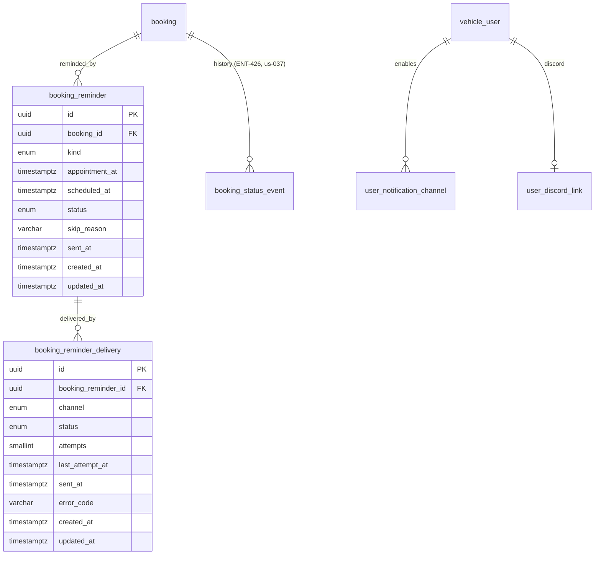
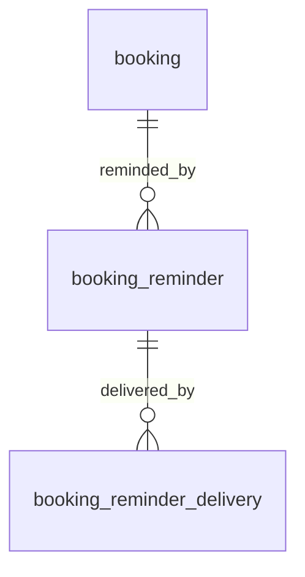
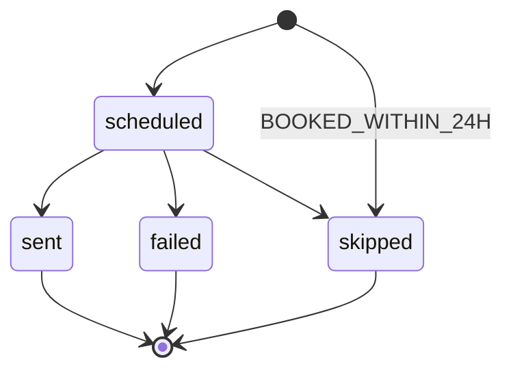
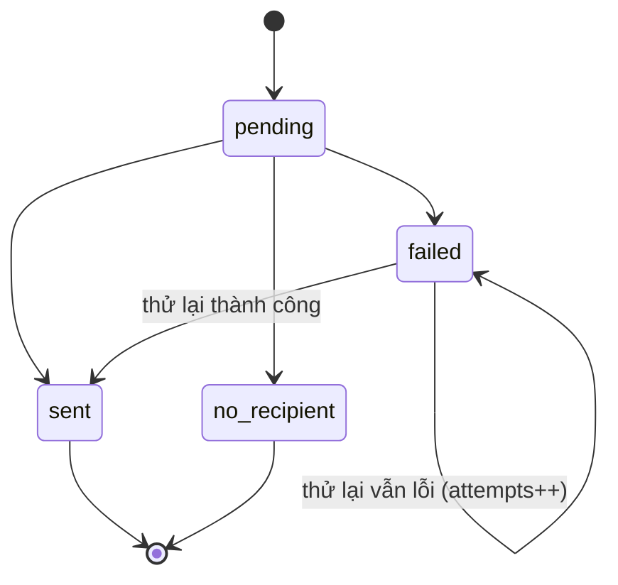

# Entity Specification — Nhắc lịch hẹn 24h & xử lý từ lời nhắc

> Đặc tả các entity phục vụ Feature `FEAT-NOTI-002` — F7 phần nhắc lịch hẹn (US-033 → US-036).
>
> **Nguồn nghiệp vụ:** [Functional Spec](../feature-functional/us-033-sprint-3-spec.ff.md). Tài liệu này **không định nghĩa lại nghiệp vụ**; mọi rule trỏ về `BR-7xx` / `EF-7xx` / `EDGE-7xx` trong Functional Spec.
>
> **Nguyên tắc:** tái dùng hạ tầng thông báo của [us-021](../../sprint-2/entity/us-021-sprint-2-spec.entity.md) (enum kênh, enum trạng thái gửi, cấu hình kênh, `user_discord_link`). Thêm **hai entity mới** theo đúng mẫu `reminder` / `reminder_delivery`, và **một cột mới** trên `booking`.
>
> **Quy ước đánh dấu:** `[Đề xuất]` = đề xuất kỹ thuật cần review · `[Cần xác nhận]` = chờ Product/Stakeholder. Business rule entity dùng dải `BR-ENT-48x`.

---

# 0. Document Information

| Field | Value |
|---|---|
| Document ID | `ENT-SPEC-NOTI-002` |
| Feature | `FEAT-NOTI-002` — Nhắc lịch hẹn 24h & xử lý từ lời nhắc (F7) |
| Version | `v1.0` |
| Status | `Draft` |
| Owner | Backend Team |
| Author | Team 4 Người |
| Database | PostgreSQL (Supabase), schema `public`, migration bằng Alembic |
| Created Date | `2026-09-29` |
| Updated Date | `2026-09-29` |
| Related Functional Spec | [us-033-sprint-3-spec.ff.md](../feature-functional/us-033-sprint-3-spec.ff.md) |
| Related API Spec | [us-033-sprint-3-spec.api.md](../api/us-033-sprint-3-spec.api.md) |

---

# 1. Entity Catalog

| Entity ID | Entity | Table | Trạng thái | Mục đích trong F7 (nhắc hẹn) |
|---|---|---|---|---|
| **`ENT-424`** | `BookingReminder` | `booking_reminder` | **Mới** | Một lời nhắc cho một (booking, giờ hẹn): thời điểm gửi, trạng thái, lý do bỏ qua |
| **`ENT-425`** | `BookingReminderDelivery` | `booking_reminder_delivery` | **Mới** | Kết quả gửi lời nhắc qua từng kênh |
| `ENT-402` | `Booking` | `booking` | Có sẵn — **mở rộng 1 cột** | Nguồn nhắc; huỷ lịch; `attendance_confirmed_at` (mới) |
| `ENT-426` | `BookingStatusEvent` | `booking_status_event` | Mới — **định nghĩa ở [us-037](us-037-sprint-3-spec.entity.md)** | Ghi sự kiện huỷ (người huỷ, nguồn, lý do) |
| `ENT-419` | `UserNotificationChannel` | `user_notification_channel` | Có sẵn — **không đổi** | Kênh chủ xe đã bật (us-021) |
| `ENT-417` | `UserDiscordLink` | `user_discord_link` | Có sẵn — **không đổi** | Kênh riêng Discord |
| `ENT-410` | `Quote` | `quote` | Có sẵn — **không đổi** | Gỡ `booking_id` khi huỷ (FF BR-709) |

### Vì sao không dùng lại bảng `reminder` (ENT-405)?

`reminder` được khoá theo **(xe, mốc km, mức)** và có `target_odo_milestone NOT NULL`, `reminder_level`, `snooze_count` — toàn bộ là khái niệm của nhắc **mốc bảo dưỡng**. Nhắc hẹn khoá theo **(booking, giờ hẹn)** và không có mốc km. Nhét hai loại vào một bảng buộc phải nới NOT NULL và thêm cột loại, làm yếu ràng buộc của us-021. Hai bảng song song, cùng mẫu, cùng enum ⇒ đơn giản và an toàn hơn.

### Vì sao `attendance_confirmed_at` nằm trên `booking`?

Chủ xe có thể xác nhận sẽ đến **cả khi không có lời nhắc** (booking xác nhận sát giờ — FF BR-703, AF-704). Thông tin thuộc về lịch hẹn, và Workshop Board (F8) đọc trực tiếp cùng danh sách booking.

---

# 2. ER Diagram



---

# 3. Quy ước chung

| Chủ đề | Quy ước |
|---|---|
| Tên bảng / cột | `snake_case`, số ít |
| Tên field ở API | `camelCase` |
| Primary key | `uuid` sinh ở app (`uuid4`) |
| Enum | Lưu **lowercase**; API trả **UPPER_SNAKE_CASE** |
| Thời gian | `timestamptz` lưu UTC. `appointment_at` = `booking_date` + `time_slot` diễn giải theo Asia/Ho_Chi_Minh rồi đổi sang UTC |
| Truy cập DB | Backend kết nối trực tiếp; bật RLS, không policy (chặn anon key) — như các bảng khác |
| Nội dung thông báo | **Không lưu** — dựng lại từ dữ liệu khi cần (như us-021 BR-ENT-455) |

---

# ENT-424 — BookingReminder

## 1. Entity Information

| Field | Value |
|---|---|
| Entity ID | `ENT-424` |
| Entity Name | `BookingReminder` |
| Business Name | Lời nhắc lịch hẹn |
| Table | `booking_reminder` |
| Domain | Notification |
| Version | `v1.0` |
| Status | `Draft` — **Mới** |
| Owner | Backend Team |
| Created Date | `2026-09-29` |
| Updated Date | `2026-09-29` |

## 2. Entity Overview

### 2.1 Description

Một lời nhắc gửi chủ xe trước giờ hẹn của một booking. MVP chỉ có loại `before_24h`.

### 2.2 Business Purpose

Lên lịch, chống gửi trùng (FF BR-704), và truy vết vì sao một lời nhắc được gửi / không gửi.

### 2.3 Scope

**In Scope** — thời điểm gửi, giờ hẹn tại lúc lên lịch, trạng thái, lý do bỏ qua.

**Out of Scope** — kết quả từng kênh (ENT-425); nội dung thông báo (không lưu); xác nhận sẽ đến (`booking.attendance_confirmed_at`).

## 3. Business Meaning

### Definition

"Nhắc chủ xe về booking B có giờ hẹn A, gửi lúc S."

### Example

Booking `EVC-7K2M`, `appointment_at = 2026-10-04T07:00:00Z` (14:00 giờ VN), `scheduled_at = 2026-10-03T07:00:00Z`, `status = sent`.

### Terminology

`TERM-701` Appointment reminder, `TERM-705` Skipped reminder (FF §22).

## 4. Identity & Keys

### 4.1 Primary Key

| Field | Type | Description |
|---|---|---|
| `id` | `uuid` | PK, `uuid4` |

### 4.2 Candidate / Unique Keys

| Field / Composite | Unique | Description |
|---|---:|---|
| `(booking_id, kind, appointment_at)` | Yes | `ux_booking_reminder_booking_kind_appt` — một lời nhắc mỗi loại cho mỗi giờ hẹn (FF BR-704). Đổi giờ hẹn ⇒ khác `appointment_at` ⇒ được tạo lời nhắc mới |

## 5. Attributes

| Tên trường (Field) | Kiểu dữ liệu (Data Type) | Required | Nullable | Default | Ràng buộc (Constraints) | Mô tả (Description) |
|---|---|---:|---:|---|---|---|
| `id` | `uuid` | Yes | No | `uuid4` | PK | Mã lời nhắc |
| `booking_id` | `uuid` | Yes | No | - | FK → `booking.id` `ON DELETE CASCADE` | Booking được nhắc |
| `kind` | `booking_reminder_kind_enum` | Yes | No | `before_24h` | `before_24h` | Loại nhắc; để mở rộng (ví dụ `before_2h`) mà không đổi bảng |
| `appointment_at` | `timestamptz` | Yes | No | - | | Giờ hẹn tại lúc lên lịch (snapshot) — dùng để phát hiện đổi giờ (FF BR-707) |
| `scheduled_at` | `timestamptz` | Yes | No | - | `< appointment_at` | Thời điểm gửi = `appointment_at − BOOKING_REMINDER_LEAD_HOURS` (FF BR-702) |
| `status` | `booking_reminder_status_enum` | Yes | No | `scheduled` | Xem §8 | Trạng thái lời nhắc |
| `skip_reason` | `varchar(32)` | No | Yes | - | Bắt buộc khi `status = skipped` | `BOOKED_WITHIN_24H` / `BOOKING_CANCELLED` / `BOOKING_NOT_CONFIRMED` / `RESCHEDULED` / `TOO_LATE` |
| `sent_at` | `timestamptz` | No | Yes | - | Bắt buộc khi `status = sent` | Lần đầu có kênh gửi thành công |
| `created_at` | `timestamptz` | Yes | No | `now()` | | |
| `updated_at` | `timestamptz` | Yes | No | `now()` | `onupdate now()` | |

## 6. Attribute Details

### `appointment_at`

| Property | Value |
|---|---|
| Type | `timestamptz` (UTC) |
| Derivation | `(booking.booking_date + booking.time_slot) AT TIME ZONE 'Asia/Ho_Chi_Minh'` |

**Business Meaning** — Chụp lại giờ hẹn khi lên lịch. Trước khi gửi, job so với giờ hẹn hiện tại của booking; khác ⇒ `skipped` (`RESCHEDULED`) (FF BR-704, BR-707).

### `skip_reason`

| Value | Khi nào | FF |
|---|---|---|
| `BOOKED_WITHIN_24H` | Booking chuyển `confirmed` khi đã qua `scheduled_at` | BR-703 |
| `BOOKING_CANCELLED` | Booking `cancelled` trước khi gửi | BR-707 |
| `BOOKING_NOT_CONFIRMED` | Booking không còn `confirmed` vì lý do khác (ví dụ đã `checked_in`) | BR-707 |
| `RESCHEDULED` | Giờ hẹn đã đổi | BR-704 |
| `TOO_LATE` | Chưa gửi được mà đã quá `appointment_at − BOOKING_REMINDER_MIN_LEAD_HOURS` | BR-702 |

Dùng `varchar` thay vì enum để thêm lý do mà không cần migration `ALTER TYPE` `[Đề xuất]`; service validate theo danh sách trên.

## 7. Relationships

### 7.1 Relationship Overview



### 7.2 Relationship Details

| Related Entity | Relationship | Cardinality | Description |
|---|---|---|---|
| [`booking`](../../entity/maintenance/booking.entity.md) (ENT-402) | for | N:1 | Booking được nhắc; thường 1, nhiều hơn khi đổi giờ |
| `booking_reminder_delivery` (ENT-425) | delivered by | 1:N | Mỗi kênh hiệu lực một dòng |

### Relationship Rules

- Chỉ tạo cho booking `confirmed` (FF BR-701).
- Xoá booking (không xảy ra trong nghiệp vụ — booking không xoá cứng) ⇒ cascade.

## 8. Entity Lifecycle / State

### 8.1 States

| State (DB) | API | Meaning |
|---|---|---|
| `scheduled` | `SCHEDULED` | Chờ tới `scheduled_at` |
| `sent` | `SENT` | ≥ 1 kênh gửi thành công |
| `failed` | `FAILED` | Mọi kênh `failed` / `no_recipient`, hết lượt hoặc quá sát giờ |
| `skipped` | `SKIPPED` | Không gửi — xem `skip_reason` |

### 8.2 State Transition



### 8.3 Transition Rules

- `scheduled → sent`: delivery đầu tiên chuyển `sent` ⇒ ghi `sent_at` (FF BR-712). Các delivery khác vẫn tiếp tục thử lại độc lập.
- `scheduled → failed`: mọi delivery ở trạng thái cuối (`failed` hết lượt / `no_recipient`) và không cái nào `sent`.
- `scheduled → skipped`: FF BR-702/BR-704/BR-707; huỷ booking (API huỷ) chuyển ngay các lời nhắc `scheduled` của booking sang `skipped` (`BOOKING_CANCELLED`) trong cùng transaction.
- Trạng thái cuối (`sent`/`failed`/`skipped`) **không** quay lại.

## 9. Business Rules & Constraints

### BR-ENT-480 — Lên lịch khi booking `confirmed` (FF BR-701, BR-702, BR-703)

**Rule** — Trong cùng transaction chuyển booking sang `confirmed` (F6 `auto` hoặc F8 chủ xưởng chấp nhận), gọi `BookingReminderScheduler.on_confirmed(booking)`:

```text
appointment_at = to_utc(booking_date + time_slot, 'Asia/Ho_Chi_Minh')
scheduled_at   = appointment_at − BOOKING_REMINDER_LEAD_HOURS
IF now() < scheduled_at  → INSERT status = scheduled
ELSE                     → INSERT status = skipped, skip_reason = BOOKED_WITHIN_24H
INSERT ... ON CONFLICT (booking_id, kind, appointment_at) DO NOTHING
```

**Expected Behavior** — Gọi lại (retry, chấp nhận hai lần) không tạo trùng.

### BR-ENT-481 — Lưới an toàn (reconcile)

**Rule** — Mỗi lần chạy, job gửi cũng tìm booking `confirmed` có `appointment_at` trong `(now, now + BOOKING_REMINDER_LEAD_HOURS + 1h]` mà **chưa có** lời nhắc `before_24h` cho đúng `appointment_at` ⇒ tạo theo BR-ENT-480. Phòng khi hook ở F6/F8 bị bỏ sót.

**Expected Behavior** — Booking `confirmed` sát giờ được tạo bản ghi `skipped` (`BOOKED_WITHIN_24H`) nếu thời điểm xác nhận muộn hơn `scheduled_at`. Thời điểm xác nhận lấy từ `booking_status_event` (ENT-426) sự kiện `→ confirmed` mới nhất; không có ⇒ coi là "đã sát giờ" (không gửi) `[Đề xuất]`.

### BR-ENT-482 — Kiểm tra lại trước khi gửi (FF BR-707)

**Rule** — Job khoá dòng lời nhắc (`SELECT ... FOR UPDATE SKIP LOCKED`), đọc lại booking; nếu `booking.status <> confirmed` hoặc giờ hẹn hiện tại ≠ `appointment_at` ⇒ `skipped` với lý do tương ứng.

### BR-ENT-483 — Không gửi trùng khi chạy chồng

**Rule** — Chọn lời nhắc đến hạn bằng `FOR UPDATE SKIP LOCKED`; tạo delivery bằng unique `(booking_reminder_id, channel)`. Hai worker không thể gửi cùng một lời nhắc (FF AC-710).

### BR-ENT-484 — `skip_reason` và `sent_at` nhất quán

**Rule** — `status = skipped` ⇔ có `skip_reason`; `status = sent` ⇒ có `sent_at`.

## 10. Data Integrity

```sql
UNIQUE (booking_id, kind, appointment_at)                        -- ux_booking_reminder_booking_kind_appt
CHECK (scheduled_at < appointment_at)                            -- ck_booking_reminder_schedule_before_appt
CHECK ((status = 'skipped') = (skip_reason IS NOT NULL))         -- ck_booking_reminder_skip_reason
CHECK (status <> 'sent' OR sent_at IS NOT NULL)                  -- ck_booking_reminder_sent_at
```

- FK `booking_id` `ON DELETE CASCADE`.

## 11. Index & Query Requirements

| Query | Fields | Frequency | Required Index |
|---|---|---|---|
| Lời nhắc đến hạn | `scheduled_at` WHERE `status = 'scheduled'` | Mỗi 15' | Partial `ix_booking_reminder_due` |
| Lời nhắc của một booking | `booking_id` | Mỗi lần huỷ/đổi | Prefix của unique §4.2 |

### Important Query Patterns

```text
1. SELECT * FROM booking_reminder
    WHERE status = 'scheduled' AND scheduled_at <= now()
    ORDER BY scheduled_at
    FOR UPDATE SKIP LOCKED LIMIT :batch                                -- job gửi
2. UPDATE booking_reminder SET status='skipped', skip_reason='BOOKING_CANCELLED'
    WHERE booking_id = :id AND status = 'scheduled'                     -- khi huỷ
```

## 12. Ownership & Authorization

| Actor / Role | Read | Create | Update | Delete |
|---|---:|---:|---:|---:|
| Hệ thống (scheduler, job) | ✅ | ✅ | ✅ | ❌ |
| Chủ xe | ❌ (không có API đọc trực tiếp) | ❌ | ❌ | ❌ |
| Chủ xưởng | ❌ | ❌ | ❌ | ❌ |

### Ownership Rule

Thuộc booking; do hệ thống quản lý hoàn toàn.

## 13. Audit Fields

`created_at`, `updated_at`, `sent_at`.

## 14. Data Source & Ownership

| Data | Source System | Owner | Sync Type |
|---|---|---|---|
| Toàn bộ | App (scheduler/job) | Backend | Real-time |

**Source of Truth** — App DB.

## 15. Data Sensitivity & Security

Không chứa PII. Không lưu nội dung thông báo hay địa chỉ nhận.

## 16. Retention & Deletion

- Giữ tối thiểu 90 ngày sau `appointment_at` `[Đề xuất]` để đo tỉ lệ no-show; dọn bằng job sau đó (không bắt buộc MVP).
- Xoá cứng; cascade xoá delivery.

## 17. Example Data

```json
{
  "id": "4b1f0c2e-7a6d-4e7b-9a31-2c5d6e7f8a90",
  "booking_id": "8d2e6f10-3c4b-4a59-8e7d-1f2a3b4c5d6e",
  "kind": "before_24h",
  "appointment_at": "2026-10-04T07:00:00Z",
  "scheduled_at": "2026-10-03T07:00:00Z",
  "status": "sent",
  "skip_reason": null,
  "sent_at": "2026-10-03T07:04:12Z",
  "created_at": "2026-09-30T02:10:00Z",
  "updated_at": "2026-10-03T07:04:12Z"
}
```

## 18. API References

- Không có API đọc/ghi trực tiếp. Được ghi bởi: hook `on_confirmed` (F6 `POST /bookings`, F8 accept), job `booking_reminder.send_due`, API huỷ `POST /api/v1/bookings/{bookingId}/cancel` (chuyển `skipped`). Xem [API Spec](../api/us-033-sprint-3-spec.api.md).

## 19. Related Entities

| Entity | Relationship | Reference |
|---|---|---|
| `booking` | for | [booking.entity.md](../../entity/maintenance/booking.entity.md) |
| `booking_reminder_delivery` | delivered by | ENT-425 (dưới) |
| `reminder` (nhắc mốc) | mẫu tương tự | [reminder.entity.md](../../entity/maintenance/reminder.entity.md) |

## 20. Related Functional Specifications

- [us-033 FF](../feature-functional/us-033-sprint-3-spec.ff.md) — BR-701 → BR-712.

---

# ENT-425 — BookingReminderDelivery

## 1. Entity Information

| Field | Value |
|---|---|
| Entity ID | `ENT-425` |
| Entity Name | `BookingReminderDelivery` |
| Business Name | Kết quả gửi lời nhắc hẹn theo kênh |
| Table | `booking_reminder_delivery` |
| Domain | Notification |
| Version | `v1.0` |
| Status | `Draft` — **Mới** |
| Owner | Backend Team |
| Created Date | `2026-09-29` |
| Updated Date | `2026-09-29` |

## 2. Entity Overview

### 2.1 Description

Kết quả gửi một lời nhắc hẹn qua một kênh. Tạo khi job bắt đầu gửi lời nhắc: mỗi kênh chủ xe đang bật (theo us-021) một dòng `pending`.

### 2.2 Business Purpose

Thử lại độc lập từng kênh (FF BR-711), tính trạng thái tổng của lời nhắc (FF BR-712), quan sát tỉ lệ gửi thành công.

### 2.3 Scope

**In Scope** — kênh, trạng thái, số lần thử, lỗi cuối. **Out of Scope** — nội dung, địa chỉ nhận.

## 3. Business Meaning

"Lời nhắc R đã gửi qua Discord: `sent` ở lần thử 1."

## 4. Identity & Keys

| Field / Composite | Unique | Description |
|---|---:|---|
| `id` | PK | `uuid4` |
| `(booking_reminder_id, channel)` | Yes | `ux_booking_reminder_delivery_channel` — một dòng mỗi kênh |

## 5. Attributes

Cùng cấu trúc với `reminder_delivery` (ENT-420, us-021), khác FK.

| Tên trường (Field) | Kiểu dữ liệu (Data Type) | Required | Nullable | Default | Ràng buộc (Constraints) | Mô tả (Description) |
|---|---|---:|---:|---|---|---|
| `id` | `uuid` | Yes | No | `uuid4` | PK | |
| `booking_reminder_id` | `uuid` | Yes | No | - | FK → `booking_reminder.id` `ON DELETE CASCADE` | Lời nhắc |
| `channel` | `reminder_channel_enum` | Yes | No | - | Tái dùng enum us-021 | Kênh |
| `status` | `notification_delivery_status_enum` | Yes | No | `pending` | `pending / sent / failed / no_recipient` — tái dùng enum us-021 | Trạng thái |
| `attempts` | `smallint` | Yes | No | `0` | `>= 0` | Số lần đã thử |
| `last_attempt_at` | `timestamptz` | No | Yes | - | | Lần thử gần nhất |
| `sent_at` | `timestamptz` | No | Yes | - | Có khi `sent` | Gửi thành công lúc |
| `error_code` | `varchar(64)` | No | Yes | - | `TIMEOUT`, `RATE_LIMITED`, `UNAVAILABLE`, `DELIVERY_FORBIDDEN`, `NO_RECIPIENT` | Lỗi cuối |
| `created_at` | `timestamptz` | Yes | No | `now()` | | |
| `updated_at` | `timestamptz` | Yes | No | `now()` | `onupdate now()` | |

## 7. Relationships

| Related Entity | Relationship | Cardinality | Description |
|---|---|---|---|
| `booking_reminder` (ENT-424) | belongs to | N:1 | Lời nhắc |

## 8. Entity Lifecycle / State



## 9. Business Rules & Constraints

### BR-ENT-485 — Thử lại có hạn giờ (FF BR-711)

**Rule** — Thử lại khi `status = failed AND attempts < REMINDER_MAX_ATTEMPTS AND error_code IN ('TIMEOUT','RATE_LIMITED','UNAVAILABLE')` **và** `now() ≤ booking_reminder.appointment_at − BOOKING_REMINDER_MIN_LEAD_HOURS`. `DELIVERY_FORBIDDEN`, `NO_RECIPIENT` không thử lại.

### BR-ENT-486 — Kênh theo cấu hình chủ xe (FF BR-705)

**Rule** — Tập kênh = kênh hiệu lực của chủ xe theo us-021 (không có dòng cấu hình ⇒ `{discord}`), giao với kênh có adapter đang hoạt động. **Không** đọc `user_notification_setting.reminders_enabled` (FF BR-705, Q-701).

### BR-ENT-487 — Không lưu nội dung

**Rule** — Như us-021 BR-ENT-455.

## 10. Data Integrity

```sql
UNIQUE (booking_reminder_id, channel)
CHECK (attempts >= 0)
CHECK (status <> 'sent' OR sent_at IS NOT NULL)
```

## 11. Index & Query Requirements

| Query | Fields | Index |
|---|---|---|
| Delivery cần thử lại | `status`, `attempts` | Partial `ix_booking_reminder_delivery_retry` WHERE `status = 'failed'` |
| Delivery của một lời nhắc | `booking_reminder_id` | Unique §4 |

## 12. Ownership & Authorization

Chỉ hệ thống đọc/ghi.

## 16. Retention & Deletion

Cascade theo `booking_reminder`.

## 17. Example Data

```json
{
  "id": "0e9d8c7b-6a5f-4e3d-2c1b-0a9f8e7d6c5b",
  "booking_reminder_id": "4b1f0c2e-7a6d-4e7b-9a31-2c5d6e7f8a90",
  "channel": "discord",
  "status": "sent",
  "attempts": 1,
  "last_attempt_at": "2026-10-03T07:04:12Z",
  "sent_at": "2026-10-03T07:04:12Z",
  "error_code": null
}
```

---

# 4. Entity tái sử dụng — ghi chú cho F7 (nhắc hẹn)

## 4.1 `booking` (ENT-402) — mở rộng 1 cột

| Field | Type | Required | Nullable | Default | Constraints | Description |
|---|---|---:|---:|---|---|---|
| `attendance_confirmed_at` | `timestamptz` | No | Yes | - | Chỉ ghi khi `status = confirmed` | Thời điểm chủ xe bấm "Xác nhận sẽ đến" (FF BR-708) |

**Rules**

- **BR-ENT-488 — Ghi một lần:** `UPDATE booking SET attendance_confirmed_at = now() WHERE id = :id AND status = 'confirmed' AND attendance_confirmed_at IS NULL`. Đã có giá trị ⇒ giữ nguyên (idempotent).
- Không reset khi booking đổi giờ qua F6b `[Cần xác nhận — Q-ENT-481]`.
- Board (F8) đọc cột này để hiện nhãn "Khách đã xác nhận đến".

**Huỷ lịch `confirmed` (FF BR-709)** — trong **một** transaction:

```text
1. UPDATE booking SET status='cancelled', updated_at=now()
    WHERE id=:id AND user_id=:uid AND status='confirmed'        -- khoá lạc quan theo trạng thái
   (0 dòng ⇒ đọc lại: đã cancelled bởi chính chủ xe ⇒ idempotent OK; khác ⇒ lỗi trạng thái)
2. INSERT booking_status_event(from='confirmed', to='cancelled',
       actor_type='vehicle_owner', source='reminder_24h'|'app', reason)    -- ENT-426
3. UPDATE booking_reminder SET status='skipped', skip_reason='BOOKING_CANCELLED'
    WHERE booking_id=:id AND status='scheduled'
4. UPDATE quote SET booking_id=NULL WHERE booking_id=:id                  -- FF BR-709 [Đề xuất]
COMMIT
```

Sức chứa (us-029 BR-005) đếm booking `pending | confirmed | checked_in | in_progress` nên sau commit chỗ được trả lại ngay — **không** cần cập nhật bảng nào khác.

## 4.2 `user_notification_channel` (ENT-419), `user_discord_link` (ENT-417) — không đổi

Đọc để xác định kênh và nơi nhận, theo đúng quy tắc us-021.

## 4.3 `quote` (ENT-410) — không đổi cấu trúc

Chỉ gỡ `booking_id` khi huỷ (bước 4 ở §4.1).

---

# 5. Enums

| Enum | Giá trị (DB) | Thay đổi |
|---|---|---|
| `booking_reminder_kind_enum` | `before_24h` | **Mới** |
| `booking_reminder_status_enum` | `scheduled, sent, failed, skipped` | **Mới** |
| `reminder_channel_enum` | (us-021) | Tái dùng, không đổi |
| `notification_delivery_status_enum` | (us-021) | Tái dùng, không đổi |

---

# 6. Cấu hình (`.env`)

| Biến | Mặc định | Ý nghĩa | FF |
|---|---|---|---|
| `BOOKING_REMINDER_LEAD_HOURS` | `24` | Gửi trước giờ hẹn bao nhiêu giờ | BR-702 |
| `BOOKING_REMINDER_MIN_LEAD_HOURS` | `2` | Không gửi / không thử lại khi còn ít hơn số giờ này | BR-702, BR-711 |
| `BOOKING_REMINDER_JOB_INTERVAL_MINUTES` | `15` | Chu kỳ job gửi | BR-702 |
| `REMINDER_MAX_ATTEMPTS` | `3` | Tái dùng us-021 | BR-711 |

---

# 7. Kế hoạch migration

Một revision Alembic mới `add_booking_reminder` (`down_revision` = revision mới nhất, hiện là `e2b6a4c8d1f7_add_booking_capacity` nếu đã merge):

1. `CREATE TYPE booking_reminder_kind_enum AS ENUM ('before_24h')`.
2. `CREATE TYPE booking_reminder_status_enum AS ENUM ('scheduled','sent','failed','skipped')`.
3. `CREATE TABLE booking_reminder (...)` + unique + CHECK + partial index `ix_booking_reminder_due`.
4. `CREATE TABLE booking_reminder_delivery (...)` + unique + partial index `ix_booking_reminder_delivery_retry`.
5. `ALTER TABLE booking ADD COLUMN attendance_confirmed_at timestamptz NULL`.
6. Bật RLS cho 2 bảng mới (không policy).
7. Model code: `backend/src/common/core/notification/booking_reminder.py` (2 model + repository), thêm `attendance_confirmed_at` vào `src/common/core/maintenance/booking.py`; đăng ký trong `src.common.core`.
8. Không backfill: booking `confirmed` hiện có sẽ được job reconcile (BR-ENT-481) tạo lời nhắc ở lần chạy đầu.

**Downgrade** — drop 2 bảng, 2 enum, cột `attendance_confirmed_at`.

---

# 8. Open Questions

| ID | Question | Owner | Status |
|---|---|---|---|
| `Q-ENT-480` | `skip_reason` dùng `varchar` + validate ở service hay enum DB? | Backend | Open — `[Đề xuất]` varchar |
| `Q-ENT-481` | Đổi giờ hẹn (F6b) có reset `attendance_confirmed_at` không? | PO | Open — `[Đề xuất]` có reset, vì chủ xe xác nhận cho giờ cũ |
| `Q-ENT-482` | Trùng mã entity: `ENT-418` đang được dùng cho cả `UserNotificationSetting` (us-021) và `WorkshopSlotBlock` (us-029) | Backend | Open — cần đánh số lại một trong hai; tài liệu này dùng dải mới `ENT-424+` để tránh thêm trùng |

---

# 9. Change Log

| Version | Date | Author | Changes |
|---|---|---|---|
| `v1.0` | `2026-09-29` | Team 4 Người | Initial version: `booking_reminder` (ENT-424), `booking_reminder_delivery` (ENT-425), cột `booking.attendance_confirmed_at` |

---

# 10. Approval

| Role | Name | Status | Date |
|---|---|---|---|
| Product / Business | Lê Đức Tùng | Pending | |
| Technical Owner | Tech Lead | Pending | |
| Data Owner | Backend Team | Pending | |
