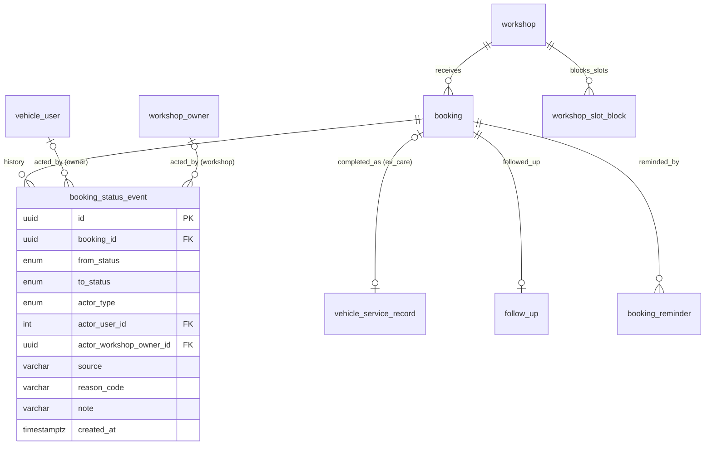
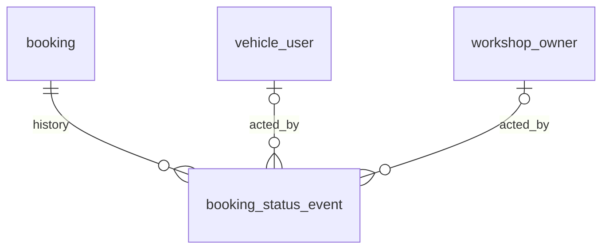

# Entity Specification — Workshop Board

> Đặc tả các entity phục vụ Feature `FEAT-BOARD-001` — F8 (US-037 → US-040).
>
> **Nguồn nghiệp vụ:** [Functional Spec](../feature-functional/us-037-sprint-3-spec.ff.md). Tài liệu này **không định nghĩa lại nghiệp vụ**; mọi rule trỏ về `BR-8xx` / `EF-8xx` / `EDGE-8xx`.
>
> **Nguyên tắc:** F8 chủ yếu **ghi** vào các entity đã có (`booking`, `workshop.booking_confirmation_mode`, `workshop_slot_block`, `vehicle_service_record`, `follow_up`). Chỉ thêm **một entity mới**: `booking_status_event` (ENT-426) — lịch sử chuyển trạng thái booking, dùng chung cho F6/F7/F8/job.
>
> **Quy ước đánh dấu:** `[Đề xuất]` · `[Cần xác nhận]`. Business rule entity dùng dải `BR-ENT-49x`.

---

# 0. Document Information

| Field | Value |
|---|---|
| Document ID | `ENT-SPEC-BOARD-001` |
| Feature | `FEAT-BOARD-001` — Workshop Board (F8) |
| Version | `v1.0` |
| Status | `Draft` |
| Owner | Backend Team |
| Author | Team 4 Người |
| Database | PostgreSQL (Supabase), schema `public`, migration bằng Alembic |
| Created Date | `2026-09-29` |
| Updated Date | `2026-09-29` |
| Related Functional Spec | [us-037-sprint-3-spec.ff.md](../feature-functional/us-037-sprint-3-spec.ff.md) |
| Related API Spec | [us-037-sprint-3-spec.api.md](../api/us-037-sprint-3-spec.api.md) |

---

# 1. Entity Catalog

| Entity ID | Entity | Table | Trạng thái | Vai trò trong F8 |
|---|---|---|---|---|
| **`ENT-426`** | `BookingStatusEvent` | `booking_status_event` | **Mới** | Lịch sử chuyển trạng thái booking: từ → sang, ai, nguồn, lý do (FF BR-808) |
| `ENT-402` | `Booking` | `booking` | Có sẵn — **không đổi cấu trúc** (ngoài cột `attendance_confirmed_at` của us-033) | State machine (FF BR-802); `actual_cost` khi hoàn tất |
| `ENT-008` | `Workshop` | `workshop` | Có sẵn — cột `booking_confirmation_mode` (us-029) | F8 **ghi** chế độ xác nhận (FF BR-811) |
| `ENT-418` | `WorkshopSlotBlock` | `workshop_slot_block` | Có sẵn (us-029) — **không đổi** | F8 **ghi** khoá chỗ (FF BR-809) |
| `ENT-009` | `WorkshopOperatingHour` | `workshop_operating_hour` | Có sẵn — không đổi | Ràng buộc khung khi khoá |
| `ENT-415` | `VehicleServiceRecord` | `vehicle_service_record` | Có sẵn (us-017) — không đổi | F8 **ghi** bản ghi `ev_care` khi hoàn tất (us-017 BR-ENT-435) |
| `ENT-414` | `VehicleOdometerReading` | `vehicle_odometer_reading` | Có sẵn (us-017) — không đổi | Đọc ODO hiện tại khi hoàn tất |
| `ENT-412` | `FollowUp` | `follow_up` | Có sẵn — mở rộng ở [us-041](../../sprint-4/entity/us-041-sprint-4-spec.entity.md) | F8 **tạo** `pending` khi hoàn tất (BR-ENT-421) |
| `ENT-424` | `BookingReminder` | `booking_reminder` | Mới ở [us-033](us-033-sprint-3-spec.entity.md) | Lên lịch khi chấp nhận; bỏ qua khi huỷ |
| `ENT-001` / `ENT-003` | `VehicleUser` / `UserVehicle` | | Có sẵn — không đổi | Tên, SĐT, model, biển số hiển thị trên Board |

### Vì sao cần `booking_status_event`?

- FF BR-808 yêu cầu truy vết **ai** đổi trạng thái, **từ đâu**, **vì sao** (huỷ bởi khách hay xưởng, no-show, quá hạn).
- `booking` chỉ có `status` + `updated_at` ⇒ không trả lời được các câu trên, cũng không biết thời điểm `confirmed` / `completed` (cần cho us-033 BR-703 và đo lường no-show).
- Thêm nhiều cột `*_at` / `cancel_*` vào `booking` sẽ phình bảng core; một bảng sự kiện append-only gọn hơn và phục vụ mọi nguồn.

---

# 2. ER Diagram



---

# 3. Quy ước chung

| Chủ đề | Quy ước |
|---|---|
| Tên bảng / cột | `snake_case`, số ít |
| Primary key | `uuid` (`uuid4`) |
| Enum | Lowercase trong DB; API trả UPPER_SNAKE_CASE |
| Thời gian | `timestamptz` UTC; ngày/khung theo Asia/Ho_Chi_Minh như us-029 |
| Append-only | `booking_status_event` không UPDATE/DELETE ở tầng ứng dụng |
| Truy cập DB | Backend kết nối trực tiếp; bật RLS, không policy |

---

# ENT-426 — BookingStatusEvent

## 1. Entity Information

| Field | Value |
|---|---|
| Entity ID | `ENT-426` |
| Entity Name | `BookingStatusEvent` |
| Business Name | Sự kiện trạng thái lịch hẹn |
| Table | `booking_status_event` |
| Domain | Maintenance |
| Version | `v1.0` |
| Status | `Draft` — **Mới** |
| Owner | Backend Team |
| Created Date | `2026-09-29` |
| Updated Date | `2026-09-29` |

## 2. Entity Overview

### 2.1 Description

Mỗi dòng ghi **một** lần booking được tạo hoặc đổi trạng thái.

### 2.2 Business Purpose

Truy vết và đo lường: ai huỷ, vì sao; thời điểm xác nhận / hoàn tất; tỉ lệ no-show; hiển thị lịch sử trên Board (FF AC-811).

### 2.3 Scope

**In Scope** — tạo booking (`from_status = NULL`) và mọi chuyển trạng thái từ F6, F7, F8, job.

**Out of Scope** — tiến độ chi tiết tại xưởng (`service_progress`, F8b); thay đổi field khác status (giờ hẹn khi đổi lịch — F6b tự quyết định có ghi thêm hay không).

## 3. Business Meaning

### Definition

"Lúc T, booking B chuyển từ S1 sang S2, do A thực hiện qua nguồn X, lý do R."

### Example

`confirmed → cancelled`, `actor_type = workshop_owner`, `source = BOARD`, `reason_code = NO_SHOW`, 09:31 04/10.

### Terminology

`TERM-806` Status event (FF §22).

## 4. Identity & Keys

### 4.1 Primary Key

| Field | Type | Description |
|---|---|---|
| `id` | `uuid` | PK |

### 4.2 Candidate / Unique Keys

Không có khoá duy nhất nghiệp vụ (một booking có nhiều sự kiện).

## 5. Attributes

| Tên trường (Field) | Kiểu dữ liệu (Data Type) | Required | Nullable | Default | Ràng buộc (Constraints) | Mô tả (Description) |
|---|---|---:|---:|---|---|---|
| `id` | `uuid` | Yes | No | `uuid4` | PK | |
| `booking_id` | `uuid` | Yes | No | - | FK → `booking.id` `ON DELETE CASCADE` | Booking |
| `from_status` | `booking_status_enum` | No | Yes | - | `NULL` = tạo mới | Trạng thái trước |
| `to_status` | `booking_status_enum` | Yes | No | - | `<> from_status` | Trạng thái sau |
| `actor_type` | `booking_actor_type_enum` | Yes | No | - | `vehicle_owner / workshop_owner / system` | Loại người thực hiện |
| `actor_user_id` | `integer` | No | Yes | - | FK → `vehicle_user.user_id` `ON DELETE SET NULL` | Chủ xe thực hiện (khi `vehicle_owner`) |
| `actor_workshop_owner_id` | `uuid` | No | Yes | - | FK → `workshop_owner.id` `ON DELETE SET NULL` | Chủ xưởng thực hiện (khi `workshop_owner`) |
| `source` | `varchar(32)` | Yes | No | - | Xem §6 | Kênh/luồng phát sinh |
| `reason_code` | `varchar(32)` | No | Yes | - | Bắt buộc khi `to_status = cancelled` | Lý do (xem §6) |
| `note` | `varchar(255)` | No | Yes | - | | Ghi chú tự do (lý do "Khác", ghi chú xưởng) |
| `created_at` | `timestamptz` | Yes | No | `now()` | | Thời điểm sự kiện |

## 6. Attribute Details

### `source`

| Value | Phát sinh từ |
|---|---|
| `CHAT` / `APP` | Chủ xe giữ chỗ (us-029) qua Agent / UI; chủ xe huỷ trong app (us-033) |
| `REMINDER_24H` | Chủ xe huỷ từ lời nhắc (us-033) |
| `AUTO_CONFIRM` | Xưởng `auto` xác nhận ngay (us-029 BR-014) |
| `BOARD` | Chủ xưởng thao tác trên Board (F8) |
| `QR_SCAN` | Chủ xưởng check-in bằng QR (F8) |
| `JOB_WS_DEADLINE` | Job huỷ khi xưởng không xác nhận kịp (us-029 BR-015) |

### `reason_code`

| Value | Dùng khi | FF |
|---|---|---|
| `OWNER_CANCELLED_HOLD` | Chủ xe huỷ giữ chỗ trong 10' | us-029 BR-010 |
| `OWNER_CANCELLED` | Chủ xe huỷ lịch `confirmed` | us-033 BR-709 |
| `FULLY_BOOKED` / `NOT_SUPPORTED_SERVICE` / `WORKSHOP_UNAVAILABLE` | Xưởng từ chối / huỷ | BR-804, BR-806 |
| `CUSTOMER_REQUEST` | Xưởng huỷ theo yêu cầu khách (khách gọi điện) | BR-806 |
| `NO_SHOW` | Khách không đến | BR-806 |
| `WS_CONFIRM_TIMEOUT` | Quá hạn xưởng xác nhận | us-029 BR-015 |
| `OTHER` | Khác — bắt buộc `note` | |

`varchar` + validate ở service để thêm giá trị không cần migration `[Đề xuất]`.

## 7. Relationships

### 7.1 Relationship Overview



### 7.2 Relationship Details

| Related Entity | Relationship | Cardinality | Description |
|---|---|---|---|
| [`booking`](../../entity/maintenance/booking.entity.md) | belongs to | N:1 | |
| `vehicle_user` (ENT-001) | acted by | N:0..1 | Khi chủ xe thực hiện |
| `workshop_owner` (ENT-007) | acted by | N:0..1 | Khi chủ xưởng thực hiện |

### Relationship Rules

- `actor_type = vehicle_owner` ⇒ `actor_user_id` phải là `booking.user_id` lúc ghi.
- `actor_type = workshop_owner` ⇒ `actor_workshop_owner_id` phải là `workshop.owner_id` của `booking.workshop_id` lúc ghi.
- `actor_type = system` ⇒ cả hai actor id `NULL`.

## 8. Entity Lifecycle / State

Không có vòng đời — **append-only**.

## 9. Business Rules & Constraints

### BR-ENT-490 — Ghi cùng transaction với chuyển trạng thái (FF BR-808)

**Rule** — Mọi code path đổi `booking.status` (F6 `create_hold`, auto confirm, `cancel_hold`; F7 cancel; F8 transitions; job BR-015) ghi sự kiện **trong cùng transaction**. Khuyến nghị gom vào một hàm `BookingStateMachine.transition(booking, to, actor, source, reason, note)` duy nhất.

**Expected Behavior** — Không có chuyển trạng thái nào thiếu sự kiện; rollback thì cả hai cùng rollback.

### BR-ENT-491 — Chỉ ghi chuyển hợp lệ (FF BR-802)

**Rule** — `(from_status, to_status)` phải thuộc bảng chuyển trạng thái FF BR-802 (hoặc `(NULL, pending)` khi tạo). Kiểm tra ở `BookingStateMachine`.

### BR-ENT-492 — Huỷ phải có lý do

**Rule** — `to_status = cancelled` ⇒ `reason_code IS NOT NULL`; `reason_code = 'OTHER'` ⇒ `note IS NOT NULL`.

### BR-ENT-493 — Append-only

**Rule** — Ứng dụng không UPDATE/DELETE. Xoá chỉ xảy ra khi cascade từ booking (không xảy ra trong nghiệp vụ).

## 10. Data Integrity

```sql
CHECK (from_status IS DISTINCT FROM to_status)                                    -- ck_bse_status_changed
CHECK (to_status <> 'cancelled' OR reason_code IS NOT NULL)                       -- ck_bse_cancel_reason
CHECK (reason_code IS DISTINCT FROM 'OTHER' OR note IS NOT NULL)                  -- ck_bse_other_note
CHECK (actor_type <> 'system' OR (actor_user_id IS NULL AND actor_workshop_owner_id IS NULL))  -- ck_bse_system_actor
```

Không CHECK "actor id NOT NULL" cho `vehicle_owner` / `workshop_owner` vì FK `ON DELETE SET NULL` — kiểm tra lúc ghi ở service.

## 11. Index & Query Requirements

| Query | Fields | Frequency | Required Index |
|---|---|---|---|
| Lịch sử của một booking | `booking_id`, `created_at` | Cao (chi tiết Board) | `ix_bse_booking_created` |
| Thời điểm `confirmed` gần nhất (us-033 BR-ENT-481) | `booking_id`, `to_status` | Mỗi 15' | Dùng `ix_bse_booking_created` |
| Báo cáo no-show / huỷ theo lý do | `to_status`, `reason_code`, `created_at` | Thấp | Không bắt buộc MVP |

### Important Query Patterns

```text
1. SELECT * FROM booking_status_event WHERE booking_id = :id ORDER BY created_at
2. SELECT created_at FROM booking_status_event
    WHERE booking_id = :id AND to_status = 'confirmed' ORDER BY created_at DESC LIMIT 1
```

## 12. Ownership & Authorization

| Actor / Role | Read | Create | Update | Delete |
|---|---:|---:|---:|---:|
| Chủ xưởng | ✅ (booking xưởng mình) | ✅ gián tiếp (thao tác Board) | ❌ | ❌ |
| Chủ xe | ❌ (MVP) | ✅ gián tiếp (giữ chỗ, huỷ) | ❌ | ❌ |
| Hệ thống | ✅ | ✅ | ❌ | ❌ |

## 13. Audit Fields

Chính bảng này là audit; `created_at`.

## 14. Data Source & Ownership

App DB — ghi bởi `BookingStateMachine`.

## 15. Data Sensitivity & Security

| Field | Classification | Notes |
|---|---|---|
| `note` | Nội bộ | Có thể chứa lời chủ xe (lý do huỷ) — không đưa vào analytics, không gửi sang hãng |

## 16. Retention & Deletion

Giữ theo vòng đời booking (booking không xoá cứng) `[Đề xuất]`.

## 17. Example Data

```json
[
  { "booking_id": "8d2e...", "from_status": null,        "to_status": "pending",     "actor_type": "vehicle_owner",  "actor_user_id": 42, "source": "CHAT",         "created_at": "2026-09-30T02:09:58Z" },
  { "booking_id": "8d2e...", "from_status": "pending",   "to_status": "confirmed",   "actor_type": "system",                              "source": "AUTO_CONFIRM", "created_at": "2026-09-30T02:09:58Z" },
  { "booking_id": "8d2e...", "from_status": "confirmed", "to_status": "checked_in",  "actor_type": "workshop_owner", "actor_workshop_owner_id": "b1c2...", "source": "QR_SCAN", "created_at": "2026-10-04T01:57:10Z" },
  { "booking_id": "8d2e...", "from_status": "checked_in","to_status": "in_progress", "actor_type": "workshop_owner", "actor_workshop_owner_id": "b1c2...", "source": "BOARD",   "created_at": "2026-10-04T02:05:00Z" },
  { "booking_id": "8d2e...", "from_status": "in_progress","to_status": "completed",  "actor_type": "workshop_owner", "actor_workshop_owner_id": "b1c2...", "source": "BOARD",   "created_at": "2026-10-04T03:40:12Z" }
]
```

## 18. API References

- Đọc: `GET /api/v1/workshop-owner/bookings/{bookingId}` (mảng `statusHistory`).
- Ghi gián tiếp: mọi API/job đổi trạng thái booking (us-029, us-033, us-037).

## 19. Related Entities

| Entity | Relationship | Reference |
|---|---|---|
| `booking` | belongs to | [booking.entity.md](../../entity/maintenance/booking.entity.md) |
| `workshop_owner` | acted by | [us-009 entity](../../sprint-1/entity/us-009-sprint-1-spec.entity.md) |

## 20. Related Functional Specifications

- [us-037 FF](../feature-functional/us-037-sprint-3-spec.ff.md) BR-808 · [us-033 FF](../feature-functional/us-033-sprint-3-spec.ff.md) BR-709 · [us-029 FF](../feature-functional/us-029-sprint-3-spec.ff.md) BR-010/014/015.

---

# 4. Entity tái sử dụng — ghi chú cho F8

## 4.1 `booking` (ENT-402)

- **State machine (FF BR-802):** mọi chuyển trạng thái dùng **cập nhật có điều kiện** để chống xung đột:
  ```sql
  UPDATE booking SET status = :to, updated_at = now()
   WHERE id = :id AND workshop_id = :ws AND status = :from
  ```
  0 dòng ⇒ đọc lại và trả lỗi trạng thái (FF EF-802).
- **Hoàn tất:** `actual_cost` (`numeric(12,2)`, `≥ 0`, tuỳ chọn) — cột đã có.
- **Chấp nhận (`pending → confirmed`):** sinh `booking_code` + QR theo us-029 nếu chưa có; gọi `BookingReminderScheduler.on_confirmed` (us-033 BR-ENT-480).
- **Huỷ (`confirmed/pending → cancelled`):** `booking_reminder` `scheduled` ⇒ `skipped` (`BOOKING_CANCELLED`); `quote.booking_id` ⇒ `NULL` (như us-033 §4.1).
- **Không thêm cột** `completed_at`, `cancelled_by`… — lấy từ `booking_status_event`.

## 4.2 `workshop` (ENT-008) — cột `booking_confirmation_mode` (us-029)

- F8 là nơi **ghi** (FF BR-811). `UPDATE workshop SET booking_confirmation_mode = :mode WHERE id = :ws AND owner_id = :owner`.
- Không ảnh hưởng booking `pending` đang có.

## 4.3 `workshop_slot_block` (ENT-418, us-029) — F8 ghi

- **Upsert:**
  ```sql
  INSERT INTO workshop_slot_block (id, workshop_id, block_date, time_slot, blocked_count, reason, note, created_by)
  VALUES (...)
  ON CONFLICT (workshop_id, block_date, time_slot)
  DO UPDATE SET blocked_count = EXCLUDED.blocked_count, reason = EXCLUDED.reason,
                note = EXCLUDED.note, updated_at = now();
  ```
  `blocked_count = 0` ⇒ `DELETE` bản ghi (gỡ khoá).
- **BR-ENT-494 — Không khoá quá chỗ trống (FF BR-809):** trong cùng Redis lock `booking:hold:{ws}:{d}:{t}` và transaction dùng cho đặt lịch (us-029 BR-001):
  ```text
  occupied = COUNT(booking open statuses) of (ws, d, t)
  max_block = total_technicians − emergency_slots_reserved − occupied
  require 0 ≤ new_blocked_count ≤ max_block
  ```
- Ngày trong `[today, today + SLOT_BLOCK_MAX_DAYS_AHEAD]`, khung trong giờ hoạt động (BR-ENT-431 us-029).

## 4.4 `vehicle_service_record` (ENT-415, us-017) — F8 tạo khi hoàn tất

Theo us-017 BR-ENT-435, trong cùng transaction `→ completed`:

| Field | Giá trị |
|---|---|
| `source` | `ev_care` |
| `booking_id` | booking vừa hoàn tất (unique partial `ux_service_record_booking`) |
| `user_vehicle_id` | `booking.user_vehicle_id` |
| `workshop_id` | `booking.workshop_id` |
| `service_date` | `booking.booking_date` |
| `odo_km` | ODO hiện tại (bản ghi hợp lệ mới nhất của `vehicle_odometer_reading`), có thể `NULL` |
| `is_periodic` | `true` |
| `items_done` | Hạng mục của booking/báo giá dạng text `[Đề xuất]` |

Không ghi `vehicle_odometer_reading` (ODO chỉ từ hãng).

## 4.5 `follow_up` (ENT-412) — F8 tạo khi hoàn tất

Theo BR-ENT-421: `status = pending`, `scheduled_at = thời điểm hoàn tất + FOLLOW_UP_DELAY_HOURS (12)`, dời khỏi giờ yên lặng theo [us-041 BR-ENT-503](../../sprint-4/entity/us-041-sprint-4-spec.entity.md), `message` = câu hỏi thăm dựng từ template AI-007. Unique `booking_id` ⇒ hoàn tất lặp không tạo trùng. Các cột mở rộng của `follow_up` định nghĩa ở [us-041 entity](../../sprint-4/entity/us-041-sprint-4-spec.entity.md).

---

# 5. Enums

| Enum | Giá trị (DB) | Thay đổi |
|---|---|---|
| `booking_actor_type_enum` | `vehicle_owner, workshop_owner, system` | **Mới** |
| `booking_status_enum` | (core) | Tái dùng, không đổi |
| `booking_confirmation_mode_enum` | `auto, manual` | Tái dùng (us-029) |
| `slot_block_reason_enum` | `phone_booking, walk_in, maintenance, other` | Tái dùng (us-029) |

---

# 6. Cấu hình (`.env`)

| Biến | Mặc định | Ý nghĩa | FF |
|---|---|---|---|
| `NO_SHOW_GRACE_MINUTES` | `30` | Chờ sau giờ hẹn trước khi được đánh dấu no-show | BR-806 |
| `SLOT_BLOCK_MAX_DAYS_AHEAD` | `30` | Khoá chỗ tối đa bao nhiêu ngày tới | BR-809 |
| `BOARD_MAX_RANGE_DAYS` | `7` | Khoảng ngày tối đa mỗi lần tải Board | BR-812 |
| `BOARD_HISTORY_DAYS` | `30` | Xem lại tối đa bao nhiêu ngày trước | BR-812 |
| `FOLLOW_UP_DELAY_HOURS` | `12` | Gửi hỏi thăm sau hoàn tất (Q-412) | BR-807 |

---

# 7. Kế hoạch migration

Revision Alembic `add_booking_status_event` (sau `add_booking_reminder` của us-033 nếu cùng đợt):

1. `CREATE TYPE booking_actor_type_enum AS ENUM ('vehicle_owner','workshop_owner','system')`.
2. `CREATE TABLE booking_status_event (...)` + CHECK §10 + index `ix_bse_booking_created (booking_id, created_at)`.
3. Bật RLS (không policy).
4. **Backfill** `[Đề xuất]`: với mỗi booking hiện có, ghi một sự kiện `(NULL → status hiện tại, system, source='BACKFILL')` để lịch sử không rỗng. Thêm `BACKFILL` vào danh sách `source` hợp lệ.
5. Model code: `backend/src/common/core/maintenance/booking_status_event.py`; `BookingStateMachine` trong `backend/src/modules/booking/`.

**Downgrade** — drop bảng + enum.

---

# 8. Open Questions

| ID | Question | Owner | Status |
|---|---|---|---|
| `Q-ENT-490` | Có backfill sự kiện cho booking cũ không? | Backend | Open — `[Đề xuất]` có, `source = BACKFILL` |
| `Q-ENT-491` | F6b đổi giờ hẹn có ghi sự kiện riêng (không đổi status) không? Cần thêm `event_type`? | Backend | Open — quyết khi làm F6b |
| `Q-ENT-492` | `items_done` của bản ghi `ev_care` lấy từ đâu khi booking không gắn báo giá? | Backend | Open — `[Đề xuất]` hạng mục của mốc (`milestoneRef`) |

---

# 9. Change Log

| Version | Date | Author | Changes |
|---|---|---|---|
| `v1.0` | `2026-09-29` | Team 4 Người | Initial version: `booking_status_event` (ENT-426); ghi chú ghi `workshop_slot_block`, `booking_confirmation_mode`, `vehicle_service_record`, `follow_up` |

---

# 10. Approval

| Role | Name | Status | Date |
|---|---|---|---|
| Product / Business | Lê Đức Tùng | Pending | |
| Technical Owner | Tech Lead | Pending | |
| Data Owner | Backend Team | Pending | |
