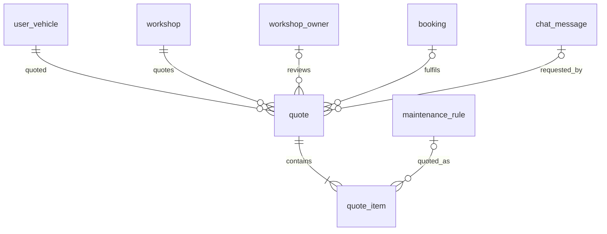

# Entity Specification — Báo giá có chủ xưởng duyệt (HITL)

> **Đã loại khỏi phạm vi (02/10/2026).** Chức năng báo giá có chủ xưởng duyệt (F5b, us-049, AI-005) đã bị bỏ khỏi sản phẩm: code backend/frontend đã gỡ, bảng `quote`, `quote_item` được xoá bởi migration `backend/alembic/versions/a3c7e9f1b2d4_drop_quote_support_ticket_discord.py`. Tài liệu giữ lại để tham khảo lịch sử, **không dùng để triển khai**.

> Entity cho Feature `FEAT-QUOTE-001` — PRD F5b (US-049 → US-052).
>
> **Nguyên tắc:** tái dùng `quote` (ENT-410) và `quote_item` (ENT-411); **không** tạo bảng mới. Bổ sung một số cột để (1) tách dòng bảo hành khỏi dòng tính phí, (2) biết lúc gửi duyệt, (3) suy ra badge kết quả mà không cần kho thông báo in-app.

---

# 0. Document Information

| Field | Value |
|---|---|
| Feature | `FEAT-QUOTE-001` — F5b |
| Version | `v1.0` |
| Status | `Draft` |
| Owner | Backend Team |
| Created Date | `2026-09-30` |
| Updated Date | `2026-09-30` |
| Related FF | [us-049-sprint-3-spec.ff.md](../feature-functional/us-049-sprint-3-spec.ff.md) |
| Related API | [us-049-sprint-3-spec.api.md](../api/us-049-sprint-3-spec.api.md) |

---

# 1. Entity Catalog

| Entity ID | Entity | Table | Trạng thái | Thay đổi |
|---|---|---|---|---|
| `ENT-410` | `Quote` | `quote` | Có sẵn — **mở rộng** | + `submitted_at`, + `result_seen_at`; + unique partial index chờ duyệt; (`source_message_id` đã thêm ở us-025) |
| `ENT-411` | `QuoteItem` | `quote_item` | Có sẵn — **mở rộng** | + `is_covered_by_warranty`, + `price_source`, + `reviewer_note` |
| `ENT-402` | `Booking` | `booking` | Có sẵn — không đổi | Gắn qua `quote.booking_id` (BR-ENT-404) |
| `ENT-007` | `WorkshopOwner` | `workshop_owner` | Có sẵn — không đổi | `quote.reviewed_by` |

### Vì sao cần `quote_item.is_covered_by_warranty`?

ENT-411 hiện chỉ có `estimated_price` / `approved_price`. Dòng bảo hành có giá 0 **không phân biệt được** với dòng xưởng cho giá 0 hay dòng "không làm". FF F5 yêu cầu tách "trong bảo hành" / "tính phí" (PRD F5) và FF F5b khoá dòng bảo hành khi duyệt (Q-1103) ⇒ cần snapshot cờ này.

---

# 2. ER Diagram (phần liên quan)



---

# 3. Thay đổi cột

## 3.1 `quote` (ENT-410)

| Field | Type | Required | Nullable | Default | Constraints | Description |
|---|---|---:|---:|---|---|---|
| `submitted_at` | `timestamptz` | No | Yes | - | Bắt buộc khi `status ≠ draft` | Thời điểm chủ xe gửi duyệt (FF BR-1103); dùng sắp xếp danh sách chờ và đo thời gian duyệt (PRD §10) |
| `result_seen_at` | `timestamptz` | No | Yes | - | Chỉ khi `status ∈ (approved, rejected)` | Chủ xe đã xem kết quả; `NULL` ⇒ badge trên Home (FF BR-1109) |

## 3.2 `quote_item` (ENT-411)

| Field | Type | Required | Nullable | Default | Constraints | Description |
|---|---|---:|---:|---|---|---|
| `is_covered_by_warranty` | `boolean` | Yes | No | `false` | | Snapshot `covered` của dự toán F5 tại lúc lập nháp |
| `price_source` | `varchar(20)` | No | Yes | - | `WORKSHOP_PRICE` / `REFERENCE_PRICE`; `NULL` khi covered | Snapshot nguồn giá (FF F5 BR-1004) |
| `reviewer_note` | `varchar(255)` | No | Yes | - | | Ghi chú của chủ xưởng cho dòng (vd. lý do sửa giá / không làm) |

> `quote_item.note` hiện có giữ nguyên ý nghĩa ghi chú chung khi lập; `reviewer_note` tách riêng để không ghi đè.

---

# 4. Business Rules & Constraints (bổ sung)

## BR-ENT-1101 — Dòng bảo hành khoá giá 0 `[Đề xuất — FF Q-1103]`

`CHECK (NOT is_covered_by_warranty OR (estimated_price = 0 AND (approved_price IS NULL OR approved_price = 0)))`.

## BR-ENT-1102 — Một báo giá chờ duyệt / (xe, xưởng, mốc) (FF BR-1104)

```sql
CREATE UNIQUE INDEX uq_quote_pending_per_milestone
    ON quote (user_vehicle_id, workshop_id, odo_milestone)
 WHERE status = 'pending_approval';
```

## BR-ENT-1103 — `submitted_at` nhất quán

`CHECK (status = 'draft' OR submitted_at IS NOT NULL)`; `CHECK (reviewed_at IS NULL OR submitted_at IS NULL OR reviewed_at >= submitted_at)`.

## BR-ENT-1104 — Tổng khớp chi tiết (nhắc lại BR-ENT-414)

`estimated_total = Σ quote_item.estimated_price` (dòng covered = 0 ⇒ bằng `chargeable_total` F5); khi `approved`: `approved_total = Σ COALESCE(approved_price, estimated_price)`. Tính ở service trong cùng transaction.

---

# 5. Index & Query Requirements

| Query | Fields | Index |
|---|---|---|
| Danh sách chờ duyệt của xưởng (chờ lâu trước) | `quote(workshop_id, status, submitted_at)` | **Mới** (thay index `workshop_id, status` hiện có) |
| Báo giá của xe | `quote(user_vehicle_id, created_at)` | Có sẵn |
| Badge kết quả chưa xem | `quote(user_vehicle_id) WHERE result_seen_at IS NULL AND status IN ('approved','rejected')` | Partial, **mới** |
| Chặn trùng chờ duyệt | BR-ENT-1102 | Partial unique, **mới** |
| Job dọn nháp | `quote(status, created_at) WHERE status = 'draft'` | Partial, **mới** |

---

# 6. Kế hoạch migration

1. `ALTER TABLE quote ADD COLUMN submitted_at timestamptz NULL, ADD COLUMN result_seen_at timestamptz NULL;`
2. Backfill `submitted_at = created_at` cho quote `status ≠ 'draft'` (nếu có dữ liệu thử).
3. `ALTER TABLE quote_item ADD COLUMN is_covered_by_warranty boolean NOT NULL DEFAULT false, ADD COLUMN price_source varchar(20) NULL, ADD COLUMN reviewer_note varchar(255) NULL;`
4. Thêm CHECK (BR-ENT-1101, BR-ENT-1103) và các index §5.
5. Cập nhật model `backend/src/common/core/maintenance/quote.py`, `quote_item.py` và [quote.entity.md](../../entity/maintenance/quote.entity.md), [quote_item.entity.md](../../entity/maintenance/quote_item.entity.md) (v1.2).

Một revision Alembic, down-migration xoá cột/index.

---

# 7. Ownership & Authorization

| Actor | `quote` | `quote_item` |
|---|---|---|
| Chủ xe | Read xe mình; Insert (nháp); Update `status draft→pending_approval`, `result_seen_at`; Delete khi `draft` | Insert khi tạo nháp (qua service) |
| Chủ xưởng | Read xưởng mình, `status ≠ draft`; Update duyệt/từ chối | Update `approved_price`, `reviewer_note` khi duyệt |
| Hệ thống | Delete nháp quá hạn; Update `booking_id` (hook F6) | — |

---

# 8. Retention

- Nháp: xoá cứng sau `QUOTE_DRAFT_TTL_DAYS` (7).
- Báo giá đã gửi: giữ vĩnh viễn trong MVP (dữ liệu nghiệp vụ, truy vết giá) `[Đề xuất]`.

---

# 9. Open Questions

| ID | Question | Status |
|---|---|---|
| `Q-ENT-1101` | Có cần bảng lịch sử thay đổi trạng thái báo giá (như `booking_status_event`) không? | Open — `[Đề xuất]` không; `submitted_at`, `reviewed_at`, `reviewed_by` đủ cho MVP |
| `Q-ENT-1102` | `price_source` dùng enum PG hay `varchar` + validate service? | Open — `[Đề xuất]` `varchar` như `booking_status_event.source` |
| `Q-ENT-1103` | Khi có thêm loại thông báo in-app (booking, follow-up…), gom `result_seen_at` về một bảng `in_app_notification` chung? | Open — phase sau |

---

# 10. Change Log

| Version | Date | Author | Change |
|---|---|---|---|
| `v1.0` | `2026-09-30` | Team 4 Người | Bản đầu — mở rộng `quote`, `quote_item` cho F5b |
