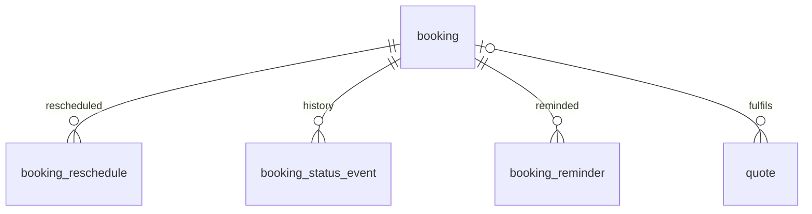

# Entity Specification — Booking Ticket, QR check-in, huỷ & đổi lịch

> **Cập nhật phạm vi (02/10/2026):** các phần dưới đây trong tài liệu này không còn áp dụng.
>
> - Báo giá / duyệt báo giá (`quote`, `quote_item`, us-049): **đã bỏ**. Đặt lịch không gắn báo giá; mọi con số chi phí là ước tính (F5), chi phí cuối cùng do xưởng xác nhận khi kiểm tra xe.

> Entity cho Feature `FEAT-BOOK-002` — PRD F6b (US-053 → US-056).
>
> **Nguyên tắc:** tái dùng `booking` (ENT-402); thêm **1 bảng** lịch sử đổi lịch (`booking_reschedule`, ENT-428) và **2 cột** trên `booking`. `booking_code` **giữ nguyên `NOT NULL`**: code hiện sinh mã ngay khi tạo booking và chỉ trả mã khi `confirmed` — cách này thoả ý us-029 BR-014 mà không cần đổi schema.

---

# 0. Document Information

| Field | Value |
|---|---|
| Feature | `FEAT-BOOK-002` — F6b |
| Version | `v1.0` |
| Status | `Draft` |
| Owner | Backend Team |
| Created Date | `2026-09-30` |
| Updated Date | `2026-09-30` |
| Related FF | [us-053-sprint-3-spec.ff.md](../feature-functional/us-053-sprint-3-spec.ff.md) |
| Related API | [us-053-sprint-3-spec.api.md](../api/us-053-sprint-3-spec.api.md) |

---

# 1. Entity Catalog

| Entity ID | Entity | Table | Trạng thái | Vai trò |
|---|---|---|---|---|
| **`ENT-428`** | `BookingReschedule` | `booking_reschedule` | **Mới** | Một lần đổi giờ của booking (append-only) — FF BR-1211 |
| `ENT-402` | `Booking` | `booking` | Có sẵn — **mở rộng 2 cột** | `odo_milestone`, `reschedule_count` |
| `ENT-426` | `BookingStatusEvent` | `booking_status_event` | Có sẵn — không đổi | Lịch sử trạng thái (đổi lịch không đổi trạng thái nên **không** ghi vào đây) |
| `ENT-424` | `BookingReminder` | `booking_reminder` | Có sẵn — không đổi | `skip_reason = RESCHEDULED` đã có |
| `ENT-410` / `ENT-411` | `Quote` / `QuoteItem` | | Có sẵn — không đổi | Hạng mục + chi phí trên ticket |

### Vì sao không ghi đổi lịch vào `booking_status_event`?

ENT-426 có ràng buộc `to_status <> from_status`; đổi lịch giữ `confirmed` ⇒ không phù hợp. Bảng riêng giữ được giờ cũ/giờ mới có kiểu dữ liệu rõ ràng.

### Vì sao cần `booking.odo_milestone`?

us-029 `API-BK-03` nhận `milestoneRef` nhưng `booking` **không có cột lưu** ⇒ Ticket không biết hạng mục khi đặt không kèm báo giá (FF BR-1202), và F7/us-021 không phân biệt được booking thuộc mốc nào.

---

# 2. ER Diagram



---

# ENT-428 — BookingReschedule

## 1. Entity Information

| Field | Value |
|---|---|
| Entity ID | `ENT-428` |
| Entity Name | `BookingReschedule` |
| Business Name | Lịch sử đổi lịch hẹn |
| Table | `booking_reschedule` |
| Domain | Maintenance |
| Version | `v1.0` |
| Status | `Draft` |

## 2. Entity Overview

Mỗi dòng = một lần booking được đổi ngày/khung giờ trong cùng xưởng. Chỉ thêm, không sửa/xoá.

## 5. Attributes

| Field | Type | Required | Nullable | Default | Constraints | Description |
|---|---|---:|---:|---|---|---|
| `id` | `uuid` | Yes | No | `uuid4` | PK | |
| `booking_id` | `uuid` | Yes | No | - | FK → `booking.id` `ON DELETE CASCADE` | Booking |
| `from_date` | `date` | Yes | No | - | | Ngày cũ |
| `from_time_slot` | `time` | Yes | No | - | | Khung cũ |
| `to_date` | `date` | Yes | No | - | | Ngày mới |
| `to_time_slot` | `time` | Yes | No | - | `(to_date, to_time_slot) <> (from_date, from_time_slot)` | Khung mới |
| `actor_type` | `booking_actor_type_enum` | Yes | No | - | MVP chỉ `vehicle_owner` | Dùng lại enum của ENT-426 |
| `actor_user_id` | `integer` | No | Yes | - | FK → `vehicle_user.user_id` `ON DELETE SET NULL` | Chủ xe thực hiện |
| `source` | `varchar(32)` | Yes | No | - | `APP` / `CHAT` / `REMINDER_24H` | Luồng phát sinh |
| `source_message_id` | `uuid` | No | Yes | - | FK → `chat_message.id` `ON DELETE SET NULL` | Tin xác nhận khi `source = CHAT` (như AC-F4-06) |
| `created_at` | `timestamptz` | Yes | No | `now()` | | Thời điểm đổi |

## 9. Business Rules & Constraints

### BR-ENT-1201 — Append-only

Không `UPDATE`/`DELETE` từ ứng dụng; chỉ xoá theo cascade khi booking bị xoá (không xảy ra trong MVP — booking không xoá cứng).

### BR-ENT-1202 — Khớp với booking

Ghi trong **cùng transaction** với `UPDATE booking`; `to_date`/`to_time_slot` = giá trị mới của booking; số dòng của một booking = `booking.reschedule_count`.

## 11. Index & Query Requirements

| Query | Fields | Index |
|---|---|---|
| Lịch sử của một booking | `(booking_id, created_at)` | Yes |

## 12. Ownership & Authorization

| Actor | Read | Create |
|---|---:|---:|
| Chủ xe | ✅ booking của mình | ✅ (qua `API-BT-04`) |
| Chủ xưởng | ✅ xưởng mình (Board) | ❌ |

## 17. Example Data

```json
{ "booking_id": "8d2e…", "from_date": "2026-10-04", "from_time_slot": "09:00", "to_date": "2026-10-05", "to_time_slot": "14:00", "actor_type": "vehicle_owner", "actor_user_id": 42, "source": "REMINDER_24H", "created_at": "2026-10-03T02:15:00Z" }
```

---

# 3. Thay đổi trên `booking` (ENT-402)

| Field | Type | Required | Nullable | Default | Constraints | Description |
|---|---|---:|---:|---|---|---|
| `odo_milestone` | `integer` | No | Yes | - | `> 0`; khớp một mốc của `maintenance_rule` theo model xe (kiểm ở service) | Mốc bảo dưỡng của lịch hẹn; lấy từ `milestoneRef`/mốc tiếp theo khi đặt (us-029 API-BK-03) |
| `reschedule_count` | `smallint` | Yes | No | `0` | `>= 0` | Số lần đã đổi (FF BR-1207) |

### Ghi chú `booking_code` (không đổi schema)

[booking.entity.md](../../entity/maintenance/booking.entity.md) khai `booking_code` **NOT NULL**, trong khi us-029 BR-014 nói "phát hành mã khi `confirmed`". Code hiện tại giải quyết bằng cách **sinh mã lúc INSERT** và **chỉ trả mã khi `confirmed`** ⇒ giữ nguyên schema. Quy ước này được ghi lại ở FF BR-1203; booking.entity nên thêm một câu giải thích tương tự (v1.3).

---

# 4. Kế hoạch migration

1. `CREATE TABLE booking_reschedule (…)` + index.
2. `ALTER TABLE booking ADD COLUMN odo_milestone integer NULL CHECK (odo_milestone > 0), ADD COLUMN reschedule_count smallint NOT NULL DEFAULT 0 CHECK (reschedule_count >= 0);`
3. Cập nhật model `backend/src/common/core/maintenance/booking.py` (thêm 2 cột) và [booking.entity.md](../../entity/maintenance/booking.entity.md) (v1.3); lưu `milestoneRef` của `API-BK-03` vào `odo_milestone`.

---

# 5. Open Questions

| ID | Question | Status |
|---|---|---|
| `Q-ENT-1201` | Định dạng `booking_code` (FF Q-1204) — ảnh hưởng regex ở us-037 `API-WB-03` (`^[A-Z0-9-]{4,20}$` vẫn khớp) | Open |
| `Q-ENT-1202` | Có cần `booking_reschedule.actor_type = workshop_owner` khi xưởng đổi giờ thay khách (phase sau)? | Open — enum đã hỗ trợ |
| `Q-ENT-1203` | `odo_milestone` backfill cho booking cũ? | Open — `[Đề xuất]` để `NULL` |

---

# 6. Change Log

| Version | Date | Author | Change |
|---|---|---|---|
| `v1.0` | `2026-09-30` | Team 4 Người | Bản đầu — ENT-428; `booking.odo_milestone`, `reschedule_count`; ghi chú quy ước `booking_code` |
