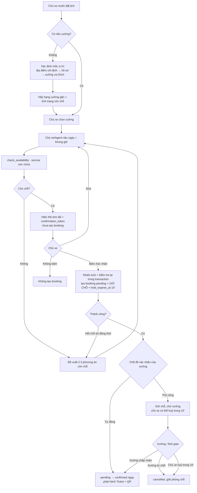
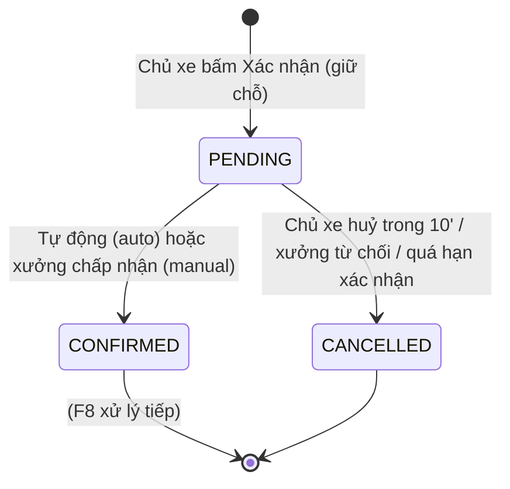

# Functional Specification — Đặt lịch bảo dưỡng theo sức chứa & vị trí

> **Cập nhật phạm vi (02/10/2026):** các phần dưới đây trong tài liệu này không còn áp dụng.
>
> - Báo giá / duyệt báo giá (`quote`, `quote_item`, us-049): **đã bỏ**. Đặt lịch không gắn báo giá; mọi con số chi phí là ước tính (F5), chi phí cuối cùng do xưởng xác nhận khi kiểm tra xe.

> Tài liệu đặc tả chức năng/nghiệp vụ cho Feature **F6 — Đặt lịch hội thoại theo sức chứa** trong [PRD EV Care MVP](../../../product/PRD_EV_Care_MVP.md#f6--đặt-lịch-theo-sức-chứa), tập trung vào **hỗ trợ chủ xe đặt lịch tự động/bán tự động** và **gợi ý xưởng gần một địa điểm chỉ định hoặc địa điểm trong hồ sơ cá nhân**.
>
> **Ghi chú:** Điểm nghiệp vụ PRD chưa chốt được đánh dấu `[Đề xuất]` (có giá trị mặc định để triển khai) hoặc `[Cần xác nhận]`, và được liệt kê lại ở mục 24 — Open Questions.
>
> **Quan hệ tài liệu:** Tầng hội thoại (Agent) đã đặc tả tại [AI-004 Booking Agent](../../ai-agent/ai-004-sprint-3-spec.agent.md). Tài liệu này là **nguồn nghiệp vụ chính (Functional Spec)** cho cả tầng hội thoại (AI-004) lẫn tầng UI trực tiếp; khi hai bên khác nhau, tài liệu này là chuẩn.

---

> ## ⚠️ ƯU TIÊN CAO NHẤT — Tìm xưởng gần (Q-401)
>
> Chức năng **tìm xưởng gần theo vị trí** ở MVP **làm đơn giản trước**: **chỉ so khớp chuỗi địa điểm** (tên/khu vực xưởng) rồi dùng chuỗi/khu vực đó để xếp các xưởng gần nhất — **chưa** tích hợp geocoding/bản đồ.
>
> **Bắt buộc tách thành một interface/tool riêng** (ví dụ `WorkshopLocationFinder` / tool `find_workshop`) với hợp đồng đầu vào–đầu ra rõ ràng, để khi cần nâng cấp (geocoding, tính khoảng cách thật theo toạ độ, định tuyến giao thông) chỉ **thay implementation** phía sau interface, **không** phải sửa luồng đặt lịch. Xem BR-003, BR-004 và [API Spec §3](../api/us-029-sprint-3-spec.api.md).
>
> 👉 Đây là điểm cần triển khai/nâng cấp về sau — để ở đầu tài liệu cho dễ theo dõi.

---

# 1. Document Information

| Field | Value |
|---|---|
| Feature ID | `FEAT-BOOK-001` |
| Feature Name | `Đặt lịch bảo dưỡng theo sức chứa & vị trí` |
| PRD Feature | `F6` (Must, S3); liên quan `F6b`, `F8` |
| Document Version | `v1.0` |
| Status | `Draft` |
| Product / Project | EV Care — AI Agent Chăm sóc sau bán & lịch bảo dưỡng xe điện |
| Business Owner | Lê Đức Tùng (PO) |
| Author | Team 4 Người |
| Reviewer | Tech Lead |
| Stakeholders | Product, Frontend, Backend, AI Team, Chủ xưởng, Hệ thống hãng xe |
| Created Date | `2026-09-29` |
| Updated Date | `2026-09-29` |
| Related PRD | [PRD_EV_Care_MVP.md §F6](../../../product/PRD_EV_Care_MVP.md) (v3.6) |
| Related Frontend Spec | [us-029-sprint-3-spec.fe.md](../frontend/us-029-sprint-3-spec.fe.md) |
| Related API Spec | [us-029-sprint-3-spec.api.md](../api/us-029-sprint-3-spec.api.md) |
| Related Entity Spec | [us-029-sprint-3-spec.entity.md](../entity/us-029-sprint-3-spec.entity.md) |
| Related Agent Spec | [ai-004-sprint-3-spec.agent.md](../../ai-agent/ai-004-sprint-3-spec.agent.md) |
| Related Design / Figma | `[Chưa có]` |
| Related GitHub Issue | `[Cần điền]` |

---

# 2. Feature Overview

## 2.1 Feature Description

Chủ xe đặt lịch bảo dưỡng cho xe của mình mà **không cần gọi điện hay thử nhiều xưởng**. Hệ thống hỗ trợ hai đường vào dùng **chung một service kiểm tra sức chứa và tạo lịch**:

1. **Qua chat (bán tự động, chủ đạo):** AI Agent (AI-004) trích xuất xưởng/ngày/giờ từ câu nói tiếng Việt, điền sẵn hạng mục theo mốc đến hạn (F3) và chi phí ước tính (F5), rồi hiện thẻ tóm tắt để chủ xe xác nhận.
2. **Qua UI trực tiếp:** chủ xe chọn xưởng, ngày, khung giờ trên màn đặt lịch.

Điểm nhấn của feature là **gợi ý xưởng theo vị trí**: khi chủ xe không chỉ định xưởng, hệ thống đề xuất các xưởng **gần một địa điểm** — hoặc **địa điểm chủ xe chỉ định trong lượt đặt** (ví dụ "gần Smart City", một địa chỉ, hoặc toạ độ hiện tại), **hoặc địa điểm chính trong hồ sơ cá nhân** (`user_location`) — kèm **xưởng ưa thích** (`vehicle_user.preferred_workshop_id`) làm mặc định. Với mỗi xưởng đề xuất, hệ thống cho biết còn chỗ trong khung mong muốn hay không.

**Bất biến cốt lõi (PRD §7 · AC-F6-01/02/03):**

- Không booking nào được tạo khi **chưa có xác nhận rõ** của chủ xe.
- Không khung giờ nào **vượt sức chứa** xưởng, kể cả khi nhiều người đặt đồng thời.
- Kiểm tra sức chứa và tạo booking là **một thao tác nguyên tử**.

## 2.2 Business Objective

Giải quyết **PP-02** (khó có lịch phù hợp) và **PP-06** (overbooking) — mục tiêu **G3**: đặt được lịch qua chat 24/7, không vượt sức chứa. Việc gợi ý xưởng gần vị trí giảm số lần chủ xe phải tự dò tìm và tự gọi từng xưởng.

## 2.3 User Objective

Chủ xe nói/chọn một vài thông tin là có được lịch bảo dưỡng ở một xưởng thuận tiện (gần nơi mình muốn), đúng khung giờ còn nhận xe, kèm mã lịch hẹn và mã QR check-in — không phải gọi điện trong giờ hành chính.

## 2.4 Business Value

- Chủ xe: đặt lịch bất kỳ lúc nào, thấy ngay xưởng gần và khung giờ còn trống.
- Xưởng: không nhận quá số kỹ thuật viên khả dụng; giảm gọi điện xác nhận lịch (PP-05).
- Hệ thống: một service sức chứa dùng chung cho Agent và UI ⇒ hành vi nhất quán, dễ kiểm thử tải (AC-F6-01).

---

# 3. Scope

## 3.1 In Scope

- Gợi ý xưởng theo vị trí: (a) địa điểm chỉ định trong lượt đặt (toạ độ / địa chỉ / tên khu vực), (b) địa điểm chính trong hồ sơ (`user_location`), (c) xưởng ưa thích.
- Xếp hạng xưởng theo khoảng cách (khi có toạ độ) hoặc theo khu vực (`region`/`province`) khi không có toạ độ, kèm tình trạng còn chỗ.
- Kiểm tra sức chứa một khung giờ theo quy tắc F6 (đếm theo đầu thợ/khung, PQ-03).
- Giữ chỗ tạm thời (hold) với thời hạn (PQ-02) và xác nhận để tạo booking.
- Đề xuất 2–3 phương án thay thế khi khung mong muốn hết chỗ.
- Booking Ticket + QR sau khi xác nhận (tóm tắt F6b; chi tiết ticket ở F6b).
- Dùng chung service cho cả tool của Agent (AI-004) và API trên UI.

## 3.2 Out of Scope

- **Tầng hội thoại chi tiết** (trích xuất NLU, prompt, tool-calling) — [AI-004](../../ai-agent/ai-004-sprint-3-spec.agent.md).
- **Huỷ / đổi lịch và nội dung Booking Ticket** — F6b ([us-053 FF](us-053-sprint-3-spec.ff.md)); ở đây chỉ nêu điểm giao.
- **Chuyển trạng thái sau `confirmed`** (check-in → in_progress → completed) và **khoá chỗ thủ công trên Board** — F8 ([us-037 FF](us-037-sprint-3-spec.ff.md)); feature này chỉ **đọc** số chỗ đã khoá để tính sức chứa.
- Nhiều xe / đặt hộ người khác; nhiều khung/ngày, giờ nghỉ trưa, lịch nghỉ lễ.
- Đặt lịch theo **thời lượng từng hạng mục** (phase sau); MVP mỗi booking chiếm 1 thợ trong 1 khung.
- Thanh toán / đặt cọc.
- Geocoding / bản đồ realtime, định tuyến giao thông; nhà cung cấp bản đồ `[Cần xác nhận]`.
- Bắt buộc có báo giá — đặt lịch **không** yêu cầu quote (AF-004).

---

# 4. Actors & Stakeholders

## 4.1 Actors

| Actor | Type | Responsibility |
|---|---|---|
| Chủ xe | User | Cung cấp vị trí/xưởng/ngày/giờ; chọn phương án; bấm Xác nhận |
| AI Agent (AI-004) | System | Trích xuất yêu cầu, điền mặc định, gọi service sức chứa, hiện thẻ xác nhận |
| Chủ xưởng | User | **Xác nhận / từ chối** yêu cầu giữ chỗ (chế độ thủ công), hoặc bật **tự động xác nhận** cho xưởng; khoá bớt chỗ trong khung giờ (F8) |
| Booking & Capacity Service | System | Nguồn duy nhất kiểm tra sức chứa, giữ chỗ, tạo booking (dùng chung Agent + UI) |
| Hệ thống hãng xe | System / Partner | Nguồn thông tin xưởng (`ServiceCenter`) đã đồng bộ vào `workshop` |

## 4.2 Stakeholders

| Stakeholder | Organization / Team | Interest / Responsibility |
|---|---|---|
| Product Owner | Product | Chốt PQ-02 (thời gian giữ chỗ), PQ-03 (độ dài khung), quy tắc gợi ý vị trí |
| Backend Team | Engineering | Service sức chứa nguyên tử, Redis lock, ràng buộc DB, truy vấn xưởng gần |
| Frontend Team | Engineering | Màn tìm xưởng gần, chọn khung giờ, thẻ xác nhận |
| AI Team | Engineering | Tool `find_workshop`, `check_availability`, `create_booking` (AI-004) |
| Chủ xưởng | Partner | Cấu hình `total_technicians`, `emergency_slots_reserved`, giờ hoạt động, khoá chỗ |

---

# 5. User Story

## US-029

**As a** chủ xe đã hoàn tất onboarding

**I want to** được gợi ý các xưởng gần một địa điểm tôi chỉ định hoặc gần địa chỉ trong hồ sơ của tôi, kèm khung giờ còn trống

**So that** tôi chọn được xưởng thuận tiện mà không phải tự dò và gọi từng nơi.

### Additional User Stories

- `US-030`: As a chủ xe, I want to đặt lịch bảo dưỡng qua chat chỉ bằng vài câu (xưởng/ngày/giờ), so that tôi không phải gọi điện trong giờ hành chính.
- `US-031`: As a chủ xe, I want to khi khung giờ mong muốn hết chỗ thì được đề xuất 2–3 phương án còn trống, so that tôi vẫn đặt được lịch nhanh.
- `US-032`: As a hệ thống EV Care, I want to kiểm tra sức chứa và tạo booking trong một thao tác nguyên tử dùng chung cho Agent và UI, so that không bao giờ có lịch vượt sức chứa kể cả khi đặt đồng thời.

---

# 6. Use Case

## UC-401 — Gợi ý xưởng gần theo vị trí

### 6.1 Use Case Description

Chủ xe muốn đặt lịch nhưng chưa chỉ định xưởng. Hệ thống xác định **mốc gốc vị trí** (địa điểm chỉ định trong lượt / địa điểm hồ sơ / xưởng ưa thích) và trả về danh sách xưởng `active` gần nhất, kèm cho biết khung giờ mong muốn (nếu có) còn chỗ hay không.

### 6.2 Primary Actor

Chủ xe (qua chat hoặc UI)

### 6.3 Supporting Actors / Systems

Booking & Capacity Service; `workshop`, `workshop_operating_hour`, `user_location`.

### 6.4 Trigger

Chủ xe yêu cầu đặt lịch mà không nêu xưởng, hoặc bấm "Tìm xưởng gần".

### 6.5 Preconditions

- Tài khoản `ACTIVE`; xe `verified` + `link_status = active`.
- Có ít nhất một xưởng `status = active`.

### 6.6 Postconditions

Chủ xe thấy danh sách xưởng gợi ý theo khoảng cách/khu vực và tình trạng còn chỗ. **Không** dữ liệu nào bị thay đổi (thao tác chỉ đọc).

## UC-402 — Đặt lịch theo sức chứa và xác nhận

### 6.1 Use Case Description

Với xưởng + ngày + khung giờ đã xác định, hệ thống kiểm tra sức chứa, giữ chỗ tạm thời, hiện thẻ tóm tắt; khi chủ xe xác nhận thì tạo booking `confirmed`.

### 6.2 Primary Actor

Chủ xe

### 6.3 Supporting Actors / Systems

Booking & Capacity Service; Redis (khoá giữ chỗ); AI-004 (khi qua chat).

### 6.4 Trigger

Chủ xe chọn một khung giờ cụ thể (hoặc chọn một phương án đề xuất).

### 6.5 Preconditions

- UC-401 hoặc chủ xe đã chỉ định xưởng.
- Khung giờ nằm trong giờ hoạt động của xưởng (ENT-009).

### 6.6 Postconditions

- Booking chuyển `confirmed`; slot được tính vào sức chứa.
- Hoặc không có booking nào nếu chủ xe không xác nhận / hết hạn giữ chỗ.

---

# 7. User Flow

## 7.1 Main User Flow



## 7.2 Flow Description

| Step | Actor | Action / Event | System Response | Result |
|---|---|---|---|---|
| 1 | Chủ xe | Muốn đặt lịch, chưa nêu xưởng | Xác định mốc vị trí (BR-002) | Có toạ độ/khu vực gốc |
| 2 | System | Xếp hạng xưởng gần | Trả danh sách xưởng `active` + còn chỗ (BR-003, BR-004) | Danh sách gợi ý |
| 3 | Chủ xe | Chọn xưởng + ngày + khung | Kiểm tra giờ hoạt động (BR-006) | Slot hợp lệ |
| 4 | System | Kiểm tra sức chứa | Đếm booking + chỗ khoá vs công suất (BR-005) | Còn / hết chỗ |
| 5a | System | Còn chỗ | Hiện thẻ tóm tắt + token, chưa tạo booking (BR-007) | Chờ chủ xe bấm |
| 5b | System | Hết chỗ | Đề xuất 2–3 phương án (BR-008) | Chủ xe chọn lại |
| 6 | Chủ xe | Bấm Xác nhận | Lock + kiểm tra lại + tạo booking `pending` = **giữ chỗ** (BR-001, BR-009) | Đã giữ chỗ |
| 7a | System / Xưởng | Xưởng bật tự động xác nhận | `pending → confirmed` ngay (BR-014) | `confirmed` + ticket |
| 7b | Chủ xưởng | Xưởng thủ công chấp nhận (F8) | `pending → confirmed` (BR-014) | `confirmed` + ticket |
| 8 | Chủ xe | Huỷ giữ chỗ trong 10' | `pending → cancelled`, giải phóng chỗ (BR-010) | Slot được trả lại |
| 9 | System | Xưởng không xác nhận trước hạn chót | `pending → cancelled` (BR-015) | Slot được trả lại |

---

# 8. Screen / UI Flow

> UI minh hoạ **nghiệp vụ**. Chi tiết component, loading/empty/error state thuộc Frontend Spec.

## 8.1 Screen Flow

```text
[SCR-401 Bắt đầu đặt lịch]
    |
    +----> [SCR-402 Gợi ý xưởng gần]  (khi chưa chọn xưởng)
    |            |
    |            v
    +----> [SCR-403 Chọn ngày + khung giờ]
                 |
                 +----> [SCR-404 Thẻ tóm tắt + Xác nhận]
                 |            |
                 |            +----> [SCR-405 Booking Ticket + QR]
                 |
                 +----> [Phương án thay thế] (khi hết chỗ)
```

## 8.2 Screen List

| Screen ID | Screen Name | Purpose | Entry From | Exit To |
|---|---|---|---|---|
| `SCR-401` | Bắt đầu đặt lịch | Chọn cách đặt: chat / chọn xưởng | Home / CTA trạng thái | SCR-402, SCR-403 |
| `SCR-402` | Gợi ý xưởng gần | Danh sách xưởng gần + còn chỗ | SCR-401 | SCR-403 |
| `SCR-403` | Chọn ngày + khung giờ | Chọn khung còn trống trong giờ hoạt động | SCR-402 / SCR-401 | SCR-404 |
| `SCR-404` | Thẻ tóm tắt | Xem lại + Xác nhận trong thời hạn giữ chỗ | SCR-403 | SCR-405 / SCR-403 |
| `SCR-405` | Booking Ticket | Mã booking, QR, giấy tờ cần mang (F6b) | SCR-404 | Home |

## 8.3 Screen / UI Reference

### SCR-402 — Gợi ý xưởng gần

**Purpose** — Giúp chủ xe chọn xưởng thuận tiện theo vị trí.

**Main UI**

- Ô nhập/hiển thị mốc vị trí: "Gần **[địa điểm chỉ định]**" hoặc "Gần **[địa chỉ hồ sơ]**"; nút đổi vị trí.
- Danh sách xưởng: tên, địa chỉ, khoảng cách (khi có toạ độ) hoặc khu vực, nhãn "Xưởng ưa thích" nếu có.
- Với mỗi xưởng: tình trạng "Còn chỗ hôm nay/khung mong muốn" hoặc "Hết chỗ khung này".

**Business Meaning** — Thứ hạng xưởng thể hiện mức thuận tiện theo vị trí; nhãn còn chỗ phản ánh kết quả **service sức chứa** (không phải suy đoán).

**User Action** — Chọn một xưởng; đổi mốc vị trí; mở chi tiết xưởng.

**System Behavior** — Chỉ hiển thị xưởng `status = active`; xếp hạng theo BR-003/BR-004; tình trạng còn chỗ đọc từ service.

### SCR-404 — Thẻ tóm tắt

**Main UI** — Xưởng + địa chỉ, thời gian (thứ, dd/mm/yyyy, HH:mm), xe (biển số che một phần), hạng mục của mốc, chi phí ước tính (nhãn "ước tính"), báo giá (mã/Không), nút **Xác nhận / Sửa / Huỷ**. Sau khi Xác nhận: hiển thị trạng thái "Đã giữ chỗ — chờ xưởng xác nhận" (xưởng `manual`) kèm đồng hồ 10' để huỷ, hoặc "Đã đặt lịch" + ticket/QR (xưởng `auto`).

**System Behavior** — Thẻ chưa tạo booking; bấm **Xác nhận** mới giữ chỗ (BR-007). Token thẻ hết hạn ⇒ vô hiệu hoá nút Xác nhận, mời kiểm tra lại (EF-001). Sau khi giữ chỗ: hiển thị theo `booking_confirmation_mode` (BR-014); trong 10' còn nút Huỷ giữ chỗ (BR-010).

---

# 9. Main Flow

## 9.1 Happy Path

1. Chủ xe (VF6, mốc 12.000 km) mở đặt lịch, nói "Tìm xưởng gần nhà tôi sáng thứ 7".
2. Không có địa điểm chỉ định trong câu ⇒ dùng địa điểm chính trong hồ sơ (`user_location`, Hà Nội, có toạ độ).
3. Hệ thống trả 3 xưởng `active` gần nhất theo khoảng cách, kèm còn chỗ sáng thứ 7.
4. Chủ xe chọn "VinFast Smart City", khung 09:00 Thứ 7 04/10.
5. `check_availability` → còn chỗ; hệ thống hiện thẻ tóm tắt + `confirmation_token` (chưa tạo booking).
6. Chủ xe bấm **Xác nhận** → service lấy Redis lock, kiểm tra lại sức chứa trong transaction, tạo booking `pending` = **giữ chỗ** (`hold_expires_at` = +10 phút). Chủ xe thấy "Đã giữ chỗ".
7. Xưởng Smart City bật **tự động xác nhận** ⇒ hệ thống chuyển `pending → confirmed` ngay, sinh `booking_code` + QR (BR-014). (Nếu xưởng để **thủ công**: chủ xưởng bấm chấp nhận trên Board (F8) rồi mới `confirmed`.)
8. Chủ xe thấy Booking Ticket (AC-001, AC-005, AC-010).

---

# 10. Alternative Flow

## AF-001 — Chủ xe chỉ định một địa điểm khác hồ sơ

**Condition** — Chủ xe nêu địa điểm cụ thể ("gần Smart City", một địa chỉ, hoặc chia sẻ toạ độ hiện tại).

**Flow**

1. Hệ thống dùng **địa điểm chỉ định** làm mốc vị trí thay cho hồ sơ (BR-002 ưu tiên 1).
2. Xếp hạng xưởng gần địa điểm đó; phần còn lại như luồng chính.

**Expected Result** — Danh sách xưởng tính theo địa điểm chủ xe vừa nêu, không theo hồ sơ (AC-002).

## AF-002 — Không có toạ độ (chỉ có khu vực)

**Condition** — Mốc vị trí không có toạ độ (địa chỉ hồ sơ chỉ có `province`, hoặc địa điểm chỉ định là tên khu vực).

**Flow** — Xếp hạng theo **khu vực** (`workshop.region` khớp `province`), rồi theo xưởng ưa thích; không tính khoảng cách chính xác (BR-004).

**Expected Result** — Vẫn có danh sách xưởng cùng khu vực; ghi rõ "sắp xếp theo khu vực".

## AF-003 — Chủ xe đã chỉ định xưởng

**Condition** — Chủ xe nêu thẳng tên xưởng hoặc chọn xưởng ưa thích.

**Flow** — Bỏ qua bước gợi ý theo vị trí; vào thẳng UC-402.

## AF-004 — Đặt lịch không kèm báo giá

**Condition** — Chủ xe không có `quote` `approved` còn hạn.

**Flow** — Vẫn đặt lịch; `estimated_cost` lấy từ mốc (F5) hoặc để trống; thẻ ghi "Báo giá: Không".

**Expected Result** — Booking được tạo bình thường (PRD F5b · AF-001 gốc).

## AF-005 — Hết chỗ khung mong muốn

**Condition** — `check_availability` trả `available = false`.

**Flow** — Đề xuất 2–3 phương án theo thứ tự: khung gần nhất **cùng xưởng cùng ngày** → **cùng xưởng ngày kế** → **xưởng khác cùng khu vực cùng khung** (BR-008). Chủ xe chọn ⇒ quay lại kiểm tra.

**Expected Result** — Chủ xe đặt được một khung còn trống (AC-004).

---

# 11. Exception Flow

## EF-001 — Token của thẻ tóm tắt hết hạn trước khi bấm Xác nhận

**Condition** — Chủ xe để thẻ tóm tắt quá lâu; `confirmation_token` hết hạn khi mới bấm Xác nhận (chưa có booking nào được tạo vì giữ chỗ chỉ xảy ra ở bước Xác nhận — BR-007).

**System Behavior** — Từ chối tạo giữ chỗ với token cũ; kiểm tra lại sức chứa; còn chỗ ⇒ cấp thẻ + token mới, hết chỗ ⇒ đề xuất phương án (BR-008).

**User Experience** — "Thẻ đặt lịch đã hết hiệu lực, mình kiểm tra lại giúp bạn nhé"; chủ xe xác nhận lại.

**Recovery** — Cấp thẻ + token mới.

## EF-006 — Xưởng không xác nhận (chế độ thủ công)

**Condition** — Chế độ `manual`; chủ xưởng không chấp nhận/từ chối booking `pending` trước hạn chót (BR-015).

**System Behavior** — Hệ thống tự huỷ `pending → cancelled`, giải phóng chỗ.

**User Experience** — Chủ xe được báo "Xưởng chưa xác nhận kịp, mời bạn chọn lại"; gợi ý xưởng/khung khác (ưu tiên xưởng bật tự động xác nhận).

**Recovery** — Đặt lại; cân nhắc gợi ý xưởng `auto`.

## EF-002 — Xung đột khi nhiều người đặt đồng thời

**Condition** — Nhiều xác nhận vào cùng khung còn 1 chỗ.

**System Behavior** — Redis lock + kiểm tra lại trong transaction + ràng buộc DB đảm bảo **đúng 1** thành công; các yêu cầu còn lại nhận `SLOT_FULL` (BR-001, BR-009).

**User Experience** — Người thua nhận thông báo hết chỗ + phương án thay thế (AC-003 = AC-F6-01).

## EF-003 — Khung giờ ngoài giờ hoạt động

**Condition** — Ngày/khung nằm ngoài `workshop_operating_hour` hoặc ngày quá khứ.

**System Behavior** — Từ chối kiểm tra; nêu giờ hoạt động và đề xuất khung hợp lệ (BR-006).

**User Experience** — Thấy giờ hoạt động của xưởng, chọn lại.

## EF-004 — Không có xưởng khả dụng gần vị trí

**Condition** — Không có xưởng `active` trong khu vực / bán kính cân nhắc, hoặc không xưởng nào còn chỗ trong `BOOKING_SEARCH_HORIZON_DAYS` (mặc định 7).

**System Behavior** — Không dựng thẻ; nêu rõ chưa có xưởng khả dụng, gợi ý mở rộng khu vực hoặc liên hệ xưởng (theo AI-004 §9.5).

**User Experience** — Thông báo rõ ràng, không trả danh sách rỗng im lặng.

## EF-005 — Service sức chứa / Redis tạm thời lỗi

**Condition** — Lock service hoặc DB timeout khi tạo booking.

**System Behavior** — Không khẳng định đã đặt; trả lỗi tạm thời; nếu đã lỡ tạo `pending`, job giữ chỗ sẽ thu hồi khi hết hạn. Idempotency theo `confirmation_token` để retry không tạo trùng.

**User Experience** — "Tạm thời chưa đặt được, bạn thử lại giúp mình"; kiểm tra "Lịch của tôi" để xác nhận trạng thái thật.

---

# 12. Business Rules

> Business Rule áp dụng cho **mọi** đường vào (Agent AI-004 và UI). Các rule ở tầng entity được tham chiếu bằng `BR-ENT-xxx`.

## BR-001 — Kiểm tra sức chứa và tạo booking là nguyên tử

**Rule** — Việc xác định "còn chỗ" và việc ghi booking `confirmed` phải nằm trong **một thao tác nguyên tử**: Redis lock theo khoá `(workshop_id, booking_date, time_slot)` + kiểm tra lại sức chứa **trong** transaction DB + ràng buộc DB chống vượt sức chứa.

**Condition** — Mọi lần tạo booking.

**Expected Behavior** — Nhiều yêu cầu đồng thời vào khung còn `n` chỗ ⇒ tối đa `n` thành công; phần còn lại nhận `SLOT_FULL` (AC-F6-01).

**Priority** — High

## BR-002 — Thứ tự ưu tiên mốc vị trí

**Rule** — Mốc vị trí để gợi ý xưởng được chọn theo thứ tự:

1. **Địa điểm chỉ định trong lượt đặt** (toạ độ chia sẻ / địa chỉ / tên khu vực chủ xe nêu).
2. **Địa điểm chính trong hồ sơ** — `user_location` với `is_primary = true` (toạ độ nếu có, nếu không thì `province`).
3. **Xưởng ưa thích** — `vehicle_user.preferred_workshop_id` (dùng chính vị trí xưởng đó làm mốc và luôn được ghim lên đầu danh sách nếu `active`).

**Condition** — Chủ xe chưa chỉ định thẳng một xưởng.

**Expected Behavior** — Chỉ dùng nguồn có sẵn theo thứ tự trên; không có nguồn nào ⇒ EF-004.

**Priority** — High

## BR-003 — Xếp hạng theo khoảng cách khi có toạ độ

**Rule** — Khi mốc vị trí có toạ độ và xưởng có (`latitude`, `longitude`), xếp hạng tăng dần theo **khoảng cách đường chim bay** (haversine). Xưởng ưa thích được ghim đầu danh sách kèm nhãn, các xưởng còn lại theo khoảng cách.

**Condition** — Có toạ độ ở cả hai phía.

**Expected Behavior** — Danh sách trả về ≤ `BOOKING_NEARBY_LIMIT` (mặc định 5) xưởng `active`, kèm khoảng cách (km).

**Priority** — High

## BR-004 — Xếp hạng theo khu vực khi thiếu toạ độ

**Rule** — Khi thiếu toạ độ, lọc xưởng theo `workshop.region` khớp `province` của mốc vị trí, rồi ưu tiên xưởng ưa thích; khoảng cách để trống, ghi rõ "sắp xếp theo khu vực".

**Condition** — Không đủ toạ độ (AF-002).

**Expected Behavior** — Vẫn trả danh sách hữu ích theo khu vực; không bịa khoảng cách.

**Priority** — Medium

## BR-005 — Công thức sức chứa một khung giờ

**Rule** — Với một xưởng `w`, ngày `d`, khung `t` (dài `SLOT_MINUTES`, mặc định 60 — PQ-03):

```text
occupied      = số booking của (w, d, t) có status ∈ {pending, confirmed, checked_in, in_progress}
blocked       = tổng blocked_count trong workshop_slot_block của (w, d, t)   (do chủ xưởng khoá — F8)
capacity      = w.total_technicians − w.emergency_slots_reserved − blocked
available     = (capacity − occupied) > 0
remaining     = max(capacity − occupied, 0)
```

Mỗi booking chiếm **1 thợ** trong 1 khung (PQ-03). Tính theo thời lượng từng hạng mục là phase sau.

**Condition** — Mọi lần kiểm tra chỗ hoặc tạo booking.

**Expected Behavior** — `available = false` khi `remaining ≤ 0`; ràng buộc DB đảm bảo `occupied ≤ capacity`.

**Priority** — High

## BR-006 — Chỉ nhận khung trong giờ hoạt động

**Rule** — Khung giờ hợp lệ khi ngày ≥ hôm nay (Asia/Ho_Chi_Minh), ngày đó xưởng không `is_closed`, và `open_time ≤ time_slot < close_time` (ENT-009). Mỗi xưởng 1 khung hoạt động/ngày (FEAT-AUTH-003).

**Priority** — High

## BR-007 — Giữ chỗ khi chủ xe bấm Xác nhận (AI-Q-401, AI-Q-402)

**Rule** — Khi hiển thị thẻ tóm tắt, hệ thống **chưa** tạo booking, chỉ cấp `confirmation_token` gắn đúng slot. Chủ xe bấm **Xác nhận** ⇒ hệ thống tạo booking `pending` = **giữ chỗ** với `hold_expires_at = now() + HOLD_MINUTES` (mặc định 10 — PQ-02); đây là bước "chủ xe muốn giữ chỗ và hệ thống xác nhận đã giữ chỗ". Giữ chỗ **chưa** phải là lịch hẹn chính thức — việc tạo lịch hẹn theo BR-014.

**Condition** — `available = true` và chủ xe bấm Xác nhận.

**Expected Behavior** — Chỗ đang giữ (`pending`) được tính vào `occupied` (BR-005) nên người khác không giữ trùng; xưởng thấy yêu cầu giữ chỗ trên Board (F8).

**Priority** — High

## BR-014 — Xác nhận tạo lịch hẹn: tự động hoặc thủ công theo xưởng (AI-Q-401)

**Rule** — Mỗi xưởng có chế độ xác nhận đặt lịch `workshop.booking_confirmation_mode ∈ {auto, manual}` (mặc định `auto` `[Đề xuất]`):

- `auto` — sau khi giữ chỗ (BR-007), hệ thống chuyển `pending → confirmed` **ngay** và phát hành `booking_code` + QR.
- `manual` — booking giữ ở `pending` (đang giữ chỗ, chờ xưởng). **Chủ xưởng** chấp nhận trên Workshop Board (F8) ⇒ `pending → confirmed`; hoặc **từ chối** ⇒ `cancelled`, giải phóng chỗ.

**Condition** — Ngay sau khi giữ chỗ thành công.

**Expected Behavior** — Chỉ khi `confirmed` mới có lịch hẹn chính thức + ticket/QR. Chuyển trạng thái của xưởng (chấp nhận/từ chối) thuộc **F8**; feature này chỉ định nghĩa nghiệp vụ và **đọc** kết quả.

**Priority** — High

## BR-015 — Hạn chót xưởng xác nhận (chế độ thủ công)

**Rule** — Ở chế độ `manual`, nếu xưởng **không** chấp nhận/từ chối trước hạn chót `BOOKING_WS_CONFIRM_DEADLINE` (`[Đề xuất]` mặc định: trước giờ hẹn, hoặc cấu hình theo giờ), hệ thống tự huỷ booking `pending` để giải phóng chỗ và báo chủ xe chọn lại.

**Condition** — Booking `pending` (đã qua cửa sổ huỷ 10' của chủ xe) chưa được xưởng xử lý.

**Expected Behavior** — `pending → cancelled`; chỗ được trả lại.

**Priority** — Medium

## BR-008 — Đề xuất phương án khi hết chỗ

**Rule** — `available = false` ⇒ đề xuất 2–3 phương án còn chỗ theo thứ tự: cùng xưởng khung gần nhất trong ngày → cùng xưởng ngày kế tiếp còn chỗ → xưởng khác cùng khu vực cùng khung.

**Priority** — Medium

## BR-009 — Chỉ giữ chỗ khi có xác nhận rõ của chủ xe

**Rule** — Chỉ tạo booking (giữ chỗ, BR-007) khi có xác nhận rõ của chủ xe: sự kiện UI bấm "Xác nhận" hoặc `INT-403` kèm `confirmation_token` hợp lệ (chưa dùng, chưa hết hạn, đúng slot). Câu mơ hồ ("ok", "được") **không** tính là xác nhận (AI-004 §7.2). Không có bước xác nhận này thì **không** chiếm chỗ.

**Condition** — Trước mọi side effect tạo/giữ booking.

**Expected Behavior** — Thiếu token hợp lệ ⇒ backend từ chối; không booking nào được tạo (AC-F6-02).

**Priority** — High

## BR-010 — Cửa sổ huỷ giữ chỗ 10 phút của chủ xe (AI-Q-402)

**Rule** — Trong `HOLD_MINUTES` (mặc định 10 — PQ-02) kể từ khi giữ chỗ, chủ xe **được huỷ giữ chỗ tạm** (`pending → cancelled`, giải phóng chỗ ngay). Sau khi `hold_expires_at` trôi qua, chủ xe **không** tự thay đổi/huỷ được qua luồng giữ chỗ tạm nữa (muốn huỷ lịch đã `confirmed` phải theo F6b). Booking `pending` chưa được xưởng xử lý sẽ chờ theo BR-015.

**Lưu ý** — Khác với đề xuất ban đầu, `hold_expires_at` **không** tự huỷ booking khi hết hạn nếu đang **chờ xưởng xác nhận** (chế độ `manual`); nó là **hạn để chủ xe được huỷ**. Việc auto-huỷ khi xưởng không phản hồi do BR-015 xử lý. Điểm này cần cập nhật tương ứng cho [booking entity BR-ENT-402](../../entity/maintenance/booking.entity.md) — xem [Entity Spec](../entity/us-029-sprint-3-spec.entity.md).

**Priority** — High

## BR-011 — Một service sức chứa dùng chung

**Rule** — Tool đặt lịch của Agent (AI-004) và API đặt lịch trên UI gọi **cùng một** service kiểm tra chỗ trống + tạo booking. Không nơi nào tự suy ra slot trống ngoài service này (PRD F6).

**Priority** — High

## BR-012 — Đặt lịch cho đúng xe của chủ xe

**Rule** — Chỉ đặt lịch cho `user_vehicle` `verified` + `link_status = active` thuộc chính chủ xe đang đăng nhập (`booking.user_id = user_vehicle.user_id`). Không đặt hộ, không đặt cho xe người khác.

**Priority** — High

## BR-013 — Số booking đang mở của một xe

**Rule** — MVP mỗi xe có tối đa **1 booking đang mở** (`pending`/`confirmed`/`checked_in`/`in_progress`) `[Đề xuất — AI-Q-403]`. Yêu cầu đặt thêm khi đang có booking mở ⇒ hỏi đổi lịch (F6b) thay vì tạo mới.

**Priority** — Medium

---

# 13. State / Status

## 13.1 State List

Vòng đời booking theo `booking.status` (ENT-402 §8). Feature này phụ trách nhánh `pending → confirmed` và `pending → cancelled`; các trạng thái sau `confirmed` thuộc F8.

| State | Meaning | Entry Condition | Exit Condition |
|---|---|---|---|
| `PENDING` | **Giữ chỗ** — chủ xe đã bấm Xác nhận, chưa thành lịch chính thức. Chế độ `manual`: đang chờ xưởng xác nhận | Chủ xe bấm Xác nhận + còn chỗ (BR-007, BR-009) | `CONFIRMED` (tự động hoặc xưởng chấp nhận — BR-014) hoặc `CANCELLED` (chủ xe huỷ trong 10' / xưởng từ chối / quá hạn BR-015) |
| `CONFIRMED` | Đã có lịch hẹn chính thức (ticket + QR) | Xưởng bật tự động, hoặc chủ xưởng chấp nhận (BR-014) | (F8) check-in / huỷ |
| `CANCELLED` | Đã huỷ giữ chỗ / bị từ chối / quá hạn xưởng | Chủ xe huỷ trong 10' (BR-010), xưởng từ chối, hoặc quá hạn (BR-015) | Kết thúc |

## 13.2 State Transition



> Ánh xạ trạng thái DB: cả hai pha "giữ chỗ chờ chủ xe huỷ" và "chờ xưởng xác nhận" đều là `booking.status = pending` (phân biệt bằng `hold_expires_at` còn hiệu lực hay không). Xem [Entity Spec §4.1](../entity/us-029-sprint-3-spec.entity.md).

---

# 14. Data Requirements

## 14.1 Required Data

| Data | Type | Required | Description | Source |
|---|---|---:|---|---|
| Xe của chủ xe | id | Yes | `user_vehicle_id` để đặt lịch | `user_vehicle` (ENT-003) |
| Mốc + hạng mục đến hạn | list | Yes | Hạng mục của booking | F3 (`maintenance_rule`) |
| Địa điểm chỉ định | text / toạ độ | No | Mốc vị trí ưu tiên 1 (BR-002) | Chủ xe nhập trong lượt |
| Địa điểm hồ sơ | address + toạ độ | No | Mốc vị trí ưu tiên 2 | `user_location` (ENT-002, `is_primary`) |
| Xưởng ưa thích | id | No | Mặc định / ghim đầu | `vehicle_user.preferred_workshop_id` |
| Danh sách xưởng | list | Yes | Tên, địa chỉ, toạ độ, khu vực, công suất | `workshop` (ENT-008) |
| Chế độ xác nhận của xưởng | enum | Yes | `auto` / `manual` (BR-014) | `workshop.booking_confirmation_mode` (**mới**, ENT-008 mở rộng) |
| Giờ hoạt động | list | Yes | Theo ngày trong tuần | `workshop_operating_hour` (ENT-009) |
| Chỗ đã khoá | int / khung | No | Chủ xưởng khoá tay (F8) | `workshop_slot_block` (ENT-418, **mới**) |
| Booking hiện có của khung | count | Yes | Tính `occupied` (BR-005) | `booking` (ENT-402) |
| Báo giá đã duyệt | id | No | Gắn vào booking nếu còn hạn | `quote` (ENT-410) |
| Chi phí ước tính | number | No | Hiển thị trên thẻ | F5 |

## 14.2 Data Dependency

| Data / Entity | Why Needed | Read / Write | Owner |
|---|---|---|---|
| `booking` (ENT-402) | Tạo/đọc lịch hẹn, tính `occupied` | Read / Write | Backend |
| `workshop` (ENT-008) | Xưởng, toạ độ, khu vực, công suất | Read | Backend |
| `workshop_operating_hour` (ENT-009) | Kiểm tra khung giờ hợp lệ | Read | Backend |
| `workshop_slot_block` (ENT-418, **mới**) | Chỗ khoá thủ công (F8) → trừ vào công suất | Read (F6) / Write (F8) | Backend |
| `user_location` (ENT-002) | Địa điểm hồ sơ để gợi ý xưởng gần | Read | Backend |
| `vehicle_user` (ENT-001) | Xưởng ưa thích, chủ sở hữu | Read | Backend |
| `user_vehicle` (ENT-003) | Xe hợp lệ để đặt | Read | Backend |
| `quote` (ENT-410) | Gắn báo giá đã duyệt còn hạn | Read | Backend |
| Redis | Khoá giữ chỗ nguyên tử (BR-001) | Read / Write | Backend |

---

# 15. Business Error & Edge Cases

> HTTP status và error code định nghĩa trong API Spec.

| Case ID | Scenario | Expected Business Behavior | User Outcome |
|---|---|---|---|
| `EDGE-401` | Chủ xe nêu địa điểm chỉ định | Dùng địa điểm đó làm mốc, bỏ qua hồ sơ (BR-002 #1) | Xưởng gần địa điểm đã nêu |
| `EDGE-402` | Chỉ có `province`, không toạ độ | Xếp theo khu vực (BR-004) | Danh sách theo khu vực |
| `EDGE-403` | Hồ sơ chưa có địa điểm, không địa điểm chỉ định, không xưởng ưa thích | EF-004: mời nhập vị trí hoặc chọn xưởng | Được hỏi vị trí/xưởng |
| `EDGE-404` | Khung mong muốn hết chỗ | Đề xuất 2–3 phương án còn chỗ (BR-008) | Chọn phương án |
| `EDGE-405` | 20 yêu cầu đồng thời, khung còn 1 chỗ | Đúng 1 thành công, 19 nhận `SLOT_FULL` + phương án (BR-001) | Không overbook |
| `EDGE-406` | Bấm Xác nhận sau khi token thẻ hết hạn | Token hết hạn, kiểm tra lại, cấp thẻ mới (EF-001) | Xác nhận lại |
| `EDGE-413` | Xưởng bật tự động xác nhận | Giữ chỗ xong `confirmed` ngay (BR-014) | Nhận ticket/QR ngay |
| `EDGE-414` | Xưởng thủ công không xác nhận trước hạn | Tự huỷ `pending`, giải phóng chỗ (BR-015, EF-006) | Được mời chọn lại |
| `EDGE-407` | Khung ngoài giờ hoạt động / ngày quá khứ | Từ chối, nêu giờ hoạt động (BR-006) | Chọn khung hợp lệ |
| `EDGE-408` | Chủ xưởng vừa khoá chỗ khung đó | Trừ ngay `blocked` vào công suất (BR-005) | Có thể thấy hết chỗ |
| `EDGE-409` | Báo giá gắn vào đã quá `expires_at` | Từ chối gán (BR-ENT-426); đặt không kèm báo giá hoặc lập mới | Vẫn đặt được |
| `EDGE-410` | Xe không thuộc chủ xe / chưa xác thực | Từ chối như thể xe không tồn tại (BR-012) | Không đặt được |
| `EDGE-411` | Đang có booking mở của xe | Hỏi đổi lịch thay vì tạo mới (BR-013) | Được hướng dẫn |
| `EDGE-412` | Xưởng không có toạ độ nhưng có `region` | Vẫn xếp theo khu vực; không tính khoảng cách | Vẫn xuất hiện trong danh sách |

---

# 16. Permissions & Access

## 16.1 Access Matrix

| Role / Actor | View | Create | Update | Delete | Notes |
|---|---:|---:|---:|---:|---|
| Chủ xe | ✅ (của mình) | ✅ | ✅ (huỷ — F6b) | ❌ | Chỉ xe & booking của mình |
| Chủ xưởng | ✅ (xưởng mình) | ❌ | ✅ (khoá chỗ — F8) | ❌ | Không tạo booking hộ |
| AI Agent | ✅ | ✅ (qua service, có token) | ❌ | ❌ | Chỉ xe của phiên chat |
| Hệ thống (job) | ✅ | ❌ | ✅ (huỷ hold hết hạn) | ❌ | BR-010 |

## 16.2 Business Authorization Rules

- Chủ xe chỉ gợi ý/đặt lịch cho xe thuộc tài khoản của mình (BR-012).
- Danh sách xưởng chỉ gồm xưởng `status = active`; không lộ xưởng `inactive`.
- Không đưa VIN đầy đủ / CCCD vào prompt hoặc thẻ; biển số che một phần (PRD §7 Privacy).

> Chi tiết cơ chế token, Firebase ID token, chống trùng: xem API Spec.

---

# 17. Acceptance Criteria

## AC-001 — Gợi ý xưởng gần theo địa điểm hồ sơ

**Given** chủ xe có `user_location` chính (Hà Nội, có toạ độ) và không nêu địa điểm/xưởng

**When** chủ xe yêu cầu đặt lịch

**Then** hệ thống trả ≤ 5 xưởng `active` gần nhất theo khoảng cách, ghim xưởng ưa thích (nếu có) lên đầu, kèm tình trạng còn chỗ.

## AC-002 — Ưu tiên địa điểm chỉ định (AC-F6 mở rộng)

**Given** hồ sơ chủ xe ở Hà Nội

**When** chủ xe nói "tìm xưởng gần Smart City"

**Then** danh sách xưởng được tính theo vị trí "Smart City" chứ không theo địa chỉ hồ sơ.

## AC-003 — Không vượt sức chứa khi đồng thời (AC-F6-01)

**Given** một khung giờ còn đúng 1 chỗ

**When** 20 yêu cầu (chat + UI) xác nhận đồng thời

**Then** đúng 1 booking `confirmed` được tạo; 19 yêu cầu còn lại nhận `SLOT_FULL` kèm phương án thay thế.

## AC-004 — Đề xuất phương án khi hết chỗ

**Given** khung 09:00 Thứ 7 ở Smart City đã đủ thợ

**When** chủ xe yêu cầu khung đó

**Then** hệ thống đề xuất 2–3 phương án đều còn chỗ (cùng xưởng khung khác / ngày khác / xưởng cùng khu vực).

## AC-005 — Không giữ chỗ khi chưa xác nhận (AC-F6-02)

**Given** chủ xe đã thấy thẻ tóm tắt

**When** chủ xe không bấm Xác nhận (hoặc chỉ nói "ok" khi chưa có thẻ)

**Then** không có booking nào được tạo (kể cả `pending`); không chiếm chỗ.

## AC-006 — Chủ xe huỷ giữ chỗ trong 10 phút (AC-F6-03 · AI-Q-402)

**Given** booking `pending` (giữ chỗ) còn trong cửa sổ 10 phút

**When** chủ xe huỷ giữ chỗ

**Then** booking chuyển `cancelled`, chỗ được trả lại ngay. Sau 10 phút, luồng huỷ giữ chỗ tạm không còn khả dụng cho chủ xe (BR-010).

## AC-010 — Xác nhận tự động và thủ công (AI-Q-401)

**Given** hai xưởng: X bật `auto`, Y để `manual`

**When** chủ xe giữ chỗ ở mỗi xưởng

**Then** ở X booking chuyển `confirmed` ngay kèm ticket/QR; ở Y booking ở `pending` chờ xưởng, chỉ `confirmed` sau khi chủ xưởng chấp nhận trên Board (F8).

## AC-011 — Xưởng thủ công không xác nhận kịp (BR-015)

**Given** booking `pending` ở xưởng `manual`, quá hạn chót xác nhận

**When** hệ thống rà soát

**Then** booking `cancelled`, chỗ được trả lại; chủ xe được mời chọn lại.

## AC-007 — Chỉ khung trong giờ hoạt động

**Given** xưởng đóng cửa Chủ nhật

**When** chủ xe chọn khung Chủ nhật

**Then** hệ thống từ chối và nêu giờ hoạt động, đề xuất khung hợp lệ.

## AC-008 — Chung service Agent và UI

**Given** cùng một khung còn 1 chỗ

**When** một yêu cầu đến từ tool Agent và một từ API UI cùng lúc

**Then** cả hai đi qua cùng một service sức chứa; chỉ 1 thành công (không đường nào bỏ qua kiểm tra).

## AC-009 — Không đặt cho xe người khác

**Given** chủ xe A đăng nhập

**When** A cố đặt lịch cho xe của chủ xe B

**Then** hệ thống từ chối như thể xe không tồn tại.

---

# 18. Non-functional Expectations

| Requirement | Expected Behavior |
|---|---|
| Response Experience | `check_availability` ≤ 500 ms (p90); gợi ý xưởng gần ≤ 500 ms (p90) — PRD §8 |
| Correctness | Kiểm tra sức chứa + tạo booking nguyên tử; DB có ràng buộc chống vượt sức chứa (PRD §8) |
| Availability | Đặt lịch 24/7; hết chỗ vẫn đề xuất phương án |
| Duplicate Handling | Idempotency theo `confirmation_token`; retry không tạo booking trùng |
| Notification Timing | Xác nhận đặt lịch phản hồi ngay; nhắc lịch 24h thuộc F7 |
| Language / Units | Tiếng Việt; km cho khoảng cách; giờ 24h; múi giờ Asia/Ho_Chi_Minh (lưu UTC) |

---

# 19. Dependencies

| Dependency | Purpose | Owner | Required | Related Document |
|---|---|---|---:|---|
| FEAT-AUTH-001 | Xe đã xác thực + địa điểm hồ sơ | Backend | Yes | [us-001 FF](../../sprint-1/feature-functional/us-001-sprint-1-spec.ff.md) |
| FEAT-AUTH-003 (xưởng) | Xưởng + giờ hoạt động + công suất | Backend | Yes | [us-009 entity](../../sprint-1/entity/us-009-sprint-1-spec.entity.md) |
| F3 — Trạng thái đến hạn | Hạng mục của mốc để điền booking | Backend | Yes | [us-017 FF](../../sprint-2/feature-functional/us-017-sprint-2-spec.ff.md) |
| F5 — Dự toán chi phí | Chi phí ước tính trên thẻ | Backend | No | PRD §F5 |
| F5b — Báo giá HITL | Gắn `quote` đã duyệt còn hạn | Backend | No | PRD §F5b |
| F8 — Workshop Board | Khoá chỗ thủ công (`workshop_slot_block`) | Backend/FE | No | PRD §F8 |
| AI-004 Booking Agent | Tầng hội thoại đặt lịch | AI Team | Yes | [ai-004](../../ai-agent/ai-004-sprint-3-spec.agent.md) |
| Redis | Khoá giữ chỗ nguyên tử | Backend | Yes | PRD §9 |

---

# 20. Assumptions

- 1 khung giờ = 60 phút (PQ-03); 1 booking chiếm 1 thợ.
- Giữ chỗ 10 phút (PQ-02).
- Mỗi xưởng 1 khung hoạt động/ngày (FEAT-AUTH-003); chưa có nhiều ca, nghỉ trưa, nghỉ lễ.
- 3–5 xưởng mock có đủ `total_technicians`, giờ hoạt động và toạ độ để xếp hạng theo khoảng cách.
- Địa điểm hồ sơ (`user_location`) có thể chỉ có `province` (toạ độ tuỳ chọn) — hệ thống phải xử lý cả hai.
- Nhà cung cấp geocoding/bản đồ để phân giải "địa điểm chỉ định" dạng text sang toạ độ `[Cần xác nhận]`; MVP chấp nhận text khớp tên/khu vực xưởng khi chưa có geocoding.

---

# 21. Business Constraints

- Không booking nào vượt sức chứa xưởng qua EV Care (PP-06, G3).
- Không tạo booking khi chưa xác nhận rõ (PRD §7 — Confirm before side effect).
- Tool Agent và API UI dùng chung một service sức chứa (BR-011).
- LLM không tự quyết định slot trống (PRD §7 — Deterministic rules).
- Privacy: biển số che một phần; không đưa VIN/CCCD vào thẻ hay prompt.

---

# 22. Terminology / Glossary

| Term ID | Term | Vietnamese Name | Definition | Example / Notes |
|---|---|---|---|---|
| `TERM-401` | Time slot | Khung giờ | Khung 60 phút tại một xưởng trong giờ hoạt động | 09:00–10:00 |
| `TERM-402` | Capacity | Sức chứa | Số thợ khả dụng của khung sau khi trừ slot khẩn cấp và chỗ khoá (BR-005) | |
| `TERM-403` | Hold | Giữ chỗ | Booking `pending` tạo khi chủ xe bấm Xác nhận; chưa phải lịch hẹn chính thức | 10 phút (cửa sổ chủ xe huỷ) |
| `TERM-404` | Confirmation token | Mã xác nhận | Token backend cấp cho thẻ tóm tắt, dùng một lần, gắn đúng slot | Chống side effect ngoài ý muốn |
| `TERM-408` | Confirmation mode | Chế độ xác nhận của xưởng | `auto` (tự động) / `manual` (chủ xưởng chấp nhận) — BR-014 | `workshop.booking_confirmation_mode` |
| `TERM-409` | Appointment | Lịch hẹn chính thức | Booking `confirmed` có ticket + QR | Chỉ sau BR-014 |
| `TERM-405` | Location anchor | Mốc vị trí | Vị trí dùng để xếp hạng xưởng gần (BR-002) | Địa điểm chỉ định / hồ sơ / xưởng ưa thích |
| `TERM-406` | Preferred workshop | Xưởng ưa thích | `vehicle_user.preferred_workshop_id` | Ghim đầu danh sách |
| `TERM-407` | Slot block | Chỗ khoá | Số thợ chủ xưởng khoá tay trong 1 khung (F8) | `workshop_slot_block` |

### Important Terminology Rules

- "Giữ chỗ" (hold) khác "Đặt lịch" (booking `confirmed`); thẻ luôn nói rõ "Chưa đặt — chờ xác nhận".
- "Sức chứa" luôn tính theo công thức BR-005; không dùng "số chỗ" một cách mơ hồ.
- Không dùng "gần nhất" khi không có toạ độ — dùng "cùng khu vực".

---

# 23. Partner / Stakeholder Notes

## 23.1 Confirmed

- Đếm sức chứa theo đầu thợ/khung (PRD Phụ lục A.2 #5); mỗi booking 1 thợ.
- Đặt lịch không bắt buộc có báo giá (AF-001 gốc / AF-004).
- Chỉ ngăn overbooking với lịch đặt qua EV Care; lịch kênh khác do chủ xưởng khoá tay (PP-06).
- **Tìm xưởng gần (Q-401):** MVP chỉ so khớp chuỗi địa điểm; tách interface/tool `WorkshopLocationFinder`; nâng cấp geocoding về sau.
- **Số xưởng (Q-402):** mặc định 5, xếp gần → xa, tuỳ chỉnh được.
- **Quét ngày (Q-403):** 7 ngày, cấu hình được.
- **Xác nhận đặt lịch (AI-Q-401/402):** bấm Xác nhận = giữ chỗ (`pending`, 10' huỷ được); lịch hẹn chính thức khi xưởng chấp nhận thủ công hoặc tự động xác nhận.
- **Số booking mở (AI-Q-403):** 1 booking/xe.

## 23.2 Pending Confirmation

- Hình thức ràng buộc DB chống vượt sức chứa (Q-ENT-451) — MVP đã triển khai bằng trigger `booking_capacity_guard` (khoá hàng `workshop` + kiểm tra lại BR-005).

## 23.3 Đã triển khai

- [booking BR-ENT-402](../../entity/maintenance/booking.entity.md) v1.2 đã cập nhật: `hold_expires_at` là cửa sổ chủ xe huỷ, không tự huỷ khi đang chờ xưởng (Q-ENT-454, done).
- Migration `e2b6a4c8d1f7` đã chạy trên Supabase: `workshop.booking_confirmation_mode`, `workshop_slot_block` (ENT-418), trigger chống vượt sức chứa.

---

# 24. Open Questions

| ID | Question | Owner | Status | Decision / Due Date |
|---|---|---|---|---|
| `Q-401` | Cách tìm xưởng gần (geocoding?) | PO + Backend | **Resolved** | MVP **làm đơn giản**: chỉ so khớp chuỗi địa điểm với tên/khu vực xưởng rồi xếp gần nhất; toạ độ chỉ khi chủ xe chia sẻ vị trí. **Tách thành interface/tool `WorkshopLocationFinder` / `find_workshop`** để về sau thay implementation (geocoding, khoảng cách thật) mà không sửa luồng đặt lịch. **Ưu tiên cao nhất để triển khai/nâng cấp** — xem callout đầu tài liệu. (BR-003, BR-004) |
| `Q-402` | Số xưởng trả về + thứ tự | PO | **Resolved** | Mặc định **5** xưởng, xếp **gần → xa**; có tham số `limit` để tuỳ chỉnh số kết quả (`BOOKING_NEARBY_LIMIT = 5`, API `limit`) |
| `Q-403` | Số ngày quét khi hết chỗ | PO | **Resolved** | **7 ngày**, cấu hình được `BOOKING_SEARCH_HORIZON_DAYS = 7` |
| `PQ-02` | Thời gian giữ chỗ | PO | **Resolved** | 10 phút (`HOLD_MINUTES`) — nay là cửa sổ chủ xe huỷ giữ chỗ (BR-010) |
| `PQ-03` | Độ dài một khung giờ | PO | **Resolved** | 60 phút (`SLOT_MINUTES`, BR-005) |
| `AI-Q-401` | Bấm Xác nhận là `confirmed` ngay hay chờ xưởng | PO | **Resolved** | Bấm Xác nhận = **giữ chỗ** (`pending`); tạo lịch hẹn (`confirmed`) khi **xưởng chấp nhận thủ công** hoặc xưởng bật **tự động xác nhận** (`workshop.booking_confirmation_mode`, BR-014) |
| `AI-Q-402` | Giữ chỗ khi hiện thẻ hay khi bấm Xác nhận | Tech Lead | **Resolved** | Giữ chỗ **khi bấm Xác nhận**; giữ tạm 10 phút — chủ xe được huỷ trong 10'; hết 10' chủ xe không đổi được, chờ xưởng xác nhận hoặc xưởng huỷ thủ công (BR-007, BR-010) |
| `AI-Q-403` | Cho phép nhiều booking mở/xe | PO | **Resolved** | **Chỉ 1** booking đang mở/xe (BR-013) |
| `Q-404` | Hạn chót để xưởng thủ công xác nhận trước khi tự huỷ | PO | **Resolved** | `BOOKING_WS_CONFIRM_DEADLINE_HOURS` (mặc định **12 giờ** kể từ khi giữ chỗ) **và** không muộn hơn giờ hẹn — lấy mốc đến trước; cấu hình `.env` (BR-015) |
| `Q-405` | Giá trị mặc định `booking_confirmation_mode` cho xưởng mới | PO | **Resolved** | Mặc định **`auto`**; chủ xưởng tự đổi sang `manual` (F8) |

---

# 25. Traceability

| Item | Reference |
|---|---|
| PRD | F6 (v3.6), G3, PP-02, PP-06, AC-F6-01 → AC-F6-03 |
| User Story | `US-029` → `US-032` |
| Use Case | `UC-401`, `UC-402`; UC-B (PRD §4) |
| Business Rules | `BR-001` → `BR-013` |
| Acceptance Criteria | `AC-001` → `AC-009` (bao gồm AC-F6-01/02/03) |
| Agent Specification | [ai-004-sprint-3-spec.agent.md](../../ai-agent/ai-004-sprint-3-spec.agent.md) |
| API Specification | [us-029-sprint-3-spec.api.md](../api/us-029-sprint-3-spec.api.md) |
| Entity Specification | [us-029-sprint-3-spec.entity.md](../entity/us-029-sprint-3-spec.entity.md) |

---

# 26. Related Documents

- [PRD EV Care MVP](../../../product/PRD_EV_Care_MVP.md)
- [AI-004 Booking Agent](../../ai-agent/ai-004-sprint-3-spec.agent.md)
- [API Specification](../api/us-029-sprint-3-spec.api.md)
- [Entity Specification](../entity/us-029-sprint-3-spec.entity.md)
- [booking.entity.md](../../entity/maintenance/booking.entity.md)
- [workshop.entity.md](../../entity/workshop/workshop.entity.md)
- [F3 — Hồ sơ xe & trạng thái đến hạn](../../sprint-2/feature-functional/us-017-sprint-2-spec.ff.md)

---

# 27. Change Log

| Version | Date | Author | Change |
|---|---|---|---|
| `v1.0` | `2026-09-29` | Team 4 Người | Initial version từ PRD v3.6 §F6; tập trung đặt lịch theo sức chứa + gợi ý xưởng theo vị trí (địa điểm chỉ định / hồ sơ / xưởng ưa thích) |
| `v1.1` | `2026-09-29` | Team 4 Người | Chốt Q-401 (tìm xưởng gần dạng đơn giản qua interface/tool, ưu tiên cao nhất), Q-402 (5 xưởng, tuỳ chỉnh, gần→xa), Q-403 (7 ngày, cấu hình); AI-Q-401/402 (bấm Xác nhận = giữ chỗ; lịch hẹn chính thức khi xưởng chấp nhận thủ công hoặc tự động xác nhận — BR-014); AI-Q-403 (1 booking/xe). Thêm BR-014, BR-015; sửa BR-007/009/010, state, EF-001, thêm EF-006, AC-010/011; thêm `workshop.booking_confirmation_mode` |

---

# 28. Approval

| Role | Name | Status | Date |
|---|---|---|---|
| Product Owner | Lê Đức Tùng | Pending | |
| Business Stakeholder | Mai Văn Trung | Pending | |
| Technical Owner | Tech Lead | Pending | |
