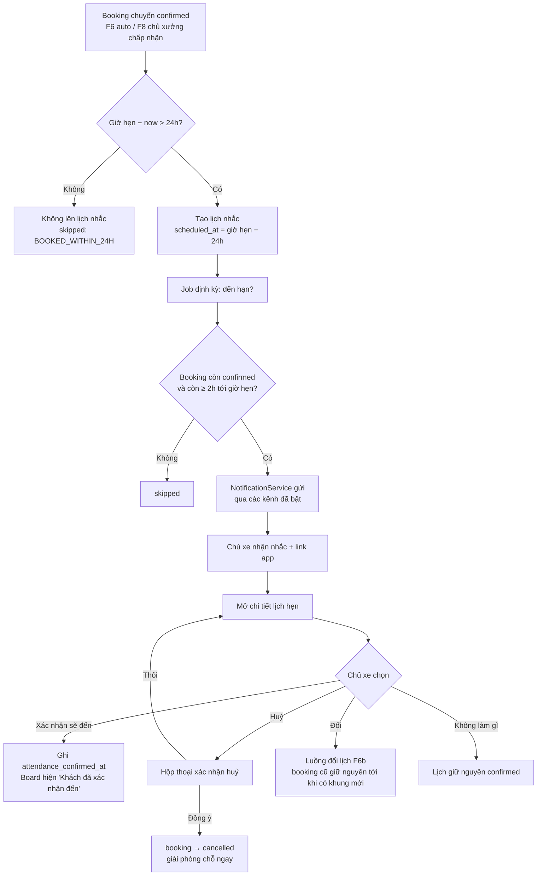
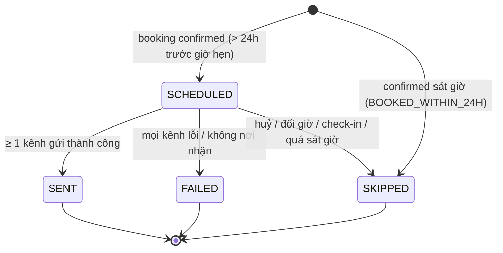

# Functional Specification — Nhắc lịch hẹn 24h & xử lý từ lời nhắc

> **Cập nhật phạm vi (02/10/2026):** các phần dưới đây trong tài liệu này không còn áp dụng.
>
> - Báo giá / duyệt báo giá (`quote`, `quote_item`, us-049): **đã bỏ**. Đặt lịch không gắn báo giá; mọi con số chi phí là ước tính (F5), chi phí cuối cùng do xưởng xác nhận khi kiểm tra xe.
> - Kết nối Discord (`user_discord_link`, ENT-417): **đã bỏ**. Nhắc bảo dưỡng, nhắc lịch hẹn và hỏi thăm hiện trong mục **Thông báo** của app; danh sách kênh ngoài (Zalo / Telegram / SMS / Email) vẫn có nhưng đều "Sắp có", bật nhắc không bắt buộc chọn kênh.

> Tài liệu đặc tả chức năng/nghiệp vụ cho Feature **F7 — phần nhắc lịch hẹn** trong [PRD EV Care MVP](../../../product/PRD_EV_Care_MVP.md#f7--nhắc).
>
> **Phạm vi tài liệu này:** nhắc chủ xe **24 giờ trước giờ hẹn** của một booking đã `confirmed`, và các hành động chủ xe làm từ lời nhắc: **Xác nhận sẽ đến / Đổi / Huỷ**. Phần **nhắc mốc bảo dưỡng** và **cấu hình kênh** đã đặc tả tại [us-021 FF](../../sprint-2/feature-functional/us-021-sprint-2-spec.ff.md) — tài liệu này **tái dùng**, không định nghĩa lại.
>
> **Quan hệ tài liệu:** Tầng nội dung/agent đã có ở [AI-006 Reminder Agent](../../ai-agent/ai-006-sprint-2-spec.agent.md) (UC-AI-602, INT-603). Tài liệu này đóng AI-Q-603 ("nhắc hẹn 24h chưa có FF riêng") và là **nguồn nghiệp vụ chính** cho phần nhắc hẹn; khi AI-006 khác tài liệu này, tài liệu này là chuẩn.
>
> **Ghi chú:** điểm chưa chốt đánh dấu `[Đề xuất]` (có giá trị mặc định để triển khai) hoặc `[Cần xác nhận]`, liệt kê lại ở mục 24.

---

# 1. Document Information

| Field | Value |
|---|---|
| Feature ID | `FEAT-NOTI-002` |
| Feature Name | `Nhắc lịch hẹn 24h & xử lý từ lời nhắc` |
| PRD Feature | `F7` (Should, S3–S4) — phần nhắc lịch hẹn; liên quan `F6`, `F6b`, `F8` |
| Document Version | `v1.0` |
| Status | `Draft` |
| Product / Project | EV Care — AI Agent Chăm sóc sau bán & lịch bảo dưỡng xe điện |
| Business Owner | Lê Đức Tùng (PO) |
| Author | Team 4 Người |
| Reviewer | Tech Lead |
| Stakeholders | Product, Frontend, Backend, AI Team, Chủ xưởng |
| Created Date | `2026-09-29` |
| Updated Date | `2026-09-29` |
| Related PRD | [PRD_EV_Care_MVP.md §F7](../../../product/PRD_EV_Care_MVP.md) (v3.6) · PP-07 (no-show) · AC-F7-02 |
| Related Frontend Spec | [us-033-sprint-3-spec.fe.md](../frontend/us-033-sprint-3-spec.fe.md) |
| Related API Spec | [us-033-sprint-3-spec.api.md](../api/us-033-sprint-3-spec.api.md) |
| Related Entity Spec | [us-033-sprint-3-spec.entity.md](../entity/us-033-sprint-3-spec.entity.md) |
| Related Agent Spec | [ai-006-sprint-2-spec.agent.md](../../ai-agent/ai-006-sprint-2-spec.agent.md) (UC-AI-602) |
| Related Specs | [us-021 FF](../../sprint-2/feature-functional/us-021-sprint-2-spec.ff.md) (kênh, `NotificationService`) · [us-029 FF](us-029-sprint-3-spec.ff.md) (đặt lịch) · [us-037 FF](us-037-sprint-3-spec.ff.md) (Workshop Board) |
| Related Design / Figma | `[Chưa có]` |
| Related GitHub Issue | `[Cần điền]` |

---

# 2. Feature Overview

## 2.1 Feature Description

Khi một lịch hẹn đã được **xác nhận chính thức** (`booking.status = confirmed` — theo us-029 BR-014), hệ thống lên lịch **một** lời nhắc gửi chủ xe **24 giờ trước giờ hẹn**. Lời nhắc đi qua `NotificationService` dùng chung (us-021), tới các kênh chủ xe đã bật (mặc định **Discord**, kênh riêng của chủ xe — PQ-11).

Lời nhắc chứa giờ hẹn, xưởng, mã lịch hẹn và **một link mở app**. Trong app, chủ xe có ba lựa chọn:

1. **Xác nhận sẽ đến** — ghi nhận chủ xe cam kết tới; xưởng thấy trên Workshop Board (F8).
2. **Huỷ lịch** — booking chuyển `cancelled` và **giải phóng chỗ ngay** (AC-F7-02).
3. **Đổi lịch** — chuyển sang luồng đổi lịch (F6b): kiểm tra sức chứa khung mới rồi mới giải phóng khung cũ.

Không làm gì cũng được: lịch hẹn giữ nguyên `confirmed`.

## 2.2 Business Objective

Giải quyết **PP-07 — khách không đến đúng hẹn (no-show)** mà không báo trước: nhắc sát giờ và cho huỷ/đổi chỉ bằng một chạm, để chỗ được trả lại sớm cho người khác. Đồng thời giảm cuộc gọi xác nhận lịch của xưởng (PP-05).

## 2.3 User Objective

Chủ xe không quên lịch hẹn; nếu bận thì huỷ hoặc đổi ngay từ lời nhắc, không phải gọi điện cho xưởng.

## 2.4 Business Value

- Chủ xe: không bỏ lỡ lịch, thao tác huỷ/đổi nhanh.
- Xưởng: biết sớm khách nào chắc chắn đến (nhãn "Khách đã xác nhận đến"), chỗ bị huỷ được trả lại kịp để nhận khách khác.
- Hệ thống: tái dùng hạ tầng thông báo của us-021 — thêm một loại thông báo mà không thêm kênh/adapter mới.

---

# 3. Scope

## 3.1 In Scope

- Lên lịch nhắc 24h khi booking chuyển `confirmed` (từ F6 chế độ `auto`, hoặc chủ xưởng chấp nhận trên Board F8).
- Job gửi nhắc đến hạn; ghi nhận kết quả theo từng kênh; thử lại khi lỗi tạm thời.
- Bỏ qua nhắc khi booking bị huỷ, đổi giờ, hoặc được xác nhận quá sát giờ hẹn.
- Màn chi tiết lịch hẹn mở từ link nhắc, với 3 hành động: Xác nhận sẽ đến / Huỷ / Đổi.
- Huỷ lịch `confirmed` từ lời nhắc (hoặc từ màn chi tiết lịch hẹn) — giải phóng chỗ ngay.
- Hiển thị trạng thái "đã xác nhận đến" cho xưởng (dữ liệu dùng ở F8).

## 3.2 Out of Scope

- **Nhắc mốc bảo dưỡng**, cấu hình bật/tắt, số ngày nhắc trước, danh sách kênh — [us-021](../../sprint-2/feature-functional/us-021-sprint-2-spec.ff.md).
- **Luồng đổi lịch chi tiết** (chọn khung mới, kiểm tra sức chứa, giải phóng khung cũ) và **nội dung Booking Ticket** — F6b ([us-053 FF](us-053-sprint-3-spec.ff.md)). Tài liệu này chỉ định nghĩa **điểm vào** từ lời nhắc.
- Nhắc nhiều mốc (ví dụ 2h trước giờ hẹn), nhắc lặp lại — phase sau.
- Nút tương tác ngay trong Discord (button/slash command) — MVP chỉ gửi link sang app (PRD F7).
- Thông báo cho chủ xưởng khi chủ xe huỷ — Board (F8) phản ánh ngay; kênh thông báo cho chủ xưởng là phase sau.
- Phí huỷ / phạt no-show / chấm điểm uy tín khách.
- Hỏi thăm sau dịch vụ — [F9 / us-041](../../sprint-4/feature-functional/us-041-sprint-4-spec.ff.md).

---

# 4. Actors & Stakeholders

## 4.1 Actors

| Actor | Type | Responsibility |
|---|---|---|
| Chủ xe | User | Nhận nhắc; xác nhận sẽ đến / huỷ / đổi lịch |
| Booking Reminder Scheduler | System | Tạo lịch nhắc khi booking `confirmed`; huỷ/điều chỉnh khi booking đổi |
| Job gửi nhắc hẹn | System | Chạy định kỳ, gửi nhắc đến hạn, thử lại khi lỗi |
| `NotificationService` + adapter Discord | System | Gửi theo kênh chủ xe đã bật (us-021) |
| Booking & Capacity Service | System | Huỷ booking và giải phóng chỗ (dùng chung với F6/F6b) |
| Chủ xưởng | User (gián tiếp) | Thấy trạng thái "đã xác nhận đến" / booking bị huỷ trên Board (F8) |

## 4.2 Stakeholders

| Stakeholder | Organization / Team | Interest / Responsibility |
|---|---|---|
| Product Owner | Product | Chốt thời điểm nhắc, quy tắc huỷ sát giờ, hành vi "Đổi" khi F6b chưa có |
| Backend Team | Engineering | Scheduler, job gửi, API huỷ/xác nhận đến |
| Frontend Team | Engineering | Màn chi tiết lịch hẹn + hộp thoại huỷ |
| AI Team | Engineering | Template nội dung (AI-006 INT-603) |
| Chủ xưởng | Partner | Giảm no-show, nhận lại chỗ sớm |

---

# 5. User Story

## US-033

**As a** chủ xe có lịch hẹn bảo dưỡng đã được xác nhận

**I want to** được nhắc 24 giờ trước giờ hẹn qua kênh tôi đã chọn

**So that** tôi không quên lịch và kịp sắp xếp.

### Additional User Stories

- `US-034`: As a chủ xe, I want to bấm "Xác nhận sẽ đến" từ lời nhắc, so that xưởng biết chắc tôi tới.
- `US-035`: As a chủ xe, I want to huỷ lịch ngay từ lời nhắc khi tôi bận, so that tôi không phải gọi điện và chỗ được trả lại cho người khác.
- `US-036`: As a chủ xe, I want to đổi lịch từ lời nhắc, so that tôi chuyển sang giờ khác mà không mất lịch cũ trước khi có lịch mới.

---

# 6. Use Case

## UC-701 — Gửi nhắc lịch hẹn 24h

### 6.1 Use Case Description

Khi booking chuyển `confirmed`, hệ thống tạo một lịch nhắc với thời điểm gửi = giờ hẹn − 24h. Đến hạn, job gửi nhắc qua các kênh chủ xe đã bật và ghi kết quả từng kênh.

### 6.2 Primary Actor

Job gửi nhắc hẹn (System)

### 6.3 Supporting Actors / Systems

Booking Reminder Scheduler; `NotificationService`; adapter Discord; `user_discord_link` (ENT-417); cấu hình kênh (ENT-419).

### 6.4 Trigger

- Booking chuyển `confirmed` ⇒ tạo lịch nhắc.
- Đến `scheduled_at` ⇒ job gửi (job chạy mỗi `BOOKING_REMINDER_JOB_INTERVAL_MINUTES`, mặc định 15 phút).

### 6.5 Preconditions

- Booking `confirmed`; xe `verified` + `link_status = active`; tài khoản chủ xe `ACTIVE`.
- Thời điểm xác nhận booking **sớm hơn** giờ hẹn − 24h (BR-703).

### 6.6 Postconditions

- Lời nhắc ở trạng thái `sent` (ít nhất một kênh gửi thành công), `failed` (mọi kênh thất bại sau khi thử lại), hoặc `skipped` (booking không còn hợp lệ).
- Kết quả từng kênh được ghi lại. **Không** thay đổi `booking`.

## UC-702 — Chủ xe phản hồi lời nhắc

### 6.1 Use Case Description

Chủ xe mở link trong lời nhắc, đăng nhập (nếu cần), xem chi tiết lịch hẹn và chọn Xác nhận sẽ đến / Huỷ / Đổi.

### 6.2 Primary Actor

Chủ xe

### 6.3 Supporting Actors / Systems

Booking & Capacity Service (huỷ, giải phóng chỗ); luồng đổi lịch F6b.

### 6.4 Trigger

Chủ xe bấm link trong lời nhắc, hoặc mở chi tiết lịch hẹn từ app.

### 6.5 Preconditions

- Chủ xe đã đăng nhập, là chủ của booking.
- Booking `confirmed` và **chưa tới giờ hẹn**.

### 6.6 Postconditions

- **Xác nhận sẽ đến:** ghi nhận thời điểm xác nhận; booking vẫn `confirmed`.
- **Huỷ:** booking `cancelled`, chỗ trả lại ngay; lời nhắc chưa gửi (nếu có) chuyển `skipped`.
- **Đổi:** chuyển sang luồng F6b; booking cũ **giữ nguyên** cho đến khi có khung mới hợp lệ.

---

# 7. User Flow

## 7.1 Main User Flow



## 7.2 Flow Description

| Step | Actor | Action / Event | System Response | Result |
|---|---|---|---|---|
| 1 | System | Booking chuyển `confirmed` | Tính `scheduled_at = appointment_at − 24h` (BR-702); quá sát giờ ⇒ không lên lịch (BR-703) | Có/không có lịch nhắc |
| 2 | System | Job chạy, có nhắc đến hạn | Kiểm tra lại booking còn hợp lệ (BR-707) và còn đủ thời gian (BR-702) | Gửi hoặc `skipped` |
| 3 | System | Gửi qua `NotificationService` | Mỗi kênh đã bật một kết quả; lỗi tạm thời ⇒ thử lại (BR-711) | `sent` / `failed` |
| 4 | Chủ xe | Bấm link trong nhắc | Mở màn chi tiết lịch hẹn (yêu cầu đăng nhập) | Thấy 3 hành động |
| 5a | Chủ xe | Xác nhận sẽ đến | Ghi thời điểm xác nhận (BR-708) | Board thấy nhãn xác nhận |
| 5b | Chủ xe | Huỷ + xác nhận huỷ | `confirmed → cancelled`, chỗ trả lại ngay (BR-709) | AC-F7-02 |
| 5c | Chủ xe | Đổi | Mở luồng đổi lịch F6b (BR-710) | Lịch cũ giữ tới khi có lịch mới |

---

# 8. Screen / UI Flow

> UI minh hoạ **nghiệp vụ**. Chi tiết component, loading/empty/error state thuộc [Frontend Spec](../frontend/us-033-sprint-3-spec.fe.md).

## 8.1 Screen Flow

```text
[Lời nhắc Discord]
    |
    v  (link app)
[Đăng nhập nếu chưa có phiên]
    |
    v
[SCR-701 Chi tiết lịch hẹn]
    |
    +----> [Xác nhận sẽ đến] ----> [SCR-701 cập nhật nhãn "Đã xác nhận đến"]
    |
    +----> [SCR-702 Hộp thoại huỷ] ----> [SCR-701 trạng thái "Đã huỷ"]
    |
    +----> [Luồng đổi lịch F6b]
    |
    +----> [Trạng thái không còn hợp lệ] (đã huỷ / đã qua giờ hẹn / đã check-in)
```

## 8.2 Screen List

| Screen ID | Screen Name | Purpose | Entry From | Exit To |
|---|---|---|---|---|
| `SCR-701` | Chi tiết lịch hẹn | Xem lịch hẹn + 3 hành động | Link nhắc 24h, Home, Đặt lịch thành công | SCR-702, F6b, Home |
| `SCR-702` | Hộp thoại xác nhận huỷ | Xác nhận lần hai trước khi huỷ | SCR-701 | SCR-701 |

## 8.3 Screen / UI Reference

### SCR-701 — Chi tiết lịch hẹn

**Purpose** — Cho chủ xe xem lịch hẹn sắp tới và phản hồi lời nhắc.

**Main UI**

- Trạng thái lịch hẹn (`Đã xác nhận`, `Đã huỷ`, `Đã check-in`…).
- Xưởng + địa chỉ; thời gian (thứ, dd/mm/yyyy, HH:mm); mã lịch hẹn; mã QR check-in.
- Xe (model + biển số che một phần); hạng mục; chi phí ước tính (nhãn "Chi phí ước tính").
- Nhãn "Bạn đã xác nhận sẽ đến lúc HH:mm dd/mm" khi đã xác nhận.
- Ba nút: **Xác nhận sẽ đến**, **Đổi lịch**, **Huỷ lịch** — chỉ hiện khi hành động còn hợp lệ.

**Business Meaning** — Đây là "bản chính" của lịch hẹn trong app; lời nhắc chỉ là con trỏ tới màn này.

**User Action** — Xác nhận đến; huỷ; đổi.

**System Behavior** — Chỉ hiện hành động hợp lệ theo trạng thái và thời gian (BR-708, BR-709, BR-710). Booking đã huỷ/đã qua giờ ⇒ ẩn hành động, nêu rõ lý do.

### SCR-702 — Hộp thoại xác nhận huỷ

**Main UI** — "Huỷ lịch hẹn HH:mm dd/mm tại {xưởng}? Chỗ của bạn sẽ được trả lại cho người khác." Hai nút: **Huỷ lịch** / **Giữ lịch**.

**System Behavior** — Chỉ khi bấm **Huỷ lịch** trong hộp thoại mới gửi yêu cầu huỷ (PRD §7 — Confirm before side effect).

---

# 9. Main Flow

## 9.1 Happy Path

1. Chủ xe đặt lịch 14:00 Thứ 7 04/10 tại VinFast Smart City; xưởng `auto` ⇒ booking `confirmed` lúc 09:10 Thứ 3 30/09.
2. Hệ thống tạo lịch nhắc `scheduled_at = 14:00 Thứ 6 03/10`.
3. 14:00 Thứ 6 03/10, job chạy, booking vẫn `confirmed`, còn 24h ⇒ gửi qua Discord (kênh riêng):
   ```text
   📅 Nhắc lịch hẹn: 14:00 Thứ 7 04/10 tại VinFast Smart City
   Mã lịch hẹn: EVC-7K2M
   Xác nhận / Đổi / Huỷ: https://app.evcare.vn/bookings/…
   ```
4. Chủ xe bấm link, mở SCR-701, bấm **Xác nhận sẽ đến**.
5. Hệ thống ghi thời điểm xác nhận; Board của xưởng hiện "Khách đã xác nhận đến" (AC-701, AC-703).

---

# 10. Alternative Flow

## AF-701 — Chủ xe huỷ từ lời nhắc

**Condition** — Chủ xe bận, bấm **Huỷ lịch** trên SCR-701.

**Flow**

1. Hộp thoại SCR-702 hiện; chủ xe bấm **Huỷ lịch**.
2. Hệ thống chuyển booking `confirmed → cancelled`, ghi người huỷ = chủ xe, nguồn = lời nhắc 24h.
3. Chỗ của khung giờ được trả lại ngay — lần kiểm tra sức chứa kế tiếp (F6) thấy thêm 1 chỗ.

**Expected Result** — Booking `cancelled`, chỗ giải phóng ngay (AC-704 = AC-F7-02).

## AF-702 — Chủ xe đổi lịch từ lời nhắc

**Condition** — Chủ xe bấm **Đổi lịch**.

**Flow**

1. Hệ thống mở luồng đổi lịch F6b với xưởng hiện tại làm mặc định.
2. Chủ xe chọn khung mới; F6b kiểm tra sức chứa khung mới **trước**, chỉ khi giữ được khung mới mới giải phóng khung cũ.
3. Giờ hẹn thay đổi ⇒ lời nhắc cũ (nếu chưa gửi) chuyển `skipped`, lời nhắc mới được lên lịch theo giờ mới (BR-704).

**Expected Result** — Không có khoảng thời gian nào chủ xe mất cả lịch cũ lẫn lịch mới.

> **Khi F6b chưa triển khai** `[Đề xuất — Q-703]`: nút **Đổi lịch** hiện hướng dẫn "Để đổi lịch, bạn đặt lịch mới rồi huỷ lịch này" kèm nút mở màn đặt lịch; không tự huỷ lịch cũ.

## AF-703 — Chủ xe không phản hồi

**Condition** — Chủ xe không mở link.

**Expected Result** — Lịch hẹn giữ nguyên `confirmed`; không nhắc lại (BR-704). Xưởng thấy "Chưa xác nhận đến" trên Board.

## AF-704 — Booking được xác nhận sát giờ

**Condition** — Booking chuyển `confirmed` khi còn ≤ 24h tới giờ hẹn (ví dụ đặt tối nay cho sáng mai, hoặc xưởng `manual` chấp nhận muộn).

**Expected Result** — Không lên lịch nhắc 24h (BR-703): chủ xe vừa thao tác/nhận xác nhận nên đã biết lịch. Màn chi tiết lịch hẹn vẫn có đủ 3 hành động.

---

# 11. Exception Flow

## EF-701 — Chủ xe chưa kết nối Discord / liên kết bị thu hồi

**Condition** — Kênh Discord đang bật nhưng không có `user_discord_link` `active`.

**System Behavior** — Kết quả kênh = `no_recipient`, không thử lại (us-021 BR). Nếu không kênh nào gửi được ⇒ lời nhắc `failed`.

**User Experience** — Không nhận nhắc; lịch hẹn vẫn xem được trong app; Home tiếp tục hiện lời mời kết nối Discord (us-021).

**Recovery** — Chủ xe kết nối Discord; không gửi bù nhắc đã lỡ.

## EF-702 — Gửi Discord lỗi tạm thời

**Condition** — Timeout / rate limit / Discord không khả dụng.

**System Behavior** — Thử lại theo backoff tối đa `REMINDER_MAX_ATTEMPTS` (mặc định 3), **chỉ khi** còn ≥ `BOOKING_REMINDER_MIN_LEAD_HOURS` (mặc định 2h) tới giờ hẹn. Không chuyển sang kênh khác (PRD F7).

**Recovery** — Hết lượt hoặc quá sát giờ ⇒ kênh `failed`, không gửi nữa.

## EF-703 — Booking đổi trạng thái giữa lúc lên lịch và lúc gửi

**Condition** — Trước khi gửi, booking bị huỷ (chủ xe/xưởng/job), đổi giờ, hoặc đã check-in.

**System Behavior** — Job kiểm tra lại ngay trước khi gửi; không còn `confirmed` hoặc giờ hẹn đã khác ⇒ `skipped` (BR-707).

## EF-704 — Chủ xe mở link khi hành động không còn hợp lệ

**Condition** — Booking đã huỷ, đã check-in, hoặc đã qua giờ hẹn.

**System Behavior** — Từ chối hành động; màn chi tiết nêu trạng thái hiện tại.

**User Experience** — "Lịch hẹn này đã huỷ" / "Đã quá giờ hẹn — vui lòng liên hệ xưởng" / "Xe đã check-in tại xưởng".

## EF-705 — Huỷ trùng (bấm hai lần / hai thiết bị)

**Condition** — Hai yêu cầu huỷ cùng booking gần như đồng thời.

**System Behavior** — Chỉ một lần chuyển trạng thái có hiệu lực; lần sau thấy booking đã `cancelled` bởi chính chủ xe ⇒ trả kết quả như đã huỷ (idempotent), không lỗi.

## EF-706 — Job gửi bị dừng / chạy trễ

**Condition** — Job ngừng chạy một thời gian, khởi động lại sau `scheduled_at`.

**System Behavior** — Vẫn gửi nếu còn ≥ 2h tới giờ hẹn (BR-702); quá sát ⇒ `skipped` với lý do `TOO_LATE`. Chạy lại job không gửi trùng (BR-704).

---

# 12. Business Rules

> Business Rule áp dụng cho mọi implementation (job, API, UI, AI-006). Rule kênh/adapter/retry chung được tham chiếu sang us-021.

## BR-701 — Đối tượng nhận nhắc hẹn

**Rule** — Chỉ nhắc cho booking `status = confirmed` của xe `verified` + `link_status = active`, thuộc tài khoản chủ xe `ACTIVE`.

**Condition** — Lúc lên lịch và lúc gửi.

**Expected Behavior** — Không thoả ⇒ không gửi (`skipped`).

**Priority** — High

## BR-702 — Thời điểm gửi

**Rule** —

```text
appointment_at = booking_date + time_slot            (giờ Asia/Ho_Chi_Minh)
scheduled_at   = appointment_at − BOOKING_REMINDER_LEAD_HOURS      (mặc định 24h)
Gửi khi:  now ≥ scheduled_at
     và  now ≤ appointment_at − BOOKING_REMINDER_MIN_LEAD_HOURS    (mặc định 2h)
```

Job chạy mỗi `BOOKING_REMINDER_JOB_INTERVAL_MINUTES` (mặc định 15) ⇒ nhắc gửi trễ tối đa ~15 phút so với `scheduled_at` trong điều kiện bình thường.

**Condition** — Mọi lần job chạy.

**Expected Behavior** — Quá `appointment_at − 2h` mà chưa gửi được ⇒ `skipped` (`TOO_LATE`).

**Priority** — High

## BR-703 — Không nhắc khi xác nhận sát giờ

**Rule** — Nếu thời điểm booking chuyển `confirmed` ≥ `scheduled_at` (tức còn ≤ 24h tới giờ hẹn), **không** lên lịch nhắc 24h (AI-EDGE-606).

**Condition** — Lúc booking chuyển `confirmed`.

**Expected Behavior** — Ghi nhận lời nhắc ở trạng thái `skipped` với lý do `BOOKED_WITHIN_24H` để truy vết `[Đề xuất]`; không gửi.

**Priority** — Medium

## BR-704 — Mỗi giờ hẹn tối đa một nhắc 24h

**Rule** — Mỗi `(booking, giờ hẹn)` có tối đa **một** lời nhắc 24h. Không nhắc lặp, không nhắc lại khi chủ xe không phản hồi. Nếu giờ hẹn thay đổi (đổi lịch F6b) ⇒ lời nhắc cũ chưa gửi chuyển `skipped` (`RESCHEDULED`), lời nhắc mới được lên lịch cho giờ mới.

**Condition** — Lên lịch, chạy lại job, retry.

**Expected Behavior** — Chạy lại job hoặc retry không tạo nhắc trùng.

**Priority** — High

## BR-705 — Kênh và công tắc

**Rule** — Nhắc hẹn gửi qua **các kênh chủ xe đã bật** theo cấu hình us-021 (không cấu hình ⇒ chỉ Discord). Nhắc hẹn là **thông báo giao dịch**, **không** phụ thuộc công tắc "nhận nhắc mốc bảo dưỡng" (`reminders_enabled`) của us-021 `[Đề xuất — Q-701]`.

**Condition** — Lúc gửi.

**Expected Behavior** — Chủ xe tắt nhắc mốc vẫn nhận nhắc lịch hẹn.

**Priority** — Medium

## BR-706 — Nội dung an toàn

**Rule** — Nội dung dùng template AI-006 INT-603: giờ, ngày, tên xưởng, mã lịch hẹn, link app. **Không** chứa VIN, SĐT, email, CCCD; biển số (nếu có) che một phần. Link **không** chứa token hành động — mọi hành động yêu cầu chủ xe đăng nhập app.

**Condition** — Mọi lời nhắc.

**Expected Behavior** — Người đọc được tin Discord (ví dụ xem trộm) không thể huỷ lịch hộ chủ xe.

**Priority** — High

## BR-707 — Kiểm tra lại ngay trước khi gửi

**Rule** — Ngay trước khi gửi, kiểm tra: booking vẫn `confirmed` và giờ hẹn vẫn bằng giờ hẹn lúc lên lịch. Sai một trong hai ⇒ `skipped` (`BOOKING_CANCELLED` / `RESCHEDULED` / `BOOKING_NOT_CONFIRMED`). Booking huỷ **sau** khi đã nhắc ⇒ không gửi gì thêm (AI-EDGE-605).

**Priority** — High

## BR-708 — Xác nhận sẽ đến

**Rule** — Chủ xe được bấm "Xác nhận sẽ đến" khi booking `confirmed` và `now < appointment_at`. Hệ thống ghi **thời điểm xác nhận**; **không** đổi `booking.status`. Bấm lại lần nữa không đổi thời điểm đã ghi (idempotent).

**Condition** — Từ SCR-701 (có hoặc không qua lời nhắc).

**Expected Behavior** — Workshop Board (F8) hiện "Khách đã xác nhận đến" cho booking đó.

**Priority** — Medium

## BR-709 — Huỷ lịch `confirmed` và giải phóng chỗ ngay

**Rule** — Chủ xe được huỷ booking `confirmed` khi `now < appointment_at` `[Đề xuất — Q-702]`, sau khi xác nhận lần hai (SCR-702). Hệ thống chuyển `confirmed → cancelled` trong một transaction và ghi **người huỷ = chủ xe**, **nguồn** (`REMINDER_24H` hoặc `APP`), lý do (tuỳ chọn). Vì sức chứa được **tính động** từ các booking đang mở (us-029 BR-005), chỗ được trả lại **ngay** khi commit.

Báo giá `approved` đang gắn với booking (nếu có) được **gỡ liên kết** để có thể dùng cho lần đặt sau nếu còn hạn `[Đề xuất]`.

**Condition** — Chủ xe bấm Huỷ lịch trong hộp thoại xác nhận.

**Expected Behavior** — Booking `cancelled`; lời nhắc chưa gửi ⇒ `skipped`; Board của xưởng thấy ngay (AC-F7-02).

**Priority** — High

## BR-710 — Đổi lịch đi qua F6b

**Rule** — "Đổi lịch" **không** huỷ booking hiện tại. Nó mở luồng đổi lịch F6b, trong đó khung mới phải được giữ thành công (kiểm tra sức chứa — us-029 BR-005) **trước** khi khung cũ được giải phóng (PRD F6b). Tài liệu này không định nghĩa chi tiết luồng đổi.

**Priority** — Medium

## BR-711 — Thử lại khi gửi lỗi

**Rule** — Áp dụng quy tắc thử lại của us-021 cho từng kênh: lỗi tạm thời (`TIMEOUT`, `RATE_LIMITED`, `UNAVAILABLE`) thử lại tối đa `REMINDER_MAX_ATTEMPTS`; `NO_RECIPIENT`, `DELIVERY_FORBIDDEN` không thử lại. **Thêm điều kiện:** không thử lại khi đã quá `appointment_at − BOOKING_REMINDER_MIN_LEAD_HOURS`.

**Priority** — Medium

## BR-712 — Kết quả tổng của lời nhắc

**Rule** — Lời nhắc `sent` khi **ít nhất một** kênh gửi thành công; `failed` khi **mọi** kênh đều `failed` / `no_recipient` và không còn lượt thử; `skipped` theo BR-703/BR-704/BR-707/BR-702.

**Priority** — Low

## BR-713 — Chỉ chủ của booking được hành động

**Rule** — Xem chi tiết, xác nhận đến, huỷ chỉ dành cho chủ xe sở hữu booking (`booking.user_id`). Người khác ⇒ từ chối như thể booking không tồn tại.

**Priority** — High

---

# 13. State / Status

## 13.1 State List — Lời nhắc hẹn

| State | Meaning | Entry Condition | Exit Condition |
|---|---|---|---|
| `SCHEDULED` | Đã lên lịch, chờ đến giờ gửi | Booking `confirmed` và còn > 24h tới giờ hẹn (BR-702, BR-703) | Gửi (`SENT`/`FAILED`) hoặc bỏ qua (`SKIPPED`) |
| `SENT` | Ít nhất một kênh đã gửi thành công | Job gửi thành công (BR-712) | Kết thúc |
| `FAILED` | Mọi kênh thất bại / không có nơi nhận | Hết lượt thử hoặc quá sát giờ (BR-711, BR-712) | Kết thúc |
| `SKIPPED` | Không gửi vì booking không còn hợp lệ hoặc quá sát giờ | BR-703, BR-704, BR-707, BR-702 | Kết thúc |

## 13.2 State Transition



## 13.3 Ảnh hưởng tới booking

| Hành động | `booking.status` | Ghi chú |
|---|---|---|
| Xác nhận sẽ đến | `confirmed` (giữ nguyên) | Ghi thời điểm xác nhận trên booking — không phụ thuộc có lời nhắc hay không (Entity Spec §4.1) |
| Huỷ | `confirmed → cancelled` | Chỗ trả lại ngay (BR-709); sự kiện trạng thái ghi theo F8 (ENT-426) |
| Đổi | theo F6b | Booking cũ giữ nguyên tới khi có khung mới |

---

# 14. Data Requirements

## 14.1 Required Data

| Data | Type | Required | Description | Source |
|---|---|---:|---|---|
| Booking | object | Yes | Trạng thái, ngày, khung giờ, mã, xưởng, xe, chủ xe | `booking` (ENT-402) |
| Xưởng | object | Yes | Tên, địa chỉ hiển thị trong nhắc và SCR-701 | `workshop` (ENT-008) |
| Xe | object | Yes | Model, biển số (che) | `user_vehicle` (ENT-003) |
| Kênh chủ xe đã bật | list | Yes | Nơi gửi (mặc định Discord) | `user_notification_channel` (us-021) |
| Liên kết Discord | object | No | Kênh riêng của chủ xe | `user_discord_link` (ENT-417) |
| Lời nhắc hẹn | object | Yes | Trạng thái, `scheduled_at`, giờ hẹn khi lên lịch, lý do bỏ qua | `booking_reminder` (ENT-424, **mới**) |
| Thời điểm xác nhận sẽ đến | datetime | No | Chủ xe bấm "Xác nhận sẽ đến" (BR-708) | `booking.attendance_confirmed_at` (ENT-402, **cột mới**) |
| Kết quả gửi từng kênh | list | Yes | Trạng thái, số lần thử, lỗi | `booking_reminder_delivery` (ENT-425, **mới**) |
| Lịch sử trạng thái booking | list | No | Ai huỷ, nguồn, lý do | `booking_status_event` (ENT-426, định nghĩa ở [us-037](../entity/us-037-sprint-3-spec.entity.md)) |

## 14.2 Data Dependency

| Data / Entity | Why Needed | Read / Write | Owner |
|---|---|---|---|
| `booking` (ENT-402) | Nguồn nhắc; huỷ lịch; ghi xác nhận đến | Read / Write | Backend |
| `booking_reminder` (ENT-424) | Lịch nhắc, trạng thái, xác nhận đến | Read / Write | Backend |
| `booking_reminder_delivery` (ENT-425) | Kết quả từng kênh | Write | Backend |
| `booking_status_event` (ENT-426) | Ghi sự kiện huỷ | Write | Backend (định nghĩa ở F8) |
| `user_notification_channel` / `user_discord_link` | Nơi gửi | Read | Backend (us-021) |
| `quote` (ENT-410) | Gỡ liên kết khi huỷ | Write | Backend |

---

# 15. Business Error & Edge Cases

> HTTP status và error code định nghĩa trong [API Spec](../api/us-033-sprint-3-spec.api.md).

| Case ID | Scenario | Expected Business Behavior | User Outcome |
|---|---|---|---|
| `EDGE-701` | Booking confirmed khi còn ≤ 24h tới giờ hẹn | Không nhắc 24h (BR-703) | Không nhận nhắc; lịch vẫn trong app |
| `EDGE-702` | Booking bị huỷ trước giờ gửi nhắc | `skipped` (BR-707) | Không nhận nhắc |
| `EDGE-703` | Booking bị huỷ sau khi đã gửi nhắc | Không gửi gì thêm (AI-EDGE-605) | — |
| `EDGE-704` | Đổi lịch sang giờ khác trước khi nhắc | Nhắc cũ `skipped`, nhắc mới theo giờ mới (BR-704) | Nhận đúng 1 nhắc cho giờ mới |
| `EDGE-705` | Chưa kết nối Discord | `no_recipient`, không thử lại (EF-701) | Không nhận nhắc; được mời kết nối |
| `EDGE-706` | Discord lỗi tạm thời | Thử lại tới khi hết lượt hoặc quá sát giờ (BR-711) | Nhận trễ hoặc không nhận |
| `EDGE-707` | Job ngừng rồi chạy lại khi còn < 2h tới giờ hẹn | `skipped` `TOO_LATE` (EF-706) | Không nhận nhắc quá sát giờ |
| `EDGE-708` | Chủ xe bấm Huỷ khi đã qua giờ hẹn | Từ chối (BR-709) | Được hướng dẫn liên hệ xưởng |
| `EDGE-709` | Chủ xe bấm Huỷ sau khi xe đã check-in | Từ chối — booking không còn `confirmed` | Thấy "Xe đã check-in" |
| `EDGE-710` | Hai lần bấm huỷ đồng thời | Một lần có hiệu lực; lần sau trả kết quả đã huỷ (EF-705) | Không thấy lỗi |
| `EDGE-711` | Người khác mở link nhắc (không phải chủ booking) | Từ chối như không tồn tại (BR-713) | Không xem được |
| `EDGE-712` | Xưởng huỷ booking (F8) sau khi đã nhắc | Không nhắc thêm; thông báo huỷ thuộc F8 | Nhận thông báo huỷ từ F8 |
| `EDGE-713` | Chủ xe tắt nhắc mốc bảo dưỡng (us-021) | Vẫn nhận nhắc hẹn (BR-705) | Nhận nhắc hẹn |
| `EDGE-714` | Booking có báo giá đã duyệt, chủ xe huỷ | Gỡ liên kết báo giá; báo giá còn hạn dùng lại được (BR-709) | Đặt lại vẫn dùng báo giá |

---

# 16. Permissions & Access

## 16.1 Access Matrix

| Role / Actor | View | Create | Update | Delete | Notes |
|---|---:|---:|---:|---:|---|
| Chủ xe | ✅ (booking của mình) | ❌ | ✅ (xác nhận đến, huỷ) | ❌ | BR-713 |
| Chủ xưởng | ✅ (booking xưởng mình, qua F8) | ❌ | ❌ (ở tài liệu này) | ❌ | Chỉ thấy nhãn xác nhận đến / huỷ |
| Job / Scheduler | ✅ | ✅ (lời nhắc) | ✅ (trạng thái lời nhắc) | ❌ | Không đổi `booking` |
| AI Agent (AI-006) | ✅ | ❌ | ❌ | ❌ | Chỉ dựng nội dung |

## 16.2 Business Authorization Rules

- Mọi hành động trên SCR-701 yêu cầu chủ xe đăng nhập và sở hữu booking (BR-713).
- Link trong lời nhắc không tự cấp quyền (BR-706).
- Nội dung thông báo không chứa dữ liệu nhạy cảm (PRD §7 Privacy).

> Chi tiết Firebase ID token và mã lỗi: xem [API Spec](../api/us-033-sprint-3-spec.api.md).

---

# 17. Acceptance Criteria

## AC-701 — Nhắc đúng 24h trước giờ hẹn

**Given** booking `confirmed` lúc 09:10 30/09 cho giờ hẹn 14:00 04/10, chủ xe đã kết nối Discord

**When** job chạy lúc 14:00–14:15 ngày 03/10

**Then** chủ xe nhận **đúng một** nhắc chứa giờ, ngày, tên xưởng, mã lịch hẹn và link app; lời nhắc `SENT`.

## AC-702 — Không nhắc khi xác nhận sát giờ

**Given** booking chuyển `confirmed` lúc 20:00 03/10 cho giờ hẹn 09:00 04/10

**When** job chạy các lần sau đó

**Then** không có nhắc 24h nào được gửi cho booking này.

## AC-703 — Xác nhận sẽ đến

**Given** chủ xe mở chi tiết lịch hẹn `confirmed` từ link nhắc

**When** bấm **Xác nhận sẽ đến**

**Then** hệ thống ghi thời điểm xác nhận, booking vẫn `confirmed`, Workshop Board hiện "Khách đã xác nhận đến"; bấm lại không đổi thời điểm đã ghi.

## AC-704 — Huỷ từ nhắc giải phóng chỗ ngay (AC-F7-02)

**Given** khung 14:00 04/10 tại Smart City đã đầy, trong đó có booking của chủ xe A

**When** A bấm **Huỷ lịch** từ lời nhắc và xác nhận trong hộp thoại

**Then** booking của A `cancelled`; kiểm tra sức chứa ngay sau đó (F6) cho thấy khung còn 1 chỗ; Board thấy booking đã huỷ.

## AC-705 — Không huỷ khi chưa xác nhận lần hai

**Given** chủ xe bấm **Huỷ lịch** trên SCR-701

**When** bấm **Giữ lịch** (hoặc đóng hộp thoại)

**Then** không có yêu cầu huỷ nào được gửi; booking vẫn `confirmed`.

## AC-706 — Không nhắc booking đã huỷ

**Given** booking đã lên lịch nhắc, bị huỷ trước `scheduled_at`

**When** job chạy tới giờ gửi

**Then** không gửi; lời nhắc `SKIPPED`.

## AC-707 — Đổi giờ ⇒ nhắc theo giờ mới

**Given** booking đổi từ 14:00 04/10 sang 09:00 06/10 (qua F6b) trước khi nhắc cũ được gửi

**When** job chạy

**Then** không gửi nhắc cho giờ cũ; chủ xe nhận đúng một nhắc lúc ~09:00 05/10.

## AC-708 — Không huỷ được sau giờ hẹn hoặc sau check-in

**Given** đã qua giờ hẹn, hoặc xe đã check-in

**When** chủ xe bấm Huỷ

**Then** hệ thống từ chối, nêu lý do; booking không đổi.

## AC-709 — Không hành động trên booking của người khác

**Given** chủ xe B mở link nhắc của booking thuộc chủ xe A

**When** B xem hoặc bấm huỷ

**Then** hệ thống trả như booking không tồn tại; booking của A không đổi.

## AC-710 — Không gửi trùng khi job chạy lại

**Given** một lời nhắc đã `SENT`

**When** job chạy lại (khởi động lại, chạy chồng)

**Then** chủ xe không nhận thêm nhắc nào cho cùng booking và giờ hẹn.

---

# 18. Non-functional Expectations

| Requirement | Expected Behavior |
|---|---|
| Notification Timing | Nhắc gửi trong vòng `BOOKING_REMINDER_JOB_INTERVAL_MINUTES` (15') sau `scheduled_at` khi hệ thống bình thường |
| Response Experience | API xác nhận đến / huỷ ≤ 500 ms (p90) — PRD §8 |
| Correctness | Huỷ giải phóng chỗ ngay trong cùng transaction (AC-F7-02) |
| Duplicate Handling | Tối đa 1 nhắc / (booking, giờ hẹn); huỷ idempotent |
| Availability | Job lỗi không làm mất nhắc còn hạn; bù khi chạy lại nếu còn ≥ 2h |
| Privacy | Nội dung không PII; link không chứa token hành động |
| Language / Time | Tiếng Việt; giờ 24h; Asia/Ho_Chi_Minh (lưu UTC) |

---

# 19. Dependencies

| Dependency | Purpose | Owner | Required | Related Document |
|---|---|---|---:|---|
| us-021 — Nhắc mốc & cấu hình kênh | `NotificationService`, adapter Discord, cấu hình kênh, retry | Backend | Yes | [us-021 FF](../../sprint-2/feature-functional/us-021-sprint-2-spec.ff.md) |
| ENT-417 `user_discord_link` | Kênh riêng Discord của chủ xe | Backend | Yes | [user_discord_link](../../entity/identity/user_discord_link.entity.md) |
| F6 — Đặt lịch (us-029) | Nguồn booking `confirmed`; công thức sức chứa | Backend | Yes | [us-029 FF](us-029-sprint-3-spec.ff.md) |
| F8 — Workshop Board (us-037) | Chấp nhận booking `manual`; hiển thị xác nhận đến; `booking_status_event` | Backend/FE | Yes | [us-037 FF](us-037-sprint-3-spec.ff.md) |
| F6b — Huỷ/đổi lịch | Luồng đổi lịch | Backend/FE | No (có fallback AF-702) | PRD §F6b |
| AI-006 | Template nội dung INT-603 | AI Team | Yes | [ai-006](../../ai-agent/ai-006-sprint-2-spec.agent.md) |
| Celery beat | Chạy job định kỳ | Backend | Yes | — |

---

# 20. Assumptions

- Mỗi xưởng 1 khung hoạt động/ngày; giờ hẹn = `booking_date` + `time_slot` theo giờ Việt Nam.
- MVP chỉ adapter Discord hoạt động; kênh khác theo us-021 hiện "Sắp có".
- Chủ xe mở link trên điện thoại; nếu chưa có phiên, app đăng nhập rồi quay lại đúng màn chi tiết.
- Một chủ xe tối đa 1 booking đang mở / xe (us-029 BR-013) ⇒ mỗi xe có tối đa 1 nhắc hẹn đang chờ.

---

# 21. Business Constraints

- Không side effect khi chưa có xác nhận rõ: huỷ luôn qua hộp thoại xác nhận (PRD §7).
- Không chuyển sang kênh khác khi Discord lỗi (PRD F7).
- Không lộ dữ liệu nhạy cảm trong thông báo (PRD §7 Privacy).
- Huỷ phải giải phóng chỗ ngay (AC-F7-02).

---

# 22. Terminology / Glossary

| Term ID | Term | Vietnamese Name | Definition | Example / Notes |
|---|---|---|---|---|
| `TERM-701` | Appointment reminder | Nhắc lịch hẹn | Thông báo gửi chủ xe `BOOKING_REMINDER_LEAD_HOURS` trước giờ hẹn của booking `confirmed` | Khác "nhắc mốc bảo dưỡng" (us-021) |
| `TERM-702` | Appointment time | Giờ hẹn | `booking_date` + `time_slot` theo giờ Việt Nam | 14:00 04/10/2026 |
| `TERM-703` | Attendance confirmation | Xác nhận sẽ đến | Chủ xe cam kết tới đúng hẹn; không đổi trạng thái booking | Nhãn trên Board |
| `TERM-704` | No-show | Không đến | Chủ xe không đến và không báo huỷ | PP-07 |
| `TERM-705` | Skipped reminder | Nhắc bị bỏ qua | Lời nhắc không gửi vì booking không còn hợp lệ hoặc quá sát giờ | Lý do được ghi |

### Important Terminology Rules

- "Nhắc lịch hẹn" chỉ dùng cho booking; "nhắc mốc" chỉ dùng cho mốc bảo dưỡng (us-021).
- "Xác nhận sẽ đến" (chủ xe) khác "xác nhận lịch hẹn" (xưởng/hệ thống chuyển `pending → confirmed` — us-029 BR-014).
- "Huỷ lịch" (booking `confirmed`) khác "huỷ giữ chỗ" (booking `pending` trong 10 phút — us-029 BR-010).

---

# 23. Partner / Stakeholder Notes

## 23.1 Confirmed

- Nhắc hẹn 24h, nút Xác nhận / Đổi / Huỷ là link sang app (PRD F7).
- Cùng kênh Discord với nhắc mốc và hỏi thăm sau dịch vụ (PRD F7).
- Huỷ từ nhắc 24h giải phóng chỗ ngay (AC-F7-02).

## 23.2 Pending Confirmation

- Nhắc hẹn có phụ thuộc công tắc nhắc mốc hay không (Q-701).
- Hạn chót huỷ lịch `confirmed` (Q-702).
- Hành vi "Đổi lịch" khi F6b chưa có (Q-703).

---

# 24. Open Questions

| ID | Question | Owner | Status | Decision / Due Date |
|---|---|---|---|---|
| `Q-701` | Nhắc hẹn có tuân theo công tắc "nhận nhắc" (`reminders_enabled`) của us-021 không? | PO | Open | `[Đề xuất]` **Không** — nhắc hẹn là thông báo giao dịch, luôn gửi (BR-705) |
| `Q-702` | Hạn chót chủ xe tự huỷ lịch `confirmed`? | PO | Open | `[Đề xuất]` Trước giờ hẹn (`now < appointment_at`); có thể siết thành `appointment_at − N giờ` sau MVP |
| `Q-703` | F6b chưa có thì nút "Đổi lịch" làm gì? | PO | Open | `[Đề xuất]` Hướng dẫn "đặt lịch mới rồi huỷ lịch này", không tự huỷ (AF-702) |
| `Q-704` | Có ghi nhận lời nhắc `skipped` khi booking xác nhận sát giờ (BR-703) hay không tạo bản ghi? | Backend | Open | `[Đề xuất]` Có ghi, để truy vết và đo lường |
| `Q-705` | Có cần nhắc thêm 2h trước giờ hẹn? | PO | Open | Phase sau |
| `AI-Q-603` | Nhắc hẹn 24h chưa có FF riêng | PO | **Resolved** | Tài liệu này |

---

# 25. Traceability

| Item | Reference |
|---|---|
| PRD | F7 (v3.6) — nhắc lịch hẹn; PP-07; AC-F7-02 |
| User Story | `US-033` → `US-036` |
| Use Case | `UC-701`, `UC-702`; AI-006 `UC-AI-602` |
| Business Rules | `BR-701` → `BR-713` |
| Acceptance Criteria | `AC-701` → `AC-710` (AC-704 = AC-F7-02) |
| Frontend Specification | [us-033-sprint-3-spec.fe.md](../frontend/us-033-sprint-3-spec.fe.md) |
| API Specification | [us-033-sprint-3-spec.api.md](../api/us-033-sprint-3-spec.api.md) |
| Entity Specification | [us-033-sprint-3-spec.entity.md](../entity/us-033-sprint-3-spec.entity.md) |
| Agent Specification | [ai-006-sprint-2-spec.agent.md](../../ai-agent/ai-006-sprint-2-spec.agent.md) |
| Test Cases | `[Chưa có]` |
| GitHub Issue / Epic | `[Cần điền]` |

---

# 26. Related Documents

- [PRD EV Care MVP](../../../product/PRD_EV_Care_MVP.md)
- [us-021 — Nhắc mốc bảo dưỡng & cấu hình thông báo](../../sprint-2/feature-functional/us-021-sprint-2-spec.ff.md)
- [us-029 — Đặt lịch theo sức chứa & vị trí](us-029-sprint-3-spec.ff.md)
- [us-037 — Workshop Board](us-037-sprint-3-spec.ff.md)
- [AI-006 Reminder Agent](../../ai-agent/ai-006-sprint-2-spec.agent.md)
- [booking.entity.md](../../entity/maintenance/booking.entity.md)

---

# 27. Change Log

| Version | Date | Author | Change |
|---|---|---|---|
| `v1.0` | `2026-09-29` | Team 4 Người | Initial version từ PRD v3.6 §F7 (phần nhắc lịch hẹn) + AI-006 UC-AI-602; đóng AI-Q-603 |

---

# 28. Approval

| Role | Name | Status | Date |
|---|---|---|---|
| Product Owner | Lê Đức Tùng | Pending | |
| Business Stakeholder | Mai Văn Trung | Pending | |
| Technical Owner | Tech Lead | Pending | |
