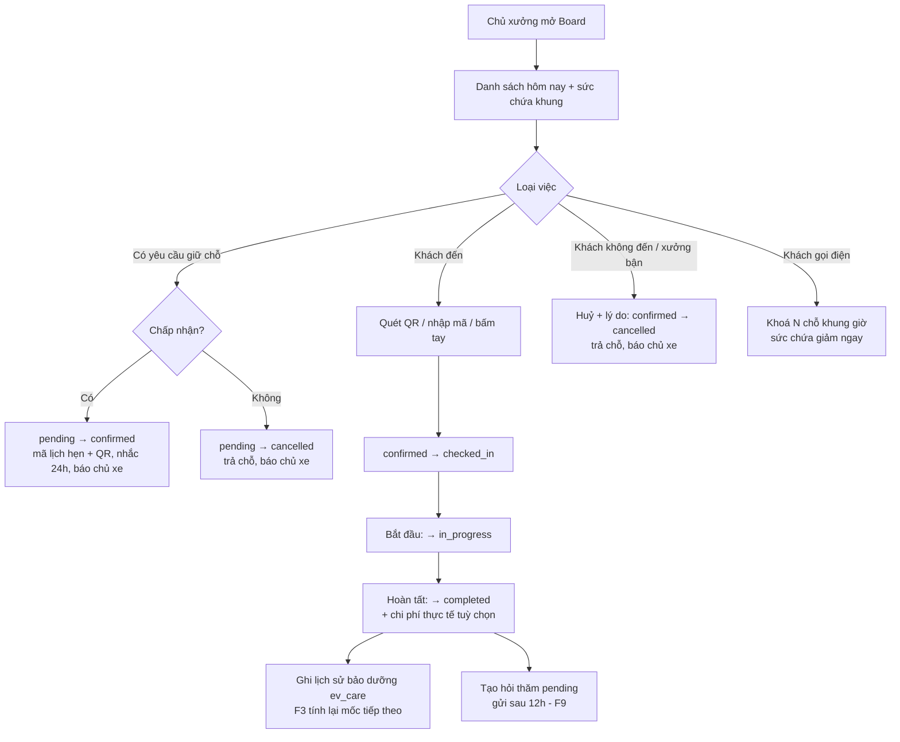
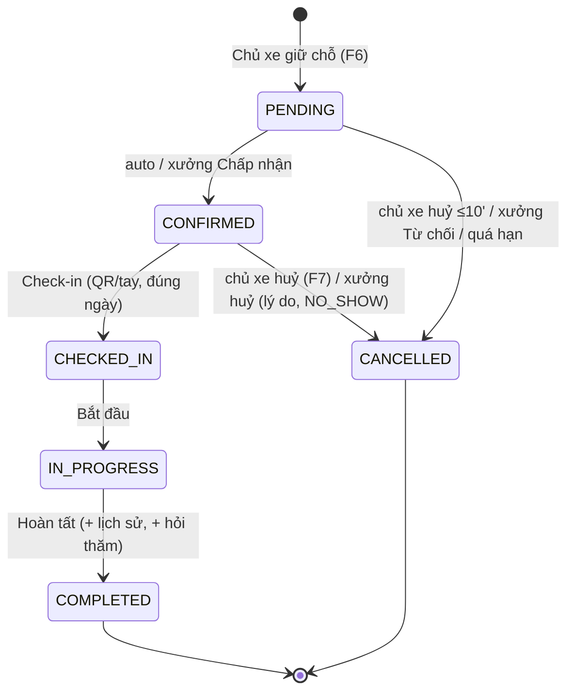

# Functional Specification — Workshop Board (Bảng điều phối lịch hẹn của xưởng)

> Tài liệu đặc tả chức năng/nghiệp vụ cho Feature **F8 — Workshop Board** trong [PRD EV Care MVP](../../../product/PRD_EV_Care_MVP.md#f8--workshop-board).
>
> **Phạm vi:** chủ xưởng xem lịch hẹn của xưởng mình, **chấp nhận / từ chối** yêu cầu giữ chỗ (xưởng chế độ thủ công), **chuyển trạng thái** lịch hẹn theo state machine (check-in bằng QR hoặc bấm tay → bắt đầu → hoàn tất, hoặc huỷ), **khoá bớt chỗ** trong khung giờ, và **đổi chế độ xác nhận** đặt lịch của xưởng.
>
> **Quan hệ tài liệu:** Các quy tắc sức chứa, giữ chỗ, chế độ `auto/manual` và hạn chót xưởng xác nhận đã chốt ở [us-029 FF](us-029-sprint-3-spec.ff.md) (BR-005, BR-014, BR-015) — tài liệu này **tái dùng** và chỉ đặc tả phần **xưởng thao tác**. Duyệt báo giá (F5b) nằm ở đặc tả riêng; Board chỉ dẫn link.
>
> **Ghi chú:** điểm chưa chốt đánh dấu `[Đề xuất]` / `[Cần xác nhận]`, liệt kê ở mục 24.

---

# 1. Document Information

| Field | Value |
|---|---|
| Feature ID | `FEAT-BOARD-001` |
| Feature Name | `Workshop Board — điều phối lịch hẹn của xưởng` |
| PRD Feature | `F8` (Must, S3); liên quan `F6`, `F6b`, `F7`, `F9`, `F5b` |
| Document Version | `v1.0` |
| Status | `Draft` |
| Product / Project | EV Care — AI Agent Chăm sóc sau bán & lịch bảo dưỡng xe điện |
| Business Owner | Lê Đức Tùng (PO) |
| Author | Team 4 Người |
| Reviewer | Tech Lead |
| Stakeholders | Product, Frontend, Backend, Chủ xưởng, Chủ xe |
| Created Date | `2026-09-29` |
| Updated Date | `2026-09-29` |
| Related PRD | [PRD_EV_Care_MVP.md §F8](../../../product/PRD_EV_Care_MVP.md) (v3.6) · PP-05, PP-06 · AC-F8-01, AC-F8-02 |
| Related Frontend Spec | [us-037-sprint-3-spec.fe.md](../frontend/us-037-sprint-3-spec.fe.md) |
| Related API Spec | [us-037-sprint-3-spec.api.md](../api/us-037-sprint-3-spec.api.md) |
| Related Entity Spec | [us-037-sprint-3-spec.entity.md](../entity/us-037-sprint-3-spec.entity.md) |
| Related Specs | [us-029 FF](us-029-sprint-3-spec.ff.md) (đặt lịch, sức chứa) · [us-033 FF](us-033-sprint-3-spec.ff.md) (nhắc hẹn) · [us-041 FF](../../sprint-4/feature-functional/us-041-sprint-4-spec.ff.md) (hỏi thăm sau dịch vụ) · [us-017 FF](../../sprint-2/feature-functional/us-017-sprint-2-spec.ff.md) (lịch sử bảo dưỡng) |
| Related Design / Figma | `[Chưa có]` |
| Related GitHub Issue | `[Cần điền]` |

---

# 2. Feature Overview

## 2.1 Feature Description

Workshop Board là màn làm việc hằng ngày của **chủ xưởng** trên Workshop Portal (desktop-first). Chủ xưởng:

1. **Xem lịch hẹn** của xưởng mình: hôm nay và 7 ngày tới, lọc theo trạng thái, kèm tóm tắt số lượng và sức chứa từng khung giờ.
2. **Chấp nhận / từ chối** yêu cầu giữ chỗ khi xưởng để chế độ **thủ công** (us-029 BR-014).
3. **Chuyển trạng thái** lịch hẹn đúng quy trình: `confirmed → checked_in → in_progress → completed`, hoặc huỷ. Check-in bằng **quét QR** trên Booking Ticket của chủ xe hoặc **bấm tay**.
4. **Hoàn tất** dịch vụ ⇒ hệ thống ghi **lịch sử bảo dưỡng phía EV Care** (mốc tiếp theo của xe được tính lại theo F3) và **lên lịch hỏi thăm** sau 12 giờ, dời sang 08:00 nếu rơi vào giờ yên lặng (F9 — us-041 BR-902).
5. **Khoá bớt chỗ** trong một khung giờ cho khách gọi điện / vãng lai — số chỗ EV Care nhận giảm **ngay** (AC-F8-02).
6. **Đổi chế độ xác nhận** đặt lịch của xưởng: tự động (`auto`) hoặc thủ công (`manual`).

## 2.2 Business Objective

- **PP-06 (overbooking):** chủ xưởng khoá chỗ cho lịch từ kênh khác ⇒ EV Care không nhận vượt số thợ thực có.
- **PP-05 (quá tải giao tiếp):** thay việc gọi điện xác nhận/đổi lịch bằng thao tác trên Board.
- Cung cấp dữ liệu hoàn tất dịch vụ chính xác để tính mốc bảo dưỡng tiếp theo (F3) và kích hoạt chăm sóc sau dịch vụ (F9).

## 2.3 User Objective

Chủ xưởng nhìn một màn là biết hôm nay có ai đến, ai đã xác nhận, khung nào còn chỗ; thao tác tiếp nhận xe nhanh bằng QR; không lo nhận quá sức.

## 2.4 Business Value

- Xưởng: kiểm soát sức chứa, giảm no-show nhờ thấy ai đã "xác nhận sẽ đến" (F7).
- Chủ xe: trạng thái lịch hẹn phản ánh đúng thực tế; được báo khi xưởng chấp nhận / từ chối / huỷ.
- Hệ thống: state machine duy nhất cho booking, có lịch sử chuyển trạng thái để truy vết.

---

# 3. Scope

## 3.1 In Scope

- Danh sách lịch hẹn theo khoảng ngày (mặc định hôm nay; tối đa 7 ngày tới), lọc trạng thái, tìm theo mã lịch hẹn / biển số.
- Chi tiết một lịch hẹn: khách, xe, khung giờ, hạng mục, chi phí ước tính, báo giá gắn kèm (link), "đã xác nhận sẽ đến", lịch sử trạng thái.
- Chấp nhận / từ chối booking `pending` (xưởng `manual`).
- Chuyển trạng thái: check-in (QR / tay), bắt đầu, hoàn tất (nhập chi phí thực tế tuỳ chọn), huỷ (có lý do, gồm "khách không đến").
- Tác động khi hoàn tất: ghi lịch sử bảo dưỡng `ev_care`; tạo hỏi thăm `pending` (F9).
- Xem sức chứa theo khung; khoá / sửa / gỡ khoá chỗ (`workshop_slot_block`).
- Đổi chế độ xác nhận `auto` / `manual` của xưởng.
- Thông báo cho chủ xe khi xưởng chấp nhận, từ chối hoặc huỷ lịch.
- Ghi lịch sử chuyển trạng thái booking (dùng chung cho F6, F7, F8, job).

## 3.2 Out of Scope

- **Duyệt báo giá** (F5b) — Board chỉ hiển thị trạng thái báo giá và link sang màn Duyệt báo giá.
- **Tiến độ chi tiết 6 bước** (`service_progress`, F8b — Could, S4).
- **Xử lý phiếu hỗ trợ** sau dịch vụ — [F9 / us-041](../../sprint-4/feature-functional/us-041-sprint-4-spec.ff.md).
- Tạo booking hộ khách (khách gọi điện) — thay bằng **khoá chỗ**.
- Đổi giờ hẹn thay khách — F6b (chủ xe tự đổi).
- Phân công kỹ thuật viên cụ thể, role nhân viên xưởng (không có trong MVP).
- Nhiều ca/ngày, nghỉ trưa, lịch nghỉ lễ; khoá nhiều khung / lặp theo tuần.
- Xem đoạn hội thoại dẫn tới booking (PRD F4) — phase sau trên Board `[Đề xuất]`.

---

# 4. Actors & Stakeholders

## 4.1 Actors

| Actor | Type | Responsibility |
|---|---|---|
| Chủ xưởng | User | Xem Board; chấp nhận/từ chối; check-in; bắt đầu; hoàn tất; huỷ; khoá chỗ; đổi chế độ xác nhận |
| Chủ xe | User (gián tiếp) | Xuất trình QR khi đến; nhận thông báo từ thao tác của xưởng |
| Booking & Capacity Service | System | State machine booking; khoá chỗ nguyên tử cùng sức chứa (us-029 BR-001) |
| Job hạn chót xưởng xác nhận | System | Tự huỷ `pending` quá hạn (us-029 BR-015) |
| `NotificationService` | System | Gửi thông báo cho chủ xe (us-021) |
| F3 MaintenanceStatusService | System | Tính lại mốc tiếp theo từ lịch sử bảo dưỡng |

## 4.2 Stakeholders

| Stakeholder | Organization / Team | Interest / Responsibility |
|---|---|---|
| Product Owner | Product | Chốt quy tắc check-in, huỷ, no-show, khoá chỗ |
| Backend Team | Engineering | State machine, khoá chỗ nguyên tử, tác động khi hoàn tất |
| Frontend Team | Engineering | Board desktop-first, quét QR |
| Chủ xưởng | Partner | Người dùng chính |

---

# 5. User Story

## US-037

**As a** chủ xưởng đã được hãng xác nhận

**I want to** xem các lịch hẹn hôm nay và 7 ngày tới của xưởng, lọc theo trạng thái

**So that** tôi chuẩn bị nhân lực và biết khách nào sắp đến.

### Additional User Stories

- `US-038`: As a chủ xưởng để chế độ thủ công, I want to chấp nhận hoặc từ chối yêu cầu giữ chỗ, so that tôi chỉ nhận lịch tôi phục vụ được.
- `US-039`: As a chủ xưởng, I want to check-in xe bằng QR hoặc bấm tay rồi cập nhật bắt đầu / hoàn tất, so that trạng thái lịch hẹn và lịch sử bảo dưỡng của xe luôn đúng.
- `US-040`: As a chủ xưởng, I want to khoá bớt chỗ trong một khung giờ và chọn chế độ xác nhận tự động hay thủ công, so that EV Care không nhận quá số thợ tôi còn trống.

---

# 6. Use Case

## UC-801 — Xem Board

**Primary Actor** — Chủ xưởng. **Trigger** — mở Board. **Preconditions** — chủ xưởng đăng nhập, phiên hợp lệ, đã hoàn tất onboarding và gắn đúng một xưởng `active` (FEAT-AUTH-003/004). **Postconditions** — không đổi dữ liệu.

## UC-802 — Chấp nhận / từ chối giữ chỗ (xưởng `manual`)

**Primary Actor** — Chủ xưởng. **Trigger** — có booking `pending` chờ xưởng. **Preconditions** — booking thuộc xưởng, `pending`, chưa quá hạn chót (us-029 BR-015). **Postconditions** — `confirmed` (+ mã lịch hẹn, QR, lên lịch nhắc 24h F7) hoặc `cancelled` (chỗ trả lại); chủ xe được báo.

## UC-803 — Check-in xe

**Primary Actor** — Chủ xưởng. **Trigger** — khách đến xưởng, xuất trình QR (hoặc đọc mã). **Preconditions** — booking thuộc xưởng, `confirmed`, ngày hẹn là hôm nay. **Postconditions** — `checked_in`.

## UC-804 — Bắt đầu và hoàn tất dịch vụ

**Primary Actor** — Chủ xưởng. **Trigger** — bắt đầu làm / nghiệm thu xe. **Postconditions** — `in_progress` → `completed`; lịch sử bảo dưỡng `ev_care` được ghi; hỏi thăm (F9) được lên lịch sau 12h.

## UC-805 — Xưởng huỷ lịch hẹn

**Primary Actor** — Chủ xưởng. **Trigger** — xưởng không phục vụ được, hoặc khách không đến. **Preconditions** — booking `confirmed`. **Postconditions** — `cancelled` với lý do; chỗ trả lại; chủ xe được báo.

## UC-806 — Khoá / gỡ khoá chỗ

**Primary Actor** — Chủ xưởng. **Trigger** — khách gọi điện / vãng lai / bảo trì thiết bị. **Postconditions** — sức chứa khung giảm (hoặc tăng lại) **ngay**.

## UC-807 — Đổi chế độ xác nhận

**Primary Actor** — Chủ xưởng. **Postconditions** — `booking_confirmation_mode` mới áp dụng cho các lần giữ chỗ **sau** thời điểm đổi.

---

# 7. User Flow

## 7.1 Main User Flow



## 7.2 Flow Description

| Step | Actor | Action / Event | System Response | Result |
|---|---|---|---|---|
| 1 | Chủ xưởng | Mở Board | Trả lịch hẹn xưởng mình + sức chứa khung (BR-801, BR-812) | Thấy việc trong ngày |
| 2 | Chủ xưởng | Chấp nhận giữ chỗ | Kiểm tra `pending` + hạn chót (BR-803) | `confirmed` + QR + nhắc 24h |
| 3 | Chủ xưởng | Quét QR khách | Tìm booking theo mã trong xưởng mình, kiểm ngày (BR-805) | `checked_in` |
| 4 | Chủ xưởng | Bắt đầu | `checked_in → in_progress` (BR-802) | Đang làm |
| 5 | Chủ xưởng | Hoàn tất | `in_progress → completed` + ghi lịch sử + tạo hỏi thăm (BR-807) | Xe hoàn tất |
| 6 | Chủ xưởng | Huỷ / không đến | `confirmed → cancelled` + lý do (BR-806) | Chỗ trả lại |
| 7 | Chủ xưởng | Khoá chỗ | Upsert khoá, kiểm tra không khoá chỗ đã có người (BR-809) | Sức chứa giảm ngay |

---

# 8. Screen / UI Flow

> UI minh hoạ **nghiệp vụ**; chi tiết thuộc [Frontend Spec](../frontend/us-037-sprint-3-spec.fe.md).

## 8.1 Screen Flow

```text
[SCR-801 Board lịch hẹn]
    |
    +----> [SCR-802 Chi tiết lịch hẹn] --(Chấp nhận/Từ chối/Check-in/Bắt đầu/Hoàn tất/Huỷ)
    |            |
    |            +----> [SCR-802a Hộp thoại lý do huỷ / từ chối]
    |            +----> [SCR-802b Hộp thoại hoàn tất (chi phí thực tế)]
    |
    +----> [SCR-803 Check-in QR]  --> [SCR-802]
    |
    +----> [SCR-804 Sức chứa & khoá chỗ]
    |
    +----> [SCR-805 Cài đặt đặt lịch (auto/manual)]
```

## 8.2 Screen List

| Screen ID | Screen Name | Purpose | Entry From | Exit To |
|---|---|---|---|---|
| `SCR-801` | Board lịch hẹn | Danh sách + lọc + tóm tắt | Menu Portal, Dashboard xưởng | SCR-802/803/804/805 |
| `SCR-802` | Chi tiết lịch hẹn | Thông tin + hành động theo trạng thái | SCR-801, SCR-803 | SCR-801 |
| `SCR-803` | Check-in QR | Quét QR / nhập mã | SCR-801 | SCR-802 |
| `SCR-804` | Sức chứa & khoá chỗ | Xem khung, khoá/gỡ khoá | SCR-801 | SCR-801 |
| `SCR-805` | Cài đặt đặt lịch | Chọn `auto` / `manual` | Menu Portal | — |

## 8.3 Screen / UI Reference

### SCR-801 — Board lịch hẹn

**Main UI**

- Bộ chọn khoảng: `Hôm nay` / `7 ngày tới` / chọn ngày.
- Thẻ tóm tắt: số lịch **Chờ xưởng xác nhận**, **Đã xác nhận**, **Đã check-in**, **Đang làm**, **Hoàn tất**, **Đã huỷ**.
- Danh sách theo khung giờ: giờ, mã lịch hẹn, tên khách, xe (model + biển số), trạng thái, nhãn **"Khách đã xác nhận đến"** (F7), nhãn **"Hạn xác nhận HH:mm"** với booking chờ xưởng.
- Nút nhanh theo từng dòng (Chấp nhận / Check-in / Bắt đầu / Hoàn tất).

**Business Meaning** — Ảnh chụp công việc của xưởng; chỉ gồm booking của **đúng xưởng mình** (BR-801).

### SCR-803 — Check-in QR

**Main UI** — Khung camera quét QR; ô nhập mã lịch hẹn (dự phòng khi không có camera); kết quả: tên khách, xe, giờ hẹn, nút **Xác nhận check-in**.

**System Behavior** — Quét xong chỉ **tìm** booking; check-in xảy ra khi bấm **Xác nhận check-in** (tránh check-in nhầm do quét lướt) `[Đề xuất]`.

### SCR-804 — Sức chứa & khoá chỗ

**Main UI** — Lưới ngày × khung giờ; mỗi ô: `Công suất`, `Đã đặt`, `Đã khoá`, `Còn nhận`. Chọn ô ⇒ nhập số chỗ khoá, lý do (Khách gọi điện / Khách vãng lai / Bảo trì / Khác), ghi chú.

**Business Meaning** — "Còn nhận" là con số EV Care đang dùng để nhận đặt lịch (us-029 BR-005).

---

# 9. Main Flow

## 9.1 Happy Path

1. 07:45 Thứ 7 04/10, chủ xưởng Smart City mở Board: 6 lịch `confirmed`, 4 lịch có nhãn "Khách đã xác nhận đến".
2. 08:55 khách VF6 đến, mở Booking Ticket; chủ xưởng vào SCR-803 quét QR ⇒ thấy đúng khách, bấm **Xác nhận check-in** ⇒ `checked_in`.
3. 09:05 bấm **Bắt đầu** ⇒ `in_progress`.
4. 10:40 bấm **Hoàn tất**, nhập chi phí thực tế 1.850.000 ⇒ `completed`.
5. Hệ thống ghi lịch sử bảo dưỡng `ev_care` (ngày 04/10, ODO hiện tại), F3 tính mốc tiếp theo; tạo hỏi thăm `pending`: 10:40 + 12h = 22:40 rơi vào giờ yên lặng ⇒ gửi lúc 08:00 ngày 05/10 (F9 — us-041 BR-902).

---

# 10. Alternative Flow

## AF-801 — Xưởng thủ công chấp nhận giữ chỗ

**Condition** — Xưởng `manual`; có booking `pending` chờ xưởng.

**Flow** — Chủ xưởng mở chi tiết, bấm **Chấp nhận** ⇒ `pending → confirmed`, sinh mã lịch hẹn + QR, lên lịch nhắc 24h (us-033), báo chủ xe "Xưởng đã xác nhận lịch hẹn".

**Expected Result** — Chủ xe có lịch hẹn chính thức (us-029 AC-010).

## AF-802 — Xưởng từ chối giữ chỗ

**Condition** — Xưởng không phục vụ được khung đó.

**Flow** — Bấm **Từ chối**, chọn lý do ⇒ `pending → cancelled`, trả chỗ; báo chủ xe kèm lời mời chọn lại (gợi ý xưởng `auto` — us-029 EF-006).

## AF-803 — Check-in bấm tay

**Condition** — Khách không mở được QR.

**Flow** — Chủ xưởng tìm theo mã lịch hẹn / biển số trên Board, bấm **Check-in** ⇒ cùng quy tắc BR-805.

## AF-804 — Khách không đến (no-show)

**Condition** — Đã qua giờ hẹn + `NO_SHOW_GRACE_MINUTES` (mặc định 30) mà khách chưa check-in.

**Flow** — Chủ xưởng bấm **Huỷ — khách không đến** ⇒ `confirmed → cancelled` với lý do `NO_SHOW`. Không gửi hỏi thăm.

**Expected Result** — Chỗ trả lại; số liệu no-show đo được (PP-07).

## AF-805 — Khoá chỗ cho khách gọi điện

**Condition** — Khách gọi điện đặt 2 chỗ khung 09:00 Thứ 7.

**Flow** — SCR-804 chọn ô, nhập 2, lý do "Khách gọi điện" ⇒ `Còn nhận` giảm 2 ngay; lần kiểm tra chỗ tiếp theo từ chủ xe (F6) thấy con số mới (AC-F8-02).

## AF-806 — Gỡ khoá

**Flow** — Đặt số chỗ khoá về 0 ⇒ bản ghi khoá bị xoá, `Còn nhận` tăng lại ngay.

## AF-807 — Đổi chế độ xác nhận

**Flow** — SCR-805 chọn `manual` ⇒ lần giữ chỗ tiếp theo sẽ chờ xưởng. Booking `pending` đã có **không** đổi cách xử lý (BR-811).

---

# 11. Exception Flow

## EF-801 — Chuyển trạng thái trái quy trình

**Condition** — Ví dụ `confirmed → completed`, `checked_in → cancelled`.

**System Behavior** — Từ chối, không đổi dữ liệu (AC-F8-01).

**User Experience** — "Không thể chuyển từ Đã xác nhận sang Hoàn tất. Hãy check-in trước."

## EF-802 — Hai người/hai tab thao tác cùng lúc, hoặc chủ xe vừa huỷ

**Condition** — Trạng thái booking đã đổi so với lúc Board tải.

**System Behavior** — Chỉ thao tác đầu tiên có hiệu lực; thao tác sau bị từ chối vì trạng thái không còn khớp.

**User Experience** — "Lịch hẹn vừa được cập nhật (Đã huỷ bởi khách)." Board tự tải lại dòng đó.

## EF-803 — QR không thuộc xưởng / sai ngày / không hợp lệ

**System Behavior** — Không tiết lộ booking của xưởng khác (trả "không tìm thấy"); đúng xưởng nhưng khác ngày ⇒ nêu ngày hẹn thật; đã check-in ⇒ báo "đã check-in lúc HH:mm".

## EF-804 — Chấp nhận khi đã quá hạn chót xưởng xác nhận

**Condition** — Job us-029 BR-015 đã huỷ booking.

**System Behavior** — Từ chối; nêu "Yêu cầu đã quá hạn xác nhận và bị huỷ tự động".

## EF-805 — Khoá nhiều hơn số chỗ còn trống

**Condition** — Khung có 5 chỗ khả dụng, đã có 4 booking; chủ xưởng khoá 3.

**System Behavior** — Từ chối; chỉ được khoá tối đa phần **còn trống** (1) — **không** huỷ booking đã có (BR-809).

**User Experience** — "Chỉ còn 1 chỗ trống để khoá. Các lịch đã đặt không bị ảnh hưởng."

## EF-806 — Khoá chỗ đồng thời với chủ xe đặt lịch

**System Behavior** — Khoá chỗ đi qua **cùng** cơ chế khoá nguyên tử với đặt lịch (us-029 BR-001) ⇒ không bao giờ `đã đặt + đã khoá > công suất`.

## EF-807 — Tác động khi hoàn tất bị lỗi

**Condition** — Ghi lịch sử bảo dưỡng hoặc tạo hỏi thăm lỗi.

**System Behavior** — Toàn bộ thao tác hoàn tất nằm trong **một** transaction: lỗi ⇒ rollback, booking vẫn `in_progress`, chủ xưởng thử lại (BR-807). Gửi thông báo cho chủ xe **không** nằm trong transaction.

---

# 12. Business Rules

## BR-801 — Chủ xưởng chỉ thấy và thao tác xưởng mình

**Rule** — Mọi dữ liệu Board lọc theo `booking.workshop_id = xưởng của chủ xưởng đang đăng nhập` (`workshop.owner_id`). Booking xưởng khác ⇒ xử lý như không tồn tại.

**Priority** — High

## BR-802 — State machine booking (AC-F8-01)

**Rule** — Chỉ cho phép các chuyển trạng thái sau (các trạng thái và chuyển khác bị từ chối):

| Từ | Sang | Ai | Điều kiện | Rule |
|---|---|---|---|---|
| `pending` | `confirmed` | Hệ thống (xưởng `auto`) / Chủ xưởng (Chấp nhận) | Còn trong hạn chót | us-029 BR-014, BR-803 |
| `pending` | `cancelled` | Chủ xe (≤ 10') / Chủ xưởng (Từ chối) / Job (quá hạn) | | us-029 BR-010/015, BR-804 |
| `confirmed` | `checked_in` | Chủ xưởng | Ngày hẹn = hôm nay | BR-805 |
| `confirmed` | `cancelled` | Chủ xe (F7) / Chủ xưởng (Huỷ) | Theo từng bên | us-033 BR-709, BR-806 |
| `checked_in` | `in_progress` | Chủ xưởng | | — |
| `in_progress` | `completed` | Chủ xưởng | | BR-807 |

`completed` và `cancelled` là trạng thái cuối. Không có chuyển lùi.

**Priority** — High

## BR-803 — Chấp nhận giữ chỗ

**Rule** — Chỉ chấp nhận booking `pending` của xưởng, khi `now ≤ hạn chót xưởng xác nhận` (us-029 BR-015) và `now < giờ hẹn`. Chấp nhận ⇒ `confirmed`, sinh mã lịch hẹn + QR (us-029), lên lịch nhắc 24h (us-033 BR-702), báo chủ xe (BR-810).

**Note** — Không cần kiểm tra lại sức chứa: booking `pending` đã được tính vào chỗ đã đặt từ lúc giữ (us-029 BR-005).

**Priority** — High

## BR-804 — Từ chối giữ chỗ

**Rule** — Từ chối cần **lý do** (`FULLY_BOOKED` / `NOT_SUPPORTED_SERVICE` / `WORKSHOP_UNAVAILABLE` / `OTHER` + ghi chú). ⇒ `cancelled`, trả chỗ ngay, báo chủ xe.

**Priority** — High

## BR-805 — Check-in

**Rule** — Check-in khi booking `confirmed` và `booking_date = hôm nay` (Asia/Ho_Chi_Minh), bất kể đến sớm hay muộn trong ngày `[Đề xuất — Q-801]`. Tìm bằng **mã lịch hẹn** (từ QR hoặc nhập tay) **trong phạm vi xưởng mình**. Đã `checked_in` ⇒ trả kết quả hiện tại, không lỗi (idempotent).

**Priority** — High

## BR-806 — Xưởng huỷ lịch `confirmed`

**Rule** — Chủ xưởng được huỷ booking `confirmed` với lý do bắt buộc:

- `NO_SHOW` — chỉ khi `now ≥ giờ hẹn + NO_SHOW_GRACE_MINUTES` (mặc định 30) `[Đề xuất — Q-802]`.
- `WORKSHOP_UNAVAILABLE` / `CUSTOMER_REQUEST` / `OTHER` (+ ghi chú) — bất kỳ lúc nào trước khi check-in.

⇒ `cancelled`, chỗ trả lại ngay, lời nhắc 24h chưa gửi bị bỏ qua (us-033 BR-707), báo chủ xe (trừ `NO_SHOW` `[Đề xuất]`).

**Priority** — High

## BR-807 — Hoàn tất và các tác động

**Rule** — `in_progress → completed` trong **một** transaction gồm:

1. Cập nhật `booking.status = completed`, `actual_cost` nếu chủ xưởng nhập (≥ 0).
2. Ghi **lịch sử bảo dưỡng nguồn EV Care** cho xe: ngày = ngày hẹn, ODO = ODO hiện tại đã đồng bộ từ hãng (có thể trống) — us-017 BR-ENT-435. F3 tự tính mốc tiếp theo từ bản ghi này. **Không** ghi/sửa ODO (ODO chỉ từ hãng — us-017).
3. Tạo **hỏi thăm** `pending` với thời điểm gửi = thời điểm hoàn tất + `FOLLOW_UP_DELAY_HOURS` (12 — Q-412), dời khỏi giờ yên lặng — us-041 BR-901, BR-902.
4. Ghi lịch sử trạng thái.

Lỗi bất kỳ bước nào ⇒ rollback toàn bộ (EF-807).

**Priority** — High

## BR-808 — Ghi lịch sử trạng thái

**Rule** — **Mọi** lần booking đổi trạng thái (từ bất kỳ nguồn nào: F6 đặt lịch, F7 chủ xe huỷ, F8 xưởng, job) ghi một sự kiện: từ → sang, ai (chủ xe / chủ xưởng / hệ thống), nguồn, lý do, thời điểm. Chỉ thêm, không sửa/xoá.

**Priority** — Medium

## BR-809 — Khoá chỗ

**Rule** — Chủ xưởng đặt **số chỗ khoá** cho một `(ngày, khung giờ)`:

- Ngày trong `[hôm nay, hôm nay + SLOT_BLOCK_MAX_DAYS_AHEAD]` (mặc định 30); khung nằm trong giờ hoạt động (us-029 BR-006).
- `số chỗ khoá ≤ total_technicians − emergency_slots_reserved − số booking đang mở của khung` — tức chỉ khoá được phần **còn trống**; không làm mất booking đã có (EF-805).
- Đặt 0 ⇒ gỡ khoá.
- Thực hiện dưới **cùng khoá nguyên tử** với đặt lịch (us-029 BR-001) (EF-806).
- Có hiệu lực **ngay** với chủ xe (AC-F8-02).

**Priority** — High

## BR-810 — Thông báo cho chủ xe

**Rule** — Gửi qua `NotificationService` (kênh chủ xe đã bật — us-021) khi: xưởng **chấp nhận**, **từ chối**, hoặc **huỷ** (trừ `NO_SHOW`). Nội dung: xưởng, giờ hẹn, kết quả, link mở chi tiết lịch hẹn (us-033 SCR-701); không PII. Gửi **sau** khi commit; lỗi gửi không ảnh hưởng thao tác của xưởng `[Đề xuất — best effort, Q-804]`.

**Priority** — Medium

## BR-811 — Chế độ xác nhận

**Rule** — Chủ xưởng đổi `booking_confirmation_mode` (`auto` / `manual`, mặc định `auto` — us-029 Q-405). Chế độ mới chỉ áp dụng cho lần giữ chỗ **sau** thời điểm đổi; booking `pending` đang chờ xưởng vẫn cần chủ xưởng xử lý hoặc hết hạn theo BR-015 `[Đề xuất — Q-803]`.

**Priority** — Medium

## BR-812 — Phạm vi thời gian của Board

**Rule** — Danh sách mặc định **hôm nay**; tối đa xem 7 ngày tới trong một lần; được xem ngày đã qua (tối đa 30 ngày trước) để tra cứu `[Đề xuất]`.

**Priority** — Low

## BR-813 — Dữ liệu khách hiển thị cho xưởng

**Rule** — Chủ xưởng thấy: tên khách, số điện thoại (để liên hệ), model, **biển số đầy đủ** (để nhận xe), hạng mục, chi phí ước tính, báo giá gắn kèm, nhãn xác nhận đến. **Không** thấy VIN đầy đủ, CCCD, email, lịch sử chat `[Cần xác nhận — Q-805]`.

**Priority** — High

---

# 13. State / Status

## 13.1 State List

| State | Meaning | Entry Condition | Exit Condition |
|---|---|---|---|
| `PENDING` | Giữ chỗ; chờ xưởng (xưởng `manual`) | Chủ xe bấm Xác nhận (us-029) | `CONFIRMED` / `CANCELLED` |
| `CONFIRMED` | Lịch hẹn chính thức | `auto` hoặc xưởng chấp nhận (BR-803) | `CHECKED_IN` / `CANCELLED` |
| `CHECKED_IN` | Xe đã đến xưởng | Check-in (BR-805) | `IN_PROGRESS` |
| `IN_PROGRESS` | Đang làm dịch vụ | Bắt đầu | `COMPLETED` |
| `COMPLETED` | Hoàn tất | Hoàn tất (BR-807) | — |
| `CANCELLED` | Đã huỷ | Chủ xe / xưởng / job (BR-802) | — |

## 13.2 State Transition



---

# 14. Data Requirements

## 14.1 Required Data

| Data | Type | Required | Description | Source |
|---|---|---:|---|---|
| Xưởng của chủ xưởng | object | Yes | Phạm vi dữ liệu, công suất, chế độ xác nhận | `workshop` (ENT-008) |
| Lịch hẹn | list | Yes | Trạng thái, ngày, khung, mã, chi phí | `booking` (ENT-402) |
| Khách + xe | object | Yes | Tên, SĐT, model, biển số | `vehicle_user`, `user_vehicle` |
| Xác nhận sẽ đến | datetime | No | Nhãn trên Board | `booking.attendance_confirmed_at` (us-033) |
| Chỗ khoá | int / khung | No | Khoá tay | `workshop_slot_block` (ENT-418, us-029) |
| Giờ hoạt động | list | Yes | Ràng buộc khung | `workshop_operating_hour` (ENT-009) |
| Lịch sử trạng thái | list | Yes | Truy vết | `booking_status_event` (ENT-426, **mới**) |
| Báo giá gắn kèm | object | No | Trạng thái + link | `quote` (ENT-410) |
| ODO hiện tại | int | No | Ghi vào lịch sử khi hoàn tất | `vehicle_odometer_reading` (ENT-414) |

## 14.2 Data Dependency

| Data / Entity | Why Needed | Read / Write | Owner |
|---|---|---|---|
| `booking` | Board + state machine | Read / Write | Backend |
| `booking_status_event` (ENT-426) | Lịch sử trạng thái | Write / Read | Backend |
| `workshop` | Chế độ xác nhận | Read / Write | Backend |
| `workshop_slot_block` | Khoá chỗ | Read / Write | Backend |
| `vehicle_service_record` (ENT-415) | Lịch sử bảo dưỡng `ev_care` khi hoàn tất | Write | Backend |
| `follow_up` (ENT-412) | Hỏi thăm sau hoàn tất | Write | Backend |
| `booking_reminder` (ENT-424) | Lên lịch/bỏ qua nhắc 24h | Write | Backend |

---

# 15. Business Error & Edge Cases

| Case ID | Scenario | Expected Business Behavior | User Outcome |
|---|---|---|---|
| `EDGE-801` | `confirmed → completed` | Từ chối (BR-802) | Được hướng dẫn check-in trước |
| `EDGE-802` | Chủ xe huỷ ngay trước khi xưởng check-in | Bên đến trước thắng; bên sau bị từ chối (EF-802) | Board thấy "Đã huỷ bởi khách" |
| `EDGE-803` | QR của xưởng khác | "Không tìm thấy" (BR-801) | Không lộ dữ liệu |
| `EDGE-804` | QR đúng xưởng nhưng hẹn ngày mai | Từ chối check-in, nêu ngày hẹn (BR-805) | Biết khách đến nhầm ngày |
| `EDGE-805` | Quét QR lần hai | Trả trạng thái đã check-in (idempotent) | Không lỗi |
| `EDGE-806` | Chấp nhận khi đã quá hạn chót | Từ chối (EF-804) | Thấy đã tự huỷ |
| `EDGE-807` | Khoá vượt chỗ trống | Từ chối, nêu số tối đa (EF-805) | Khoá đúng số |
| `EDGE-808` | Khoá khung ngoài giờ hoạt động / ngày quá khứ | Từ chối (BR-809) | Chọn lại |
| `EDGE-809` | Hoàn tất khi xe chưa có ODO từ hãng | Vẫn hoàn tất; lịch sử ghi ODO trống (us-017 EDGE-001) | Bình thường |
| `EDGE-810` | Huỷ `NO_SHOW` trước giờ hẹn + 30' | Từ chối (BR-806) | Chờ đủ thời gian |
| `EDGE-811` | Đổi `auto → manual` khi đang có booking `pending` | Booking cũ giữ nguyên cách xử lý (BR-811) | — |
| `EDGE-812` | Xưởng bị hãng chuyển `inactive` | Không cho thao tác mới; lịch đã có vẫn xem được `[Đề xuất]` | Thấy cảnh báo |
| `EDGE-813` | Gửi thông báo cho chủ xe lỗi | Thao tác của xưởng vẫn thành công (BR-810) | — |
| `EDGE-814` | Khách đến sớm/muộn trong cùng ngày | Vẫn check-in được (BR-805) | — |

---

# 16. Permissions & Access

## 16.1 Access Matrix

| Role / Actor | View | Create | Update | Delete | Notes |
|---|---:|---:|---:|---:|---|
| Chủ xưởng | ✅ (xưởng mình) | ✅ (khoá chỗ) | ✅ (trạng thái, khoá, chế độ) | ✅ (gỡ khoá) | BR-801 |
| Chủ xe | ✅ (booking của mình — us-033) | ❌ | ✅ (huỷ — us-033) | ❌ | Không vào Board |
| Hệ thống / job | ✅ | ✅ (sự kiện) | ✅ (auto confirm, quá hạn) | ❌ | us-029 |

## 16.2 Business Authorization Rules

- Chủ xưởng phải có phiên hợp lệ (FEAT-AUTH-004), onboarding hoàn tất, gắn đúng 1 xưởng `active` (FEAT-AUTH-003).
- Không role nhân viên / admin trong MVP.
- Dữ liệu khách theo BR-813.

---

# 17. Acceptance Criteria

## AC-801 — Board chỉ gồm xưởng mình

**Given** chủ xưởng A (Smart City) và booking của xưởng B (Mỹ Đình)

**When** A mở Board hoặc gọi chi tiết booking của B

**Then** booking của B không xuất hiện / trả "không tìm thấy".

## AC-802 — Không chuyển trái state machine (AC-F8-01)

**Given** booking `confirmed`

**When** chủ xưởng yêu cầu chuyển sang `completed`

**Then** hệ thống từ chối; booking vẫn `confirmed`.

## AC-803 — Khoá chỗ có hiệu lực ngay (AC-F8-02)

**Given** khung 09:00 04/10 còn nhận 3 chỗ

**When** chủ xưởng khoá 2 chỗ

**Then** kiểm tra chỗ từ phía chủ xe (F6) ngay sau đó trả `remaining = 1`.

## AC-804 — Không khoá chỗ đã có người đặt

**Given** khung còn trống 1 chỗ

**When** chủ xưởng khoá 3

**Then** bị từ chối, nêu tối đa khoá được 1; không booking nào bị huỷ.

## AC-805 — Chấp nhận giữ chỗ

**Given** xưởng `manual`, booking `pending` còn trong hạn

**When** chủ xưởng bấm Chấp nhận

**Then** booking `confirmed` có mã lịch hẹn + QR; lời nhắc 24h được lên lịch; chủ xe nhận thông báo.

## AC-806 — Check-in bằng QR

**Given** booking `confirmed` hẹn hôm nay tại xưởng

**When** chủ xưởng quét QR và bấm Xác nhận check-in

**Then** booking `checked_in`; quét lại lần hai trả trạng thái đã check-in, không lỗi.

## AC-807 — Hoàn tất tạo lịch sử và hỏi thăm

**Given** booking `in_progress`

**When** chủ xưởng bấm Hoàn tất lúc 10:40

**Then** booking `completed`; có đúng một bản ghi lịch sử bảo dưỡng nguồn EV Care cho booking; có đúng một hỏi thăm `pending` hẹn gửi 08:00 hôm sau (22:40 rơi vào giờ yên lặng — us-041 BR-902); trạng thái đến hạn của xe (F3) tính theo lần bảo dưỡng này.

## AC-808 — Hoàn tất nguyên tử

**Given** ghi hỏi thăm bị lỗi

**When** chủ xưởng bấm Hoàn tất

**Then** booking vẫn `in_progress`, không có bản ghi lịch sử bảo dưỡng mới.

## AC-809 — Xưởng huỷ giải phóng chỗ + báo khách

**Given** booking `confirmed` còn 1 ngày tới giờ hẹn

**When** chủ xưởng huỷ với lý do "Xưởng bận đột xuất"

**Then** booking `cancelled`, chỗ trả lại ngay, lời nhắc 24h không gửi, chủ xe nhận thông báo huỷ.

## AC-810 — No-show

**Given** booking `confirmed` 09:00 hôm nay, khách chưa đến

**When** 09:20 chủ xưởng chọn "Khách không đến"

**Then** bị từ chối (chưa đủ 30'); lúc 09:31 thì thành công với lý do `NO_SHOW`.

## AC-811 — Lịch sử trạng thái đầy đủ

**Given** một booking đi hết `pending → confirmed → checked_in → in_progress → completed`

**When** mở chi tiết

**Then** thấy 5 sự kiện theo thứ tự thời gian, mỗi sự kiện có người thực hiện và nguồn.

---

# 18. Non-functional Expectations

| Requirement | Expected Behavior |
|---|---|
| Response Experience | Tải Board ≤ 500 ms (p90) với ≤ 200 booking/tuần; chuyển trạng thái ≤ 500 ms (p90) — PRD §8 |
| Correctness | State machine kiểm tra ở backend; khoá chỗ nguyên tử cùng đặt lịch |
| Freshness | Board tự làm mới mỗi 60 giây `[Đề xuất]`; realtime là phase sau |
| Duplicate Handling | Check-in / hoàn tất idempotent theo trạng thái |
| Device | Desktop-first; màn check-in dùng được trên điện thoại (camera) |

---

# 19. Dependencies

| Dependency | Purpose | Owner | Required | Related Document |
|---|---|---|---:|---|
| FEAT-AUTH-003/004 | Chủ xưởng, xưởng, phiên | Backend | Yes | [us-009](../../sprint-1/feature-functional/us-009-sprint-1-spec.ff.md), [us-013](../../sprint-1/feature-functional/us-013-sprint-1-spec.ff.md) |
| F6 — us-029 | Sức chứa, giữ chỗ, `auto/manual`, hạn chót | Backend | Yes | [us-029 FF](us-029-sprint-3-spec.ff.md) |
| F7 — us-033 | Nhắc 24h, xác nhận đến | Backend | Yes | [us-033 FF](us-033-sprint-3-spec.ff.md) |
| F3 — us-017 | Lịch sử bảo dưỡng `ev_care`, mốc tiếp theo | Backend | Yes | [us-017 FF](../../sprint-2/feature-functional/us-017-sprint-2-spec.ff.md) |
| F9 — us-041 | Hỏi thăm sau dịch vụ | Backend | No (Could) | [us-041 FF](../../sprint-4/feature-functional/us-041-sprint-4-spec.ff.md) |
| F5b — Báo giá | Hiển thị/duyệt báo giá | Backend/FE | No | PRD §F5b |
| us-021 | `NotificationService` | Backend | Yes | [us-021 FF](../../sprint-2/feature-functional/us-021-sprint-2-spec.ff.md) |

---

# 20. Assumptions

- Mỗi chủ xưởng quản lý đúng 1 xưởng; không có nhân viên.
- Booking Ticket (F6b) hiển thị QR chứa **mã lịch hẹn**; nếu F6b chưa có, QR lấy từ `qrUrl` của us-029.
- Chủ xưởng dùng máy tính có webcam hoặc điện thoại để quét; luôn có ô nhập mã dự phòng.
- Số booking mỗi xưởng/ngày nhỏ (≤ 50) ⇒ không cần phân trang phức tạp trên Board.

---

# 21. Business Constraints

- Không vượt sức chứa kể cả khi khoá chỗ đồng thời với đặt lịch (PP-06).
- Chủ xưởng chỉ thấy dữ liệu xưởng mình (PRD §7 Privacy).
- ODO không được sửa tay; lịch sử bảo dưỡng `ev_care` chỉ tạo khi hoàn tất qua Board (us-017).
- Mỗi booking tối đa 1 hỏi thăm (BR-006 core, us-041).

---

# 22. Terminology / Glossary

| Term ID | Term | Vietnamese Name | Definition | Example / Notes |
|---|---|---|---|---|
| `TERM-801` | Workshop Board | Bảng điều phối lịch hẹn | Màn làm việc của chủ xưởng với lịch hẹn của xưởng mình | Portal `/technician/board` |
| `TERM-802` | Accept / Reject hold | Chấp nhận / Từ chối giữ chỗ | Xưởng `manual` xử lý booking `pending` | us-029 BR-014 |
| `TERM-803` | Check-in | Tiếp nhận xe | Xác nhận xe đã đến xưởng, bằng QR hoặc bấm tay | Chỉ trong ngày hẹn |
| `TERM-804` | No-show | Khách không đến | Huỷ với lý do `NO_SHOW` sau giờ hẹn + 30' | PP-07 |
| `TERM-805` | Slot block | Khoá chỗ | Số thợ giữ ngoài EV Care cho một khung | ENT-418 |
| `TERM-806` | Status event | Sự kiện trạng thái | Một lần booking đổi trạng thái, có người thực hiện và nguồn | ENT-426 |
| `TERM-807` | EV Care service record | Lịch sử bảo dưỡng phía EV Care | Bản ghi lịch sử nguồn `ev_care` tạo khi hoàn tất | us-017 ENT-415 |

### Important Terminology Rules

- "Huỷ" của xưởng luôn đi kèm lý do; "Từ chối" chỉ dùng cho booking `pending`.
- "Còn nhận" = sức chứa khả dụng còn lại theo us-029 BR-005 — không dùng "còn trống" cho con số khác.

---

# 23. Partner / Stakeholder Notes

## 23.1 Confirmed

- State machine `confirmed → checked_in → in_progress → completed` hoặc `cancelled`; check-in bằng QR hoặc bấm tay (PRD F8).
- `completed` kích hoạt cập nhật lịch sử + mốc tiếp theo + hỏi thăm (PRD F8, Q-412).
- Khoá chỗ giảm ngay số chỗ còn nhận (AC-F8-02).
- Chế độ xác nhận mặc định `auto` (us-029 Q-405).

## 23.2 Pending Confirmation

- Q-801 → Q-806 (mục 24).

---

# 24. Open Questions

| ID | Question | Owner | Status | Decision / Due Date |
|---|---|---|---|---|
| `Q-801` | Check-in được phép trong khoảng nào? | PO | Open | `[Đề xuất]` Cả ngày hẹn (BR-805) |
| `Q-802` | Thời gian chờ trước khi được đánh dấu no-show? | PO | Open | `[Đề xuất]` 30 phút (`NO_SHOW_GRACE_MINUTES`) |
| `Q-803` | Đổi `manual → auto` có tự xác nhận các booking `pending` đang chờ không? | PO | Open | `[Đề xuất]` Không (BR-811) |
| `Q-804` | Thông báo cho chủ xe khi xưởng thao tác: best effort hay có bảng theo dõi gửi như nhắc hẹn? | Backend | Open | `[Đề xuất]` Best effort + log ở MVP |
| `Q-805` | Chủ xưởng có được thấy SĐT khách không? | PO | Open | `[Đề xuất]` Có (cần để liên hệ), không thấy VIN/CCCD/email |
| `Q-806` | `checked_in → cancelled` (khách bỏ về trước khi làm)? | PO | Open | `[Đề xuất]` Không trong MVP; xưởng hoàn tất với chi phí 0 hoặc liên hệ hỗ trợ |

---

# 25. Traceability

| Item | Reference |
|---|---|
| PRD | F8 (v3.6); PP-05, PP-06, PP-07; AC-F8-01, AC-F8-02 |
| User Story | `US-037` → `US-040` |
| Use Case | `UC-801` → `UC-807` |
| Business Rules | `BR-801` → `BR-813` |
| Acceptance Criteria | `AC-801` → `AC-811` |
| Frontend Specification | [us-037-sprint-3-spec.fe.md](../frontend/us-037-sprint-3-spec.fe.md) |
| API Specification | [us-037-sprint-3-spec.api.md](../api/us-037-sprint-3-spec.api.md) |
| Entity Specification | [us-037-sprint-3-spec.entity.md](../entity/us-037-sprint-3-spec.entity.md) |
| Test Cases | `[Chưa có]` |
| GitHub Issue / Epic | `[Cần điền]` |

---

# 26. Related Documents

- [PRD EV Care MVP](../../../product/PRD_EV_Care_MVP.md)
- [us-029 — Đặt lịch theo sức chứa & vị trí](us-029-sprint-3-spec.ff.md)
- [us-033 — Nhắc lịch hẹn 24h](us-033-sprint-3-spec.ff.md)
- [us-041 — Hỏi thăm sau dịch vụ & phiếu hỗ trợ](../../sprint-4/feature-functional/us-041-sprint-4-spec.ff.md)
- [us-017 — Hồ sơ xe & trạng thái đến hạn](../../sprint-2/feature-functional/us-017-sprint-2-spec.ff.md)
- [booking.entity.md](../../entity/maintenance/booking.entity.md) · [workshop.entity.md](../../entity/workshop/workshop.entity.md)

---

# 27. Change Log

| Version | Date | Author | Change |
|---|---|---|---|
| `v1.0` | `2026-09-29` | Team 4 Người | Initial version từ PRD v3.6 §F8 + us-029 (BR-005, BR-014, BR-015) |

---

# 28. Approval

| Role | Name | Status | Date |
|---|---|---|---|
| Product Owner | Lê Đức Tùng | Pending | |
| Business Stakeholder | Chủ xưởng (đại diện) | Pending | |
| Technical Owner | Tech Lead | Pending | |
