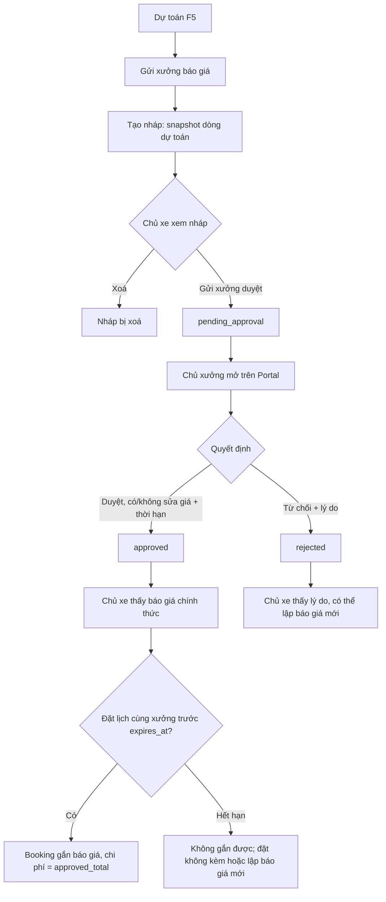
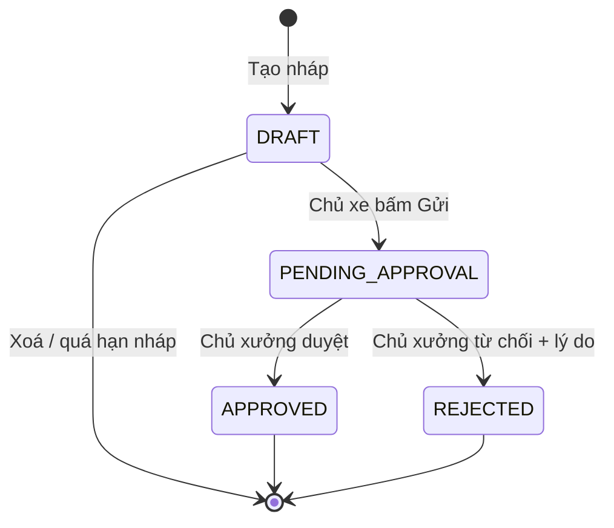

# Functional Specification — Báo giá có chủ xưởng duyệt (HITL)

> Đặc tả nghiệp vụ cho Feature **F5b — Báo giá HITL** trong [PRD EV Care MVP](../../../product/PRD_EV_Care_MVP.md#f5b--báo-giá-hitl).
>
> **Quan hệ tài liệu:** Tầng hội thoại đã đặc tả tại [AI-005 Quote HITL Agent](../../ai-agent/ai-005-sprint-3-spec.agent.md). Tài liệu này là **nguồn nghiệp vụ chính** cho chat, app chủ xe và Workshop Portal; khi khác nhau, tài liệu này là chuẩn.
>
> **Quy ước mã:** dải `11xx` (`UC-11xx`, `BR-11xx`, `EDGE-11xx`, `AC-11xx`, `SCR-11xx`, `Q-11xx`).
>
> Điểm chưa chốt đánh dấu `[Đề xuất]` hoặc `[Cần xác nhận]`, liệt kê ở mục 24.

---

# 1. Document Information

| Field | Value |
|---|---|
| Feature ID | `FEAT-QUOTE-001` |
| Feature Name | `Báo giá có chủ xưởng duyệt (HITL)` |
| PRD Feature | `F5b` (Should, S3); liên quan `F5`, `F6`, `F8` |
| Document Version | `v1.0` |
| Status | `Draft` |
| Product / Project | EV Care — AI Agent Chăm sóc sau bán & lịch bảo dưỡng xe điện |
| Business Owner | Lê Đức Tùng (PO) |
| Author | Team 4 Người |
| Reviewer | Tech Lead |
| Stakeholders | Product, Frontend, Backend, AI Team, Chủ xưởng |
| Created Date | `2026-09-30` |
| Updated Date | `2026-09-30` |
| Related PRD | [PRD_EV_Care_MVP.md §F5b, §7](../../../product/PRD_EV_Care_MVP.md) (v3.6) · core BR-004 · EF-002 |
| Related Frontend Spec | [us-049-sprint-3-spec.fe.md](../frontend/us-049-sprint-3-spec.fe.md) |
| Related API Spec | [us-049-sprint-3-spec.api.md](../api/us-049-sprint-3-spec.api.md) |
| Related Entity Spec | [us-049-sprint-3-spec.entity.md](../entity/us-049-sprint-3-spec.entity.md) |
| Related Agent Spec | [ai-005-sprint-3-spec.agent.md](../../ai-agent/ai-005-sprint-3-spec.agent.md) |
| Related Design / Figma | `[Chưa có]` — mock: `/technician/quotes`, `/technician/quote-review` |
| Related GitHub Issue | `[Cần điền]` |

---

# 2. Feature Overview

## 2.1 Feature Description

Từ một **dự toán** (F5), chủ xe lập **báo giá nháp** cho một xưởng và bấm **"Gửi xưởng duyệt"**. Chủ xưởng xem trên Workshop Portal và **duyệt** (có thể sửa giá từng dòng, chọn thời hạn hiệu lực) hoặc **từ chối** kèm lý do. Báo giá đã duyệt còn hạn có thể gắn vào lịch hẹn (F6) — khi đó chi phí của lịch hẹn là con số chủ xưởng đã duyệt và **không** còn gắn nhãn "ước tính".

**Đặt lịch không bắt buộc có báo giá** (PRD F5b, us-029 AF-004).

## 2.2 Business Objective

Đáp ứng core **BR-004** (báo giá do AI lập chỉ có giá trị khi chủ xưởng duyệt); tăng niềm tin về chi phí (PP-03, PP-04); gom việc xác nhận giá lên một màn hình cho chủ xưởng (G4, PP-05).

## 2.3 User Objective

- Chủ xe: có con số chắc chắn hơn dự toán trước khi mang xe đến; biết lý do nếu bị từ chối.
- Chủ xưởng: xác nhận giá nhanh, sửa khi bảng giá chưa cập nhật, mà không phải gọi điện.

## 2.4 Business Value

- AI không bao giờ tự "duyệt" giá (HITL).
- Con số trên lịch hẹn truy vết được về người duyệt và thời điểm duyệt.

---

# 3. Scope

## 3.1 In Scope

- Tạo báo giá nháp từ dự toán F5 (qua chat hoặc màn Dự toán).
- Chủ xe xem, xoá nháp, gửi duyệt; xem danh sách và trạng thái báo giá của mình.
- Chủ xưởng xem danh sách chờ duyệt, xem chi tiết (kèm đoạn hội thoại dẫn tới báo giá nếu tạo từ chat — API-CHAT-008), duyệt có/không sửa giá, từ chối kèm lý do.
- Thời hạn hiệu lực của báo giá đã duyệt (`expires_at`).
- Gắn báo giá `approved` còn hạn vào booking (điểm giao với F6).
- Thông báo kết quả duyệt cho chủ xe trong app và trong chat.

## 3.2 Out of Scope

- Thêm hạng mục phát sinh ngoài định mức (bởi chủ xe hoặc chủ xưởng) — phase sau `[Đề xuất — Q-1102]`.
- Thương lượng giá qua chat giữa chủ xe và chủ xưởng (xem kế hoạch chat nhiều bên — post-MVP).
- Thanh toán, đặt cọc, hoá đơn.
- Thông báo Discord khi có kết quả duyệt — phase sau `[Đề xuất — Q-1101]`.
- Báo giá sửa chữa (không thuộc mốc bảo dưỡng).

---

# 4. Actors & Stakeholders

## 4.1 Actors

| Actor | Type | Responsibility |
|---|---|---|
| Chủ xe | User | Tạo nháp, gửi duyệt, xem kết quả, gắn vào đặt lịch |
| AI Agent (AI-005) | System | Lập nháp trong chat, chờ chủ xe bấm gửi, báo kết quả |
| Chủ xưởng | User | Duyệt / sửa giá / từ chối báo giá của xưởng mình |
| Quote Service | System | Nguồn duy nhất tạo/chuyển trạng thái báo giá (dùng chung Agent + UI) |
| Cost Estimation Service (F5) | System | Nguồn dòng hạng mục + giá khi tạo nháp |

## 4.2 Stakeholders

| Stakeholder | Organization / Team | Interest / Responsibility |
|---|---|---|
| Product Owner | Team 4 | Chốt thời hạn, quy tắc sửa giá |
| Backend | Team 4 | State machine, snapshot giá, ràng buộc |
| Frontend | Team 4 | App chủ xe + Workshop Portal |
| AI Team | Team 4 | AI-005 không tự duyệt/sửa số |

---

# 5. User Story

## US-049

**As a** chủ xe đã xem dự toán

**I want to** gửi dự toán đó cho xưởng duyệt thành báo giá chính thức

**So that** tôi biết chắc chi phí trước khi mang xe tới xưởng.

### Additional User Stories

- `US-050`: As a chủ xưởng, I want to xem các báo giá chờ duyệt của xưởng mình và duyệt/sửa giá/từ chối kèm lý do, so that giá báo cho khách luôn do tôi xác nhận.
- `US-051`: As a chủ xe, I want to thấy lý do khi báo giá bị từ chối và lập lại báo giá mới, so that tôi không bị bất ngờ (AC-F5b-02).
- `US-052`: As a chủ xe, I want to gắn báo giá đã duyệt còn hạn vào lịch hẹn, so that chi phí trên lịch hẹn là con số xưởng đã xác nhận (AC-F5b-01).

---

# 6. Use Case

## UC-1101 — Lập nháp và gửi duyệt (chủ xe)

### 6.1 Use Case Description

Chủ xe tạo báo giá nháp từ dự toán một mốc tại một xưởng, xem lại và bấm gửi duyệt.

### 6.2 Primary Actor

Chủ xe

### 6.3 Supporting Actors / Systems

- Quote Service, Cost Estimation Service (F5), AI-005 (khi từ chat)

### 6.4 Trigger

Nút "Gửi xưởng báo giá" trên màn Dự toán hoặc thẻ dự toán trong chat; hoặc chủ xe nói "gửi báo giá cho xưởng" trong chat.

### 6.5 Preconditions

- Xe `verified` + `link_status = active`; xưởng `active` (BR-ENT-416).
- Dự toán có ≥ 1 hạng mục (không phải `NO_RULE`).
- Chưa có báo giá `pending_approval` cho cùng (xe, xưởng, mốc) (BR-1104).

### 6.6 Postconditions

- Nháp: `quote.status = draft` + các `quote_item` snapshot từ dự toán (BR-1101). Xưởng **chưa** thấy.
- Sau khi gửi: `pending_approval`, `submitted_at` được ghi; xuất hiện trong danh sách chờ duyệt của xưởng.

## UC-1102 — Duyệt báo giá (chủ xưởng)

### 6.4 Trigger

Chủ xưởng mở báo giá `pending_approval` của xưởng mình.

### 6.5 Preconditions

Báo giá `pending_approval`, `workshop_id` = xưởng của chủ xưởng.

### 6.6 Postconditions

`approved`, `approved_total`, `reviewed_by`, `reviewed_at`, `expires_at` được ghi; từng dòng có `approved_price` (bằng hoặc khác giá ước tính). Chủ xe thấy kết quả.

## UC-1103 — Từ chối báo giá (chủ xưởng)

### 6.6 Postconditions

`rejected` + `reviewer_note` bắt buộc; chủ xe thấy lý do (AC-F5b-02).

## UC-1104 — Gắn báo giá vào đặt lịch

### 6.4 Trigger

Chủ xe đặt lịch (F6) tại cùng xưởng và chọn "Dùng báo giá đã duyệt".

### 6.6 Postconditions

`quote.booking_id = booking.id`, `booking.estimated_cost = quote.approved_total` (BR-ENT-404). Thực hiện trong transaction tạo booking của F6.

---

# 7. User Flow

## 7.1 Main User Flow



## 7.2 Flow Description

| Step | Actor | Action / Event | System Response | Result |
|---|---|---|---|---|
| 1 | Chủ xe | "Gửi xưởng báo giá" | Tính lại dự toán ở backend, tạo nháp (BR-1101) | `draft` |
| 2 | Chủ xe | Xem nháp, bấm "Gửi xưởng duyệt" | Kiểm tra trùng (BR-1104), chuyển trạng thái | `pending_approval` |
| 3 | Chủ xưởng | Mở báo giá | Hiển thị dòng, giá ước tính, nguồn giá | — |
| 4a | Chủ xưởng | Duyệt (sửa giá tuỳ chọn, chọn thời hạn) | Tính `approved_total`, ghi `expires_at` (BR-1105, BR-1106) | `approved` |
| 4b | Chủ xưởng | Từ chối + lý do | Ghi `reviewer_note` (BR-1107) | `rejected` |
| 5 | Chủ xe | Mở app / chat | Thấy kết quả (BR-1109) | — |
| 6 | Chủ xe | Đặt lịch kèm báo giá | F6 kiểm tra BR-1108 | Booking có chi phí đã duyệt |

---

# 8. Screen / UI Flow

## 8.1 Screen Flow

```text
App chủ xe                                  Workshop Portal
[SCR-1001 Dự toán (F5)]                     [SCR-1111 Báo giá chờ duyệt]  (/technician/quotes)
    |                                            |
    v                                            v
[SCR-1101 Nháp báo giá] --Gửi--> ........> [SCR-1112 Duyệt báo giá]     (/technician/quote-review)
    |                                            |
    v                                            +--> [SCR-1113 Hộp thoại từ chối]
[SCR-1102 Chi tiết báo giá]  <.......kết quả.....+
    |
    +--> [F6 — Đặt lịch kèm báo giá]
[SCR-1103 Báo giá của tôi]
```

## 8.2 Screen List

| Screen ID | Screen Name | Purpose | Entry From | Exit To |
|---|---|---|---|---|
| `SCR-1101` | Nháp báo giá | Xem lại nháp, gửi duyệt / xoá | SCR-1001, chat | SCR-1102 |
| `SCR-1102` | Chi tiết báo giá | Trạng thái, dòng, tổng, hạn, lý do từ chối | SCR-1103, Home, chat | F6, SCR-1001 |
| `SCR-1103` | Báo giá của tôi | Danh sách báo giá của xe | Menu | SCR-1102 |
| `SCR-1111` | Báo giá chờ duyệt | Danh sách báo giá của xưởng theo trạng thái | Sidebar Portal, Board (F8) | SCR-1112 |
| `SCR-1112` | Duyệt báo giá | Sửa giá dòng, chọn thời hạn, duyệt / từ chối | SCR-1111, Board | SCR-1111 |
| `SCR-1113` | Từ chối báo giá | Nhập lý do bắt buộc | SCR-1112 | SCR-1111 |
| `CARD-QUOTE` | Thẻ báo giá trong chat | Nháp / trạng thái / kết quả | Tin trợ lý | SCR-1101/1102 |

## 8.3 Screen / UI Reference

### SCR-1112 — Duyệt báo giá

**Main UI** — thông tin khách (tên, model, biển số — theo us-037 BR-813), mốc, bảng dòng: tên | trong bảo hành | giá ước tính | nguồn giá | **giá duyệt** (ô nhập) | ghi chú dòng; tổng ước tính và tổng duyệt (tính trực tiếp khi sửa); chọn thời hạn (mặc định 7 ngày); ô "Ghi chú của chủ xưởng"; nút **Duyệt**, **Từ chối**; link "Xem hội thoại" (khi tạo từ chat).

**Business Meaning** — Chủ xưởng xác nhận con số sẽ báo cho khách; không thêm/bớt hạng mục trong MVP.

**System Behavior** — Dòng trong bảo hành khoá ở 0 (BR-1105). Tổng duyệt do backend tính lại khi lưu; FE chỉ hiển thị tạm.

---

# 9. Main Flow

## 9.1 Happy Path

1. Chủ xe VF6 xem dự toán mốc 12.000 km tại Smart City: tổng ước tính 1.300.000 VNĐ (F5).
2. Bấm "Gửi xưởng báo giá" → hệ thống tính lại dự toán ở backend và tạo nháp gồm 5 dòng (1 dòng bảo hành giá 0) — `estimated_total = 1.300.000`.
3. Chủ xe bấm "Gửi xưởng duyệt" → `pending_approval`.
4. Chủ xưởng Smart City mở báo giá, sửa dòng "Thay dầu phanh" từ 350.000 (giá tham khảo) thành 320.000 (giá thực của xưởng), chọn thời hạn 7 ngày, bấm **Duyệt**.
5. Hệ thống ghi `approved_total = 1.270.000`, `expires_at = reviewed_at + 7 ngày`.
6. Chủ xe mở app: báo giá "Đã duyệt — 1.270.000 VNĐ, hiệu lực đến 07/10"; dòng đã sửa hiển thị giá cũ gạch ngang.
7. Chủ xe đặt lịch tại Smart City ngày 04/10 kèm báo giá → booking `estimated_cost = 1.270.000`, hiển thị "Chi phí theo báo giá đã duyệt" (không còn nhãn "ước tính" — PRD §7).

---

# 10. Alternative Flow

## AF-1101 — Lập nháp từ chat

**Condition** — Chủ xe nói "gửi báo giá cho xưởng" sau khi AI-003 trả dự toán.

**Flow** — AI-005 gọi tạo nháp với (xe, xưởng, mốc) của dự toán vừa trả; hiện thẻ `CARD-QUOTE` với nút "Gửi xưởng duyệt". Chỉ khi chủ xe **bấm nút** (hoặc xác nhận rõ theo AI-004 §7.2) mới gửi (BR-1103). Báo giá ghi `source_message_id` = tin nhắn xác nhận (us-025).

**Expected Result** — Như UC-1101; truy vết được về hội thoại.

## AF-1102 — Duyệt không sửa giá

**Flow** — Chủ xưởng bấm Duyệt mà không sửa ô nào ⇒ `approved_price = estimated_price` cho mọi dòng; `approved_total = estimated_total`.

## AF-1103 — Bị từ chối, lập lại

**Flow** — Chủ xe xem lý do → "Lập báo giá mới" → quay lại F5 với cùng mốc (có thể chọn xưởng khác) → UC-1101. Báo giá cũ giữ nguyên `rejected` (trạng thái cuối).

## AF-1104 — Hết hạn trước khi đặt lịch

**Flow** — Báo giá `approved` nhưng `now ≥ expires_at` ⇒ hiển thị "Đã hết hiệu lực"; đặt lịch không gắn được (BR-1108); gợi ý đặt không kèm hoặc lập báo giá mới.

## AF-1105 — Đặt lịch khác xưởng

**Flow** — Chủ xe có báo giá duyệt ở xưởng A nhưng đặt lịch ở xưởng B ⇒ không gắn (BR-1108); lịch hẹn dùng chi phí ước tính của xưởng B.

---

# 11. Exception Flow

## EF-1101 — Gửi trùng

**Condition** — Đã có báo giá `pending_approval` cho cùng (xe, xưởng, mốc).

**System Behavior** — Từ chối gửi (BR-1104); trả về báo giá đang chờ.

**User Experience** — "Bạn đã gửi báo giá này cho xưởng, đang chờ duyệt" + link.

## EF-1102 — Hai thao tác đồng thời phía xưởng

**Condition** — Hai tab cùng duyệt/từ chối một báo giá.

**System Behavior** — Chỉ thao tác đầu tiên thành công (điều kiện `status = pending_approval` khi cập nhật); thao tác sau nhận "báo giá đã được xử lý" kèm trạng thái hiện tại.

## EF-1103 — Xưởng ngừng hoạt động khi báo giá đang chờ

**Condition** — `workshop.status` chuyển khác `active`.

**System Behavior** — Báo giá vẫn giữ trạng thái; không gửi mới được; chủ xe thấy ghi chú "Xưởng hiện không nhận khách" `[Đề xuất]`.

## EF-1104 — Định mức/giá thay đổi giữa lúc lập nháp và lúc gửi

**Condition** — Nháp lập hôm trước, hôm nay giá xưởng đổi.

**System Behavior** — Nháp giữ **snapshot** tại lúc lập; khi gửi, nếu nháp đã quá `QUOTE_DRAFT_REFRESH_HOURS` (mặc định 24h) thì backend lập lại snapshot và yêu cầu chủ xe xem lại trước khi gửi `[Đề xuất — Q-1104]`.

---

# 12. Business Rules

## BR-1101 — Nháp được lập từ dự toán tính ở backend

**Rule** — Khi tạo nháp, Quote Service **tự gọi** Cost Estimation Service (F5) với (xe, xưởng, mốc) và snapshot từng dòng vào `quote_item`: `maintenance_rule_id`, `item_code`, `item_name`, `is_covered_by_warranty`, `price_source`, `estimated_price` (= `price` của dự toán; dòng bảo hành = 0). **Không** nhận giá hay danh sách dòng do client/LLM gửi lên. `estimated_total = Σ estimated_price` (= `chargeable_total` của F5).

**Condition** — Mọi lần tạo nháp (UI hoặc AI-005).

**Expected Behavior** — Không thể tạo báo giá với số liệu bịa hoặc bị sửa ở client.

**Priority** — High

## BR-1102 — Điều kiện tạo

**Rule** — Xe `verified` + `active` thuộc chủ xe; xưởng `active`; dự toán `READY` có ≥ 1 dòng (BR-ENT-416).

**Priority** — High

## BR-1103 — Gửi duyệt cần xác nhận rõ

**Rule** — `draft → pending_approval` chỉ khi chủ xe bấm "Gửi xưởng duyệt" (UI) hoặc AI-005 gửi kèm `confirmation_token` hợp lệ (PRD §7 — Confirm before side effect). Chỉ chủ của xe được gửi.

**Priority** — High

## BR-1104 — Không trùng báo giá chờ duyệt

**Rule** — Mỗi (xe, xưởng, mốc) tối đa **1** báo giá `pending_approval` (AI-Q-503). Nhiều nháp cùng lúc được phép nhưng chỉ nháp gửi trước thành công.

**Priority** — Medium

## BR-1105 — Chủ xưởng sửa giá

**Rule** — Khi duyệt, chủ xưởng được đặt `approved_price ≥ 0` cho từng dòng **không** thuộc bảo hành; dòng bảo hành khoá ở 0 `[Đề xuất — Q-1103]`. Không thêm/xoá dòng trong MVP (BR-ENT-417; Q-1102). Muốn "không làm" một hạng mục ⇒ đặt 0 kèm ghi chú dòng. Dòng không sửa ⇒ `approved_price = estimated_price`. `approved_total = Σ approved_price` do backend tính (BR-ENT-414).

**Priority** — High

## BR-1106 — Thời hạn hiệu lực

**Rule** — Khi duyệt, chủ xưởng chọn thời hạn `validity_days ∈ [1, 30]`, mặc định **7** (Q-410). `expires_at = reviewed_at + validity_days`. Quá hạn: `status` vẫn `approved` nhưng hiển thị "Đã hết hiệu lực" và không gắn được vào booking (BR-ENT-426).

**Priority** — High

## BR-1107 — Từ chối cần lý do

**Rule** — Từ chối bắt buộc `reviewer_note` (10–500 ký tự). `approved`/`rejected` là trạng thái cuối; lập lại ⇒ tạo báo giá mới.

**Priority** — High

## BR-1108 — Gắn báo giá vào booking (AC-F5b-01)

**Rule** — Chỉ gắn khi: `status = approved` ∧ `now < expires_at` ∧ `quote.workshop_id = booking.workshop_id` ∧ `quote.user_vehicle_id = booking.user_vehicle_id` ∧ `quote.booking_id IS NULL` hoặc trỏ tới booking đã `cancelled`. Khi gắn: `booking.estimated_cost = approved_total` (BR-ENT-404). Booking bị huỷ ⇒ gỡ `quote.booking_id` để dùng lại nếu còn hạn (us-033 BR-709).

**Priority** — High

## BR-1109 — Thông báo kết quả

**Rule** — Khi duyệt/từ chối: (1) chủ xe thấy trạng thái mới trên SCR-1102/SCR-1103 và một **thông báo trong app** (badge trên Home); (2) lần sau chủ xe mở hội thoại đã tạo báo giá, AI-005 báo kết quả. Không gửi Discord trong MVP `[Đề xuất — Q-1101]`.

**Priority** — Medium

## BR-1110 — Chủ xưởng chỉ thấy xưởng mình

**Rule** — Danh sách và thao tác duyệt lọc theo `quote.workshop_id` = xưởng của chủ xưởng; người duyệt phải là `workshop.owner_id` (BR-ENT-413). Chủ xưởng không thấy nháp (`draft`).

**Priority** — High

## BR-1111 — Nhãn chi phí

**Rule** — Dự toán và báo giá chưa duyệt: "Chi phí ước tính". Báo giá đã duyệt còn hạn: "Báo giá đã duyệt — hiệu lực đến {ngày}" (PRD §7 — ngoại lệ Estimate label).

**Priority** — Medium

## BR-1112 — Dọn nháp

**Rule** — Nháp không gửi quá `QUOTE_DRAFT_TTL_DAYS` (mặc định 7) bị xoá cứng bởi job nền (AI-Q-502). Chủ xe xoá nháp bất kỳ lúc nào. Báo giá đã gửi **không** bị xoá cứng.

**Priority** — Low

---

# 13. State / Status

## 13.1 State List

| State | Meaning | Entry Condition | Exit Condition |
|---|---|---|---|
| `DRAFT` | Nháp, chỉ chủ xe thấy | Tạo nháp (BR-1101) | Gửi (BR-1103) / xoá / job dọn |
| `PENDING_APPROVAL` | Chờ chủ xưởng | Chủ xe gửi | Duyệt / Từ chối |
| `APPROVED` | Đã duyệt | Chủ xưởng duyệt | Cuối (hết hạn là trạng thái **suy ra**) |
| `REJECTED` | Bị từ chối | Chủ xưởng từ chối + lý do | Cuối |

Trạng thái suy ra (không lưu DB): `EXPIRED` = `APPROVED` ∧ `now ≥ expires_at`; `MODIFIED` = `APPROVED` ∧ có dòng `approved_price ≠ estimated_price` (AI-005 §16.3).

## 13.2 State Transition



---

# 14. Data Requirements

## 14.1 Required Data

| Data | Type | Required | Description | Source |
|---|---|---:|---|---|
| Dự toán | object | Yes | Dòng, giá, nguồn giá, cờ bảo hành | F5 service |
| Xe / xưởng / mốc | ids | Yes | Khoá báo giá | `user_vehicle`, `workshop`, `maintenance_rule` |
| Giá duyệt từng dòng | number | Khi duyệt | `approved_price` | Chủ xưởng |
| Thời hạn | integer | Khi duyệt | `validity_days` → `expires_at` | Chủ xưởng |
| Lý do từ chối | text | Khi từ chối | `reviewer_note` | Chủ xưởng |
| Tin nhắn nguồn | id | No | `source_message_id` khi tạo từ chat | us-025 |

## 14.2 Data Dependency

| Data / Entity | Why Needed | Read / Write | Owner |
|---|---|---|---|
| `quote` (ENT-410) | Báo giá | Read / Write | Backend |
| `quote_item` (ENT-411, **mở rộng**) | Dòng snapshot | Read / Write | Backend |
| `booking` (ENT-402) | Gắn báo giá | Read / Write (qua F6) | Backend |
| `workshop_owner` (ENT-007) | Người duyệt | Read | Backend |
| `chat_message` (ENT-422) | Truy vết từ chat | Read | Backend |

---

# 15. Business Error & Edge Cases

| Case ID | Scenario | Expected Business Behavior | User Outcome |
|---|---|---|---|
| `EDGE-1101` | Dự toán `NO_RULE` | Không tạo nháp | Được gợi ý liên hệ xưởng |
| `EDGE-1102` | Gửi trùng (xe, xưởng, mốc) đang chờ | EF-1101 | Xem báo giá đang chờ |
| `EDGE-1103` | Báo giá đã duyệt quá hạn khi đặt lịch | Không gắn (BR-1108) | Đặt không kèm / lập mới |
| `EDGE-1104` | Đặt lịch khác xưởng với báo giá | Không gắn (AF-1105) | Chi phí ước tính của xưởng mới |
| `EDGE-1105` | Chủ xưởng đặt giá âm / không phải số | Từ chối lưu | Sửa lại ô nhập |
| `EDGE-1106` | Chủ xưởng từ chối không ghi lý do | Không cho gửi | Bắt buộc nhập lý do |
| `EDGE-1107` | Hai tab cùng xử lý | EF-1102 | Thấy trạng thái hiện tại |
| `EDGE-1108` | Booking gắn báo giá bị huỷ | Gỡ liên kết; báo giá còn hạn dùng lại được (BR-1108) | Đặt lại vẫn dùng được báo giá |
| `EDGE-1109` | Chủ xe xoá nháp đã gửi | Không cho (chỉ xoá `draft`) | — |
| `EDGE-1110` | Báo giá chờ duyệt quá lâu | Không tự huỷ trong MVP; Portal gắn nhãn "Chờ > 24h" `[Đề xuất — Q-1105]` | Chủ xe có thể gửi xưởng khác |
| `EDGE-1111` | Xe hết bảo hành giữa lúc nháp và lúc duyệt | Giữ snapshot lúc lập nháp; chủ xưởng có thể từ chối và yêu cầu lập lại | — |

---

# 16. Permissions & Access

## 16.1 Access Matrix

| Role / Actor | View | Create | Update | Delete | Notes |
|---|---:|---:|---:|---:|---|
| Chủ xe | ✅ xe mình | ✅ nháp | ✅ gửi (khi `draft`) | ✅ chỉ `draft` | |
| AI Agent (AI-005) | ✅ | ✅ nháp | ✅ gửi kèm token | ❌ | Dưới danh nghĩa chủ xe |
| Chủ xưởng | ✅ xưởng mình, trừ `draft` | ❌ | ✅ duyệt / từ chối khi `pending_approval` | ❌ | BR-1110 |

## 16.2 Business Authorization Rules

- Người duyệt = `workshop.owner_id` của `quote.workshop_id` tại thời điểm duyệt (BR-ENT-413).
- Chủ xưởng xem đoạn hội thoại dẫn tới báo giá ở chế độ chỉ đọc (API-CHAT-008).

---

# 17. Acceptance Criteria

## AC-1101 — Chỉ báo giá duyệt còn hạn mới gắn booking (AC-F5b-01)

**Given** báo giá A `approved`, `expires_at` = hôm qua; báo giá B `approved`, còn hạn, cùng xưởng

**When** chủ xe đặt lịch kèm A, rồi kèm B

**Then** A bị từ chối gắn; B gắn thành công và `booking.estimated_cost = B.approved_total`.

## AC-1102 — Lý do từ chối hiển thị cho chủ xe (AC-F5b-02)

**Given** chủ xưởng từ chối với ghi chú "Xe cần kiểm tra pin trước khi báo giá"

**When** chủ xe mở chi tiết báo giá hoặc quay lại chat

**Then** thấy nguyên văn ghi chú.

## AC-1103 — Không gửi khi chưa xác nhận

**Given** AI-005 đã tạo nháp

**When** chủ xe trả lời mơ hồ ("ok") mà không bấm nút

**Then** báo giá vẫn `draft`; xưởng không thấy.

## AC-1104 — Không nhận giá từ client

**Given** client gửi yêu cầu tạo nháp kèm danh sách dòng/giá tự đặt

**When** tạo nháp

**Then** backend bỏ qua giá client, dòng và giá bằng đúng dự toán F5 tại thời điểm tạo.

## AC-1105 — Tổng duyệt do backend tính

**Given** chủ xưởng sửa 1 dòng từ 350.000 thành 320.000

**When** duyệt

**Then** `approved_total = estimated_total − 30.000`; dòng bảo hành vẫn 0.

## AC-1106 — Chủ xưởng không thấy báo giá xưởng khác

**Given** chủ xưởng X

**When** mở báo giá của xưởng Y theo id

**Then** bị từ chối như không tồn tại.

## AC-1107 — Không trùng báo giá chờ

**Given** đã có báo giá `pending_approval` (xe, xưởng, mốc 12.000)

**When** chủ xe gửi nháp thứ hai cùng khoá

**Then** bị từ chối, được dẫn tới báo giá đang chờ.

---

# 18. Non-functional Expectations

| Requirement | Expected Behavior |
|---|---|
| Response Experience | API ≤ 500 ms (p90) |
| Duplicate Handling | Gửi/duyệt idempotent theo trạng thái; không tạo hai `pending_approval` cùng khoá |
| Audit | Lưu người duyệt, thời điểm, giá trước/sau từng dòng |
| Metric | Thời gian duyệt (median) — đo, chưa đặt mục tiêu (PRD §10) |

---

# 19. Dependencies

| Dependency | Purpose | Owner | Required | Related Document |
|---|---|---|---:|---|
| F5 Cost Estimation Service | Nguồn dòng + giá | Backend | Yes | [us-045 FF](../../sprint-2/feature-functional/us-045-sprint-2-spec.ff.md) |
| F6 Booking Service | Gắn báo giá | Backend | Yes | [us-029 FF](us-029-sprint-3-spec.ff.md) |
| Workshop Portal (F8) | Điểm vào duyệt | Frontend | Yes | [us-037 FF](us-037-sprint-3-spec.ff.md) |
| Conversation (us-025) | `source_message_id`, excerpt | Backend | No | [us-025 API](../../sprint-2/api/us-025-sprint-2-spec.api.md) |
| AI-005 | Tầng hội thoại | AI Team | Yes | [AI-005](../../ai-agent/ai-005-sprint-3-spec.agent.md) |

---

# 20. Assumptions

- Mỗi xưởng có đúng 1 chủ xưởng (MVP) và chủ xưởng là người duyệt (Q-411, W-11).
- Chủ xưởng truy cập Portal hằng ngày; chưa cần thông báo đẩy khi có báo giá mới.

---

# 21. Business Constraints

- AI không duyệt/sửa giá (core BR-004).
- Không thêm hạng mục ngoài định mức trong MVP.
- Báo giá đã gửi không xoá cứng.

---

# 22. Terminology / Glossary

| Term ID | Term | Vietnamese Name | Definition | Example / Notes |
|---|---|---|---|---|
| `TERM-1101` | Quote | Báo giá | Bản ghi chi phí có chủ xưởng duyệt | `quote` |
| `TERM-1102` | Draft | Nháp | Báo giá chưa gửi, chỉ chủ xe thấy | |
| `TERM-1103` | Approved total | Tổng đã duyệt | Σ `approved_price` | |
| `TERM-1104` | Validity | Hiệu lực | Khoảng từ lúc duyệt đến `expires_at` | 7 ngày |
| `TERM-1105` | HITL | Người duyệt | AI đề xuất, con người quyết định | |

### Important Terminology Rules

- "Báo giá" chỉ dùng cho `quote`; con số chưa có người duyệt là "dự toán" / "chi phí ước tính".
- Người duyệt luôn gọi là "chủ xưởng" (không dùng "kỹ thuật viên" như mock UI hiện tại).

---

# 23. Partner / Stakeholder Notes

## 23.1 Confirmed

- Người duyệt là chủ xưởng (Q-411); có `expires_at` (Q-410); booking không bắt buộc có báo giá (AF-001).

## 23.2 Pending Confirmation

- Q-1101 → Q-1105.

---

# 24. Open Questions

| ID | Question | Owner | Status | Decision / Due Date |
|---|---|---|---|---|
| `Q-1101` | Có gửi Discord khi báo giá được duyệt/từ chối? (= AI-Q-501) | PO | Open | `[Đề xuất]` MVP chỉ trong app + chat |
| `Q-1102` | Có cho chủ xưởng thêm hạng mục phát sinh / bỏ hạng mục khi duyệt? (Mock `/technician/quote-review` hiện cho thêm/xoá) | PO | Open | `[Đề xuất]` không trong MVP; đặt 0 + ghi chú thay cho "bỏ" |
| `Q-1103` | Chủ xưởng có được đổi dòng "trong bảo hành" sang tính phí? | PO | Open | `[Đề xuất]` không — dòng bảo hành khoá 0; tranh chấp ⇒ từ chối + ghi chú |
| `Q-1104` | Nháp quá 24h có phải lập lại snapshot trước khi gửi? | PO | Open | `[Đề xuất]` có |
| `Q-1105` | Báo giá chờ duyệt quá lâu có tự huỷ không (cần trạng thái mới)? | PO | Open | `[Đề xuất]` không trong MVP; nhãn "Chờ > 24h" trên Portal |

---

# 25. Traceability

| Item | Reference |
|---|---|
| PRD | [F5b, §7](../../../product/PRD_EV_Care_MVP.md) · core BR-004, EF-002 |
| User Story | `US-049` → `US-052` |
| Use Case | `UC-1101` → `UC-1104` |
| Business Rules | `BR-1101` → `BR-1112`; `BR-ENT-413` → `BR-ENT-417`, `BR-ENT-426`, `BR-ENT-404` |
| Acceptance Criteria | `AC-1101` → `AC-1107` (bao AC-F5b-01, AC-F5b-02) |
| Frontend Specification | [us-049 FE](../frontend/us-049-sprint-3-spec.fe.md) |
| API Specification | [us-049 API](../api/us-049-sprint-3-spec.api.md) |
| Agent Specification | [AI-005](../../ai-agent/ai-005-sprint-3-spec.agent.md) |

---

# 26. Related Documents

- [PRD](../../../product/PRD_EV_Care_MVP.md) · [quote.entity](../../entity/maintenance/quote.entity.md) · [quote_item.entity](../../entity/maintenance/quote_item.entity.md)
- [F5 — us-045](../../sprint-2/feature-functional/us-045-sprint-2-spec.ff.md) · [F6 — us-029](us-029-sprint-3-spec.ff.md) · [F8 — us-037](us-037-sprint-3-spec.ff.md)

---

# 27. Change Log

| Version | Date | Author | Change |
|---|---|---|---|
| `v1.0` | `2026-09-30` | Team 4 Người | Bản đầu — bổ sung FF F5b còn thiếu (AI-005 ghi "FF F5b [Chưa có]") |

---

# 28. Approval

| Role | Name | Status | Date |
|---|---|---|---|
| Product Owner | Lê Đức Tùng | Pending | |
| Technical Owner | Tech Lead | Pending | |
