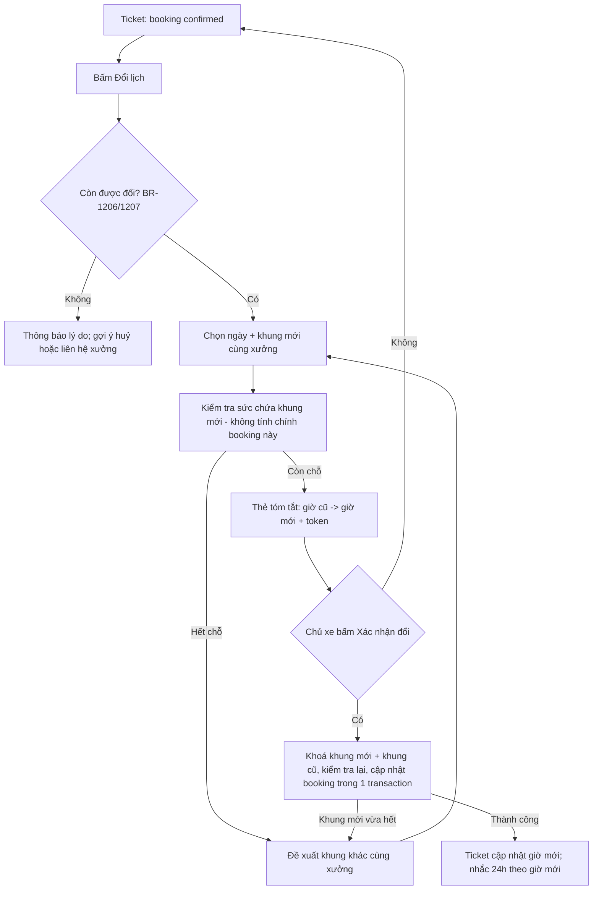
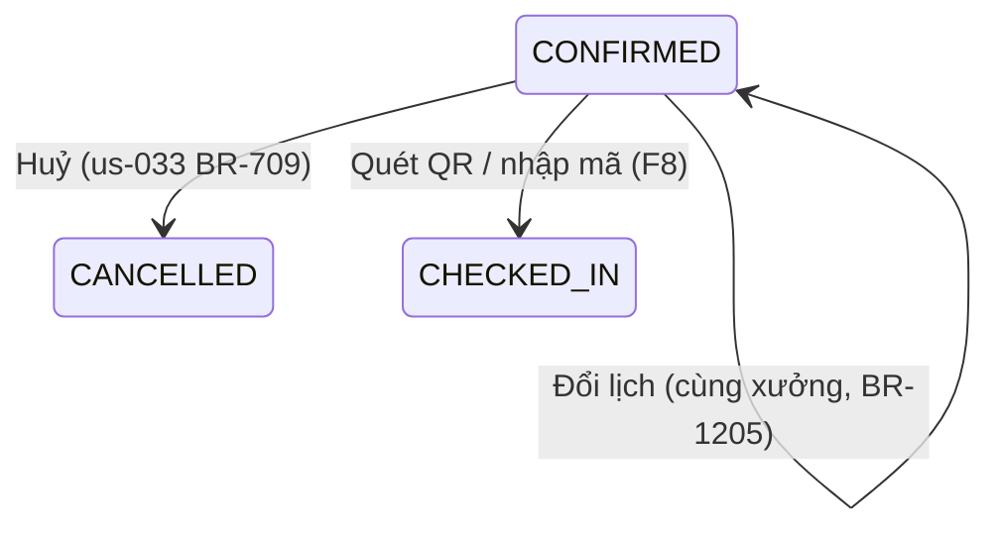

# Functional Specification — Booking Ticket, QR check-in, huỷ & đổi lịch

> **Cập nhật phạm vi (02/10/2026):** các phần dưới đây trong tài liệu này không còn áp dụng.
>
> - Báo giá / duyệt báo giá (`quote`, `quote_item`, us-049): **đã bỏ**. Đặt lịch không gắn báo giá; mọi con số chi phí là ước tính (F5), chi phí cuối cùng do xưởng xác nhận khi kiểm tra xe.
> - Kết nối Discord (`user_discord_link`, ENT-417): **đã bỏ**. Nhắc bảo dưỡng, nhắc lịch hẹn và hỏi thăm hiện trong mục **Thông báo** của app; danh sách kênh ngoài (Zalo / Telegram / SMS / Email) vẫn có nhưng đều "Sắp có", bật nhắc không bắt buộc chọn kênh.

> Đặc tả nghiệp vụ cho Feature **F6b — Booking Ticket + QR, huỷ/đổi lịch** trong [PRD EV Care MVP](../../../product/PRD_EV_Care_MVP.md#f6b--booking-ticket-qr-huỷđổi).
>
> **Quan hệ tài liệu:** Đây là "tài liệu riêng F6b" mà [us-029 FF](us-029-sprint-3-spec.ff.md) (§3.2), [us-033 FF](us-033-sprint-3-spec.ff.md) (BR-710, AF-702) và [us-037 FF](us-037-sprint-3-spec.ff.md) (§3.2) tham chiếu. Tầng hội thoại: [AI-004](../../ai-agent/ai-004-sprint-3-spec.agent.md) (TOOL-404/405/406).
>
> **Nguyên tắc tái dùng:** không định nghĩa lại những gì đã chốt — huỷ giữ chỗ 10' (us-029 BR-010, `API-BK-04`), huỷ lịch `confirmed` (us-033 BR-709, `API-BR-03`), check-in bằng mã (us-037 BR-805). Tài liệu này định nghĩa **nội dung Ticket, mã lịch hẹn, QR, danh sách "Lịch của tôi" và luồng đổi lịch**.
>
> **Quy ước mã:** dải `12xx` (`UC-12xx`, `BR-12xx`, `EDGE-12xx`, `AC-12xx`, `SCR-12xx`, `Q-12xx`).

---

# 1. Document Information

| Field | Value |
|---|---|
| Feature ID | `FEAT-BOOK-002` |
| Feature Name | `Booking Ticket, QR check-in, huỷ & đổi lịch` |
| PRD Feature | `F6b` (Should, S3–S4); liên quan `F6`, `F7`, `F8` |
| Document Version | `v1.0` |
| Status | `Draft` |
| Product / Project | EV Care — AI Agent Chăm sóc sau bán & lịch bảo dưỡng xe điện |
| Business Owner | Lê Đức Tùng (PO) |
| Author | Team 4 Người |
| Reviewer | Tech Lead |
| Stakeholders | Product, Frontend, Backend, AI Team, Chủ xưởng |
| Created Date | `2026-09-30` |
| Updated Date | `2026-09-30` |
| Related PRD | [PRD_EV_Care_MVP.md §F6b](../../../product/PRD_EV_Care_MVP.md) (v3.6) · PP-02, PP-07 |
| Related Frontend Spec | [us-053-sprint-3-spec.fe.md](../frontend/us-053-sprint-3-spec.fe.md) |
| Related API Spec | [us-053-sprint-3-spec.api.md](../api/us-053-sprint-3-spec.api.md) |
| Related Entity Spec | [us-053-sprint-3-spec.entity.md](../entity/us-053-sprint-3-spec.entity.md) |
| Related Agent Spec | [ai-004-sprint-3-spec.agent.md](../../ai-agent/ai-004-sprint-3-spec.agent.md) |
| Related Design / Figma | `[Chưa có]` — mock: `/booking-success` (`BookingSuccess.tsx`) |
| Related GitHub Issue | `[Cần điền]` |

---

# 2. Feature Overview

## 2.1 Feature Description

Sau khi lịch hẹn thành chính thức (`confirmed` — us-029 BR-014), chủ xe có một **Booking Ticket**: mã lịch hẹn, **QR check-in**, xưởng, địa chỉ, ngày giờ, hạng mục, chi phí, giấy tờ cần mang. Chủ xe xem tất cả lịch hẹn của mình ở **"Lịch của tôi"**, có thể **huỷ** (giải phóng chỗ ngay) hoặc **đổi lịch** (giữ được khung mới rồi mới trả khung cũ — không có lúc nào mất cả hai).

## 2.2 Business Objective

- Giảm no-show (PP-07, G5): huỷ/đổi sớm để giải phóng slot cho người khác.
- Tiếp nhận xe nhanh tại xưởng bằng QR (F8, PP-05).

## 2.3 User Objective

Có "vé" rõ ràng để mang tới xưởng; đổi hoặc huỷ lịch dễ dàng mà không phải gọi điện.

## 2.4 Business Value

- Xưởng: check-in bằng quét mã, dữ liệu lịch luôn đúng thực tế.
- Chủ xe: tự phục vụ 24/7.

---

# 3. Scope

## 3.1 In Scope

- Nội dung Booking Ticket và điều kiện hiển thị theo trạng thái.
- Quy tắc sinh **mã lịch hẹn** (`booking_code`) và **nội dung QR**.
- Danh sách "Lịch của tôi" (sắp tới / đã qua).
- **Đổi lịch** cùng xưởng: chọn khung mới, kiểm tra sức chứa, cập nhật nguyên tử.
- Điểm vào huỷ (tái dùng us-029 `API-BK-04` và us-033 `API-BR-03`), gồm huỷ qua chat (AI-004 TOOL-405).
- Tác động phụ khi đổi lịch: lời nhắc 24h, xác nhận sẽ đến, lịch sử.

## 3.2 Out of Scope

- Đổi **sang xưởng khác** trong một thao tác — MVP hướng dẫn huỷ rồi đặt mới `[Đề xuất — Q-1201]`.
- Xưởng đổi giờ thay khách (us-037 §3.2).
- Phí huỷ, phạt no-show, chấm điểm uy tín.
- Nút tương tác trong Discord (PRD F7 — chỉ link sang app).
- Thêm vào lịch điện thoại (.ics) `[Đề xuất — Q-1205]`.
- Ví điện tử / Apple Wallet pass.

---

# 4. Actors & Stakeholders

## 4.1 Actors

| Actor | Type | Responsibility |
|---|---|---|
| Chủ xe | User | Xem ticket, huỷ, đổi lịch |
| AI Agent (AI-004) | System | Xem lịch, huỷ, đổi lịch qua chat (có xác nhận) |
| Booking & Capacity Service | System | Nguồn duy nhất kiểm tra sức chứa + cập nhật booking (us-029 BR-011) |
| Chủ xưởng | User | Quét QR check-in (F8); thấy lịch đã đổi trên Board |
| Booking Reminder Scheduler | System | Lên lịch lại nhắc 24h (us-033) |

## 4.2 Stakeholders

| Stakeholder | Organization / Team | Interest / Responsibility |
|---|---|---|
| Product Owner | Team 4 | Chốt quy tắc đổi lịch, nội dung ticket |
| Backend | Team 4 | Đổi lịch nguyên tử, mã/QR |
| Frontend | Team 4 | Ticket, danh sách, luồng đổi |

---

# 5. User Story

## US-053

**As a** chủ xe có lịch hẹn đã xác nhận

**I want to** xem Booking Ticket với mã và QR check-in

**So that** tôi đến xưởng và được tiếp nhận nhanh.

### Additional User Stories

- `US-054`: As a chủ xe, I want to xem tất cả lịch hẹn sắp tới và đã qua của tôi, so that tôi không nhầm lịch.
- `US-055`: As a chủ xe, I want to đổi sang khung giờ khác cùng xưởng mà không sợ mất lịch cũ khi khung mới hết chỗ, so that tôi linh hoạt khi bận.
- `US-056`: As a chủ xe, I want to huỷ lịch sớm, so that xưởng có chỗ cho người khác (PP-07).

---

# 6. Use Case

## UC-1201 — Xem Booking Ticket

### 6.2 Primary Actor

Chủ xe

### 6.4 Trigger

Ngay sau khi booking `confirmed` (us-029 SCR-405); mở từ "Lịch của tôi"; mở từ link trong lời nhắc 24h (us-033 SCR-701) hoặc từ chat.

### 6.5 Preconditions

Booking thuộc chủ xe.

### 6.6 Postconditions

Chỉ đọc; không thay đổi dữ liệu.

## UC-1202 — Xem "Lịch của tôi"

### 6.4 Trigger

Menu "Lịch hẹn"; hoặc hỏi AI "lịch của tôi khi nào?" (AI-004 INT-404).

### 6.6 Postconditions

Danh sách booking của chủ xe, tách **Sắp tới** (`pending`, `confirmed`, `checked_in`, `in_progress`) và **Đã qua** (`completed`, `cancelled`).

## UC-1203 — Đổi lịch cùng xưởng

### 6.4 Trigger

Nút "Đổi lịch" trên ticket / lời nhắc 24h (us-033 AF-702) / yêu cầu trong chat (AI-004 INT-406).

### 6.5 Preconditions

- Booking `confirmed`, thuộc chủ xe, còn trước hạn đổi (BR-1206).
- Chưa vượt số lần đổi tối đa (BR-1207).

### 6.6 Postconditions

- Cùng một booking (giữ `booking_code`, QR, báo giá gắn kèm) với `booking_date`/`time_slot` mới; `status` vẫn `confirmed` (BR-1209).
- Khung cũ được trả lại tại thời điểm commit; khung mới được chiếm trong cùng transaction (BR-1205).
- Lời nhắc 24h cũ `skipped`, nhắc mới được lên lịch; `attendance_confirmed_at` xoá (BR-1210).
- Một bản ghi lịch sử đổi lịch (BR-1211).

## UC-1204 — Huỷ lịch

Tái dùng: `pending` trong cửa sổ 10' ⇒ us-029 BR-010 (`API-BK-04`); `confirmed` ⇒ us-033 BR-709 (`API-BR-03`). F6b chỉ quy định điểm vào trên Ticket/"Lịch của tôi"/chat và hộp xác nhận lần hai (BR-1212).

## UC-1205 — Check-in bằng QR (điểm giao với F8)

Chủ xưởng quét QR trên ticket ⇒ Portal tách `booking_code` ⇒ us-037 UC-803 / BR-805. F6b quy định **nội dung QR** (BR-1203).

---

# 7. User Flow

## 7.1 Main User Flow — Đổi lịch



## 7.2 Flow Description

| Step | Actor | Action / Event | System Response | Result |
|---|---|---|---|---|
| 1 | Chủ xe | Bấm "Đổi lịch" | Kiểm tra điều kiện (BR-1206, BR-1207) | Mở bộ chọn khung |
| 2 | Chủ xe | Chọn ngày + khung | Kiểm tra sức chứa, loại trừ chính booking (BR-1204) | Còn chỗ / phương án |
| 3 | Chủ xe | Xem thẻ "cũ → mới", bấm Xác nhận | Cập nhật nguyên tử (BR-1205) | Lịch mới |
| 4 | System | Sau commit | Lên lịch lại nhắc 24h, ghi lịch sử (BR-1210, BR-1211) | — |

---

# 8. Screen / UI Flow

## 8.1 Screen Flow

```text
[SCR-1202 Lịch của tôi] ──> [SCR-1201 Booking Ticket] ──> [SCR-1203 Đổi lịch: chọn khung]
                                   │                               │
                                   │                               v
                                   │                        [SCR-1204 Xác nhận đổi (cũ → mới)]
                                   │
                                   └──> [SCR-702 Hộp thoại huỷ (us-033)]
```

> SCR-1201 là **mở rộng** của màn chi tiết lịch hẹn us-033 SCR-701 (`/bookings/:bookingId`) — một màn duy nhất, không tạo màn trùng.

## 8.2 Screen List

| Screen ID | Screen Name | Purpose | Entry From | Exit To |
|---|---|---|---|---|
| `SCR-1201` | Booking Ticket (= SCR-701 mở rộng) | Ticket + hành động | us-029 SCR-405, SCR-1202, nhắc 24h, chat | SCR-1203, SCR-702 |
| `SCR-1202` | Lịch của tôi | Danh sách sắp tới / đã qua | Menu, Home | SCR-1201 |
| `SCR-1203` | Đổi lịch — chọn khung | Chọn ngày + khung cùng xưởng | SCR-1201 | SCR-1204 |
| `SCR-1204` | Xác nhận đổi | So sánh cũ → mới, bấm Xác nhận | SCR-1203 | SCR-1201 |

## 8.3 Screen / UI Reference

### SCR-1201 — Booking Ticket

**Main UI (khi `confirmed`)**

- Mã lịch hẹn (chữ lớn, dễ đọc cho xưởng nhập tay) + **QR**.
- Xưởng, địa chỉ (link bản đồ ngoài — tuỳ chọn), ngày giờ (giờ VN), trạng thái.
- Xe: model + biển số che một phần.
- Hạng mục (BR-1202), chi phí: "Theo báo giá đã duyệt: …" hoặc "Chi phí ước tính: …".
- Giấy tờ cần mang (BR-1208).
- Nút: **Xác nhận sẽ đến** (us-033), **Đổi lịch**, **Huỷ lịch** — theo `allowedActions` do backend tính.

**Khi `pending`:** không có mã/QR; hiển thị "Đang giữ chỗ — chờ xưởng xác nhận" và nút huỷ giữ chỗ nếu còn trong 10' (us-029 BR-010).

**Khi `checked_in` / `in_progress`:** ẩn QR; hiện tiến độ (F8b nếu có). **Khi `completed` / `cancelled`:** ticket chỉ đọc, ghi rõ trạng thái; ẩn QR.

---

# 9. Main Flow

## 9.1 Happy Path — Đổi lịch

1. Chủ xe có booking `EVC-7F3A9C21` tại Smart City 04/10 09:00 (`confirmed`).
2. 03/10 nhận nhắc 24h, bấm "Đổi lịch" (us-033 AF-702) → SCR-1201 → SCR-1203.
3. Chọn 05/10 14:00 → còn 3 chỗ → SCR-1204 "Thứ 7 04/10 09:00 → Chủ nhật 05/10 14:00".
4. Bấm Xác nhận → hệ thống khoá khung mới và khung cũ, kiểm tra lại, cập nhật booking → khung 04/10 09:00 được trả lại, khung 05/10 14:00 bị chiếm.
5. Ticket hiển thị giờ mới, **cùng mã và QR**; lời nhắc 24h cũ `skipped`, nhắc mới được lên lịch gửi lúc 04/10 14:00 (24h trước giờ mới); nhãn "đã xác nhận sẽ đến" (nếu có) bị xoá.

---

# 10. Alternative Flow

## AF-1201 — Đổi lịch qua chat

**Flow** — AI-004 thu thập khung mới, gọi kiểm tra chỗ, hiện thẻ cũ → mới kèm `confirmation_token`; chỉ khi chủ xe bấm Xác nhận mới gọi đổi (PRD §7). Kết quả như UC-1203; lịch sử ghi `source = CHAT`.

## AF-1202 — Muốn đổi sang xưởng khác `[Đề xuất — Q-1201]`

**Flow** — Hệ thống giải thích MVP chỉ đổi giờ trong cùng xưởng; đưa hai lựa chọn: (a) giữ lịch hiện tại, (b) **huỷ lịch này rồi đặt mới** ở xưởng khác (cảnh báo: khung cũ được trả ngay, không đảm bảo khung mới còn chỗ). Báo giá gắn kèm (nếu có) không dùng được ở xưởng khác (us-049 BR-1108).

## AF-1203 — Khung mới hết chỗ

**Flow** — Như us-029 BR-008 nhưng **chỉ trong cùng xưởng**: khung gần nhất cùng ngày → ngày kế tiếp còn chỗ. Lịch cũ giữ nguyên.

## AF-1204 — Xem ticket từ chat

**Flow** — AI-004 trả thẻ tóm tắt lịch (TOOL-404) có link sang SCR-1201; AI không tự dựng mã/QR.

---

# 11. Exception Flow

## EF-1201 — Khung mới vừa bị người khác lấy khi bấm Xác nhận

**System Behavior** — Kiểm tra lại trong transaction thất bại ⇒ rollback, **booking giữ nguyên giờ cũ**; trả phương án (AF-1203).

**User Experience** — "Khung này vừa hết chỗ. Lịch cũ của bạn vẫn giữ nguyên." + phương án.

## EF-1202 — Token thẻ đổi lịch hết hạn

Như us-029 EF-001: kiểm tra lại, cấp thẻ + token mới.

## EF-1203 — Booking đổi trạng thái giữa chừng

**Condition** — Khi chủ xe đang chọn khung, xưởng huỷ lịch hoặc check-in.

**System Behavior** — Đổi lịch bị từ chối (điều kiện `status = confirmed` trong transaction); hiển thị trạng thái hiện tại.

## EF-1204 — Lỗi khoá/DB

**System Behavior** — Không khẳng định đã đổi; lịch cũ giữ nguyên (transaction chưa commit). Retry an toàn nhờ token dùng một lần + idempotency.

---

# 12. Business Rules

## BR-1201 — Ticket chỉ đầy đủ khi `confirmed`

**Rule** — Mã lịch hẹn và QR chỉ hiển thị cho chủ xe (và chỉ check-in được) khi booking đã `confirmed` (us-029 BR-014). QR chỉ hiển thị ở `confirmed`; sau check-in/hoàn tất/huỷ thì ẩn.

**Priority** — High

## BR-1202 — Nội dung Ticket

**Rule** — Ticket gồm: `booking_code`, QR, tên + địa chỉ xưởng, ngày + khung giờ (Asia/Ho_Chi_Minh), xe (model + biển số che), **hạng mục**, **chi phí**, **giấy tờ cần mang**, trạng thái.

- **Hạng mục:** nếu gắn báo giá ⇒ các dòng `quote_item`; ngược lại ⇒ hạng mục `maintenance_rule` của **mốc đã lưu trên booking** (`booking.odo_milestone` — **cột mới**, xem Entity Spec); không có mốc ⇒ "Bảo dưỡng theo yêu cầu, xưởng sẽ tư vấn tại chỗ".
- **Chi phí:** gắn báo giá còn hạn lúc đặt ⇒ "Theo báo giá đã duyệt: {approved_total}"; ngược lại ⇒ "Chi phí ước tính: {estimated_cost}" hoặc "Chưa có ước tính".
- **Không** hiển thị VIN, CCCD, email, SĐT.

**Priority** — High

## BR-1203 — Mã lịch hẹn và nội dung QR

**Rule** —

- `booking_code` được sinh **một lần** ngay khi tạo booking (giữ chỗ) — theo implementation hiện tại (`backend/src/modules/booking/service.py`), cột giữ `NOT NULL` — nhưng **chỉ hiển thị cho chủ xe và chỉ dùng check-in được khi booking `confirmed`** (khớp ý us-029 BR-014 "phát hành mã khi `confirmed`"). Định dạng hiện tại `EVC-` + 8 ký tự hex in hoa, ví dụ `EVC-7F3A9C21` `[Cần xác nhận — Q-1204]`; duy nhất toàn hệ thống; **không đổi** khi đổi lịch.
- QR mã hoá chuỗi URL `{APP_BASE_URL}/c/{booking_code}` — **chỉ** chứa mã lịch hẹn, không chứa PII hay token quyền. Mở bằng camera thường: chủ xe đã đăng nhập ⇒ tới ticket của mình; chủ xưởng đã đăng nhập ⇒ tới màn check-in (us-037 SCR-803); còn lại ⇒ trang đăng nhập.
- QR **không** phải bằng chứng quyền: check-in vẫn yêu cầu chủ xưởng đăng nhập, đúng xưởng, đúng ngày (us-037 BR-805).

**Priority** — High

## BR-1204 — Kiểm tra sức chứa khi đổi lịch

**Rule** — Khung mới phải thoả us-029 BR-005/BR-006 (sức chứa, giờ hoạt động, không quá khứ), tính `occupied` **không gồm chính booking đang đổi** (tránh tự chiếm chỗ khi đổi trong cùng khung/ngày). Khung mới phải khác khung cũ.

**Priority** — High

## BR-1205 — Đổi lịch nguyên tử: giữ khung mới trước, trả khung cũ sau

**Rule** — Đổi lịch là **cập nhật tại chỗ** booking hiện có trong một transaction: lấy Redis lock của cả khung mới và khung cũ (thứ tự khoá cố định để tránh deadlock) → kiểm tra lại sức chứa khung mới → `UPDATE booking SET booking_date, time_slot`. Khung cũ được trả **cùng lúc** commit; thất bại ⇒ không có gì thay đổi. Không bao giờ có lúc chủ xe mất cả lịch cũ lẫn lịch mới (PRD F6b, us-033 AF-702).

**Priority** — High

## BR-1206 — Hạn đổi lịch

**Rule** — Chỉ đổi được khi `status = confirmed` và `now < appointment_at − RESCHEDULE_MIN_LEAD_MINUTES` (mặc định **60** phút) `[Đề xuất — Q-1202]`. Ngày mới trong `[hôm nay, hôm nay + BOOKING_SEARCH_HORIZON_DAYS]` (us-029, mặc định 7).

**Priority** — High

## BR-1207 — Số lần đổi tối đa

**Rule** — Mỗi booking đổi tối đa `RESCHEDULE_MAX_COUNT` = **2** lần `[Đề xuất — Q-1203]`. Vượt ⇒ gợi ý huỷ và đặt mới.

**Priority** — Medium

## BR-1208 — Giấy tờ cần mang

**Rule** — Danh sách cấu hình chung (không theo xưởng trong MVP) `[Đề xuất — Q-1206]`: "Giấy đăng ký xe", "Sổ bảo hành / sổ bảo dưỡng (nếu có)", "Mã lịch hẹn hoặc QR này".

**Priority** — Low

## BR-1209 — Trạng thái sau khi đổi

**Rule** — Đổi lịch **giữ** `status = confirmed` ở cả xưởng `auto` và `manual` (xưởng đã chấp nhận khách; khung mới đã được kiểm tra sức chứa) `[Đề xuất — Q-1207]`. Board của xưởng hiển thị nhãn "Đã đổi giờ" và lịch sử đổi. Báo giá gắn kèm và `estimated_cost` giữ nguyên.

**Priority** — High

## BR-1210 — Tác động phụ khi đổi lịch

**Rule** — Sau commit: (1) lời nhắc 24h chưa gửi của giờ cũ ⇒ `skipped`, lên lịch nhắc cho giờ mới theo us-033 BR-702/BR-703/BR-704; (2) `attendance_confirmed_at = NULL` (xác nhận đến là cho giờ cũ); (3) báo cho chủ xe trong app (không Discord — chính chủ xe thực hiện).

**Priority** — High

## BR-1211 — Lưu lịch sử đổi lịch

**Rule** — Mỗi lần đổi ghi: giờ cũ, giờ mới, người thực hiện, nguồn (`APP` / `CHAT` / `REMINDER_24H`), thời điểm. Chỉ thêm, không sửa/xoá. Board (F8) hiển thị cùng dòng thời gian với lịch sử trạng thái (us-037 BR-808).

**Priority** — Medium

## BR-1212 — Huỷ cần xác nhận lần hai

**Rule** — Mọi điểm vào huỷ trên ticket/danh sách/chat đều qua hộp xác nhận lần hai (us-033 SCR-702) hoặc `confirmation_token` (chat). Hành động huỷ dùng **đúng** endpoint đã có: `API-BK-04` (pending ≤ 10'), `API-BR-03` (confirmed). Không tạo endpoint huỷ thứ ba.

**Priority** — High

## BR-1213 — "Lịch của tôi"

**Rule** — Liệt kê booking của **tất cả** xe thuộc chủ xe (MVP 1 xe). Sắp tới: sắp `appointment_at` tăng dần; Đã qua: giảm dần, tối đa 90 ngày gần nhất `[Đề xuất]`. Mỗi dòng kèm `allowedActions`.

**Priority** — Medium

---

# 13. State / Status

F6b **không** thêm trạng thái booking. Đổi lịch là thay đổi thuộc tính trong trạng thái `confirmed`:

| State | Ticket | Hành động chủ xe |
|---|---|---|
| `PENDING` | Không mã/QR; "Chờ xưởng xác nhận" | Huỷ giữ chỗ (≤ 10' — us-029) |
| `CONFIRMED` | Đầy đủ + QR | Xác nhận đến, Đổi lịch (BR-1206/1207), Huỷ (us-033 BR-709) |
| `CHECKED_IN` / `IN_PROGRESS` | Không QR; tiến độ | — |
| `COMPLETED` / `CANCELLED` | Chỉ đọc | — |



---

# 14. Data Requirements

## 14.1 Required Data

| Data | Type | Required | Description | Source |
|---|---|---:|---|---|
| Booking | object | Yes | Trạng thái, ngày giờ, mã | `booking` (ENT-402) |
| Mốc của booking | integer | No | Hạng mục trên ticket | `booking.odo_milestone` (**mới**) |
| Báo giá gắn kèm | object | No | Dòng + tổng đã duyệt | `quote`, `quote_item` |
| Xưởng | object | Yes | Tên, địa chỉ, giờ hoạt động | `workshop`, `workshop_operating_hour` |
| Lịch sử đổi | list | No | Board + audit | `booking_reschedule` (**mới**, ENT-428) |

## 14.2 Data Dependency

| Data / Entity | Why Needed | Read / Write | Owner |
|---|---|---|---|
| `booking` | Ticket, đổi lịch | Read / Write | Backend |
| `booking_reschedule` (ENT-428) | Lịch sử đổi | Write | Backend |
| `booking_reminder` (ENT-424) | Nhắc lại theo giờ mới | Write (qua scheduler) | Backend |
| `workshop_slot_block` (ENT-418) | Sức chứa khung mới | Read | Backend |
| Redis | Khoá khung | Read / Write | Backend |

---

# 15. Business Error & Edge Cases

| Case ID | Scenario | Expected Business Behavior | User Outcome |
|---|---|---|---|
| `EDGE-1201` | Đổi trong cùng ngày sang khung khác | BR-1204 loại trừ chính booking | Đổi được nếu còn chỗ |
| `EDGE-1202` | Đổi sang đúng khung cũ | Từ chối "khung mới trùng khung hiện tại" | Chọn khung khác |
| `EDGE-1203` | Đổi khi còn < 60' tới giờ hẹn | Từ chối (BR-1206); gợi ý liên hệ xưởng hoặc huỷ | Không đổi |
| `EDGE-1204` | Đổi lần thứ 3 | Từ chối (BR-1207) | Gợi ý huỷ + đặt mới |
| `EDGE-1205` | Hai thiết bị cùng đổi một booking | Transaction thứ hai thấy giờ đã thay đổi ⇒ từ chối, hiển thị giờ hiện tại | Không đổi trùng |
| `EDGE-1206` | Chủ xưởng khoá chỗ khung mới đúng lúc đổi | Cùng khoá nguyên tử (us-037 BR-809) ⇒ một bên thắng | Có thể hết chỗ |
| `EDGE-1207` | Khung mới rơi vào ngày xưởng nghỉ | us-029 BR-006 | Chọn khung hợp lệ |
| `EDGE-1208` | Người khác quét QR của chủ xe | Chỉ ra mã; không xem được chi tiết nếu không đăng nhập đúng chủ | Không lộ PII |
| `EDGE-1209` | Chủ xưởng quét QR của xưởng khác | us-037 EF-803 | Báo không thuộc xưởng |
| `EDGE-1210` | Booking `pending` quá 10' (chờ xưởng) muốn huỷ | Theo quyết định hiện tại không tự huỷ được (us-029 BR-010) ⇒ hiển thị "Đang chờ xưởng xác nhận — liên hệ xưởng nếu muốn huỷ" `[Cần xác nhận — Q-1208]` | Không huỷ được trong app |

---

# 16. Permissions & Access

| Role / Actor | View ticket | Reschedule | Cancel | Notes |
|---|---:|---:|---:|---|
| Chủ xe | ✅ booking của mình | ✅ | ✅ (theo us-029/us-033) | Booking người khác ⇒ như không tồn tại |
| AI Agent (AI-004) | ✅ | ✅ có token | ✅ có token | Dưới danh nghĩa chủ xe |
| Chủ xưởng | ✅ qua Board (us-037) | ❌ | ✅ (us-037 BR-806) | Quét QR |

---

# 17. Acceptance Criteria

## AC-1201 — Ticket đầy đủ khi `confirmed`

**Given** booking `confirmed` có báo giá gắn kèm **When** mở ticket **Then** thấy mã, QR, xưởng, địa chỉ, ngày giờ, hạng mục (từ báo giá), "Theo báo giá đã duyệt: {tổng}", giấy tờ cần mang; không thấy VIN/SĐT.

## AC-1202 — Không có QR khi `pending`

**Given** booking `pending` (xưởng manual) **When** mở ticket **Then** không có mã/QR; có trạng thái "chờ xưởng xác nhận".

## AC-1203 — Đổi lịch không làm mất lịch cũ khi khung mới đầy

**Given** booking 04/10 09:00; khung 05/10 14:00 còn 1 chỗ; người khác đặt mất chỗ đó ngay trước khi chủ xe bấm Xác nhận đổi **When** chủ xe xác nhận **Then** đổi thất bại, booking vẫn 04/10 09:00 `confirmed`, nhận phương án khác.

## AC-1204 — Đổi lịch giải phóng khung cũ

**Given** khung cũ đầy (0 chỗ) **When** chủ xe đổi thành công sang khung mới **Then** khung cũ còn 1 chỗ ngay sau commit; khung mới giảm 1 chỗ.

## AC-1205 — Mã và QR không đổi sau khi đổi lịch

**Given** booking `EVC-7F3A9C21` **When** đổi lịch **Then** mã và QR giữ nguyên; xưởng quét QR ngày mới check-in được, ngày cũ thì không (us-037 BR-805).

## AC-1206 — Nhắc 24h theo giờ mới

**Given** đã có nhắc 24h cho giờ cũ chưa gửi **When** đổi lịch **Then** nhắc cũ `skipped`, có nhắc mới cho giờ mới (us-033 AC-707).

## AC-1207 — Không đổi khi sát giờ / quá số lần

**Given** còn 30' tới giờ hẹn, hoặc booking đã đổi 2 lần **When** đổi **Then** bị từ chối với lý do tương ứng.

## AC-1208 — QR không chứa PII

**Given** bất kỳ ticket nào **When** giải mã QR **Then** nội dung chỉ là `{APP_BASE_URL}/c/{booking_code}`.

---

# 18. Non-functional Expectations

| Requirement | Expected Behavior |
|---|---|
| Correctness | Đổi lịch nguyên tử; 0 lần vượt sức chứa (PRD §10) |
| Response Experience | Ticket ≤ 300 ms, đổi lịch ≤ 500 ms (p90) |
| Offline | Ticket (mã + QR) hiển thị được khi mất mạng nếu đã mở trước đó `[Đề xuất — cache cục bộ]` |
| Readability | Mã lịch hẹn đủ lớn để đọc qua điện thoại |

---

# 19. Dependencies

| Dependency | Purpose | Owner | Required | Related Document |
|---|---|---|---:|---|
| F6 Booking & Capacity Service | Sức chứa, khoá, `booking_code` | Backend | Yes | [us-029](us-029-sprint-3-spec.ff.md) |
| F7 nhắc 24h | Lên lịch lại | Backend | Yes | [us-033](us-033-sprint-3-spec.ff.md) |
| F8 Board | Check-in QR, hiển thị lịch sử | Backend/FE | Yes | [us-037](us-037-sprint-3-spec.ff.md) |
| F5b | Báo giá gắn kèm | Backend | No | [us-049](us-049-sprint-3-spec.ff.md) |

---

# 20. Assumptions

- MVP mỗi xe tối đa 1 booking mở (us-029 BR-013) — "Lịch của tôi" thường có ≤ 1 lịch sắp tới.
- `APP_BASE_URL` cố định theo môi trường (staging/pilot).

---

# 21. Business Constraints

- Đổi lịch không vượt sức chứa; dùng chung service với F6 (us-029 BR-011).
- Không thêm trạng thái booking mới.

---

# 22. Terminology / Glossary

| Term ID | Term | Vietnamese Name | Definition | Example / Notes |
|---|---|---|---|---|
| `TERM-1201` | Booking ticket | Phiếu lịch hẹn | Thông tin lịch hẹn + QR cho chủ xe | SCR-1201 |
| `TERM-1202` | Booking code | Mã lịch hẹn | Mã duy nhất, sinh khi giữ chỗ, chỉ hiển thị/dùng được khi `confirmed` | `EVC-7F3A9C21` |
| `TERM-1203` | Reschedule | Đổi lịch | Đổi ngày/khung trong cùng xưởng, giữ nguyên booking | |
| `TERM-1204` | Appointment time | Giờ hẹn | `booking_date + time_slot` theo giờ VN | |

---

# 23. Partner / Stakeholder Notes

## 23.1 Confirmed

- Huỷ giải phóng chỗ ngay; đổi lịch kiểm tra khung mới trước khi trả khung cũ (PRD F6b).

## 23.2 Pending Confirmation

- Q-1201 → Q-1208.

---

# 24. Open Questions

| ID | Question | Owner | Status | Decision / Due Date |
|---|---|---|---|---|
| `Q-1201` | Cho đổi sang xưởng khác trong một thao tác? | PO | Open | `[Đề xuất]` không trong MVP; hướng dẫn huỷ + đặt mới |
| `Q-1202` | Hạn chót đổi lịch trước giờ hẹn? | PO | Open | `[Đề xuất]` 60 phút |
| `Q-1203` | Số lần đổi tối đa / booking? | PO | Open | `[Đề xuất]` 2 |
| `Q-1204` | Định dạng `booking_code` đang không thống nhất: code sinh `EVC-` + 8 hex (docstring ghi ví dụ `EVC-7K2M9Q`), us-029/us-033 ví dụ `EVC-7K2M`, booking.entity ví dụ `BK-20261003-0012`. Chốt một định dạng? | Tech Lead | Open | `[Đề xuất]` giữ `EVC-` + 8 hex như code, sửa ví dụ ở các tài liệu khác |
| `Q-1205` | Có nút "Thêm vào lịch" (.ics)? | PO | Open | `[Đề xuất]` phase sau |
| `Q-1206` | Giấy tờ cần mang có theo từng xưởng? | PO | Open | `[Đề xuất]` cấu hình chung |
| `Q-1207` | Xưởng `manual`: đổi lịch có cần xưởng chấp nhận lại? | PO | Open | `[Đề xuất]` không — giữ `confirmed` |
| `Q-1208` | Chủ xe có được rút yêu cầu `pending` sau 10' (đang chờ xưởng) không? Hiện us-029 BR-010 không cho ⇒ chủ xe bị "kẹt" tới 12h | PO | Open | `[Đề xuất]` cho phép huỷ `pending` bất kỳ lúc nào trước khi xưởng quyết định |

---

# 25. Traceability

| Item | Reference |
|---|---|
| PRD | [F6b](../../../product/PRD_EV_Care_MVP.md) · AC-F7-02 |
| User Story | `US-053` → `US-056` |
| Use Case | `UC-1201` → `UC-1205` |
| Business Rules | `BR-1201` → `BR-1213`; us-029 BR-005/006/010/011/014; us-033 BR-702/704/709/710; us-037 BR-805/808 |
| Acceptance Criteria | `AC-1201` → `AC-1208` |
| Frontend / API / Entity | [FE](../frontend/us-053-sprint-3-spec.fe.md) · [API](../api/us-053-sprint-3-spec.api.md) · [Entity](../entity/us-053-sprint-3-spec.entity.md) |
| Agent | [AI-004](../../ai-agent/ai-004-sprint-3-spec.agent.md) TOOL-404/405/406 |

---

# 26. Related Documents

- [us-029 FF](us-029-sprint-3-spec.ff.md) · [us-033 FF](us-033-sprint-3-spec.ff.md) · [us-037 FF](us-037-sprint-3-spec.ff.md) · [us-049 FF](us-049-sprint-3-spec.ff.md)
- [booking.entity](../../entity/maintenance/booking.entity.md)

---

# 27. Change Log

| Version | Date | Author | Change |
|---|---|---|---|
| `v1.0` | `2026-09-30` | Team 4 Người | Bản đầu — tài liệu F6b mà us-029/us-033/us-037 tham chiếu nhưng chưa có |

---

# 28. Approval

| Role | Name | Status | Date |
|---|---|---|---|
| Product Owner | Lê Đức Tùng | Pending | |
| Technical Owner | Tech Lead | Pending | |
