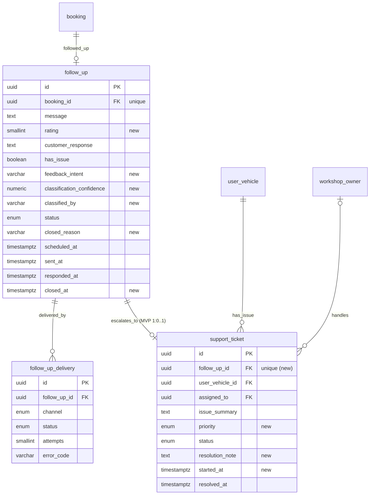
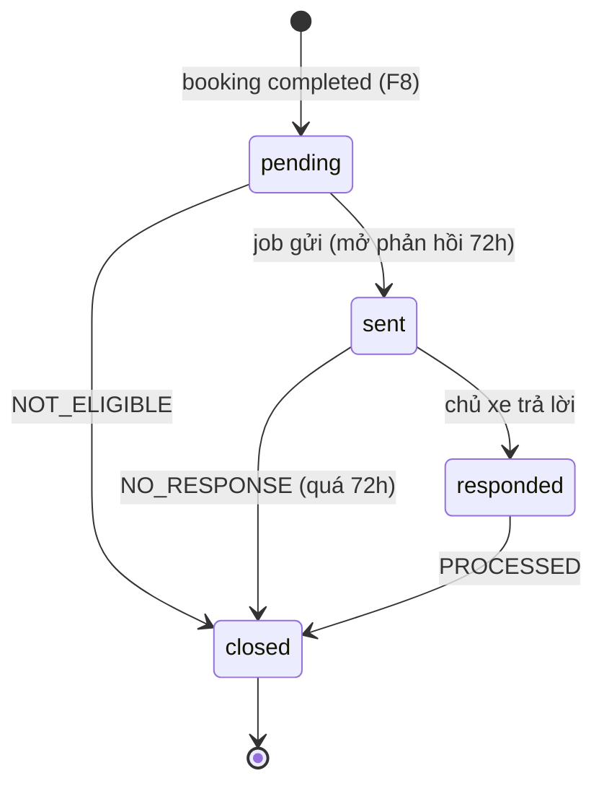
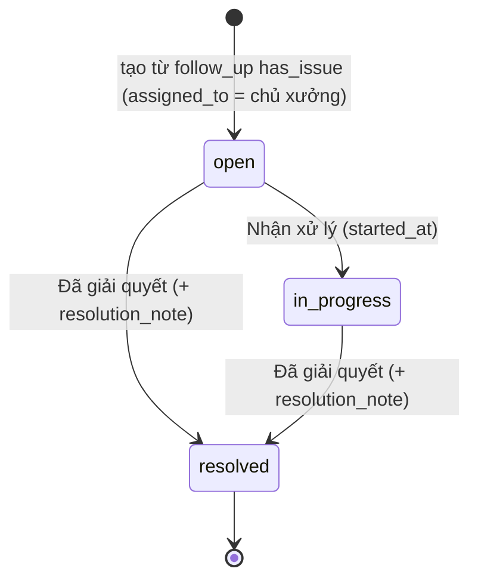

# Entity Specification — Hỏi thăm sau dịch vụ & phiếu hỗ trợ

> **Cập nhật phạm vi (02/10/2026):** các phần dưới đây trong tài liệu này không còn áp dụng.
>
> - Phiếu hỗ trợ (`support_ticket`): **đã bỏ**. Phản hồi hỏi thăm có vấn đề chỉ được phân loại và ghi trên `follow_up` (`has_issue`); app hiện lời khuyên an toàn và hotline xưởng, không tạo phiếu, không có màn phiếu cho chủ xe hay xưởng.
> - Kết nối Discord (`user_discord_link`, ENT-417): **đã bỏ**. Nhắc bảo dưỡng, nhắc lịch hẹn và hỏi thăm hiện trong mục **Thông báo** của app; danh sách kênh ngoài (Zalo / Telegram / SMS / Email) vẫn có nhưng đều "Sắp có", bật nhắc không bắt buộc chọn kênh.

> Đặc tả các entity phục vụ Feature `FEAT-CRM-001` — F9 (US-041 → US-044).
>
> **Nguồn nghiệp vụ:** [Functional Spec](../feature-functional/us-041-sprint-4-spec.ff.md). Tài liệu này **không định nghĩa lại nghiệp vụ**; mọi rule trỏ về `BR-9xx` / `EF-9xx` / `EDGE-9xx`.
>
> **Nguyên tắc:** tái dùng `follow_up` (ENT-412) và `support_ticket` (ENT-413) đã có — **mở rộng cột** và **nới/siết ràng buộc** cho đúng vòng đời mới (chốt đề xuất AI-Q-701, AI-Q-704). Thêm **một entity mới** `follow_up_delivery` (ENT-427) theo mẫu `reminder_delivery` (us-021).
>
> **Quy ước đánh dấu:** `[Đề xuất]` · `[Cần xác nhận]`. Business rule entity dùng dải `BR-ENT-50x`.

---

# 0. Document Information

| Field | Value |
|---|---|
| Document ID | `ENT-SPEC-CRM-001` |
| Feature | `FEAT-CRM-001` — Hỏi thăm sau dịch vụ & phiếu hỗ trợ (F9) |
| Version | `v1.0` |
| Status | `Draft` |
| Owner | Backend Team |
| Author | Team 4 Người |
| Database | PostgreSQL (Supabase), schema `public`, migration bằng Alembic |
| Created Date | `2026-09-29` |
| Updated Date | `2026-09-29` |
| Related Functional Spec | [us-041-sprint-4-spec.ff.md](../feature-functional/us-041-sprint-4-spec.ff.md) |
| Related API Spec | [us-041-sprint-4-spec.api.md](../api/us-041-sprint-4-spec.api.md) |

---

# 1. Entity Catalog

| Entity ID | Entity | Table | Trạng thái | Vai trò trong F9 |
|---|---|---|---|---|
| `ENT-412` | `FollowUp` | `follow_up` | Có sẵn — **mở rộng** (6 cột, sửa CHECK) | Vòng đời hỏi thăm, phản hồi, kết quả phân loại |
| `ENT-413` | `SupportTicket` | `support_ticket` | Có sẵn — **mở rộng** (3 cột, unique, CHECK) | Phiếu, ưu tiên, ghi chú xử lý |
| **`ENT-427`** | `FollowUpDelivery` | `follow_up_delivery` | **Mới** | Kết quả gửi hỏi thăm theo kênh |
| `ENT-402` | `Booking` | `booking` | Có sẵn — không đổi | Nguồn (`completed`) |
| `ENT-426` | `BookingStatusEvent` | `booking_status_event` | Mới ở [us-037](../../sprint-3/entity/us-037-sprint-3-spec.entity.md) | Thời điểm hoàn tất |
| `ENT-008` | `Workshop` | `workshop` | Có sẵn — không đổi | `owner_id` (người được gán), `hotline` |
| `ENT-419` / `ENT-417` | kênh / Discord | | Có sẵn — không đổi | Nơi gửi (us-021) |

---

# 2. ER Diagram



---

# 3. Quy ước chung

| Chủ đề | Quy ước |
|---|---|
| Tên bảng / cột | `snake_case`, số ít |
| Enum | Lowercase DB; API UPPER_SNAKE_CASE |
| Thời gian | `timestamptz` UTC; giờ yên lặng tính theo Asia/Ho_Chi_Minh |
| Truy cập DB | Backend trực tiếp; RLS bật, không policy |
| Mã lý do | `varchar` + validate ở service (như us-033, us-037) |

---

# ENT-412 — FollowUp (mở rộng)

## 1. Entity Information

| Field | Value |
|---|---|
| Entity ID | `ENT-412` |
| Table | `follow_up` |
| Version | `v1.1` → **`v1.2`** (tài liệu này) |
| Status | `Draft` |

## 2. Thay đổi so với v1.1

| # | Thay đổi | Lý do (FF) |
|---|---|---|
| 1 | Thêm `rating` | BR-905 — điểm 1–5 bắt buộc |
| 2 | Thêm `feedback_intent`, `classification_confidence`, `classified_by` | BR-906 — lưu kết quả phân loại (AI-007 INT-701…704) |
| 3 | Thêm `closed_reason`, `closed_at` | BR-903, BR-909 — biết vì sao đóng |
| 4 | Thêm chuyển `pending → closed`, `sent → closed` | BR-903, BR-909 — chốt AI-Q-701 |
| 5 | Nới `ck_follow_up_responded`: nhận xét **không** bắt buộc, điểm bắt buộc | BR-905 |
| 6 | Sửa `ck_follow_up_sent_at` cho phép đóng từ `pending` | BR-903 |

## 5. Attributes (cột mới)

| Tên trường (Field) | Kiểu dữ liệu (Data Type) | Required | Nullable | Default | Ràng buộc (Constraints) | Mô tả (Description) |
|---|---|---:|---:|---|---|---|
| `rating` | `smallint` | No | Yes | - | `1..5`; bắt buộc khi đã phản hồi | Điểm hài lòng |
| `feedback_intent` | `varchar(32)` | No | Yes | - | `SATISFIED / ISSUE_REPORTED / COMPLAINT_SERVICE / UNCLEAR` | Ý định phản hồi (AI-007 §7.1) |
| `classification_confidence` | `numeric(3,2)` | No | Yes | - | `0..1` | Độ tin cậy phân loại; `NULL` khi phân loại bằng quy tắc |
| `classified_by` | `varchar(16)` | No | Yes | - | `RULES / LLM / LLM_FALLBACK` | Cách phân loại (quan sát chất lượng AI) |
| `closed_reason` | `varchar(32)` | No | Yes | - | `PROCESSED / NO_RESPONSE / NOT_ELIGIBLE`; bắt buộc khi `closed` | Lý do đóng |
| `closed_at` | `timestamptz` | No | Yes | - | Bắt buộc khi `closed` | Thời điểm đóng |

Các cột hiện có giữ nguyên: `id`, `booking_id` (unique), `message`, `customer_response`, `has_issue`, `status`, `scheduled_at`, `sent_at`, `responded_at`, `created_at`, `updated_at`.

**Ghi chú `message`:** lưu câu hỏi thăm đã dựng lúc tạo (model, biển số **che**, tên xưởng, ngày) — không chứa PII (FF BR-904). Link không lưu trong `message`; dựng lúc gửi.

## 8. Entity Lifecycle / State



| Transition | Điều kiện | Ghi |
|---|---|---|
| `pending → sent` | `now ≥ scheduled_at`, BR-903 thoả | `sent_at = now()` |
| `pending → closed` | BR-903 không thoả | `closed_reason = NOT_ELIGIBLE` |
| `sent → responded` | Chủ xe gửi trong 72h | `rating`, `customer_response?`, `responded_at` |
| `sent → closed` | `now > sent_at + 72h` | `closed_reason = NO_RESPONSE` |
| `responded → closed` | Phân loại xong (+ phiếu nếu có) | `has_issue`, `feedback_intent`, … , `closed_reason = PROCESSED` |

MVP: `sent → responded → closed` diễn ra **trong cùng transaction** của API phản hồi (FF BR-907); `responded` chỉ tồn tại lâu khi phân loại được đẩy sang nền trong tương lai.

## 9. Business Rules & Constraints

### BR-ENT-500 — Tạo khi hoàn tất (FF BR-901)

**Rule** — Tạo trong transaction `→ completed` của F8 (us-037 BR-807). `INSERT ... ON CONFLICT (booking_id) DO NOTHING` — hoàn tất lặp không tạo trùng (thay thế BR-ENT-421 phần "tạo khi booking hoàn tất", giữ nguyên ý).

### BR-ENT-501 — Chỉ trả lời một lần (FF BR-905)

**Rule** — `UPDATE follow_up SET status='responded', rating=:r, customer_response=:c, responded_at=now() WHERE id=:id AND status='sent' AND now() <= sent_at + interval ':window hours'`. 0 dòng ⇒ đã trả lời / đã đóng / quá hạn.

### BR-ENT-502 — Tự đóng (FF BR-909)

**Rule** — `UPDATE follow_up SET status='closed', closed_reason='NO_RESPONSE', closed_at=now() WHERE status='sent' AND sent_at < now() - interval '72 hours'`.

### BR-ENT-503 — Tính `scheduled_at` có giờ yên lặng (FF BR-902)

```text
t = completed_at + FOLLOW_UP_DELAY_HOURS
local = t tại Asia/Ho_Chi_Minh
IF local.time ≥ QUIET_START (21:00):   scheduled_at = (local.date + 1) @ QUIET_END (08:00)
ELIF local.time < QUIET_END (08:00):   scheduled_at = local.date @ QUIET_END
ELSE                                   scheduled_at = t
```

`completed_at` = thời điểm sự kiện `→ completed` (us-037 ENT-426), cũng là `now()` trong transaction hoàn tất.

### BR-ENT-504 — Kết quả phân loại nhất quán

**Rule** — `closed_reason = PROCESSED` ⇒ `rating`, `responded_at`, `feedback_intent`, `classified_by` NOT NULL; `has_issue` phản ánh kết quả cuối (FF BR-906).

## 10. Data Integrity

```sql
-- sửa (drop + add)
ALTER TABLE follow_up DROP CONSTRAINT ck_follow_up_sent_at;
ALTER TABLE follow_up ADD  CONSTRAINT ck_follow_up_sent_at
  CHECK (status = 'pending' OR sent_at IS NOT NULL OR closed_reason = 'NOT_ELIGIBLE');

ALTER TABLE follow_up DROP CONSTRAINT ck_follow_up_responded;
ALTER TABLE follow_up ADD  CONSTRAINT ck_follow_up_responded
  CHECK (status <> 'responded' OR (responded_at IS NOT NULL AND rating IS NOT NULL));

-- mới
ALTER TABLE follow_up ADD CONSTRAINT ck_follow_up_rating
  CHECK (rating IS NULL OR rating BETWEEN 1 AND 5);
ALTER TABLE follow_up ADD CONSTRAINT ck_follow_up_closed
  CHECK ((status = 'closed') = (closed_reason IS NOT NULL AND closed_at IS NOT NULL));
ALTER TABLE follow_up ADD CONSTRAINT ck_follow_up_confidence
  CHECK (classification_confidence IS NULL OR classification_confidence BETWEEN 0 AND 1);
ALTER TABLE follow_up ADD CONSTRAINT ck_follow_up_processed
  CHECK (closed_reason IS DISTINCT FROM 'PROCESSED'
         OR (rating IS NOT NULL AND responded_at IS NOT NULL AND classified_by IS NOT NULL));
```

## 11. Index & Query Requirements

| Query | Fields | Frequency | Required Index |
|---|---|---|---|
| Job gửi đến hạn | `scheduled_at` WHERE `status='pending'` | 15' | `ix_follow_up_pending_scheduled` (đã có) |
| Job tự đóng | `sent_at` WHERE `status='sent'` | 1h | **Mới** partial `ix_follow_up_sent_sent_at` |
| Hỏi thăm theo booking | `booking_id` | Cao | Unique (đã có) |

## 12. Ownership & Authorization

| Actor / Role | Read | Create | Update | Delete |
|---|---:|---:|---:|---:|
| Chủ xe | ✅ (booking của mình; không thấy `classification_confidence`, `classified_by`) | ❌ | ✅ (phản hồi, 1 lần) | ❌ |
| Chủ xưởng | ✅ (qua phiếu của xưởng mình) | ❌ | ❌ | ❌ |
| Hệ thống / AI-007 | ✅ | ✅ | ✅ | ❌ |

## 15. Data Sensitivity & Security

| Field | Classification | Notes |
|---|---|---|
| `customer_response` | Nội dung người dùng | Không đưa vào analytics; gửi LLM như **dữ liệu** (không làm instruction — FF EF-906); không log ở mức INFO |
| `rating` | Phản hồi | Được tổng hợp theo xưởng |

## 16. Retention & Deletion

Theo vòng đời booking. Chủ xe yêu cầu xoá dữ liệu ⇒ xoá `customer_response` (đặt `NULL`, giữ `rating` để thống kê) `[Đề xuất]`.

---

# ENT-413 — SupportTicket (mở rộng)

## 1. Entity Information

| Field | Value |
|---|---|
| Entity ID | `ENT-413` |
| Table | `support_ticket` |
| Version | `v1.0` → **`v1.1`** (tài liệu này) |
| Status | `Draft` |

## 2. Thay đổi so với v1.0

| # | Thay đổi | Lý do (FF) |
|---|---|---|
| 1 | Thêm `priority` | BR-908 — chốt AI-Q-704 |
| 2 | Thêm `resolution_note` (bắt buộc khi `resolved`) | BR-910 |
| 3 | Thêm `started_at` | BR-910 — "Nhận xử lý lúc" |
| 4 | Unique `follow_up_id` | BR-907 — 1 phiếu / hỏi thăm (MVP) |
| 5 | Cho phép `open → resolved` trực tiếp | BR-910 |

## 5. Attributes (cột mới)

| Tên trường (Field) | Kiểu dữ liệu (Data Type) | Required | Nullable | Default | Ràng buộc (Constraints) | Mô tả (Description) |
|---|---|---:|---:|---|---|---|
| `priority` | `support_ticket_priority_enum` | Yes | No | `normal` | `normal / high` | Ưu tiên; `high` khi có dấu hiệu an toàn |
| `resolution_note` | `text` | No | Yes | - | ≤ 1000 ký tự (service); bắt buộc khi `resolved` | Ghi chú xử lý của chủ xưởng — **chủ xe đọc được** |
| `started_at` | `timestamptz` | No | Yes | - | Có khi `in_progress` | Thời điểm nhận xử lý |

Giữ nguyên: `id`, `follow_up_id`, `user_vehicle_id`, `assigned_to`, `issue_summary`, `status`, `resolved_at`, `created_at`, `updated_at`.

## 8. Entity Lifecycle / State



## 9. Business Rules & Constraints

### BR-ENT-505 — Tạo cùng transaction với phản hồi (FF BR-907)

**Rule** — `INSERT support_ticket(status='open', assigned_to = workshop.owner_id, priority, issue_summary, user_vehicle_id = booking.user_vehicle_id)` cùng transaction với BR-ENT-501 → `closed/PROCESSED`. Unique `follow_up_id` chống trùng. Giữ BR-ENT-423, BR-ENT-424.

### BR-ENT-506 — Chỉ người được gán chuyển trạng thái (FF BR-910)

**Rule** — `UPDATE support_ticket SET ... WHERE id=:id AND assigned_to=:owner AND status=:expected`. Nếu `assigned_to IS NULL` (chủ xưởng cũ bị xoá — FF EDGE-912) và người gọi là `workshop.owner_id` hiện tại của xưởng booking ⇒ gán lại cho người gọi rồi chuyển `[Đề xuất — Q-905]`.

### BR-ENT-507 — `issue_summary` giới hạn

**Rule** — ≤ 500 ký tự (cắt ở service); không rỗng.

## 10. Data Integrity

```sql
ALTER TABLE support_ticket ADD CONSTRAINT ux_support_ticket_follow_up UNIQUE (follow_up_id);
ALTER TABLE support_ticket ADD CONSTRAINT ck_support_ticket_resolution
  CHECK (status <> 'resolved' OR resolution_note IS NOT NULL);
ALTER TABLE support_ticket ADD CONSTRAINT ck_support_ticket_started
  CHECK (status <> 'in_progress' OR started_at IS NOT NULL);
-- giữ: status <> 'resolved' OR resolved_at IS NOT NULL
-- giữ: status = 'open' OR assigned_to IS NOT NULL
```

> Trước khi thêm unique: kiểm tra không có `follow_up_id` trùng (hiện chưa có luồng ghi `support_ticket`).

## 11. Index & Query Requirements

| Query | Fields | Frequency | Required Index |
|---|---|---|---|
| Phiếu của chủ xưởng theo trạng thái | `assigned_to`, `status` | Cao | Đã có |
| Phiếu theo xe (chủ xe) | `user_vehicle_id` | Trung bình | Đã có |
| Sắp xếp ưu tiên trên Portal | `priority DESC, created_at` | Cao | Không bắt buộc (ít dòng) |

## 12. Ownership & Authorization

| Actor / Role | Read | Create | Update | Delete |
|---|---:|---:|---:|---:|
| Chủ xe | ✅ (xe của mình; ẩn `priority`) | ❌ | ❌ | ❌ |
| Chủ xưởng | ✅ (được gán / xưởng mình) | ❌ | ✅ (trạng thái, ghi chú) | ❌ |
| Hệ thống / AI-007 | ✅ | ✅ | ✅ | ❌ |

---

# ENT-427 — FollowUpDelivery

## 1. Entity Information

| Field | Value |
|---|---|
| Entity ID | `ENT-427` |
| Entity Name | `FollowUpDelivery` |
| Business Name | Kết quả gửi hỏi thăm theo kênh |
| Table | `follow_up_delivery` |
| Domain | Notification |
| Version | `v1.0` |
| Status | `Draft` — **Mới** |
| Owner | Backend Team |
| Created Date | `2026-09-29` |
| Updated Date | `2026-09-29` |

## 2. Entity Overview

Mỗi kênh chủ xe đang bật một dòng khi hỏi thăm được gửi. Cùng cấu trúc `reminder_delivery` (ENT-420) và `booking_reminder_delivery` (ENT-425); khác FK.

## 4. Identity & Keys

| Field / Composite | Unique | Description |
|---|---:|---|
| `id` | PK | `uuid4` |
| `(follow_up_id, channel)` | Yes | `ux_follow_up_delivery_channel` |

## 5. Attributes

| Tên trường (Field) | Kiểu dữ liệu (Data Type) | Required | Nullable | Default | Ràng buộc (Constraints) | Mô tả (Description) |
|---|---|---:|---:|---|---|---|
| `id` | `uuid` | Yes | No | `uuid4` | PK | |
| `follow_up_id` | `uuid` | Yes | No | - | FK → `follow_up.id` `ON DELETE CASCADE` | Hỏi thăm |
| `channel` | `reminder_channel_enum` | Yes | No | - | Tái dùng us-021 | Kênh |
| `status` | `notification_delivery_status_enum` | Yes | No | `pending` | Tái dùng us-021 | Trạng thái |
| `attempts` | `smallint` | Yes | No | `0` | `>= 0` | Số lần thử |
| `last_attempt_at` | `timestamptz` | No | Yes | - | | |
| `sent_at` | `timestamptz` | No | Yes | - | Có khi `sent` | |
| `error_code` | `varchar(64)` | No | Yes | - | Như ENT-420 | |
| `created_at` / `updated_at` | `timestamptz` | Yes | No | `now()` | | |

## 9. Business Rules & Constraints

### BR-ENT-508 — Thử lại trong cửa sổ phản hồi

**Rule** — Như us-021 BR-ENT-454, thêm điều kiện: không thử lại khi hỏi thăm không còn `sent` (đã trả lời / đã đóng).

### BR-ENT-509 — Không ảnh hưởng vòng đời hỏi thăm

**Rule** — Trạng thái delivery **không** quyết định `follow_up.status`: hỏi thăm `sent` ngay khi phát hành (FF BR-904, EF-901).

## 10. Data Integrity

```sql
UNIQUE (follow_up_id, channel)
CHECK (attempts >= 0)
CHECK (status <> 'sent' OR sent_at IS NOT NULL)
```

## 11. Index & Query

| Query | Fields | Index |
|---|---|---|
| Delivery cần thử lại | `status`, `attempts` | Partial `ix_follow_up_delivery_retry` WHERE `status = 'failed'` |

## 16. Retention

Cascade theo `follow_up`.

## 17. Example Data

```json
{
  "id": "5e6f7a8b-9c0d-4e1f-a2b3-c4d5e6f7a8b9",
  "follow_up_id": "f1a2b3c4-d5e6-4f70-8192-a3b4c5d6e7f8",
  "channel": "discord",
  "status": "no_recipient",
  "attempts": 1,
  "error_code": "NO_RECIPIENT"
}
```

---

# 4. Ví dụ dữ liệu đầy đủ (Happy Path FF §9)

```json
{
  "follow_up": {
    "id": "f1a2b3c4-d5e6-4f70-8192-a3b4c5d6e7f8",
    "booking_id": "8d2e6f10-3c4b-4a59-8e7d-1f2a3b4c5d6e",
    "message": "Xe VF 6 (30A-***.45) đã bảo dưỡng xong tại VinFast Smart City ngày 04/10. Xe của bạn chạy thế nào?",
    "status": "closed",
    "scheduled_at": "2026-10-05T01:00:00Z",
    "sent_at": "2026-10-05T01:03:10Z",
    "rating": 2,
    "customer_response": "Về nhà thấy phanh trước kêu khi dừng",
    "responded_at": "2026-10-05T05:15:44Z",
    "has_issue": true,
    "feedback_intent": "ISSUE_REPORTED",
    "classification_confidence": 0.93,
    "classified_by": "LLM",
    "closed_reason": "PROCESSED",
    "closed_at": "2026-10-05T05:15:46Z"
  },
  "support_ticket": {
    "id": "0a1b2c3d-4e5f-4a6b-8c7d-9e0f1a2b3c4d",
    "follow_up_id": "f1a2b3c4-d5e6-4f70-8192-a3b4c5d6e7f8",
    "user_vehicle_id": "b2c3d4e5-f6a7-4b8c-9d0e-1f2a3b4c5d6e",
    "assigned_to": "b1c2d3e4-f5a6-7b8c-9d0e-1f2a3b4c5d6e",
    "issue_summary": "Phanh trước kêu khi dừng sau bảo dưỡng.",
    "priority": "high",
    "status": "resolved",
    "started_at": "2026-10-05T06:00:00Z",
    "resolution_note": "Đã gọi khách, hẹn kiểm tra lại má phanh miễn phí 06/10.",
    "resolved_at": "2026-10-05T09:30:00Z"
  }
}
```

---

# 5. Enums

| Enum | Giá trị (DB) | Thay đổi |
|---|---|---|
| `support_ticket_priority_enum` | `normal, high` | **Mới** |
| `follow_up_status_enum` | `pending, sent, responded, closed` | Không đổi giá trị; thêm chuyển trạng thái (§ENT-412) |
| `support_ticket_status_enum` | `open, in_progress, resolved` | Không đổi |
| `reminder_channel_enum`, `notification_delivery_status_enum` | (us-021) | Tái dùng |

---

# 6. Cấu hình (`.env`)

| Biến | Mặc định | Ý nghĩa | FF |
|---|---|---|---|
| `FOLLOW_UP_DELAY_HOURS` | `12` | Q-412 (dùng chung với us-037) | BR-902 |
| `FOLLOW_UP_QUIET_START` | `21:00` | Bắt đầu giờ yên lặng (giờ VN) | BR-902 |
| `FOLLOW_UP_QUIET_END` | `08:00` | Kết thúc giờ yên lặng | BR-902 |
| `FOLLOW_UP_RESPONSE_WINDOW_HOURS` | `72` | PQ-05 | BR-905, BR-909 |
| `FOLLOW_UP_ISSUE_MAX_RATING` | `2` | Điểm ≤ ngưỡng ⇒ có vấn đề | BR-906 |
| `FOLLOW_UP_CLASSIFY_MIN_CONFIDENCE` | `0.7` | Dưới ngưỡng ⇒ coi là có vấn đề | BR-906 |
| `FOLLOW_UP_CLASSIFY_TIMEOUT_SECONDS` | `5` | Hết giờ ⇒ fallback quy tắc | AF-904 |
| `FOLLOW_UP_JOB_INTERVAL_MINUTES` | `15` | Chu kỳ job gửi | BR-902 |

---

# 7. Kế hoạch migration

Revision Alembic `extend_follow_up_support_ticket` (sau `add_booking_status_event` — us-037):

1. `CREATE TYPE support_ticket_priority_enum AS ENUM ('normal','high')`.
2. `ALTER TABLE follow_up ADD COLUMN rating smallint, feedback_intent varchar(32), classification_confidence numeric(3,2), classified_by varchar(16), closed_reason varchar(32), closed_at timestamptz`.
3. Drop/add `ck_follow_up_sent_at`, `ck_follow_up_responded`; add `ck_follow_up_rating`, `ck_follow_up_closed`, `ck_follow_up_confidence`, `ck_follow_up_processed`.
   - Dữ liệu cũ ở `closed` (nếu có) ⇒ backfill `closed_reason = 'PROCESSED'`, `closed_at = updated_at` trước khi add `ck_follow_up_closed`.
4. `CREATE INDEX ix_follow_up_sent_sent_at ON follow_up (sent_at) WHERE status = 'sent'`.
5. `ALTER TABLE support_ticket ADD COLUMN priority support_ticket_priority_enum NOT NULL DEFAULT 'normal', resolution_note text, started_at timestamptz`; add `ux_support_ticket_follow_up`, `ck_support_ticket_resolution`, `ck_support_ticket_started`.
6. `CREATE TABLE follow_up_delivery (...)` + unique + partial index; RLS.
7. Model code: cập nhật `src/common/core/crm/follow_up.py`, `support_ticket.py`; thêm `src/common/core/notification/follow_up_delivery.py`.

**Downgrade** — đảo ngược theo thứ tự; khôi phục CHECK cũ (cần đảm bảo không còn dòng `closed` từ `pending`).

---

# 8. Open Questions

| ID | Question | Owner | Status |
|---|---|---|---|
| `Q-ENT-500` | Có cần bảng riêng cho nhiều phiếu / hỏi thăm (bỏ unique) sau MVP? | Backend | Open — MVP 1:0..1 |
| `Q-ENT-501` | Gộp 3 bảng `*_delivery` (ENT-420, 425, 427) thành một bảng `notification_delivery` đa hình? | Backend | Open — `[Đề xuất]` giữ tách để có FK; xem xét khi thêm loại thông báo thứ 4 |
| `Q-ENT-502` | Xoá `customer_response` khi chủ xe yêu cầu xoá dữ liệu nhưng giữ `rating`? | PO | Open |

---

# 9. Change Log

| Version | Date | Author | Changes |
|---|---|---|---|
| `v1.0` | `2026-09-29` | Team 4 Người | Initial version: mở rộng `follow_up` (v1.2), `support_ticket` (v1.1); thêm `follow_up_delivery` (ENT-427) |

---

# 10. Approval

| Role | Name | Status | Date |
|---|---|---|---|
| Product / Business | Lê Đức Tùng | Pending | |
| Technical Owner | Tech Lead | Pending | |
| Data Owner | Backend Team | Pending | |
