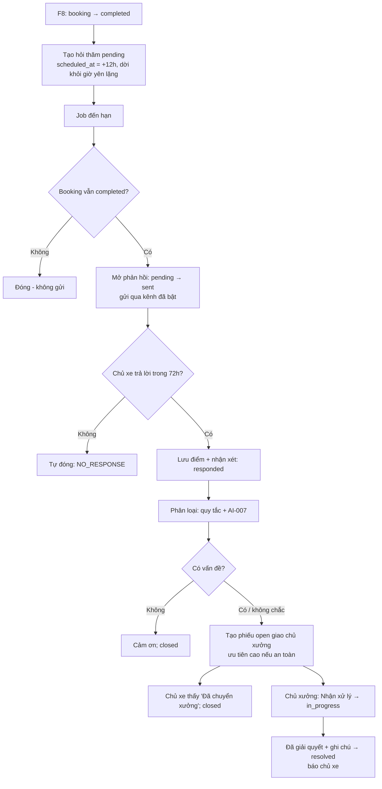
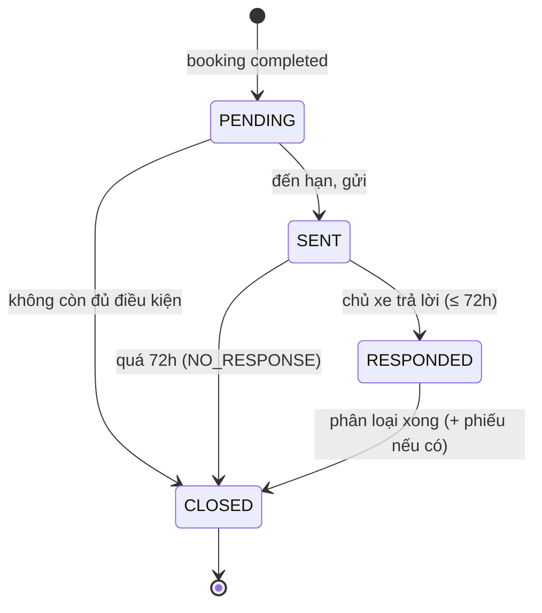
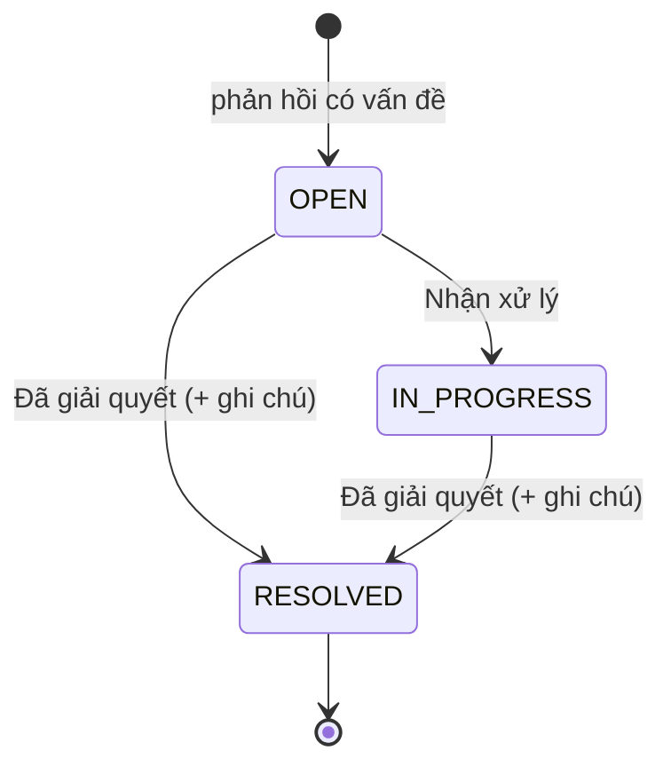

# Functional Specification — Hỏi thăm sau dịch vụ & phiếu hỗ trợ

> Tài liệu đặc tả chức năng/nghiệp vụ cho Feature **F9 — Hỏi thăm sau dịch vụ + phiếu hỗ trợ** trong [PRD EV Care MVP](../../../product/PRD_EV_Care_MVP.md#f9--hỏi-thăm-sau-dịch-vụ).
>
> **Phạm vi:** sau khi lịch hẹn **hoàn tất** trên Workshop Board (F8), hệ thống gửi chủ xe **một** câu hỏi thăm; chủ xe trả lời trong app (điểm hài lòng + nhận xét); phản hồi **có vấn đề** tạo **phiếu hỗ trợ** giao chủ xưởng; chủ xưởng xử lý phiếu tới khi xong; hỏi thăm không được trả lời sẽ tự đóng sau 72 giờ.
>
> **Quan hệ tài liệu:** Tầng agent (phân loại phản hồi, tóm tắt vấn đề, template) đã có ở [AI-007 Follow-up Agent](../../ai-agent/ai-007-sprint-4-spec.agent.md). Tài liệu này là **nguồn nghiệp vụ chính** cho F9 và chốt đề xuất AI-Q-701 → AI-Q-704 ở dạng `[Đề xuất]`.
>
> **Ưu tiên:** Could (S4) — chỉ làm khi nhóm Must đạt Demo 2 (PRD §5).
>
> **Ghi chú:** điểm chưa chốt đánh dấu `[Đề xuất]` / `[Cần xác nhận]`, liệt kê ở mục 24.

---

# 1. Document Information

| Field | Value |
|---|---|
| Feature ID | `FEAT-CRM-001` |
| Feature Name | `Hỏi thăm sau dịch vụ & phiếu hỗ trợ` |
| PRD Feature | `F9` (Could, S4); liên quan `F8`, `F7` |
| Document Version | `v1.0` |
| Status | `Draft` |
| Product / Project | EV Care — AI Agent Chăm sóc sau bán & lịch bảo dưỡng xe điện |
| Business Owner | Lê Đức Tùng (PO) |
| Author | Team 4 Người |
| Reviewer | Tech Lead |
| Stakeholders | Product, Frontend, Backend, AI Team, Chủ xưởng |
| Created Date | `2026-09-29` |
| Updated Date | `2026-09-29` |
| Related PRD | [PRD_EV_Care_MVP.md §F9](../../../product/PRD_EV_Care_MVP.md) (v3.6) · PQ-05 · Q-412 · core BR-006 |
| Related Frontend Spec | [us-041-sprint-4-spec.fe.md](../frontend/us-041-sprint-4-spec.fe.md) |
| Related API Spec | [us-041-sprint-4-spec.api.md](../api/us-041-sprint-4-spec.api.md) |
| Related Entity Spec | [us-041-sprint-4-spec.entity.md](../entity/us-041-sprint-4-spec.entity.md) |
| Related Agent Spec | [ai-007-sprint-4-spec.agent.md](../../ai-agent/ai-007-sprint-4-spec.agent.md) |
| Related Specs | [us-037 FF](../../sprint-3/feature-functional/us-037-sprint-3-spec.ff.md) (hoàn tất trên Board) · [us-021 FF](../../sprint-2/feature-functional/us-021-sprint-2-spec.ff.md) (kênh thông báo) · [follow_up](../../entity/crm/follow_up.entity.md) · [support_ticket](../../entity/crm/support_ticket.entity.md) |
| Related Design / Figma | `[Chưa có]` |
| Related GitHub Issue | `[Cần điền]` |

---

# 2. Feature Overview

## 2.1 Feature Description

1. Khi chủ xưởng bấm **Hoàn tất** một lịch hẹn (F8), hệ thống tạo một **hỏi thăm** chờ gửi, hẹn giờ gửi **12 giờ sau** (Q-412).
2. Đến giờ, hệ thống gửi qua kênh chủ xe đã bật (mặc định Discord) một tin ngắn kèm **link mở form phản hồi** trong app.
3. Chủ xe chấm **điểm hài lòng 1–5** và (tuỳ chọn) viết nhận xét.
4. Hệ thống phân loại phản hồi (quy tắc + AI-007). Phản hồi **có vấn đề** ⇒ tạo **phiếu hỗ trợ** giao **chủ xưởng** của xưởng đã làm dịch vụ, kèm tóm tắt vấn đề. Vấn đề liên quan an toàn ⇒ phiếu **ưu tiên cao** và chủ xe được khuyên dừng xe, liên hệ xưởng.
5. Chủ xưởng xem phiếu trên Portal, **nhận xử lý** rồi **đánh dấu đã giải quyết** kèm ghi chú. Chủ xe xem được trạng thái phiếu của mình.
6. Hỏi thăm không được trả lời trong **72 giờ** ⇒ tự đóng (PQ-05).

## 2.2 Business Objective

Phát hiện sớm vấn đề chất lượng sau bảo dưỡng và bảo đảm mỗi vấn đề khách báo **có người chịu trách nhiệm xử lý** (core BR-006, Charter §4.1). Tạo tín hiệu hài lòng để xưởng cải thiện.

## 2.3 User Objective

- Chủ xe: báo lại vấn đề sau khi nhận xe **không cần gọi điện**, biết vấn đề đang được xử lý.
- Chủ xưởng: nhận vấn đề có tóm tắt rõ, biết cái nào khẩn.

## 2.4 Business Value

- Giảm khiếu nại leo thang; xưởng sửa lỗi sớm.
- Dữ liệu hài lòng theo xưởng (điểm trung bình, tỉ lệ có vấn đề).
- Tái dùng `NotificationService` (us-021) và dữ liệu hoàn tất của F8.

---

# 3. Scope

## 3.1 In Scope

- Tạo hỏi thăm khi booking `completed` (gọi từ F8), tối đa 1 / booking.
- Job gửi hỏi thăm đến hạn qua `NotificationService`; ghi kết quả theo kênh.
- Form phản hồi trong app: điểm 1–5 (bắt buộc) + nhận xét (tuỳ chọn).
- Phân loại phản hồi (quy tắc + LLM, có fallback) và tạo phiếu hỗ trợ khi có vấn đề.
- Cờ ưu tiên an toàn trên phiếu.
- Chủ xưởng: danh sách + chi tiết phiếu; chuyển `open → in_progress → resolved` với ghi chú xử lý.
- Chủ xe: xem phiếu hỗ trợ của mình; nhận thông báo khi phiếu được giải quyết.
- Tự đóng hỏi thăm sau 72 giờ không phản hồi.

## 3.2 Out of Scope

- Khảo sát nhiều câu, NPS chi tiết (AI-007 §3.2).
- Chat hai chiều chủ xe ↔ chủ xưởng trong phiếu (post-MVP — Multi-party chat plan).
- Trả lời hỏi thăm ngay trong Discord (nút/tin nhắn) — MVP chỉ link sang app.
- Bồi thường, bảo hành lại, đặt lịch sửa lại tự động (chủ xe tự đặt qua F6).
- Mở lại phiếu đã giải quyết; SLA/escalation theo thời gian.
- Phiếu hỗ trợ không xuất phát từ hỏi thăm (chủ xe tự mở phiếu).

---

# 4. Actors & Stakeholders

## 4.1 Actors

| Actor | Type | Responsibility |
|---|---|---|
| Chủ xe | User | Nhận hỏi thăm, trả lời, xem phiếu |
| Chủ xưởng | User | Xử lý phiếu của xưởng mình |
| Workshop Board (F8) | System | Tạo hỏi thăm khi hoàn tất |
| Job gửi hỏi thăm | System | Gửi đến hạn, tự đóng quá hạn |
| Follow-up Agent (AI-007) | System | Phân loại, tóm tắt vấn đề |
| `NotificationService` | System | Gửi qua kênh chủ xe (us-021) |

## 4.2 Stakeholders

| Stakeholder | Organization / Team | Interest / Responsibility |
|---|---|---|
| Product Owner | Product | Chốt thời điểm gửi, cửa sổ phản hồi, ngưỡng mở phiếu |
| Backend Team | Engineering | Job, API, phân loại có fallback |
| AI Team | Engineering | Prompt phân loại/tóm tắt (AI-007) |
| Frontend Team | Engineering | Form phản hồi, màn phiếu (chủ xe + Portal) |
| Chủ xưởng | Partner | Xử lý phiếu |

---

# 5. User Story

## US-041

**As a** chủ xe vừa bảo dưỡng xong qua EV Care

**I want to** được hỏi thăm một lần và trả lời nhanh bằng điểm + vài dòng nhận xét

**So that** tôi báo được vấn đề (nếu có) mà không phải gọi điện.

### Additional User Stories

- `US-042`: As a chủ xe, I want to thấy vấn đề tôi báo đã được chuyển cho xưởng và đang được xử lý, so that tôi yên tâm.
- `US-043`: As a chủ xưởng, I want to nhận phiếu hỗ trợ có tóm tắt rõ và biết phiếu nào khẩn, rồi đánh dấu đang xử lý / đã giải quyết, so that tôi xử lý đúng việc, đúng thứ tự.
- `US-044`: As a hệ thống, I want to tự đóng hỏi thăm không được trả lời sau 72 giờ, so that dữ liệu không treo mãi ở trạng thái chờ.

---

# 6. Use Case

## UC-901 — Gửi hỏi thăm

**Primary Actor** — Job gửi hỏi thăm. **Trigger** — `scheduled_at` đến hạn. **Preconditions** — hỏi thăm `pending`; booking `completed`. **Postconditions** — hỏi thăm `sent` (mở phản hồi), kết quả từng kênh được ghi.

## UC-902 — Chủ xe phản hồi

**Primary Actor** — Chủ xe. **Trigger** — mở link / mở từ chi tiết lịch hẹn. **Preconditions** — hỏi thăm `sent`, chưa quá 72 giờ, chủ xe sở hữu booking. **Postconditions** — phản hồi được lưu; hỏi thăm `responded`.

## UC-903 — Phân loại và tạo phiếu

**Primary Actor** — Hệ thống (AI-007). **Trigger** — ngay sau UC-902. **Postconditions** — `has_issue` xác định; có vấn đề ⇒ phiếu `open` giao chủ xưởng; hỏi thăm `closed`.

## UC-904 — Chủ xưởng xử lý phiếu

**Primary Actor** — Chủ xưởng. **Trigger** — có phiếu `open`. **Postconditions** — `in_progress` → `resolved` (có ghi chú xử lý); chủ xe được báo khi `resolved`.

## UC-905 — Tự đóng hỏi thăm không phản hồi

**Primary Actor** — Job. **Trigger** — hỏi thăm `sent` quá 72 giờ. **Postconditions** — `closed` với lý do "không phản hồi".

---

# 7. User Flow

## 7.1 Main User Flow



## 7.2 Flow Description

| Step | Actor | Action / Event | System Response | Result |
|---|---|---|---|---|
| 1 | System | Booking `completed` (F8) | Tạo hỏi thăm `pending` (BR-901, BR-902) | Chờ gửi |
| 2 | System | Đến hạn | Kiểm tra booking, mở phản hồi, gửi (BR-903, BR-904) | `sent` |
| 3 | Chủ xe | Chấm điểm + nhận xét | Kiểm tra cửa sổ 72h, lưu (BR-905) | `responded` |
| 4 | System | Phân loại | Quy tắc + LLM, fallback (BR-906) | `has_issue` |
| 5 | System | Có vấn đề | Tạo phiếu, gán chủ xưởng, ưu tiên (BR-907, BR-908) | Phiếu `open` |
| 6 | Chủ xưởng | Nhận xử lý / Giải quyết | Chuyển trạng thái phiếu (BR-910) | `in_progress` → `resolved` |
| 7 | System | 72h không phản hồi | Tự đóng (BR-909) | `closed` |

---

# 8. Screen / UI Flow

> Chi tiết thuộc [Frontend Spec](../frontend/us-041-sprint-4-spec.fe.md).

## 8.1 Screen Flow

```text
Chủ xe:
[Tin Discord] --link--> [SCR-901 Hỏi thăm sau dịch vụ] --gửi--> [SCR-901 Cảm ơn / Đã chuyển xưởng]
[SCR-701 Chi tiết lịch hẹn (us-033), COMPLETED] --"Đánh giá dịch vụ"--> [SCR-901]
[Menu] --> [SCR-902 Phiếu hỗ trợ của tôi] --> [SCR-903 Chi tiết phiếu]

Chủ xưởng (Portal):
[Sidebar "Phiếu hỗ trợ"] --> [SCR-904 Danh sách phiếu] --> [SCR-905 Chi tiết phiếu + hành động]
[SCR-802 Chi tiết lịch hẹn (us-037)] --"Phiếu hỗ trợ"--> [SCR-905]
```

## 8.2 Screen List

| Screen ID | Screen Name | Purpose | Entry From | Exit To |
|---|---|---|---|---|
| `SCR-901` | Hỏi thăm sau dịch vụ | Chấm điểm + nhận xét | Link Discord, SCR-701 | Home, SCR-903 |
| `SCR-902` | Phiếu hỗ trợ của tôi | Danh sách phiếu của chủ xe | Menu, SCR-901 | SCR-903 |
| `SCR-903` | Chi tiết phiếu (chủ xe) | Trạng thái, tóm tắt, ghi chú xử lý | SCR-902 | SCR-902 |
| `SCR-904` | Phiếu hỗ trợ (Portal) | Danh sách phiếu của xưởng | Sidebar, Dashboard | SCR-905 |
| `SCR-905` | Chi tiết phiếu (Portal) | Nội dung phản hồi + xử lý | SCR-904, SCR-802 | SCR-904 |

## 8.3 Screen / UI Reference

### SCR-901 — Hỏi thăm sau dịch vụ

**Main UI** — "Xe VF 6 (30A-***.45) đã bảo dưỡng xong tại VinFast Smart City ngày 04/10. Xe của bạn chạy thế nào?"; 5 ngôi sao; ô nhận xét (tuỳ chọn, ≤ 1000 ký tự); nút **Gửi**.

**System Behavior** — Chỉ gửi được một lần; quá 72h ⇒ "Khảo sát đã đóng — nếu xe có vấn đề, vui lòng liên hệ xưởng {SĐT xưởng}". Sau khi gửi: cảm ơn; nếu tạo phiếu ⇒ "Chúng mình đã chuyển thông tin tới xưởng {tên}. Xưởng sẽ liên hệ lại với bạn."; nếu an toàn ⇒ thêm khuyến cáo dừng xe + liên hệ xưởng ngay.

### SCR-905 — Chi tiết phiếu (Portal)

**Main UI** — Nhãn ưu tiên (**Khẩn — an toàn** / Bình thường); tóm tắt vấn đề; phản hồi gốc (điểm + nhận xét); lịch hẹn liên quan (mã, ngày, hạng mục); khách (tên, SĐT), xe (model, biển số); nút **Nhận xử lý** / **Đã giải quyết** (ghi chú bắt buộc).

---

# 9. Main Flow

## 9.1 Happy Path

1. 10:40 04/10 chủ xưởng Smart City hoàn tất bảo dưỡng VF6 (F8) ⇒ hỏi thăm `pending`, gửi lúc 22:40 → rơi vào giờ yên lặng ⇒ dời sang **08:00 05/10** (BR-902).
2. 08:00 05/10 job gửi Discord:
   ```text
   Xe VF 6 (30A-***.45) đã bảo dưỡng xong tại VinFast Smart City ngày 04/10.
   Xe của bạn chạy thế nào? Chia sẻ với chúng mình: https://app.evcare.vn/follow-ups/…
   ```
3. 12:15 chủ xe chấm 2 sao, viết "Về nhà thấy phanh trước kêu khi dừng".
4. Hệ thống phân loại **có vấn đề** (điểm ≤ 2, nhắc tới phanh) ⇒ phiếu `open`, **ưu tiên cao (an toàn)**, giao chủ xưởng Smart City, tóm tắt "Phanh trước kêu khi dừng sau bảo dưỡng".
5. Chủ xe thấy "Đã chuyển xưởng" + khuyến cáo an toàn.
6. 13:00 chủ xưởng bấm **Nhận xử lý**; 16:30 bấm **Đã giải quyết**, ghi "Đã gọi khách, hẹn kiểm tra lại má phanh miễn phí 06/10" ⇒ chủ xe nhận thông báo phiếu đã giải quyết.

---

# 10. Alternative Flow

## AF-901 — Phản hồi hài lòng

**Condition** — Điểm ≥ 4, nhận xét không nêu vấn đề (hoặc trống).

**Expected Result** — Không tạo phiếu; chủ xe thấy lời cảm ơn; hỏi thăm `closed`.

## AF-902 — Điểm cao nhưng nhận xét phàn nàn

**Condition** — 4 sao, "Xe ổn nhưng tính tiền cao hơn báo giá".

**Expected Result** — Theo nhận xét ⇒ **có vấn đề** ⇒ tạo phiếu ưu tiên bình thường (AI-EDGE-701, BR-906).

## AF-903 — Chủ xe mở hỏi thăm từ app, không qua Discord

**Condition** — Chủ xe chưa kết nối Discord, hoặc mở chi tiết lịch hẹn `COMPLETED`.

**Expected Result** — Vẫn trả lời được nếu hỏi thăm đã `sent` và còn trong 72h (AI-EDGE-705).

## AF-904 — Phân loại AI lỗi / quá thời gian

**Condition** — LLM không phản hồi trong `FOLLOW_UP_CLASSIFY_TIMEOUT_SECONDS` (5).

**Expected Result** — Dùng quy tắc fallback (điểm ≤ 2 hoặc có từ khoá vấn đề ⇒ có vấn đề; không chắc ⇒ có vấn đề); tóm tắt = nhận xét gốc cắt 500 ký tự (BR-906).

---

# 11. Exception Flow

## EF-901 — Gửi thất bại / chưa kết nối Discord

**System Behavior** — Hỏi thăm vẫn chuyển `sent` (mở phản hồi trong app); kênh ghi `failed` / `no_recipient`; thử lại lỗi tạm thời theo us-021. Không chuyển kênh khác.

**User Experience** — Không nhận tin; vẫn thấy lời mời đánh giá trên chi tiết lịch hẹn.

## EF-902 — Phản hồi sau 72 giờ

**System Behavior** — Từ chối lưu (AI-Q-701 → đã đóng).

**User Experience** — "Khảo sát đã đóng. Nếu xe có vấn đề, vui lòng liên hệ xưởng {tên} — {SĐT}."

## EF-903 — Gửi phản hồi hai lần

**System Behavior** — Lần hai bị từ chối (đã trả lời); không tạo phiếu thứ hai.

**User Experience** — Thấy lại kết quả lần trước.

## EF-904 — Tạo phiếu lỗi

**System Behavior** — Lưu phản hồi và tạo phiếu trong **một** transaction; lỗi ⇒ không lưu gì, chủ xe gửi lại (phản hồi không mất vì form giữ nội dung).

## EF-905 — Chủ xưởng thao tác phiếu đã đổi trạng thái

**System Behavior** — Từ chối, báo trạng thái hiện tại (như Board — us-037 EF-802).

## EF-906 — Nhận xét chứa nội dung điều khiển AI (prompt injection)

**System Behavior** — Coi là dữ liệu; phân loại bình thường; tóm tắt chỉ dựa trên nội dung chủ xe viết (AI-EDGE-703, AI-007 §14.5).

---

# 12. Business Rules

## BR-901 — Tạo hỏi thăm khi hoàn tất

**Rule** — Chỉ booking chuyển `completed` (F8 BR-807) mới có hỏi thăm; **tối đa 1 / booking** (core BR-006, BR-ENT-421). Booking `cancelled` (kể cả no-show) **không** có hỏi thăm.

**Priority** — High

## BR-902 — Thời điểm gửi

**Rule** —

```text
scheduled_at = completed_at + FOLLOW_UP_DELAY_HOURS (12 — Q-412)
Nếu scheduled_at rơi vào giờ yên lặng [FOLLOW_UP_QUIET_START, FOLLOW_UP_QUIET_END) = [21:00, 08:00) giờ VN
   ⇒ dời tới FOLLOW_UP_QUIET_END gần nhất sau đó   [Đề xuất — Q-901]
```

Job chạy mỗi 15 phút.

**Priority** — Medium

## BR-903 — Kiểm tra trước khi gửi

**Rule** — Ngay trước khi gửi: booking vẫn `completed`, xe vẫn thuộc chủ xe (`verified` + `active`), tài khoản `ACTIVE`. Không thoả ⇒ hỏi thăm `closed` (`NOT_ELIGIBLE`), không gửi.

**Priority** — Medium

## BR-904 — Gửi và mở phản hồi

**Rule** — Khi gửi, hỏi thăm chuyển `pending → sent` và **mở cửa sổ phản hồi 72 giờ** tính từ `sent_at`, **bất kể** kênh gửi thành công hay không (EF-901). Kênh theo cấu hình us-021 (mặc định Discord); hỏi thăm là thông báo giao dịch, **không** phụ thuộc công tắc nhắc mốc `[Đề xuất — như us-033 Q-701]`. Nội dung theo template AI-007, không PII, biển số che, link `/follow-ups/{id}`.

**Priority** — High

## BR-905 — Phản hồi của chủ xe

**Rule** — Chỉ chủ xe sở hữu booking được trả lời; hỏi thăm phải `sent` và `now ≤ sent_at + FOLLOW_UP_RESPONSE_WINDOW_HOURS` (72 — PQ-05). Phản hồi gồm **điểm 1–5 (bắt buộc)** và **nhận xét (tuỳ chọn, ≤ 1000 ký tự)** `[Đề xuất — AI-Q-702: form trong app]`. Chỉ trả lời **một lần**, không sửa.

**Priority** — High

## BR-906 — Phân loại phản hồi (thiên về không bỏ sót)

**Rule** — `has_issue = true` khi **một trong**:

1. Điểm ≤ `FOLLOW_UP_ISSUE_MAX_RATING` (2).
2. Nhận xét nêu lỗi, đèn cảnh báo, tiếng lạ, sai hạng mục, tính tiền sai, thái độ/thời gian phục vụ (AI-007 INT-702, INT-703) — **mọi phàn nàn cụ thể đều mở phiếu** `[Đề xuất — AI-Q-703]`.
3. Phân loại không chắc (độ tin cậy < 0,7) hoặc AI lỗi mà quy tắc không kết luận được "không có vấn đề".

Điểm ≥ 4 và nhận xét trống ⇒ **không** có vấn đề (không cần gọi AI). AI lỗi/quá thời gian ⇒ fallback quy tắc từ khoá + điểm (AF-904).

**Priority** — High

## BR-907 — Tạo phiếu hỗ trợ

**Rule** — `has_issue = true` ⇒ tạo **đúng một** phiếu `open` cho hỏi thăm đó, **gán ngay** cho chủ xưởng của xưởng đã làm booking (BR-ENT-424), với:

- `issue_summary`: tóm tắt ≤ 500 ký tự **chỉ từ lời chủ xe**, không thêm chẩn đoán (AI-007 §9.4); AI lỗi ⇒ nhận xét gốc (hoặc "Khách chấm {n}/5, không để lại nhận xét").
- Xe = xe của booking (BR-ENT-423).

Lưu phản hồi + tạo phiếu trong **một** transaction (EF-904).

**Priority** — High

## BR-908 — Ưu tiên an toàn

**Rule** — Nhận xét có dấu hiệu an toàn (phanh, pin, khói, cháy, mùi khét, mất lái, đèn cảnh báo đỏ, rò rỉ) ⇒ phiếu `priority = high` `[Đề xuất — AI-Q-704]` và màn cảm ơn hiện khuyến cáo: "Nếu xe có dấu hiệu bất thường khi vận hành, bạn nên dừng xe và liên hệ xưởng ngay: {SĐT xưởng}". Không hứa bồi thường/bảo hành (AI-007 BR-AI-703).

**Priority** — High

## BR-909 — Tự đóng khi không phản hồi

**Rule** — Hỏi thăm `sent` quá 72 giờ không có phản hồi ⇒ `closed` (`NO_RESPONSE`) `[Đề xuất — AI-Q-701: thêm chuyển sent → closed]`. Job chạy mỗi giờ.

**Priority** — Medium

## BR-910 — Xử lý phiếu

**Rule** — Chủ xưởng (người được gán) chuyển phiếu:

| Từ | Sang | Hành động | Bắt buộc |
|---|---|---|---|
| `open` | `in_progress` | **Nhận xử lý** | — |
| `open` / `in_progress` | `resolved` | **Đã giải quyết** | Ghi chú xử lý (≤ 1000) |

`resolved` là trạng thái cuối trong MVP (không mở lại). Khi `resolved` ⇒ báo chủ xe qua `NotificationService` (best effort) kèm link xem phiếu.

**Priority** — High

## BR-911 — Quyền xem

**Rule** —

- Chủ xe: xem hỏi thăm/phiếu của booking mình: trạng thái, tóm tắt, ghi chú xử lý. **Không** thấy độ tin cậy phân loại, ưu tiên nội bộ.
- Chủ xưởng: chỉ phiếu của xưởng mình (được gán): điểm, nhận xét gốc, tóm tắt, ưu tiên, độ tin cậy, booking, tên + SĐT khách, model + biển số. Không VIN/CCCD/email.

**Priority** — High

## BR-912 — Không chẩn đoán, không hứa hẹn

**Rule** — Mọi nội dung hệ thống sinh ra (tin nhắn, tóm tắt, lời cảm ơn) không chẩn đoán kỹ thuật, không hứa bồi thường/sửa miễn phí/bảo hành, không đổ lỗi (AI-007 §12.6).

**Priority** — High

---

# 13. State / Status

## 13.1 Hỏi thăm (`follow_up`)

| State | Meaning | Entry Condition | Exit Condition |
|---|---|---|---|
| `PENDING` | Chờ tới giờ gửi | Booking `completed` (BR-901) | `SENT` / `CLOSED` (NOT_ELIGIBLE) |
| `SENT` | Đã gửi, đang mở phản hồi 72h | Job gửi (BR-904) | `RESPONDED` / `CLOSED` (NO_RESPONSE) |
| `RESPONDED` | Đã nhận phản hồi, đang phân loại | Chủ xe gửi (BR-905) | `CLOSED` (PROCESSED) |
| `CLOSED` | Kết thúc | BR-903 / BR-909 / sau phân loại | — |



## 13.2 Phiếu hỗ trợ (`support_ticket`)

| State | Meaning | Entry Condition | Exit Condition |
|---|---|---|---|
| `OPEN` | Mới tạo, đã gán chủ xưởng | BR-907 | `IN_PROGRESS` / `RESOLVED` |
| `IN_PROGRESS` | Chủ xưởng đang xử lý | Nhận xử lý | `RESOLVED` |
| `RESOLVED` | Đã giải quyết | Có ghi chú xử lý | — |



---

# 14. Data Requirements

## 14.1 Required Data

| Data | Type | Required | Description | Source |
|---|---|---:|---|---|
| Booking hoàn tất | object | Yes | Xưởng, ngày, xe, thời điểm hoàn tất | `booking` + `booking_status_event` (us-037) |
| Hỏi thăm | object | Yes | Trạng thái, thời điểm gửi, điểm, nhận xét, phân loại | `follow_up` (ENT-412, **mở rộng**) |
| Kết quả gửi | list | Yes | Theo kênh | `follow_up_delivery` (ENT-427, **mới**) |
| Phiếu hỗ trợ | object | Yes | Tóm tắt, ưu tiên, trạng thái, ghi chú xử lý | `support_ticket` (ENT-413, **mở rộng**) |
| Chủ xưởng của xưởng | id | Yes | Người được gán | `workshop.owner_id` |
| SĐT xưởng | string | No | Khuyến cáo an toàn / khảo sát đã đóng | `workshop` |
| Kênh + Discord | list | Yes | Nơi gửi | us-021, ENT-417 |

## 14.2 Data Dependency

| Data / Entity | Why Needed | Read / Write | Owner |
|---|---|---|---|
| `follow_up` | Vòng đời hỏi thăm, phản hồi | Read / Write | Backend |
| `follow_up_delivery` | Kết quả gửi | Write | Backend |
| `support_ticket` | Phiếu | Read / Write | Backend |
| `booking`, `workshop`, `user_vehicle`, `vehicle_user` | Ngữ cảnh | Read | Backend |
| LLM (AI-007) | Phân loại, tóm tắt | — | AI Team |

---

# 15. Business Error & Edge Cases

| Case ID | Scenario | Expected Business Behavior | User Outcome |
|---|---|---|---|
| `EDGE-901` | Hoàn tất lúc 10:40 ⇒ 22:40 trong giờ yên lặng | Dời 08:00 hôm sau (BR-902) | Nhận tin buổi sáng |
| `EDGE-902` | Booking huỷ / no-show | Không có hỏi thăm (BR-901) | — |
| `EDGE-903` | Chưa kết nối Discord | `sent` vẫn mở phản hồi; kênh `no_recipient` (EF-901) | Trả lời trong app |
| `EDGE-904` | 5 sao, không nhận xét | Không gọi AI, không phiếu (BR-906) | Cảm ơn |
| `EDGE-905` | 4 sao + phàn nàn giá | Có vấn đề, phiếu bình thường (AF-902) | Đã chuyển xưởng |
| `EDGE-906` | 1 sao, không nhận xét | Có vấn đề; tóm tắt "Khách chấm 1/5, không để lại nhận xét" (BR-907) | Đã chuyển xưởng |
| `EDGE-907` | Nhắc "phanh", "khói" | Ưu tiên cao + khuyến cáo an toàn (BR-908) | Thấy khuyến cáo |
| `EDGE-908` | Trả lời sau 72h | Từ chối (EF-902) | Hướng dẫn liên hệ xưởng |
| `EDGE-909` | Trả lời hai lần | Từ chối lần hai (EF-903) | Thấy kết quả cũ |
| `EDGE-910` | AI lỗi | Fallback quy tắc (AF-904) | Không thấy khác biệt |
| `EDGE-911` | Chủ xưởng khác mở phiếu | Không tìm thấy (BR-911) | — |
| `EDGE-912` | Xưởng đổi chủ / chủ xưởng bị gỡ | Phiếu giữ `assigned_to` cũ = NULL (SET NULL) ⇒ hiện "Chưa gán" cho chủ xưởng mới của xưởng `[Cần xác nhận — Q-905]` | — |
| `EDGE-913` | Nhận xét chứa prompt injection | Coi là dữ liệu (EF-906) | — |

---

# 16. Permissions & Access

## 16.1 Access Matrix

| Role / Actor | View | Create | Update | Delete | Notes |
|---|---:|---:|---:|---:|---|
| Chủ xe | ✅ (hỏi thăm/phiếu của mình) | ✅ (phản hồi) | ❌ | ❌ | BR-905, BR-911 |
| Chủ xưởng | ✅ (phiếu xưởng mình) | ❌ | ✅ (trạng thái phiếu) | ❌ | BR-910, BR-911 |
| Hệ thống / AI-007 | ✅ | ✅ (hỏi thăm, phiếu) | ✅ | ❌ | |

## 16.2 Business Authorization Rules

- Link Discord chỉ mang `followUpId`; trả lời yêu cầu đăng nhập (như us-033 BR-706).
- Chủ xưởng chỉ thấy phiếu của xưởng mình (BR-911).

---

# 17. Acceptance Criteria

## AC-901 — Một hỏi thăm mỗi booking hoàn tất (BR-006)

**Given** booking hoàn tất trên Board

**When** chủ xưởng bấm Hoàn tất (kể cả bấm lặp)

**Then** có đúng một hỏi thăm `pending` cho booking, hẹn gửi sau 12 giờ (hoặc 08:00 kế tiếp nếu rơi vào giờ yên lặng).

## AC-902 — Gửi đúng hạn

**Given** hỏi thăm `pending` có `scheduled_at` 08:00

**When** job chạy 08:00–08:15

**Then** hỏi thăm `sent`; chủ xe đã kết nối Discord nhận đúng một tin có link form.

## AC-903 — Hài lòng không tạo phiếu

**Given** hỏi thăm `sent`

**When** chủ xe chấm 5 sao, không nhận xét

**Then** không có phiếu; hỏi thăm `closed`; chủ xe thấy lời cảm ơn.

## AC-904 — Có vấn đề tạo phiếu giao đúng xưởng

**Given** hỏi thăm của booking tại Smart City

**When** chủ xe chấm 2 sao "phanh trước kêu"

**Then** có đúng một phiếu `open`, `priority = high`, gán chủ xưởng Smart City, tóm tắt không chứa thông tin ngoài lời chủ xe; chủ xe thấy "Đã chuyển xưởng" + khuyến cáo an toàn.

## AC-905 — Tự đóng sau 72 giờ (PQ-05)

**Given** hỏi thăm `sent` lúc 08:00 05/10, không phản hồi

**When** job chạy sau 08:00 08/10

**Then** hỏi thăm `closed` (`NO_RESPONSE`); mở form thấy "Khảo sát đã đóng".

## AC-906 — Chỉ trả lời một lần

**Given** chủ xe đã trả lời

**When** gửi lại

**Then** bị từ chối; không có phiếu thứ hai.

## AC-907 — AI lỗi vẫn không bỏ sót

**Given** LLM không khả dụng

**When** chủ xe chấm 1 sao "đèn báo lỗi sáng"

**Then** vẫn tạo phiếu với tóm tắt = nhận xét gốc.

## AC-908 — Chủ xưởng xử lý phiếu

**Given** phiếu `open` của xưởng

**When** chủ xưởng bấm Nhận xử lý rồi Đã giải quyết với ghi chú

**Then** phiếu `in_progress` rồi `resolved` có ghi chú; chủ xe thấy trạng thái + ghi chú và nhận thông báo.

## AC-909 — Giải quyết bắt buộc có ghi chú

**Given** phiếu `in_progress`

**When** chủ xưởng bấm Đã giải quyết không ghi chú

**Then** bị từ chối.

## AC-910 — Phân quyền phiếu

**Given** phiếu của xưởng Smart City

**When** chủ xưởng Mỹ Đình mở, hoặc chủ xe khác mở

**Then** trả "không tìm thấy".

---

# 18. Non-functional Expectations

| Requirement | Expected Behavior |
|---|---|
| Notification Timing | Gửi trong 15' sau `scheduled_at` |
| Response Experience | Gửi phản hồi ≤ 6 s (p90) kể cả gọi AI (timeout 5 s + fallback); API khác ≤ 500 ms |
| Correctness | Phản hồi + phiếu nguyên tử; 1 hỏi thăm / booking; 1 phiếu / hỏi thăm |
| Safety | Ưu tiên không bỏ sót vấn đề; khuyến cáo an toàn khi cần |
| Privacy | Tin nhắn không PII; nhận xét không đưa vào analytics |
| Language | Tiếng Việt; giờ VN (lưu UTC) |

---

# 19. Dependencies

| Dependency | Purpose | Owner | Required | Related Document |
|---|---|---|---:|---|
| F8 — us-037 | Tạo hỏi thăm khi hoàn tất; SCR-802 dẫn tới phiếu | Backend/FE | Yes | [us-037 FF](../../sprint-3/feature-functional/us-037-sprint-3-spec.ff.md) |
| us-021 | `NotificationService`, kênh, retry | Backend | Yes | [us-021 FF](../../sprint-2/feature-functional/us-021-sprint-2-spec.ff.md) |
| us-033 | Màn chi tiết lịch hẹn (entry "Đánh giá dịch vụ") | FE | No | [us-033 FF](../../sprint-3/feature-functional/us-033-sprint-3-spec.ff.md) |
| AI-007 | Phân loại, tóm tắt, template | AI Team | Yes (có fallback) | [ai-007](../../ai-agent/ai-007-sprint-4-spec.agent.md) |
| LLM provider | Structured output | AI Team | No (fallback) | — |

---

# 20. Assumptions

- `workshop` có số điện thoại liên hệ (đồng bộ từ hãng) để hiện trong khuyến cáo; thiếu ⇒ chỉ nói "liên hệ xưởng".
- Một xưởng một chủ xưởng; người được gán luôn là chủ xưởng hiện tại lúc tạo phiếu.
- Lượng phản hồi nhỏ (vài chục/ngày) ⇒ gọi AI đồng bộ khi gửi phản hồi là chấp nhận được.

---

# 21. Business Constraints

- Tối đa 1 hỏi thăm / booking (core BR-006).
- Không hứa hẹn, không chẩn đoán (AI-007).
- Không PII trong thông báo (PRD §7).
- Không chuyển kênh khi Discord lỗi (PRD F7).

---

# 22. Terminology / Glossary

| Term ID | Term | Vietnamese Name | Definition | Example / Notes |
|---|---|---|---|---|
| `TERM-901` | Follow-up | Hỏi thăm sau dịch vụ | Một câu hỏi gửi chủ xe sau khi booking hoàn tất | 1 / booking |
| `TERM-902` | Response window | Cửa sổ phản hồi | 72 giờ từ khi gửi | PQ-05 |
| `TERM-903` | Quiet hours | Giờ yên lặng | 21:00–08:00 giờ VN, không gửi hỏi thăm | `[Đề xuất]` |
| `TERM-904` | Support ticket | Phiếu hỗ trợ | Vấn đề sau dịch vụ giao chủ xưởng xử lý | ENT-413 |
| `TERM-905` | Safety priority | Ưu tiên an toàn | Phiếu có dấu hiệu nguy hiểm khi vận hành | `priority = high` |
| `TERM-906` | Issue summary | Tóm tắt vấn đề | ≤ 500 ký tự, chỉ từ lời chủ xe | |

### Important Terminology Rules

- "Hỏi thăm" (sau dịch vụ) khác "nhắc" (trước dịch vụ — us-021, us-033).
- "Đã giải quyết" nghĩa là chủ xưởng đã xử lý và ghi chú; không có nghĩa khách đồng ý.

---

# 23. Partner / Stakeholder Notes

## 23.1 Confirmed

- Gửi 12 giờ sau `completed` (Q-412); 1 lần / booking (BR-006).
- Kênh Discord; tự đóng sau 72 giờ (PQ-05).
- Phản hồi có vấn đề ⇒ phiếu giao chủ xưởng (PRD F9).

## 23.2 Pending Confirmation

- AI-Q-701 → AI-Q-704 và Q-901 → Q-905 (mục 24).

---

# 24. Open Questions

| ID | Question | Owner | Status | Decision / Due Date |
|---|---|---|---|---|
| `AI-Q-701` | Thêm chuyển `sent → closed` vào `follow_up`? | PO + Backend | Open | `[Đề xuất]` Có (BR-909; Entity Spec) |
| `AI-Q-702` | Chủ xe trả lời ở đâu? | PO | Open | `[Đề xuất]` Form trong app (BR-905) |
| `AI-Q-703` | Mọi phàn nàn nhỏ đều mở phiếu? | PO | Open | `[Đề xuất]` Có (BR-906) |
| `AI-Q-704` | Phiếu có cờ ưu tiên an toàn? | Backend | Open | `[Đề xuất]` Có — cột `priority` (BR-908) |
| `Q-901` | Có giờ yên lặng khi gửi hỏi thăm? | PO | Open | `[Đề xuất]` 21:00–08:00, dời sang 08:00 |
| `Q-902` | Ngưỡng điểm coi là có vấn đề | PO | Open | `[Đề xuất]` ≤ 2 |
| `Q-903` | Hỏi thăm có tuân theo công tắc nhắc mốc của us-021? | PO | Open | `[Đề xuất]` Không |
| `Q-904` | Chủ xe có phản hồi lại khi phiếu `resolved` (không đồng ý)? | PO | Open | Post-MVP (chat nhiều bên) |
| `Q-905` | Phiếu mất người gán khi đổi chủ xưởng | PO | Open | `[Đề xuất]` Gán lại cho chủ xưởng hiện tại của xưởng khi họ mở |

---

# 25. Traceability

| Item | Reference |
|---|---|
| PRD | F9 (v3.6); PQ-05; Q-412; core BR-006 |
| User Story | `US-041` → `US-044` |
| Use Case | `UC-901` → `UC-905`; AI-007 `UC-AI-701`, `UC-AI-702` |
| Business Rules | `BR-901` → `BR-912` |
| Acceptance Criteria | `AC-901` → `AC-910` |
| Frontend Specification | [us-041-sprint-4-spec.fe.md](../frontend/us-041-sprint-4-spec.fe.md) |
| API Specification | [us-041-sprint-4-spec.api.md](../api/us-041-sprint-4-spec.api.md) |
| Entity Specification | [us-041-sprint-4-spec.entity.md](../entity/us-041-sprint-4-spec.entity.md) |
| Agent Specification | [ai-007-sprint-4-spec.agent.md](../../ai-agent/ai-007-sprint-4-spec.agent.md) |
| Test Cases | `[Chưa có]` |

---

# 26. Related Documents

- [PRD EV Care MVP](../../../product/PRD_EV_Care_MVP.md)
- [AI-007 Follow-up Agent](../../ai-agent/ai-007-sprint-4-spec.agent.md)
- [us-037 — Workshop Board](../../sprint-3/feature-functional/us-037-sprint-3-spec.ff.md)
- [follow_up.entity.md](../../entity/crm/follow_up.entity.md) · [support_ticket.entity.md](../../entity/crm/support_ticket.entity.md)

---

# 27. Change Log

| Version | Date | Author | Change |
|---|---|---|---|
| `v1.0` | `2026-09-29` | Team 4 Người | Initial version từ PRD v3.6 §F9 + AI-007 |

---

# 28. Approval

| Role | Name | Status | Date |
|---|---|---|---|
| Product Owner | Lê Đức Tùng | Pending | |
| Business Stakeholder | Chủ xưởng (đại diện) | Pending | |
| Technical Owner | Tech Lead | Pending | |
