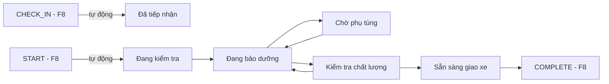

# Functional Specification — Tiến độ dịch vụ chi tiết 6 bước

> **Cập nhật phạm vi (02/10/2026):** các phần dưới đây trong tài liệu này không còn áp dụng.
>
> - Báo giá / duyệt báo giá (`quote`, `quote_item`, us-049): **đã bỏ**. Đặt lịch không gắn báo giá; mọi con số chi phí là ước tính (F5), chi phí cuối cùng do xưởng xác nhận khi kiểm tra xe.
> - Kết nối Discord (`user_discord_link`, ENT-417): **đã bỏ**. Nhắc bảo dưỡng, nhắc lịch hẹn và hỏi thăm hiện trong mục **Thông báo** của app; danh sách kênh ngoài (Zalo / Telegram / SMS / Email) vẫn có nhưng đều "Sắp có", bật nhắc không bắt buộc chọn kênh.

> Đặc tả nghiệp vụ cho Feature **F8b — Tiến độ chi tiết 6 bước (`service_progress`)** trong [PRD EV Care MVP](../../../product/PRD_EV_Care_MVP.md#5-phạm-vi) (Could, S4).
>
> **Quan hệ tài liệu:** [us-037 FF](../../sprint-3/feature-functional/us-037-sprint-3-spec.ff.md) (Workshop Board) quản lý `booking.status`; F8b bổ sung **mốc tiến độ chi tiết** bên trong giai đoạn xe ở xưởng (`checked_in` → `in_progress`) và **không** thay đổi state machine của booking.
>
> **Ưu tiên:** Could — chỉ làm khi nhóm Must đạt Demo 2 (PRD §12 — Scope creep).
>
> **Quy ước mã:** dải `13xx`.

---

# 1. Document Information

| Field | Value |
|---|---|
| Feature ID | `FEAT-PROG-001` |
| Feature Name | `Tiến độ dịch vụ chi tiết 6 bước` |
| PRD Feature | `F8b` (Could, S4); liên quan `F8`, `F6b`, `F9` |
| Document Version | `v1.0` |
| Status | `Draft` |
| Business Owner | Lê Đức Tùng (PO) |
| Author | Team 4 Người |
| Created Date | `2026-09-30` |
| Updated Date | `2026-09-30` |
| Related PRD | [PRD §5 (F8b), Phụ lục A.2 #7](../../../product/PRD_EV_Care_MVP.md) |
| Related Frontend Spec | [us-057-sprint-4-spec.fe.md](../frontend/us-057-sprint-4-spec.fe.md) |
| Related API Spec | [us-057-sprint-4-spec.api.md](../api/us-057-sprint-4-spec.api.md) |
| Related Entity Spec | [us-057-sprint-4-spec.entity.md](../entity/us-057-sprint-4-spec.entity.md) · [service_progress.entity](../../entity/maintenance/service_progress.entity.md) |

---

# 2. Feature Overview

## 2.1 Feature Description

Khi xe đã ở xưởng, chủ xưởng cập nhật xe đang ở bước nào trong **6 bước**: Đã tiếp nhận → Đang kiểm tra → Đang bảo dưỡng → Chờ phụ tùng → Kiểm tra chất lượng → Sẵn sàng giao xe. Chủ xe xem dòng thời gian tiến độ trên màn lịch hẹn và được báo khi xe **chờ phụ tùng** hoặc **sẵn sàng giao**.

## 2.2 Business Objective

Giảm cuộc gọi hỏi "xe tôi xong chưa?" tới xưởng (PP-05, G4).

## 2.3 User Objective

Chủ xe biết xe đang ở đâu trong quy trình và khi nào đến nhận xe.

## 2.4 Business Value

Lưu vết các mốc tại xưởng; dữ liệu cho hỏi thăm sau dịch vụ (F9).

---

# 3. Scope

## 3.1 In Scope

- 6 mốc theo `service_stage_enum` (ENT-403).
- Hệ thống tự ghi mốc khi check-in và khi bắt đầu dịch vụ (F8).
- Chủ xưởng cập nhật các mốc còn lại trên Board, kèm ghi chú.
- Chủ xe xem dòng thời gian; nhận thông báo ở mốc "Chờ phụ tùng" và "Sẵn sàng giao xe".

## 3.2 Out of Scope

- Ước tính thời gian hoàn thành tự động.
- Ảnh/video tiến độ, chữ ký giao xe.
- Phân công kỹ thuật viên (không có role nhân viên trong MVP).
- Cập nhật realtime (WebSocket/Supabase Realtime) — MVP làm mới định kỳ (PRD §9).
- Phát sinh báo giá khi đang sửa (F5b chỉ cho mốc bảo dưỡng; phát sinh ⇒ ghi chú + xưởng liên hệ khách).

---

# 4. Actors

| Actor | Type | Responsibility |
|---|---|---|
| Chủ xưởng | User | Cập nhật mốc + ghi chú |
| Hệ thống | System | Tự ghi `checked_in`, `inspecting`; gửi thông báo |
| Chủ xe | User | Xem tiến độ |
| NotificationService | System | Gửi Discord theo us-021 |

---

# 5. User Story

## US-057

**As a** chủ xe đang để xe tại xưởng **I want to** xem xe đang ở bước nào **So that** tôi không phải gọi điện hỏi.

### Additional User Stories

- `US-058`: As a chủ xưởng, I want to cập nhật bước tiến độ bằng một thao tác trên Board, so that khách tự theo dõi được.
- `US-059`: As a chủ xe, I want to được báo khi xe chờ phụ tùng hoặc sẵn sàng giao, so that tôi sắp xếp thời gian nhận xe.

---

# 6. Use Case

## UC-1301 — Hệ thống ghi mốc tự động

**Trigger** — us-037: `CHECK_IN` (`confirmed → checked_in`) ⇒ ghi `checked_in`; `START` (`checked_in → in_progress`) ⇒ ghi `inspecting`. Ghi trong **cùng transaction** chuyển trạng thái booking.

## UC-1302 — Chủ xưởng cập nhật mốc

**Preconditions** — Booking của xưởng mình, `status = in_progress`; mốc mới hợp lệ theo BR-1302.

**Postconditions** — Thêm một dòng `service_progress` (append-only); chủ xe thấy ở lần tải kế tiếp; thông báo nếu BR-1305.

## UC-1303 — Chủ xe xem tiến độ

**Preconditions** — Booking của chủ xe ở `checked_in` / `in_progress` / `completed`.

**Postconditions** — Chỉ đọc.

---

# 7. User Flow

---

# 8. Screen / UI Flow

| Screen ID | Screen Name | Purpose | Actor |
|---|---|---|---|
| `SCR-1301` | Khối "Tiến độ" trong chi tiết lịch hẹn Board (us-037 SCR-802) | Xem dòng thời gian + nút mốc kế tiếp hợp lệ + ghi chú | Chủ xưởng |
| `SCR-1302` | Khối "Tiến độ" trong Booking Ticket (us-053 SCR-1201) | Dòng thời gian 6 bước | Chủ xe |

---

# 9. Main Flow

1. 09:05 chủ xưởng quét QR check-in (F8) ⇒ mốc **Đã tiếp nhận**.
2. 09:10 bấm Bắt đầu (F8) ⇒ booking `in_progress`, mốc **Đang kiểm tra**.
3. 09:40 bấm **Đang bảo dưỡng**.
4. 10:30 phát hiện thiếu má phanh ⇒ **Chờ phụ tùng**, ghi chú "Chờ má phanh trước, dự kiến 14:00" ⇒ chủ xe nhận Discord.
5. 14:10 **Đang bảo dưỡng** ⇒ 15:00 **Kiểm tra chất lượng** ⇒ 15:20 **Sẵn sàng giao xe** ⇒ chủ xe nhận Discord "Xe đã sẵn sàng".
6. 16:00 bấm Hoàn tất (F8) ⇒ `completed`; tiến độ đóng băng.

---

# 10. Alternative / Exception Flow

## AF-1301 — Hoàn tất khi chưa ở "Sẵn sàng giao xe"

Hoàn tất (F8 BR-807) **không** bị chặn bởi F8b; Board hiển thị cảnh báo "Chưa cập nhật Sẵn sàng giao xe — vẫn hoàn tất?" `[Đề xuất — Q-1301]`.

## AF-1302 — Làm lại sau kiểm tra chất lượng

`quality_check → servicing` được phép (BR-1302), ghi chú khuyến nghị.

## EF-1301 — Cập nhật mốc trái thứ tự

Từ chối; hiển thị các mốc hợp lệ kế tiếp.

## EF-1302 — Hai tab cập nhật cùng lúc

Kiểm tra "mốc hiện tại mong đợi" (`expectedCurrentStage`); lệch ⇒ từ chối, tải lại.

## EF-1303 — Gửi thông báo lỗi

Không ảnh hưởng việc ghi mốc; thử lại theo us-021; không chuyển kênh.

---

# 11. Business Rules

## BR-1301 — Tiến độ chỉ là chi tiết bên trong trạng thái booking

`service_progress` **không** thay `booking.status`. Ghi được khi `booking.status ∈ {checked_in, in_progress}` (BR-ENT-405). Sau `completed`/`cancelled`: đóng băng.

## BR-1302 — Thứ tự mốc hợp lệ

| Mốc hiện tại | Mốc kế tiếp hợp lệ | Ai ghi |
|---|---|---|
| (chưa có) | `checked_in` | Hệ thống — khi CHECK_IN |
| `checked_in` | `inspecting` | Hệ thống — khi START |
| `inspecting` | `servicing` | Chủ xưởng |
| `servicing` | `waiting_parts`, `quality_check` | Chủ xưởng |
| `waiting_parts` | `servicing` | Chủ xưởng |
| `quality_check` | `ready_for_pickup`, `servicing` | Chủ xưởng |
| `ready_for_pickup` | — (chờ COMPLETE ở F8) | — |

Không có bước lùi khác; không có "hoàn tác" `[Đề xuất — Q-1302]`.

## BR-1303 — Ghi chú

- `waiting_parts`: **bắt buộc** ghi chú (phụ tùng chờ, dự kiến) 10–500 ký tự.
- Mốc khác: tuỳ chọn ≤ 500 ký tự.
- Ghi chú **hiển thị cho chủ xe** — Portal nhắc "Khách hàng sẽ thấy ghi chú này" `[Đề xuất — Q-1303]`. Không ghi PII.

## BR-1304 — Append-only và truy vết

Mỗi lần cập nhật là một dòng mới gồm người ghi (chủ xưởng hoặc hệ thống), nguồn, thời điểm (BR-ENT-405).

## BR-1305 — Thông báo cho chủ xe

Gửi qua `NotificationService` (kênh chủ xe đã bật, mặc định Discord — us-021) khi vào `waiting_parts` và `ready_for_pickup`; các mốc khác chỉ hiện trong app. Nội dung: xưởng, mốc, ghi chú đã lọc độ dài, link ticket; không VIN/SĐT/biển số đầy đủ. Gửi sau commit, best-effort.

## BR-1306 — Chủ xưởng chỉ cập nhật xưởng mình

Như us-037 BR-801.

---

# 12. State

Không thêm trạng thái booking. "Mốc hiện tại" = dòng `service_progress` mới nhất của booking.

---

# 13. Business Error & Edge Cases

| Case ID | Scenario | Expected Behavior |
|---|---|---|
| `EDGE-1301` | Cập nhật khi booking `confirmed` (chưa check-in) | Từ chối |
| `EDGE-1302` | `waiting_parts` không có ghi chú | Từ chối |
| `EDGE-1303` | Cập nhật sau `completed` | Từ chối (BR-1301) |
| `EDGE-1304` | Booking check-in trước khi F8b bật (không có mốc `checked_in`) | Mốc hiện tại coi như theo `booking.status`: `checked_in` ⇒ `checked_in`, `in_progress` ⇒ `inspecting`; cho phép tiếp tục |
| `EDGE-1305` | Chủ xe chưa kết nối Discord | Không gửi được; vẫn thấy trong app (us-021) |
| `EDGE-1306` | Nhiều lần `waiting_parts ↔ servicing` | Cho phép; mỗi lần vào `waiting_parts` gửi một thông báo, tối đa 3 lần/booking `[Đề xuất]` |

---

# 14. Permissions

| Role | View | Create |
|---|---:|---:|
| Chủ xe | ✅ booking của mình | ❌ |
| Chủ xưởng | ✅ xưởng mình | ✅ (BR-1302) |
| Hệ thống | ✅ | ✅ `checked_in`, `inspecting` |

---

# 15. Acceptance Criteria

## AC-1301 — Mốc tự động

**Given** booking `confirmed` hôm nay **When** chủ xưởng check-in rồi bắt đầu **Then** tiến độ có `checked_in` rồi `inspecting`, cùng thời điểm với chuyển trạng thái booking.

## AC-1302 — Chặn sai thứ tự

**Given** mốc hiện tại `inspecting` **When** chủ xưởng chọn `ready_for_pickup` **Then** bị từ chối, được gợi ý `servicing`.

## AC-1303 — Chờ phụ tùng cần ghi chú và báo khách

**Given** mốc `servicing` **When** chuyển `waiting_parts` kèm ghi chú **Then** dòng được ghi và chủ xe nhận thông báo; không có ghi chú ⇒ bị từ chối.

## AC-1304 — Chủ xe chỉ thấy booking của mình

**Given** chủ xe A **When** đọc tiến độ booking của B **Then** như không tồn tại.

## AC-1305 — Đóng băng sau hoàn tất

**Given** booking `completed` **When** chủ xưởng thêm mốc **Then** bị từ chối.

---

# 16. Non-functional

| Requirement | Expected |
|---|---|
| Làm mới phía chủ xe | Tự tải lại mỗi 60 s khi màn đang mở và booking ở `checked_in`/`in_progress` |
| API | ≤ 500 ms (p90) |

---

# 17. Dependencies

| Dependency | Purpose | Related |
|---|---|---|
| F8 Board (us-037) | CHECK_IN/START/COMPLETE, SCR-802 | [us-037 FF](../../sprint-3/feature-functional/us-037-sprint-3-spec.ff.md) |
| F6b Ticket (us-053) | Nơi chủ xe xem | [us-053 FF](../../sprint-3/feature-functional/us-053-sprint-3-spec.ff.md) |
| NotificationService (us-021) | Discord | [us-021 FF](../../sprint-2/feature-functional/us-021-sprint-2-spec.ff.md) |

---

# 18. Glossary

| Term | Vietnamese | Definition |
|---|---|---|
| `checked_in` | Đã tiếp nhận | Xe đã được check-in tại xưởng |
| `inspecting` | Đang kiểm tra | Kiểm tra tổng quát trước khi làm |
| `servicing` | Đang bảo dưỡng | Thực hiện hạng mục |
| `waiting_parts` | Chờ phụ tùng | Tạm dừng chờ phụ tùng |
| `quality_check` | Kiểm tra chất lượng | Kiểm tra sau khi làm |
| `ready_for_pickup` | Sẵn sàng giao xe | Khách có thể đến nhận |

---

# 19. Open Questions

| ID | Question | Status |
|---|---|---|
| `Q-1301` | Có bắt buộc `ready_for_pickup` trước khi COMPLETE? | Open — `[Đề xuất]` không bắt buộc, chỉ cảnh báo |
| `Q-1302` | Có cho "hoàn tác" mốc bấm nhầm (vd. trong 5 phút)? | Open — `[Đề xuất]` không trong MVP |
| `Q-1303` | Ghi chú tiến độ có hiển thị cho chủ xe? | Open — `[Đề xuất]` có, Portal cảnh báo |
| `Q-1304` | `service_progress.updated_by` là `integer` (Q-403 đã chốt giữ nguyên) nhưng `workshop_owner.id` là `uuid` ⇒ không lưu được người cập nhật | Open — xem Entity Spec, đề xuất cột mới |

---

# 20. Traceability

| Item | Reference |
|---|---|
| PRD | F8b (§5), Phụ lục A.2 #7 |
| User Story | `US-057` → `US-059` |
| Business Rules | `BR-1301` → `BR-1306`, `BR-ENT-405` |
| Acceptance Criteria | `AC-1301` → `AC-1305` |

---

# 21. Change Log

| Version | Date | Author | Change |
|---|---|---|---|
| `v1.0` | `2026-09-30` | Team 4 Người | Bản đầu — PRD liệt kê F8b nhưng chưa có spec |
