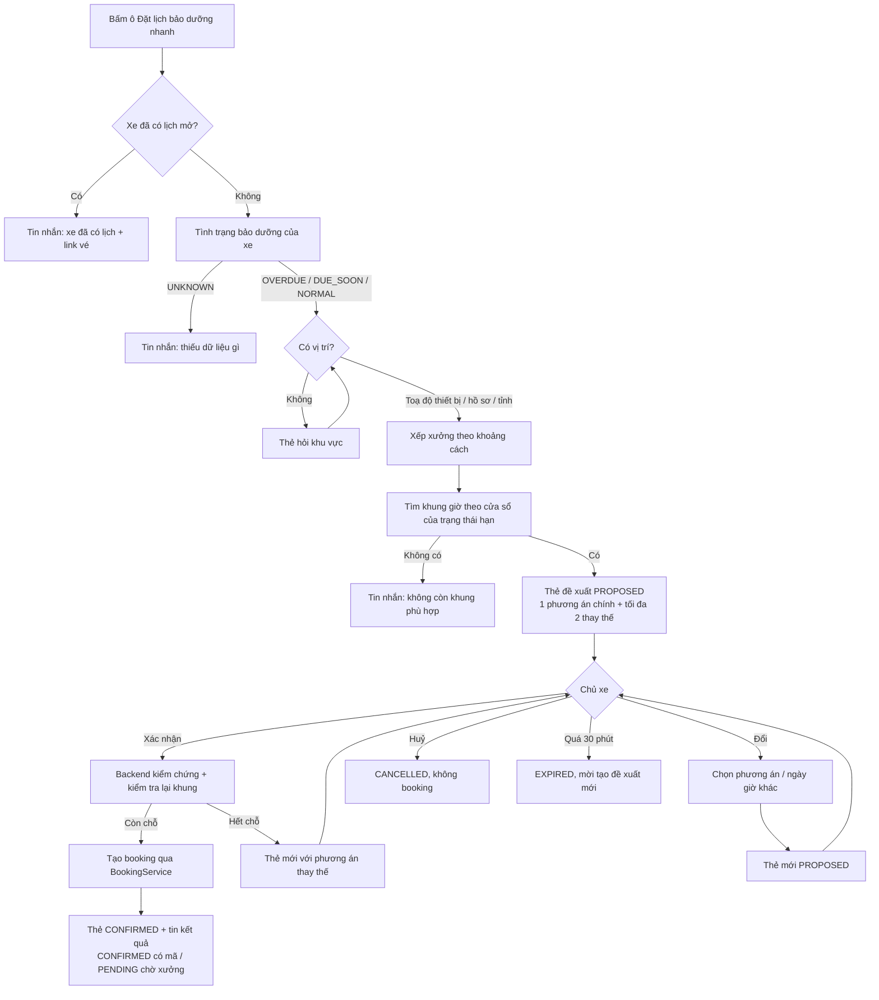

# Functional Specification — Đặt lịch bảo dưỡng nhanh từ AI trợ lý

> Đặc tả nghiệp vụ cho Feature **Đặt lịch bảo dưỡng nhanh** trên màn hình AI trợ lý (SCR-601), thuộc PRD F4 (chat) + F6 (đặt lịch).
>
> **Quan hệ tài liệu:** đây là một trường hợp cụ thể của [AI-004 Booking Agent](../../ai-agent/ai-004-sprint-3-spec.agent.md): dùng lại thẻ tóm tắt (`booking_summary`), nguyên tắc DEC-401 (không side effect khi chưa xác nhận) và các trạng thái HITL §16.3. Sức chứa, giờ mở cửa, khoá xe/khoá khung giờ và BR-013 (một lịch mở mỗi xe) giữ nguyên theo [us-029 FF](../../sprint-3/feature-functional/us-029-sprint-3-spec.ff.md). Tình trạng bảo dưỡng theo [us-017](../../sprint-2/feature-functional/us-017-sprint-2-spec.ff.md) (RM-401). Chi phí ước tính theo [us-045 FF](../../sprint-2/feature-functional/us-045-sprint-2-spec.ff.md).
>
> **Thay đổi so với AI-004 (quyết định 03/10/2026):** chỉ nút **Xác nhận đặt lịch** trên thẻ mới tạo booking. Câu gõ "xác nhận", "đồng ý đặt" **không** còn được tính là xác nhận (thay AI-004 §7.2, TOOL-403). LLM không còn tool ghi booking; tool `create_booking_draft` đổi thành `propose_booking` (chỉ tạo đề xuất).
>
> [designs/dat-lich-tu-tin-nhac.md](../../../designs/dat-lich-tu-tin-nhac.md) đã ngừng dùng; tài liệu này không dựa trên nó.
>
> **Quy ước mã:** dải `15xx` (`UC-15xx`, `BR-15xx`, `EF-15xx`, `AC-15xx`, `SCR-15xx`, `Q-15xx`).

---

# 1. Document Information

| Field | Value |
|---|---|
| Feature ID | `FEAT-QBOOK-001` |
| Feature Name | `Đặt lịch bảo dưỡng nhanh` |
| PRD Feature | `F4` (chat AI), `F6` (đặt lịch) |
| Document Version | `v1.1` |
| Status | `Approved` |
| Business Owner | Lê Đức Tùng (PO) |
| Author | Team 4 Người |
| Created Date | `2026-10-03` |
| Updated Date | `2026-10-03` |
| Related Frontend Spec | [us-061-sprint-4-spec.fe.md](../frontend/us-061-sprint-4-spec.fe.md) |
| Related API Spec | [us-061-sprint-4-spec.api.md](../api/us-061-sprint-4-spec.api.md) |
| Related Entity Spec | [us-061-sprint-4-spec.entity.md](../entity/us-061-sprint-4-spec.entity.md) |
| Related Agent Spec | [AI-004](../../ai-agent/ai-004-sprint-3-spec.agent.md) |

---

# 2. Feature Overview

## 2.1 Feature Description

Trên màn hình AI trợ lý có thêm ô **"Đặt lịch bảo dưỡng nhanh"**. Chủ xe bấm ô này, hệ thống dựa trên dữ liệu thật của xe đang chọn để xác định mốc bảo dưỡng cần làm, chọn xưởng **gần nhất theo khoảng cách** đang có khung giờ phù hợp, tính chi phí ước tính, rồi hiển thị **thẻ đề xuất** ngay trong hội thoại. Chủ xe bấm **Xác nhận đặt lịch** thì backend kiểm tra lại và tạo lịch hẹn qua luồng đặt lịch hiện có. Trước khi bấm xác nhận, hệ thống không tạo booking và không giữ chỗ.

## 2.2 Business Objective

Rút ngắn đường từ "xe sắp đến hạn" tới "có lịch hẹn" xuống **2 chạm** (bấm ô, bấm Xác nhận), không phải trả lời từng câu hỏi xưởng nào, ngày nào, giờ nào.

## 2.3 User Objective

Chủ xe biết ngay xe cần làm gì, ở đâu, lúc nào, khoảng bao nhiêu tiền, và đặt được lịch bằng một lần bấm.

## 2.4 Business Value

- Chỉ số chính: (1) thời gian từ `booking_proposal.created_at` tới `confirmed_at` của đề xuất được xác nhận (median); (2) tỷ lệ xác nhận = số đề xuất `source = QUICK_BOOKING` có `status = confirmed` / tổng đề xuất `source = QUICK_BOOKING` tạo trong tuần. Chưa có số nền: đo 2 tuần đầu rồi đặt mục tiêu.
- Mọi booking tạo từ luồng này có `source = CHAT` và `source_message_id` trỏ về tin nhắn chứa thẻ (AC-F4-06).

---

# 3. Scope

## 3.1 In Scope

- Ô "Đặt lịch bảo dưỡng nhanh" trong danh sách câu hỏi gợi ý (màn trống và panel "Xe của tôi", desktop và mobile).
- Xác định mốc bảo dưỡng bằng service tình trạng bảo dưỡng hiện có.
- Chọn xưởng theo khoảng cách tăng dần (bỏ ưu tiên xưởng yêu thích trong luồng này), khung giờ thật từ `BookingService`.
- Thẻ đề xuất có cấu trúc, lưu cùng hội thoại, hiện đúng trạng thái khi mở lại.
- Ba hành động trên thẻ: Xác nhận đặt lịch, Đổi xưởng / thời gian, Hủy đề xuất.
- Endpoint xác nhận do backend kiểm chứng; tạo booking qua `BookingService` hiện có.
- Đổi tool ghi của LLM (`create_booking_draft`) thành tool chỉ tạo đề xuất (`propose_booking`), để chat tự do cũng đi qua thẻ và nút xác nhận.

## 3.2 Out of Scope

- Huỷ / đổi lịch đã đặt qua chat (AI-004 UC-AI-402): vẫn làm ở màn vé lịch hẹn (us-053).
- Chọn theo khung thời gian mong muốn trong ô nhanh ("chiều thứ Bảy"): ô nhanh luôn lấy khung phù hợp sớm nhất theo §11; muốn chọn giờ cụ thể thì dùng "Đổi xưởng / thời gian" hoặc chat tự do.
- Giới hạn bán kính tối đa tới xưởng, geocoding địa chỉ nhập tay.
- Chọn giữa nhiều xe: app hiện chỉ có một xe mỗi tài khoản (`VehicleGate` lấy xe đầu tiên).
- Thông báo đẩy / email cho đề xuất.
- Đo số chạm phía server.

---

# 4. Actors

| Actor | Vai trò |
|---|---|
| Chủ xe | Bấm ô, xem thẻ, xác nhận / đổi / huỷ |
| Hệ thống (QuickBookingService) | Dựng đề xuất từ dữ liệu xe, xưởng, khung giờ, chi phí |
| Booking service (us-029) | Kiểm tra sức chứa, tạo booking, tự xác nhận khi xưởng `AUTO` |
| LLM agent (AI-001/004) | Trả lời chat tự do; chỉ được tạo đề xuất, không tạo booking |

---

# 5. User Story

## US-061

**As a** chủ xe đang dùng AI trợ lý,
**I want** bấm một ô để nhận đề xuất lịch bảo dưỡng phù hợp với xe của tôi ở xưởng gần nhất,
**so that** tôi đặt được lịch bằng một lần xác nhận mà không phải tự tra mốc, xưởng và giờ trống.

---

# 6. Use Case

## UC-1501 — Nhận đề xuất nhanh

Trigger: chủ xe bấm ô "Đặt lịch bảo dưỡng nhanh".
Preconditions: tài khoản `ACTIVE`, đã onboarding, có xe `VERIFIED` + `ACTIVE` (màn AI trợ lý chỉ mở khi có xe).
Outcome: một tin nhắn của trợ lý có thẻ đề xuất (`PROPOSED`), hoặc một tin nhắn giải thích vì sao chưa đề xuất được (§9 EF).

## UC-1502 — Xác nhận đề xuất

Trigger: chủ xe bấm "Xác nhận đặt lịch" trên thẻ `PROPOSED` còn hạn.
Outcome: booking `CONFIRMED` (xưởng `AUTO`) hoặc `PENDING` (xưởng `MANUAL`); thẻ chuyển `CONFIRMED`; trợ lý gửi tin kết quả.

## UC-1503 — Đổi xưởng / thời gian

Trigger: chủ xe bấm "Đổi xưởng / thời gian", chọn một phương án thay thế hoặc ngày giờ khác tại cùng xưởng.
Outcome: đề xuất cũ `SUPERSEDED`; thẻ mới `PROPOSED` với phương án đã chọn; phải xác nhận lại.

## UC-1504 — Huỷ đề xuất

Trigger: chủ xe bấm "Hủy đề xuất".
Outcome: đề xuất `CANCELLED`; không có booking nào được tạo.

---

# 7. User Flow

---

# 8. Screen / UI Flow

| Screen | Thay đổi |
|---|---|
| SCR-601 AI trợ lý — màn trống | Thêm ô "Đặt lịch bảo dưỡng nhanh" đứng đầu danh sách câu hỏi gợi ý |
| SCR-601 — panel "Xe của tôi" (desktop: cột phải; mobile: drawer) | Thêm cùng ô, đứng đầu mục "Câu hỏi gợi ý" |
| SCR-1501 Thẻ đề xuất đặt lịch (trong tin nhắn trợ lý) | Mới — chi tiết ở FE spec §2 |
| SCR-1502 Thẻ hỏi khu vực | Mới — danh sách khu vực có xưởng hoạt động |

---

# 9. Main Flow (UC-1501 → UC-1502)

1. Chủ xe bấm ô. Nếu cuộc trò chuyện chưa tồn tại thì tạo mới cho xe đang chọn (như khi gửi tin đầu tiên).
2. Hội thoại hiện tin của chủ xe "Đặt lịch bảo dưỡng nhanh".
3. Hệ thống kiểm tra BR-1501..BR-1507, dựng đề xuất (§11), lưu đề xuất `PROPOSED` và gửi tin trợ lý có thẻ.
4. Chủ xe bấm "Xác nhận đặt lịch".
5. Backend kiểm chứng (BR-1509), kiểm tra lại khung giờ, tạo booking (BR-1510).
6. Thẻ chuyển `CONFIRMED`; trợ lý gửi tin kết quả theo trạng thái booking (BR-1512).

---

# 10. Alternative / Exception Flow

## AF-1501 — Không có vị trí

Không có toạ độ thiết bị, hồ sơ không có vị trí chính: trợ lý gửi **thẻ hỏi khu vực** liệt kê các khu vực (`workshop.region`) đang có xưởng hoạt động. Chủ xe chọn một khu vực thì luồng chạy lại với khu vực đó. Không dùng xưởng yêu thích làm điểm neo trong luồng này.

## AF-1502 — Chỉ có khu vực, không có toạ độ

Xếp xưởng trong khu vực theo tên; thẻ ghi "Xưởng trong khu vực {khu vực}", **không** hiện số km.

## AF-1503 — Hết chỗ khi xác nhận

Đề xuất cũ `SUPERSEDED` (lý do `SLOT_FULL`). Hệ thống dựng đề xuất mới từ các phương án còn trống (BR-1511) và gửi thẻ mới; chủ xe phải xác nhận lại.

## AF-1504 — Đổi xưởng / thời gian

Chọn phương án thay thế trên thẻ, hoặc chọn ngày khác tại cùng xưởng rồi chọn khung giờ còn trống. Đề xuất cũ `SUPERSEDED` (lý do `REVISED`), thẻ mới `PROPOSED`.

## AF-1505 — Bấm ô lần nữa khi đang có đề xuất

Đề xuất `PROPOSED` cũ của chủ xe chuyển `SUPERSEDED` (lý do `NEW_PROPOSAL`); chỉ thẻ mới nhất có nút hành động.

## EF-1501 — Xe đã có lịch đang mở (BR-013)

Không dựng đề xuất. Trợ lý trả lời "Xe đã có lịch hẹn {mã nếu có} lúc {giờ, ngày} tại {xưởng}" kèm `refs.bookingId` để mở vé.

## EF-1502 — Thiếu dữ liệu bảo dưỡng (`dueStatus = UNKNOWN`)

| `unknownReason` | Nội dung |
|---|---|
| `OEM_DATA_NOT_SYNCED` | Đang lấy dữ liệu xe từ hãng (ODO, lịch sử bảo dưỡng); thử lại sau ít phút |
| `NO_MAINTENANCE_RULE` | Chưa có lịch bảo dưỡng cho dòng xe này; liên hệ xưởng để được tư vấn |

Không tự đoán ODO hoặc mốc bảo dưỡng.

## EF-1503 — Không còn khung giờ phù hợp

Không có xưởng nào có khung giờ trong cửa sổ §11: trợ lý giải thích và gợi ý chat để chọn ngày khác. Không tạo đề xuất.

## EF-1504 — Xe chưa đến hạn và hạn còn quá xa

Cửa sổ đề xuất bắt đầu sau ngày hôm nay + 60 ngày: trợ lý nói rõ mốc, hạn dự kiến, số km còn lại, và cho biết app sẽ nhắc khi gần hạn. Không tạo đề xuất.

## EF-1505 — Đề xuất hết hạn

Quá 30 phút kể từ khi tạo: thẻ hiện "Đề xuất đã hết hạn" và nút "Tạo đề xuất mới" (chạy lại UC-1501). Xác nhận đề xuất hết hạn bị từ chối.

## EF-1506 — Xác nhận đề xuất không còn hiệu lực

Đề xuất `SUPERSEDED`, `CANCELLED`, `EXPIRED`, của hội thoại khác, của xe khác hoặc của chủ xe khác: từ chối, không tạo booking.

## EF-1507 — Bấm xác nhận nhiều lần / mạng gửi lại

Chỉ một booking được tạo; các lần sau trả về đúng booking đã tạo.

## EF-1508 — Chủ xe gõ "đồng ý" thay vì bấm nút

Trợ lý nhắc bấm "Xác nhận đặt lịch" trên thẻ. Không tạo booking.

---

# 11. Business Rules

## BR-1501 — Chỉ cho xe của chủ xe trong phiên hội thoại

Đề xuất gắn với đúng một chủ xe, một xe và một cuộc trò chuyện. Xe phải `VERIFIED` + `ACTIVE` và là xe của cuộc trò chuyện.

## BR-1502 — Mốc bảo dưỡng lấy từ service tình trạng bảo dưỡng

Mốc đề xuất là `next_milestone` của tình trạng bảo dưỡng (RM-401: model xe, ODO hiệu lực mới nhất từ hãng, lịch sử bảo dưỡng định kỳ, định mức km/tháng). Hạng mục là `next_milestone.items`. Không có nguồn nào khác cho mốc.

## BR-1503 — Lý do đề xuất

Thẻ nêu trạng thái hạn và lý do theo `due_reason`:

| `due_status` | Lý do hiển thị (mẫu) |
|---|---|
| `OVERDUE` | "Xe đã quá mốc {mốc}: quá {n} km / {n} ngày. Đề xuất khung sớm nhất còn trống." |
| `DUE_SOON` | "Xe còn {n} km / {n} ngày tới mốc {mốc} (hạn {ngày}). Đề xuất lịch trước hạn." |
| `NORMAL` | "Xe chưa đến hạn: còn {n} km / {n} ngày tới mốc {mốc}. Đề xuất lịch gần hạn." |

Phần km chỉ hiện khi có ODO; phần ngày luôn có (`due_date` luôn được tính).

## BR-1504 — Cửa sổ chọn khung giờ

`now` theo giờ Việt Nam. Khung giờ hợp lệ phải bắt đầu sau `now + 2 giờ`.

| `due_status` | Cửa sổ | Chọn |
|---|---|---|
| `OVERDUE` | `[now + 2h, hôm nay + 14 ngày]` | Khung sớm nhất |
| `DUE_SOON` | `[now + 2h, min(due_date, hôm nay + 14 ngày)]`; chỉ khi **không xưởng nào** có khung trong cửa sổ này mới mở rộng tới `hôm nay + 14 ngày` và ghi "sau ngày hạn" | Khung sớm nhất |
| `NORMAL` | `[max(now + 2h, due_date − 7 ngày), due_date]`; nếu ngày bắt đầu > hôm nay + 60 ngày thì không đề xuất (EF-1504) | Khung sớm nhất trong cửa sổ |

Khung "còn trống" theo đúng công thức sức chứa us-029 BR-005 tại thời điểm dựng đề xuất.

## BR-1505 — Điểm neo vị trí

Theo thứ tự: (1) toạ độ thiết bị nếu chủ xe cho phép trình duyệt lấy vị trí; (2) vị trí chính trong hồ sơ (`user_location.is_primary`) có toạ độ; (3) khu vực trong hồ sơ hoặc khu vực chủ xe chọn ở thẻ hỏi khu vực; (4) không có gì → AF-1501. Toạ độ thiết bị chỉ dùng để xếp hạng, không lưu.

## BR-1506 — Xếp hạng xưởng theo khoảng cách

Trong luồng này, xưởng `ACTIVE` được xếp theo khoảng cách tăng dần tính từ toạ độ (haversine). Xưởng yêu thích **không** được đẩy lên đầu (khác us-029 BR-003); thẻ vẫn có thể gắn nhãn "Xưởng yêu thích". Xưởng không có toạ độ xếp cuối, không hiện km. Khi chỉ có khu vực: xưởng trong khu vực (so khớp không phân biệt dấu, hoa/thường, dấu câu: "Ha Noi" khớp "Hà Nội"), không có km. Không bao giờ hiện số km không tính từ toạ độ. Xét tối đa 5 xưởng đầu bảng xếp hạng.

## BR-1507 — Phương án chính và thay thế

- **Phương án chính:** xưởng đứng đầu bảng xếp hạng **có** khung giờ trong cửa sổ BR-1504, với khung sớm nhất của xưởng đó.
- **Thay thế (tối đa 2):** khung sớm nhất của các xưởng kế tiếp trong bảng xếp hạng; nếu không đủ 2 thì lấy các khung kế tiếp tại xưởng của phương án chính (khác ngày hoặc giờ).
- Mỗi phương án kèm chi phí ước tính tại xưởng đó nếu `cost_estimate` trả `READY` (tổng phải trả `chargeable_total`; ghi "giá tham khảo" khi `has_reference_price`). Không có dữ liệu thì không hiện chi phí.

## BR-1508 — Chỉ một đề xuất đang chờ mỗi chủ xe

Tạo đề xuất mới (ô nhanh, đổi phương án, hết chỗ, hoặc LLM `propose_booking`) làm mọi đề xuất `PROPOSED` khác của chủ xe chuyển `SUPERSEDED`. Đề xuất có hiệu lực **30 phút**.

## BR-1509 — Kiểm chứng xác nhận ở backend

Xác nhận chỉ hợp lệ khi đồng thời: đề xuất tồn tại, thuộc chủ xe đang đăng nhập, thuộc đúng cuộc trò chuyện trong yêu cầu, xe của đề xuất là xe của cuộc trò chuyện và còn `VERIFIED` + `ACTIVE`, trạng thái `PROPOSED`, chưa hết hạn. Không dựa vào nội dung chat hay quyết định của LLM.

## BR-1510 — Tạo booking sau xác nhận

Dùng đúng luồng us-029: kiểm tra lại sức chứa của khung tại thời điểm xác nhận, rồi tạo booking qua `BookingService` (khoá xe rồi khoá khung giờ, BR-013, trigger sức chứa). `source = CHAT`, `source_message_id` = tin nhắn chứa thẻ, `odo_milestone` = mốc của đề xuất. Khung giờ phải còn bắt đầu sau thời điểm xác nhận.

## BR-1511 — Hết chỗ khi xác nhận

Không tạo booking. Đề xuất mới lấy các phương án còn trống theo thứ tự: phương án thay thế của đề xuất cũ (đã xếp theo khoảng cách) → phương án thay thế của us-029 BR-008. Phải xác nhận lại.

## BR-1512 — Hiển thị kết quả đúng trạng thái booking

| Booking | Thẻ / tin kết quả |
|---|---|
| `CONFIRMED` (xưởng `AUTO`) | "Đã xác nhận" + mã đặt lịch + link vé |
| `PENDING` (xưởng `MANUAL`) | "Đã gửi, chờ xưởng xác nhận (tối đa 12 giờ)"; **không** hiện mã (mã chỉ có khi xưởng xác nhận) + link vé |

Khi mở lại hội thoại, thẻ hiện trạng thái booking **hiện tại** (xưởng đã xác nhận thì hiện `CONFIRMED` và mã).

## BR-1513 — Chống tạo trùng

Một đề xuất có tối đa một booking. Bấm nhiều lần, hai tab, hoặc mạng gửi lại đều trả về cùng booking. BR-013 vẫn áp dụng cho mọi đường tạo booking.

## BR-1514 — LLM không tạo booking

Chat tự do: LLM chỉ được gọi `propose_booking` để tạo đề xuất (cùng thẻ, cùng BR-1508..1513). Không tool nào của LLM tạo, huỷ hay đổi booking.

---

# 12. State

Trạng thái đề xuất (`booking_proposal.status`), ánh xạ AI-004 §16.3:

| Status | AI-004 | Ý nghĩa | Chuyển tới |
|---|---|---|---|
| `PROPOSED` | `PENDING_REVIEW` | Thẻ đang chờ chủ xe | `CONFIRMED`, `CANCELLED`, `SUPERSEDED`, `EXPIRED` |
| `CONFIRMED` | `APPROVED` | Đã tạo booking | — |
| `CANCELLED` | `REJECTED` | Chủ xe huỷ | — |
| `SUPERSEDED` | `MODIFIED` | Bị thay bởi đề xuất mới (`NEW_PROPOSAL` / `REVISED` / `SLOT_FULL`) | — |
| `EXPIRED` | `REJECTED` | Quá 30 phút | — |

---

# 13. Business Error & Edge Cases

| Case | Kết quả |
|---|---|
| Hai tab cùng bấm Xác nhận | Một booking; tab còn lại nhận cùng booking (BR-1513) |
| Bấm Xác nhận trên thẻ cũ sau khi đã có thẻ mới | Từ chối `SUPERSEDED` (EF-1506) |
| Bấm Xác nhận khi khung giờ đã trôi qua | Như hết chỗ (AF-1503) |
| Xưởng chuyển `INACTIVE` sau khi đề xuất | Như hết chỗ (AF-1503) |
| Bấm ô nhanh hoặc đổi phương án khi lượt chat của LLM đang chạy | Từ chối tạm thời, thử lại sau (xác nhận không bị chặn) |
| Xác nhận và huỷ cùng lúc | Thao tác tới trước quyết định: hoặc có booking và đề xuất `CONFIRMED`, hoặc `CANCELLED` và không booking |
| Booking của thẻ đã bị huỷ ở màn vé, chủ xe bấm Xác nhận lại trên thẻ cũ | Không đặt lần hai; thẻ hiện trạng thái booking hiện tại |
| Thao tác đúng lúc hết hạn | Hết hạn khi `now ≥ expiresAt`; hết hạn thắng mọi thao tác, kể cả huỷ |
| Lỗi Redis (không lấy được khoá) | Không tạo booking; báo thử lại |
| Mất kết nối giữa lúc tạo booking và lúc cập nhật đề xuất | Lần xác nhận sau nhận ra booking của chính đề xuất và trả về nó |
| Ô nhanh bị bấm khi xe chưa có dữ liệu hãng | EF-1502 |

---

# 14. Permissions

| Hành động | Ai |
|---|---|
| Tạo / xem / xác nhận / đổi / huỷ đề xuất | Chủ xe sở hữu cuộc trò chuyện và xe (`ACTIVE`, đã onboarding) |
| Chủ xưởng | Không thấy đề xuất; chỉ thấy booking sau khi tạo (Workshop Board) |

---

# 15. Acceptance Criteria

## AC-1501 — Ô gợi ý

Ô có nhãn đúng "Đặt lịch bảo dưỡng nhanh", nằm đầu danh sách câu hỏi gợi ý ở màn trống và ở panel "Xe của tôi" (cột phải desktop ≥ 1280 px, drawer trên màn nhỏ hơn), cùng kiểu với các câu gợi ý khác.

## AC-1502 — Bấm ô không tạo booking

Sau khi bấm ô và nhận thẻ, số dòng `booking` của xe không đổi và không có khoá giữ chỗ nào.

## AC-1503 — Mốc khớp service

`milestone.odoMilestoneKm`, `dueDate`, `dueStatus` và danh sách hạng mục trên thẻ bằng đúng kết quả `UserVehicleService.get_maintenance_status` của xe tại cùng thời điểm.

## AC-1504 — Xưởng theo khoảng cách

Với toạ độ neo cho trước và 3 xưởng có khung trống ở khoảng cách 5 km (xưởng yêu thích), 2 km, 9 km: phương án chính là xưởng 2 km; thay thế là 5 km rồi 9 km. Xưởng gần nhất **không** có khung trong cửa sổ thì bị bỏ qua.

## AC-1505 — Không bịa khoảng cách

Khi chỉ có khu vực, mọi phương án có `distanceKm = null` và thẻ ghi "Xưởng trong khu vực {khu vực}".

## AC-1506 — Chưa xác nhận / huỷ / đề xuất cũ không tạo lịch

Huỷ đề xuất, để hết hạn, hoặc xác nhận đề xuất `SUPERSEDED` / `CANCELLED` / `EXPIRED` / của hội thoại khác / của chủ xe khác: không có booking mới. LLM không có tool nào tạo booking.

## AC-1507 — Xác nhận hợp lệ tạo đúng một booking

Gọi xác nhận 2 lần liên tiếp và 2 lần song song cho cùng đề xuất: đúng 1 booking với `source = CHAT`, `source_message_id` = tin nhắn chứa thẻ; các phản hồi trả về cùng `bookingId`.

## AC-1508 — Hết chỗ phải đề xuất lại

Khung của đề xuất bị chiếm trước khi xác nhận: không có booking; đề xuất cũ `SUPERSEDED (SLOT_FULL)`; có tin trợ lý mới với thẻ `PROPOSED`; xác nhận thẻ mới thì tạo booking.

## AC-1509 — Phân biệt PENDING và CONFIRMED

Xưởng `AUTO`: thẻ "Đã xác nhận" + mã `EVC-…`. Xưởng `MANUAL`: thẻ "Chờ xưởng xác nhận", không có mã. Sau khi xưởng `MANUAL` xác nhận, mở lại hội thoại thấy "Đã xác nhận" + mã.

## AC-1510 — Mở lại hội thoại

Tải lại trang: mỗi thẻ hiện đúng trạng thái của đề xuất (`PROPOSED` còn nút; `CONFIRMED`, `CANCELLED`, `SUPERSEDED`, `EXPIRED` không còn nút Xác nhận).

## AC-1511 — Thiếu dữ liệu

`OEM_DATA_NOT_SYNCED` / `NO_MAINTENANCE_RULE` / không vị trí / xe đã có lịch mở: đúng tin nhắn EF/AF tương ứng, không có thẻ `PROPOSED`.

---

# 16. Open Questions

| ID | Câu hỏi | Owner | Đề xuất |
|---|---|---|---|
| `Q-1501` | Có giới hạn bán kính tối đa cho "xưởng gần nhất" không? | PO | Chưa giới hạn ở MVP |
| `Q-1502` | 30 phút hiệu lực, đệm 2 giờ, cửa sổ 14 / 60 ngày có hợp với vận hành xưởng không? | PO + chủ xưởng | Giữ, đưa vào config |
| `Q-1503` | Cập nhật AI-004 §7.2 / TOOL-403 theo quyết định "chỉ nút xác nhận" | AI Team | Sửa AI-004 cùng PR triển khai |

---

# 17. Change Log

| Version | Date | Change |
|---|---|---|
| `v0.1` | `2026-10-03` | Bản nháp đầu |
| `v1.0` | `2026-10-03` | Chủ sản phẩm duyệt bản nháp; triển khai cùng PR (backend `modules/quick_booking`, frontend `features/assistant/quickBooking`) |
| `v1.1` | `2026-10-03` | Sau review Codex (7/10): khoá theo đề xuất cho xác nhận / đổi / huỷ; liên kết booking ↔ thẻ bền vững; trả lời gửi lại theo `refs.inReplyTo`; hết hạn thắng huỷ; khớp khu vực bỏ dấu; quét khung giờ theo lô; chỉ số đo được |
