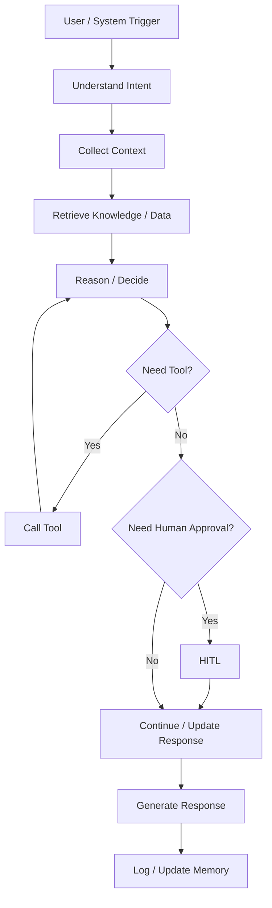
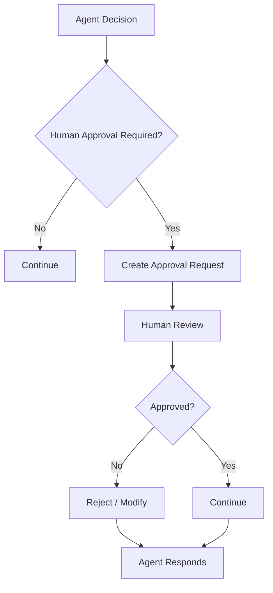
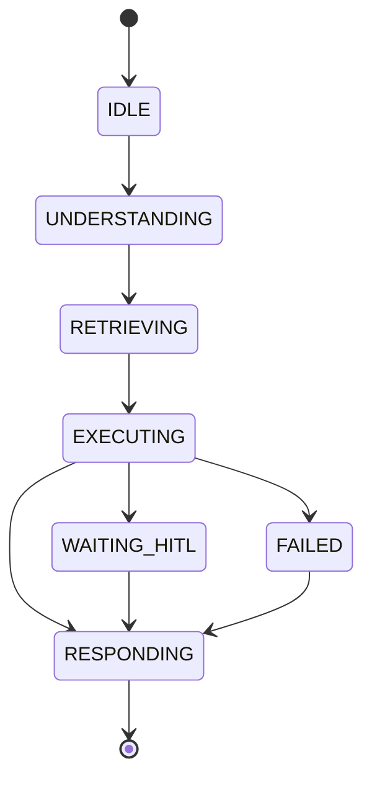

# AI-Agent Specification

> Tài liệu đặc tả hành vi và thiết kế nghiệp vụ của AI Agent cho một Feature / Use Case cụ thể.
>
> **Mục đích:** mô tả AI Agent phải hiểu gì, quyết định gì, sử dụng dữ liệu / knowledge / tool nào, phản hồi ra sao và khi nào cần fallback hoặc chuyển sang Human-in-the-Loop.
>
> **Phạm vi:** tập trung vào **AI behavior và AI orchestration**, không thay thế Functional Specification, API Specification, Frontend Specification hoặc Technical Design.

---

# 1. Document Information

| Field                           | Value                                    |
| ------------------------------- | ---------------------------------------- |
| Agent Spec ID                   | `AI-XXX`                                 |
| Agent Name                      | `[Tên AI Agent]`                         |
| Feature / Use Case              | `[Feature / Use Case]`                   |
| Document Version                | `v1.0`                                   |
| Status                          | `Draft / Review / Approved / Deprecated` |
| Product / Project               | `[Tên sản phẩm]`                         |
| Agent Owner                     | `[Team / Person]`                        |
| Author                          | `[Tên]`                                  |
| Reviewer                        | `[Tên / Team]`                           |
| Stakeholders                    | `[Các bên liên quan]`                    |
| Created Date                    | `YYYY-MM-DD`                             |
| Updated Date                    | `YYYY-MM-DD`                             |
| Related Functional Spec         | `[Link]`                                 |
| Related API Spec                | `[Link]`                                 |
| Related Entity Spec             | `[Link]`                                 |
| Related PRD                     | `[Link]`                                 |
| Related Architecture            | `[Link]`                                 |
| Related Prompt / Knowledge Spec | `[Link]`                                 |

---

# 2. Agent Overview

## 2.1 Agent Description

> AI Agent này là gì? Phục vụ user / actor nào? Giải quyết interaction nào?

`[Mô tả AI Agent]`

## 2.2 Agent Objective

> Agent phải đạt được kết quả gì?

`[Agent objective]`

## 2.3 User Objective

`[Người dùng muốn đạt được điều gì]`

## 2.4 Business Value

`[Giá trị của AI Agent đối với user / business / partner]`

## 2.5 Agent Responsibilities

Agent chịu trách nhiệm:

* `[Responsibility 1]`
* `[Responsibility 2]`
* `[Responsibility 3]`

## 2.6 Agent Non-Responsibilities

Agent không chịu trách nhiệm:

* `[Non-responsibility 1]`
* `[Non-responsibility 2]`

---

# 3. Scope

## 3.1 In Scope

* `[AI capability 1]`
* `[AI capability 2]`
* `[AI capability 3]`

## 3.2 Out of Scope

* `[Capability không thuộc agent]`
* `[Capability cần human xử lý]`

---

# 4. Actors & Systems

## 4.1 Actors

| Actor               | Type  | Responsibility           |
| ------------------- | ----- | ------------------------ |
| `[Vehicle Owner]`   | User  | `[Interaction]`          |
| `[Service Advisor]` | Human | `[Review / Approval]`    |
| `[Technician]`      | Human | `[Technical validation]` |

## 4.2 Supporting Systems

| System                  | Purpose                  | Read / Write |
| ----------------------- | ------------------------ | ------------ |
| `[Vehicle Data]`        | `[Vehicle information]`  | Read         |
| `[Maintenance History]` | `[Service history]`      | Read         |
| `[Warranty System]`     | `[Warranty information]` | Read         |
| `[Workshop System]`     | `[Booking / capacity]`   | Read / Write |
| `[Notification System]` | `[Notification]`         | Write        |

---

# 5. Agent Use Case

## UC-AI-001 — [Agent Use Case Name]

### 5.1 Trigger

`[User message / proactive event / system event]`

### 5.2 Preconditions

* `[Condition 1]`
* `[Condition 2]`

### 5.3 Expected Outcome

`[Agent phải hoàn thành điều gì]`

### 5.4 Postconditions

* `[Data / state changed]`
* `[Notification / action created]`

---

# 6. Agent Interaction Flow

## 6.1 Main Agent Flow



## 6.2 Agent Step Definition

| Step | Agent Action           | Input              | Output          | Decision         |
| ---- | ---------------------- | ------------------ | --------------- | ---------------- |
| 1    | `[Understand intent]`  | `[User message]`   | `[Intent]`      | `[Decision]`     |
| 2    | `[Retrieve context]`   | `[User / vehicle]` | `[Context]`     | `[Decision]`     |
| 3    | `[Retrieve knowledge]` | `[Query]`          | `[Evidence]`    | `[Decision]`     |
| 4    | `[Call tool]`          | `[Tool arguments]` | `[Tool result]` | `[Decision]`     |
| 5    | `[Generate response]`  | `[Context]`        | `[Response]`    | `[Final output]` |

---

# 7. Intent & Task Definition

## 7.1 Supported Intents

| Intent ID | Intent     | Description     | Example     |
| --------- | ---------- | --------------- | ----------- |
| `INT-001` | `[Intent]` | `[Description]` | `[Example]` |
| `INT-002` | `[Intent]` | `[Description]` | `[Example]` |
| `INT-003` | `[Intent]` | `[Description]` | `[Example]` |

## 7.2 Intent Routing Rules

### Rule

`[How the agent distinguishes between intents]`

### Examples

**User input:**

> `[Example user message]`

**Detected intent:**

`INT-001`

**Reason / evidence:**

`[Explanation]`

---

# 8. Context Requirements

## 8.1 Required Context

| Context             | Required | Source     | Description     |
| ------------------- | -------: | ---------- | --------------- |
| User Profile        |      Yes | `[System]` | `[Description]` |
| Vehicle             |      Yes | `[System]` | `[Description]` |
| Current Mileage     |      Yes | `[System]` | `[Description]` |
| Maintenance History |       No | `[System]` | `[Description]` |

## 8.2 Context Priority

1. `[Context priority 1]`
2. `[Context priority 2]`
3. `[Context priority 3]`

## 8.3 Missing Context Handling

| Missing Context         | Agent Behavior                     |
| ----------------------- | ---------------------------------- |
| `[Vehicle]`             | `[Ask user / retrieve / fallback]` |
| `[Mileage]`             | `[Behavior]`                       |
| `[Maintenance History]` | `[Behavior]`                       |

---

# 9. Knowledge & RAG

## 9.1 Knowledge Sources

| Knowledge Source         | Type            | Authority | Usage     |
| ------------------------ | --------------- | --------- | --------- |
| `[Manufacturer Manual]`  | Document        | Official  | `[Usage]` |
| `[Warranty Policy]`      | Document        | Official  | `[Usage]` |
| `[Maintenance Schedule]` | Structured Data | Official  | `[Usage]` |

## 9.2 Knowledge Priority

Khi nhiều nguồn có thể trả lời cùng một câu hỏi, Agent ưu tiên:

1. `[Official manufacturer source]`
2. `[Approved internal source]`
3. `[Other approved source]`

## 9.3 Retrieval Requirement

**Query construction**

`[Quy tắc tạo retrieval query]`

**Required filters**

* `[Vehicle model]`
* `[Vehicle version]`
* `[Document type]`
* `[Document version]`

## 9.4 Evidence Requirement

Agent phải:

* `[Only answer from retrieved evidence]`
* `[Identify uncertainty when evidence is insufficient]`
* `[Avoid unsupported technical claims]`

## 9.5 No-Evidence Behavior

Khi không tìm thấy knowledge phù hợp:

`[Fallback behavior]`

Ví dụ:

> `[Response pattern]`

---

# 10. Tool / Function Specification

## 10.1 Tool Inventory

| Tool ID    | Tool Name                   | Purpose     | Input     | Output     | Required |
| ---------- | --------------------------- | ----------- | --------- | ---------- | -------: |
| `TOOL-001` | `[get_vehicle]`             | `[Purpose]` | `[Input]` | `[Output]` |      Yes |
| `TOOL-002` | `[get_maintenance_history]` | `[Purpose]` | `[Input]` | `[Output]` |       No |
| `TOOL-003` | `[book_appointment]`        | `[Purpose]` | `[Input]` | `[Output]` |       No |

## 10.2 Tool Calling Rules

### TOOL-001 — `[Tool Name]`

**When to use**

`[Condition]`

**When not to use**

`[Condition]`

**Required parameters**

* `[Parameter]`
* `[Parameter]`

**Validation before call**

* `[Validation 1]`
* `[Validation 2]`

**Expected result**

`[Expected result]`

## 10.3 Tool Failure Handling

| Failure            | Agent Behavior                  |
| ------------------ | ------------------------------- |
| Timeout            | `[Retry / fallback]`            |
| Invalid input      | `[Ask user / repair arguments]` |
| Business rejection | `[Explain / fallback]`          |
| Tool unavailable   | `[Fallback]`                    |

---

# 11. Agent Decision Logic

## 11.1 Decision Rules

### DEC-001 — [Decision Name]

**IF**

`[Condition]`

**THEN**

`[Agent action]`

**ELSE**

`[Alternative action]`

### DEC-002 — [Decision Name]

**IF**

`[Condition]`

**THEN**

`[Agent action]`

## 11.2 Decision Priority

| Priority | Decision                      |
| -------- | ----------------------------- |
| 1        | `[Safety / correctness rule]` |
| 2        | `[Business rule]`             |
| 3        | `[User preference]`           |

---

# 12. Response Specification

## 12.1 Response Objectives

Agent response phải:

* `[Accurate]`
* `[Relevant]`
* `[Actionable]`
* `[Understandable]`

## 12.2 Response Structure

```text
[Answer / conclusion]

[Relevant explanation]

[Supporting information]

[Next action / CTA]
```

## 12.3 Response Tone

`[Professional / Friendly / Concise / Informative]`

## 12.4 Response Language

`[Vietnamese / English / Other]`

## 12.5 Required Information

Khi trả lời `[Use Case]`, Agent phải bao gồm:

* `[Information 1]`
* `[Information 2]`
* `[Information 3]`

## 12.6 Prohibited Response

Agent không được:

* `[Make unsupported technical claims]`
* `[Invent vehicle information]`
* `[Claim tool success when tool failed]`
* `[Provide information outside approved knowledge]`

---

# 13. Memory & Personalization

## 13.1 Memory Types

| Memory              | Description              | Source           | Retention  |
| ------------------- | ------------------------ | ---------------- | ---------- |
| User Profile        | `[Profile info]`         | `[System]`       | `[Policy]` |
| Vehicle Profile     | `[Vehicle info]`         | `[System]`       | `[Policy]` |
| Conversation Memory | `[Conversation context]` | `[Agent]`        | `[Policy]` |
| Preference          | `[User preference]`      | `[Agent/System]` | `[Policy]` |

## 13.2 Conversation Context

Agent cần nhớ trong current conversation:

* `[Context 1]`
* `[Context 2]`

## 13.3 Long-term Memory

Agent được phép lưu:

* `[Memory item]`
* `[Memory item]`

Agent không được lưu:

* `[Sensitive / unnecessary data]`

## 13.4 Cold Start Behavior

Khi user chưa có lịch sử hoặc context:

`[Cold-start behavior]`

---

# 14. Guardrails & Safety

## 14.1 Knowledge Guardrails

* `[Only approved knowledge]`
* `[Official manufacturer source required]`
* `[No unsupported claims]`

## 14.2 Business Guardrails

* `[Business constraint]`
* `[Business constraint]`

## 14.3 User Data Guardrails

* `[Data access rule]`
* `[Privacy rule]`

## 14.4 Technical Advice Guardrails

Agent:

* `[May provide informational guidance]`
* `[Must not make unsupported diagnosis]`
* `[Must escalate high-risk cases]`

## 14.5 Hallucination Handling

Khi confidence / evidence không đủ:

`[Agent behavior]`

Ví dụ:

> `[Không đủ thông tin để xác nhận ...]`

---

# 15. Confidence & Uncertainty

## 15.1 Confidence Levels

| Level  | Meaning                   | Behavior                      |
| ------ | ------------------------- | ----------------------------- |
| High   | `[Strong evidence]`       | `[Answer directly]`           |
| Medium | `[Partial evidence]`      | `[Answer with caveat]`        |
| Low    | `[Insufficient evidence]` | `[Ask / fallback / escalate]` |

## 15.2 Uncertainty Statement

Khi cần, Agent phải thể hiện:

`[Uncertainty wording]`

---

# 16. Human-in-the-Loop (HITL)

## 16.1 HITL Required Scenarios

| Scenario                | Trigger       | Human Role               | Agent Behavior               |
| ----------------------- | ------------- | ------------------------ | ---------------------------- |
| `[Service quote]`       | `[Condition]` | `[Technician / Advisor]` | `[Pause / request approval]` |
| `[Technical diagnosis]` | `[Condition]` | `[Technician]`           | `[Escalate]`                 |

## 16.2 HITL Flow



## 16.3 Human Decision States

| State            | Meaning                   |
| ---------------- | ------------------------- |
| `PENDING_REVIEW` | `[Waiting for human]`     |
| `APPROVED`       | `[Approved]`              |
| `REJECTED`       | `[Rejected]`              |
| `MODIFIED`       | `[Human modified output]` |

---

# 17. Fallback & Recovery

## 17.1 Fallback Scenarios

| Scenario                | Fallback              |
| ----------------------- | --------------------- |
| No knowledge found      | `[Fallback]`          |
| Tool unavailable        | `[Fallback]`          |
| Missing vehicle context | `[Fallback]`          |
| Ambiguous intent        | `[Ask clarification]` |
| Low confidence          | `[Escalate]`          |

## 17.2 Recovery Strategy

`[Retry / alternative source / human escalation / graceful degradation]`

---

# 18. Agent State

## 18.1 State List

| State           | Meaning     | Entry Condition | Exit Condition |
| --------------- | ----------- | --------------- | -------------- |
| `IDLE`          | `[Meaning]` | `[Condition]`   | `[Condition]`  |
| `UNDERSTANDING` | `[Meaning]` | `[Condition]`   | `[Condition]`  |
| `RETRIEVING`    | `[Meaning]` | `[Condition]`   | `[Condition]`  |
| `EXECUTING`     | `[Meaning]` | `[Condition]`   | `[Condition]`  |
| `WAITING_HITL`  | `[Meaning]` | `[Condition]`   | `[Condition]`  |
| `RESPONDING`    | `[Meaning]` | `[Condition]`   | `[Condition]`  |
| `FAILED`        | `[Meaning]` | `[Condition]`   | `[Condition]`  |

## 18.2 State Transition



---

# 19. AI Business Rules

## BR-AI-001 — [Rule Name]

**Rule**

`[Business rule]`

**Condition**

`[IF]`

**Agent Behavior**

`[THEN]`

**Priority**

`High / Medium / Low`

---

## BR-AI-002 — [Rule Name]

**Rule**

`[Business rule]`

**Condition**

`[IF]`

**Agent Behavior**

`[THEN]`

---

# 20. Input / Output Contract

## 20.1 Agent Input

| Input                | Required | Source  | Description     |
| -------------------- | -------: | ------- | --------------- |
| User Message         |      Yes | User    | `[Description]` |
| Vehicle ID           |      Yes | Context | `[Description]` |
| Conversation Context |       No | Memory  | `[Description]` |
| Retrieved Knowledge  |       No | RAG     | `[Description]` |

## 20.2 Agent Output

| Output       | Required | Description                   |
| ------------ | -------: | ----------------------------- |
| Response     |      Yes | `[Natural language response]` |
| Intent       |       No | `[Detected intent]`           |
| Action       |       No | `[Action to execute]`         |
| Tool Call    |       No | `[Tool invocation]`           |
| HITL Request |       No | `[Human approval request]`    |
| Confidence   |       No | `[Confidence level]`          |

---

# 21. Prompt / Instruction Specification

## 21.1 System Instruction

`[System-level instruction / policy reference]`

## 21.2 Agent Role

`[Define the role of the agent]`

## 21.3 Behavioral Instructions

* `[Instruction 1]`
* `[Instruction 2]`
* `[Instruction 3]`

## 21.4 Tool Instructions

`[Rules governing tool usage]`

## 21.5 Knowledge Instructions

`[Rules governing RAG / knowledge usage]`

## 21.6 Prompt Variables

| Variable                | Source              | Required |
| ----------------------- | ------------------- | -------: |
| `{vehicle_model}`       | Vehicle Profile     |      Yes |
| `{vehicle_version}`     | Vehicle Profile     |       No |
| `{current_mileage}`     | Vehicle Data        |      Yes |
| `{maintenance_history}` | Maintenance History |       No |

> Prompt implementation / model configuration chi tiết có thể được tách sang Prompt Specification nếu cần.

---

# 22. AI-specific Error & Edge Cases

| Case ID       | Scenario                  | Agent Behavior        | User Outcome             |
| ------------- | ------------------------- | --------------------- | ------------------------ |
| `AI-EDGE-001` | `[Ambiguous intent]`      | `[Ask clarification]` | `[User provides detail]` |
| `AI-EDGE-002` | `[No evidence]`           | `[Fallback]`          | `[User informed]`        |
| `AI-EDGE-003` | `[Wrong vehicle context]` | `[Stop and verify]`   | `[Correct context]`      |
| `AI-EDGE-004` | `[Tool failure]`          | `[Fallback]`          | `[Alternative path]`     |
| `AI-EDGE-005` | `[Low confidence]`        | `[Escalate]`          | `[Human support]`        |

---

# 23. AI Evaluation Criteria

## 23.1 Functional Evaluation

| Metric                 | Expected   |
| ---------------------- | ---------- |
| Intent Recognition     | `[Target]` |
| Tool Selection         | `[Target]` |
| Tool Argument Accuracy | `[Target]` |
| Response Correctness   | `[Target]` |
| Knowledge Grounding    | `[Target]` |

## 23.2 Quality Evaluation

| Metric             | Expected   |
| ------------------ | ---------- |
| Relevance          | `[Target]` |
| Completeness       | `[Target]` |
| Consistency        | `[Target]` |
| Hallucination Rate | `[Target]` |
| User Satisfaction  | `[Target]` |

## 23.3 Evaluation Dataset

| Dataset     | Purpose                     | Source     |
| ----------- | --------------------------- | ---------- |
| `[Dataset]` | `[Intent evaluation]`       | `[Source]` |
| `[Dataset]` | `[RAG evaluation]`          | `[Source]` |
| `[Dataset]` | `[Tool calling evaluation]` | `[Source]` |

---

# 24. Observability & Logging

## 24.1 Events to Log

* `[Agent invocation]`
* `[Intent detected]`
* `[Retrieval performed]`
* `[Tool called]`
* `[HITL requested]`
* `[Fallback triggered]`

## 24.2 Trace Information

| Field              | Description                 |
| ------------------ | --------------------------- |
| `conversation_id`  | `[Conversation identifier]` |
| `agent_run_id`     | `[Agent run identifier]`    |
| `intent`           | `[Detected intent]`         |
| `tool`             | `[Tool called]`             |
| `knowledge_source` | `[Retrieved source]`        |
| `status`           | `[Run status]`              |

---

# 25. Dependencies

| Dependency             | Purpose     | Owner     | Required | Related Document |
| ---------------------- | ----------- | --------- | -------: | ---------------- |
| `[Vehicle System]`     | `[Purpose]` | `[Owner]` |      Yes | `[Link]`         |
| `[RAG Knowledge Base]` | `[Purpose]` | `[Owner]` |      Yes | `[Link]`         |
| `[Workshop System]`    | `[Purpose]` | `[Owner]` |       No | `[Link]`         |
| `[Human Reviewer]`     | `[Purpose]` | `[Team]`  |       No | `[Link]`         |

---

# 26. Assumptions

* `[Agent assumption 1]`
* `[Agent assumption 2]`
* `[Agent assumption 3]`

---

# 27. AI Constraints

> Các giới hạn mà Agent bắt buộc phải tuân theo.

* `[Official source constraint]`
* `[Privacy constraint]`
* `[Technical advice constraint]`
* `[Cost / token constraint]`
* `[Latency constraint]`
* `[HITL constraint]`

---

# 28. Terminology / Glossary

| Term ID       | Term     | Vietnamese Name | Definition     | Example / Notes |
| ------------- | -------- | --------------- | -------------- | --------------- |
| `AI-TERM-001` | `[Term]` | `[Vietnamese]`  | `[Definition]` | `[Example]`     |
| `AI-TERM-002` | `[Term]` | `[Vietnamese]`  | `[Definition]` | `[Example]`     |

---

# 29. Open Questions

| ID         | Question     | Owner     | Status | Decision / Due Date |
| ---------- | ------------ | --------- | ------ | ------------------- |
| `AI-Q-001` | `[Question]` | `[Owner]` | Open   | `[Decision]`        |
| `AI-Q-002` | `[Question]` | `[Owner]` | Open   | `[Decision]`        |

---

# 30. Acceptance Criteria

## AC-AI-001 — [Acceptance Criteria Name]

**Given**

`[Initial condition]`

**When**

`[User / system action]`

**Then**

`[Expected agent behavior]`

---

## AC-AI-002 — [Acceptance Criteria Name]

**Given**

`[Initial condition]`

**When**

`[Action]`

**Then**

`[Expected agent behavior]`

---

# 31. Traceability

| Item                     | Reference     |
| ------------------------ | ------------- |
| PRD                      | `[Link]`      |
| Functional Specification | `[Link]`      |
| User Story               | `[US-XXX]`    |
| Use Case                 | `[UC-XXX]`    |
| Business Rules           | `[BR-XXX]`    |
| Agent Rules              | `[BR-AI-XXX]` |
| Tool Specification       | `[TOOL-XXX]`  |
| Acceptance Criteria      | `[AC-AI-XXX]` |
| API Specification        | `[Link]`      |
| Entity Specification     | `[Link]`      |
| Prompt Specification     | `[Link]`      |
| Evaluation Dataset       | `[Link]`      |
| Test Cases               | `[Link]`      |
| GitHub Issue / Epic      | `[Link]`      |

---

# 32. Related Documents

* [PRD](`[Link]`)
* [Functional Specification](`[Link]`)
* [API Specification](`[Link]`)
* [Entity Specification](`[Link]`)
* [Frontend Specification](`[Link]`)
* [Prompt Specification](`[Link]`)
* [Evaluation Specification](`[Link]`)
* [Architecture / Technical Design](`[Link]`)

---

# 33. Change Log

| Version | Date         | Author     | Change                 |
| ------- | ------------ | ---------- | ---------------------- |
| `v1.0`  | `YYYY-MM-DD` | `[Author]` | Initial version        |
| `v1.1`  | `YYYY-MM-DD` | `[Author]` | `[Change description]` |

---

# 34. Approval

| Role                 | Name     | Status             | Date         |
| -------------------- | -------- | ------------------ | ------------ |
| Product Owner        | `[Name]` | Pending / Approved | `YYYY-MM-DD` |
| AI Owner             | `[Name]` | Pending / Approved | `YYYY-MM-DD` |
| Business Stakeholder | `[Name]` | Pending / Approved | `YYYY-MM-DD` |
| Technical Owner      | `[Name]` | Pending / Approved | `YYYY-MM-DD` |

---

# Appendix A — Example

## Agent

**Agent Name:** EV Care Maintenance Assistant

**Use Case:** Maintenance Cost Estimation

### Input

```text
User:
"Bảo dưỡng 20.000 km cho VF7 hết khoảng bao nhiêu?"
```

### Agent Process

```text
1. Identify intent
   → MAINTENANCE_COST_ESTIMATION

2. Resolve vehicle context
   → Vehicle Model = VF7
   → Current Mileage = 20,000 km

3. Retrieve approved knowledge
   → Manufacturer maintenance schedule
   → Approved maintenance price data

4. Evaluate evidence
   → Verify model / version / milestone

5. Generate estimate

6. Add uncertainty / disclaimer when required

7. Present next action
   → "Bạn có muốn đặt lịch bảo dưỡng không?"
```

### Business Rules

```text
BR-AI-001:
Agent chỉ sử dụng nguồn giá / hạng mục đã được phê duyệt.

BR-AI-002:
Nếu không xác định được vehicle version,
Agent không được tự suy đoán.

BR-AI-003:
Nếu chi phí là estimate,
Agent phải thể hiện rõ đây là chi phí dự kiến.

BR-AI-004:
Nếu service quote cần technician approval,
Agent phải chuyển HITL.
```

### Example Response

```text
Theo dữ liệu hiện có, gói bảo dưỡng 20.000 km của xe
có các hạng mục ...

Chi phí dự kiến: ...

Lưu ý: đây là chi phí tham khảo dựa trên dữ liệu hiện có.
Chi phí thực tế có thể thay đổi sau khi xưởng kiểm tra xe.

Bạn có muốn xem các lịch trống để đặt lịch không?
```

---

# Appendix B — Documentation Boundary

```text
Functional Specification
    ├── Business meaning
    ├── User Story
    ├── Use Case
    ├── User Flow
    ├── Business Rules
    ├── State
    └── Acceptance Criteria

AI-Agent Specification
    ├── Agent Objective
    ├── Intent
    ├── Context
    ├── Knowledge / RAG
    ├── Tool Usage
    ├── Decision Logic
    ├── Response Behavior
    ├── Memory
    ├── Guardrails
    ├── Confidence / Uncertainty
    ├── HITL
    ├── Fallback
    ├── Prompt Instructions
    ├── AI Evaluation
    └── Observability

API Specification
    ├── Endpoint
    ├── Request
    ├── Validation
    ├── Authorization
    ├── Internal Processing
    ├── Database / Entity
    ├── Error Handling
    └── Response

Frontend Specification
    ├── Component
    ├── UI State
    ├── Validation
    ├── Loading
    ├── Empty State
    ├── Error UI
    ├── Navigation
    └── API Integration
```

---

# Appendix C — Recommended GitHub File Structure

```text
docs/
├── prd/
│   └── product-requirements.md
│
├── functional/
│   ├── maintenance-reminder.md
│   ├── maintenance-cost-estimation.md
│   ├── appointment-booking.md
│   └── repair-progress.md
│
├── ai-agent/
│   ├── maintenance-reminder.md
│   ├── maintenance-cost-estimation.md
│   ├── appointment-booking.md
│   └── repair-progress.md
│
├── prompt/
│   ├── maintenance-agent.md
│   └── booking-agent.md
│
├── frontend/
│   └── ...
│
└── api/
    └── ...
```
