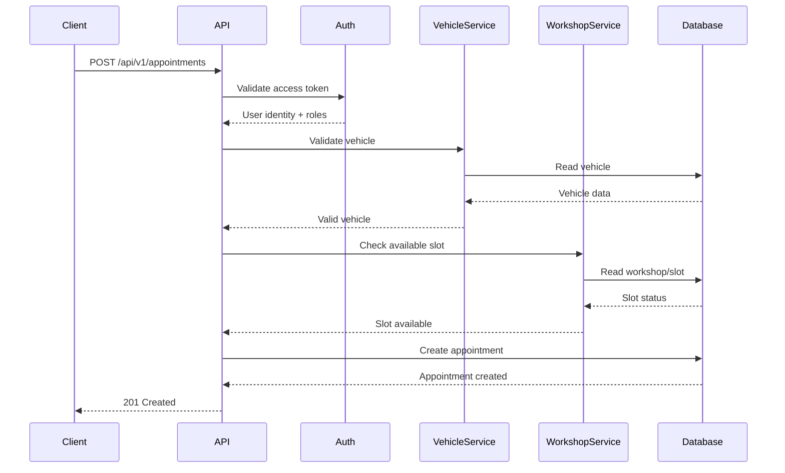

# API Technical Specification

## 1. Overview

### 1.1 API Name

`[Tên API]`

### 1.2 Purpose

Mô tả ngắn gọn API này dùng để làm gì.

> Ví dụ: API dùng để tạo một lịch hẹn bảo dưỡng cho một phương tiện của người dùng tại trung tâm dịch vụ.

### 1.3 Endpoint

```http
[HTTP_METHOD] /api/v1/[resource]
```

### 1.4 HTTP Method

| Property       | Value                   |
| -------------- | ----------------------- |
| Method         | `POST`                  |
| Endpoint       | `/api/v1/[resource]`    |
| Authentication | Required / Not Required |
| Authorization  | Required / Not Required |

### 1.5 Scope

**In Scope**

* [Chức năng 1]
* [Chức năng 2]

**Out of Scope**

* [Chức năng không thuộc API này]
* [Chức năng được xử lý bởi API khác]

---

# 2. Authentication & Authorization

## 2.1 Authentication

Mô tả cách client xác thực với API.

Ví dụ:

```http
Authorization: Bearer <access_token>
```

## 2.2 Allowed Roles

| Role              | Access    |
| ----------------- | --------- |
| `USER`            | ✅ Allowed |
| `SERVICE_ADVISOR` | ✅ Allowed |
| `ADMIN`           | ✅ Allowed |
| `ANONYMOUS`       | ❌ Denied  |

## 2.3 Authorization Rules

Mô tả các điều kiện để user được phép gọi API.

Ví dụ:

* User phải đăng nhập.
* User chỉ được thao tác với vehicle thuộc về tài khoản của mình.
* `SERVICE_ADVISOR` chỉ được thao tác với appointment thuộc workshop của mình.
* `ADMIN` có quyền truy cập toàn bộ dữ liệu.

---

# 3. Request

## 3.1 Request Overview

Mô tả mục đích của request và cách client gửi dữ liệu.

### Request Headers

| Field           | Type     | Required | Description          |
| --------------- | -------- | -------: | -------------------- |
| `Authorization` | `string` |      Yes | Bearer access token  |
| `Content-Type`  | `string` |      Yes | Request content type |

### Request Body

```json
{
  "vehicleId": "vehicle_123",
  "workshopId": "workshop_001",
  "maintenancePackageId": "package_20k",
  "appointmentTime": "2026-09-30T09:00:00Z",
  "note": "Kiểm tra thêm hệ thống phanh"
}
```

---

## 3.2 Request Fields

| Field                  | Type       | Required | Nullable | Description              | Constraints   |
| ---------------------- | ---------- | -------: | -------: | ------------------------ | ------------- |
| `vehicleId`            | `string`   |      Yes |       No | ID của phương tiện       | Must exist    |
| `workshopId`           | `string`   |      Yes |       No | ID của trung tâm dịch vụ | Must exist    |
| `maintenancePackageId` | `string`   |      Yes |       No | Gói bảo dưỡng            | Must exist    |
| `appointmentTime`      | `datetime` |      Yes |       No | Thời gian đặt lịch       | ISO-8601      |
| `note`                 | `string`   |       No |      Yes | Ghi chú của người dùng   | Max 500 chars |

---

## 3.3 Field Technical Specification

### `vehicleId`

| Property   | Value     |
| ---------- | --------- |
| Type       | `string`  |
| Required   | Yes       |
| Nullable   | No        |
| Format     | UUID / ID |
| Min Length | `[N]`     |
| Max Length | `[N]`     |
| Default    | None      |

**Meaning**

ID duy nhất của phương tiện mà người dùng muốn đặt lịch.

**Constraints**

* Vehicle phải tồn tại.
* Vehicle phải thuộc quyền sở hữu / quản lý của user hiện tại.
* Vehicle không được ở trạng thái `DELETED`.

---

### `workshopId`

| Property | Value    |
| -------- | -------- |
| Type     | `string` |
| Required | Yes      |
| Nullable | No       |
| Format   | ID       |
| Default  | None     |

**Meaning**

ID của trung tâm dịch vụ nơi người dùng muốn thực hiện bảo dưỡng.

**Constraints**

* Workshop phải tồn tại.
* Workshop phải ở trạng thái `ACTIVE`.
* Workshop phải hỗ trợ loại dịch vụ được yêu cầu.

---

### `appointmentTime`

| Property | Value      |
| -------- | ---------- |
| Type     | `datetime` |
| Required | Yes        |
| Nullable | No         |
| Format   | ISO-8601   |
| Timezone | UTC        |

**Meaning**

Thời gian người dùng mong muốn đặt lịch.

**Constraints**

* Phải lớn hơn thời gian hiện tại.
* Không được nằm ngoài thời gian hoạt động của workshop.
* Slot phải còn khả dụng.
* Không được đặt lịch quá giới hạn `[N]` ngày trong tương lai.

---

# 4. Request Validation

Mô tả các rule được kiểm tra trước khi xử lý business logic.

| Validation        | Rule                        | Error             |
| ----------------- | --------------------------- | ----------------- |
| Required field    | Field bắt buộc phải tồn tại | `400 Bad Request` |
| Data type         | Đúng kiểu dữ liệu           | `400 Bad Request` |
| Vehicle existence | Vehicle phải tồn tại        | `404 Not Found`   |
| Vehicle ownership | Vehicle phải thuộc user     | `403 Forbidden`   |
| Workshop status   | Workshop phải active        | `400 Bad Request` |
| Appointment slot  | Slot phải còn trống         | `409 Conflict`    |

---

# 5. Internal Processing

Phần này mô tả API hoạt động như thế nào ở phía backend.

## 5.1 Processing Flow



---

## 5.2 Processing Steps

### Step 1 — Authenticate User

* Validate `access_token`.
* Extract:

  * `userId`
  * `role`
  * `permissions`

### Step 2 — Validate Request

Kiểm tra:

* Required fields
* Data type
* Format
* Business constraints

### Step 3 — Load Vehicle

Read entity:

`Vehicle`

Conditions:

```text
vehicle.id = request.vehicleId
AND vehicle.ownerId = currentUser.id
```

### Step 4 — Load Workshop

Read entity:

`Workshop`

Check:

```text
workshop.status = ACTIVE
```

### Step 5 — Check Availability

Read:

`WorkshopSchedule`

`TechnicianSchedule`

`Appointment`

Kiểm tra:

* Workshop capacity
* Technician capacity
* Existing appointment
* Required service duration

### Step 6 — Create Appointment

Create:

`Appointment`

### Step 7 — Update Related Data

Có thể cập nhật:

* `Appointment`
* `Vehicle`
* `WorkshopSchedule`

### Step 8 — Publish Event

Ví dụ:

```text
AppointmentCreated
```

Event có thể được gửi tới:

* Notification Service
* AI Agent
* Workshop Management System

---

# 6. Database / Entity Interaction

## 6.1 Entities Used

| Entity / Table     | Operation     | Purpose              |
| ------------------ | ------------- | -------------------- |
| `User`             | Read          | Xác định user        |
| `Vehicle`          | Read          | Kiểm tra phương tiện |
| `Workshop`         | Read          | Kiểm tra workshop    |
| `WorkshopSchedule` | Read          | Kiểm tra slot        |
| `Appointment`      | Read / Insert | Kiểm tra và tạo lịch |
| `Notification`     | Insert        | Tạo thông báo        |

---

## 6.2 Read Data

### `Vehicle`

```text
SELECT
    id,
    owner_id,
    model,
    version,
    status
FROM vehicle
WHERE id = :vehicleId
  AND owner_id = :currentUserId;
```

### `Workshop`

```text
SELECT
    id,
    status,
    operating_hours
FROM workshop
WHERE id = :workshopId;
```

---

## 6.3 Write Data

### Create `Appointment`

```text
INSERT INTO appointment (
    id,
    user_id,
    vehicle_id,
    workshop_id,
    appointment_time,
    status,
    created_at
)
VALUES (...);
```

---

## 6.4 Database Transaction

Mô tả transaction nếu API yêu cầu atomic operation.

Ví dụ:

```text
BEGIN TRANSACTION

1. Check appointment slot
2. Create appointment
3. Update workshop capacity

COMMIT
```

Nếu một bước thất bại:

```text
ROLLBACK
```

---

# 7. Business Logic

Mô tả các business rule chính của API.

### Rule 1 — Vehicle Ownership

```text
vehicle.ownerId == currentUser.id
```

Nếu không đúng:

```text
403 Forbidden
```

### Rule 2 — Appointment Slot

```text
requestedSlot.available == true
```

Nếu slot đã được sử dụng:

```text
409 Conflict
```

### Rule 3 — Appointment Time

```text
appointmentTime > currentTime
```

Nếu không:

```text
400 Bad Request
```

---

# 8. Error Handling

## 8.1 Error Response Standard

Tất cả lỗi nên có response format thống nhất.

```json
{
  "error": {
    "code": "VEHICLE_NOT_FOUND",
    "message": "Vehicle was not found.",
    "details": null,
    "traceId": "abc-123"
  }
}
```

---

## 8.2 Error Cases

| Case                   | Error Code                     | HTTP Status | Description              |
| ---------------------- | ------------------------------ | ----------: | ------------------------ |
| Missing required field | `INVALID_REQUEST`              |       `400` | Request thiếu field      |
| Invalid format         | `INVALID_FIELD_FORMAT`         |       `400` | Sai format dữ liệu       |
| Invalid business rule  | `INVALID_BUSINESS_RULE`        |       `400` | Không thỏa business rule |
| Authentication failed  | `UNAUTHORIZED`                 |       `401` | Token không hợp lệ       |
| Permission denied      | `FORBIDDEN`                    |       `403` | User không có quyền      |
| Vehicle not found      | `VEHICLE_NOT_FOUND`            |       `404` | Vehicle không tồn tại    |
| Workshop not found     | `WORKSHOP_NOT_FOUND`           |       `404` | Workshop không tồn tại   |
| Slot unavailable       | `APPOINTMENT_SLOT_UNAVAILABLE` |       `409` | Slot đã được đặt         |
| Database error         | `DATABASE_ERROR`               |       `500` | Lỗi database             |
| Internal error         | `INTERNAL_SERVER_ERROR`        |       `500` | Lỗi hệ thống             |

---

# 9. HTTP Status Codes

|                 HTTP Status | Meaning               | When                                                    |
| --------------------------: | --------------------- | ------------------------------------------------------- |
|                    `200 OK` | Success               | API trả về dữ liệu thành công                           |
|               `201 Created` | Resource created      | Tạo resource thành công                                 |
|            `204 No Content` | Success without body  | Operation thành công nhưng không trả body               |
|           `400 Bad Request` | Invalid request       | Request không hợp lệ                                    |
|          `401 Unauthorized` | Authentication failed | Chưa xác thực / token invalid                           |
|             `403 Forbidden` | Permission denied     | Không có quyền                                          |
|             `404 Not Found` | Resource not found    | Không tìm thấy resource                                 |
|              `409 Conflict` | Resource conflict     | Conflict về trạng thái/resource                         |
|  `422 Unprocessable Entity` | Validation failed     | Dữ liệu hợp lệ về format nhưng không hợp lệ về semantic |
| `500 Internal Server Error` | Internal error        | Lỗi hệ thống                                            |
|   `503 Service Unavailable` | Service unavailable   | Dependency/service tạm thời không khả dụng              |

---

# 10. Response

## 10.1 Success Response

### HTTP Status

```http
201 Created
```

### Response Body

```json
{
  "data": {
    "appointmentId": "apt_123",
    "vehicleId": "vehicle_123",
    "workshopId": "workshop_001",
    "appointmentTime": "2026-09-30T09:00:00Z",
    "status": "CONFIRMED",
    "createdAt": "2026-09-23T06:35:08Z"
  }
}
```

---

# 11. Response Fields

| Field             | Type       | Nullable | Description         |
| ----------------- | ---------- | -------: | ------------------- |
| `appointmentId`   | `string`   |       No | ID của lịch hẹn     |
| `vehicleId`       | `string`   |       No | ID phương tiện      |
| `workshopId`      | `string`   |       No | ID workshop         |
| `appointmentTime` | `datetime` |       No | Thời gian hẹn       |
| `status`          | `string`   |       No | Trạng thái lịch hẹn |
| `createdAt`       | `datetime` |       No | Thời điểm tạo       |

---

## 11.1 Response Field Details

### `appointmentId`

| Property    | Value                             |
| ----------- | --------------------------------- |
| Type        | `string`                          |
| Nullable    | No                                |
| Format      | ID                                |
| Description | Unique identifier của appointment |

### `status`

| Property       | Value                               |
| -------------- | ----------------------------------- |
| Type           | `string`                            |
| Nullable       | No                                  |
| Allowed Values | `PENDING`, `CONFIRMED`, `CANCELLED` |
| Description    | Trạng thái hiện tại của appointment |

---

# 12. Error Response Examples

## 12.1 Invalid Request

```http
400 Bad Request
```

```json
{
  "error": {
    "code": "INVALID_REQUEST",
    "message": "vehicleId is required.",
    "details": {
      "field": "vehicleId"
    },
    "traceId": "abc-123"
  }
}
```

## 12.2 Unauthorized

```http
401 Unauthorized
```

```json
{
  "error": {
    "code": "UNAUTHORIZED",
    "message": "Authentication is required.",
    "traceId": "abc-124"
  }
}
```

## 12.3 Forbidden

```http
403 Forbidden
```

```json
{
  "error": {
    "code": "FORBIDDEN",
    "message": "You do not have permission to access this vehicle.",
    "traceId": "abc-125"
  }
}
```

## 12.4 Conflict

```http
409 Conflict
```

```json
{
  "error": {
    "code": "APPOINTMENT_SLOT_UNAVAILABLE",
    "message": "The selected appointment slot is no longer available.",
    "traceId": "abc-126"
  }
}
```

---

# 13. Idempotency

API có yêu cầu idempotency hay không:

```text
Required: Yes / No
```

Nếu có:

```http
Idempotency-Key: <unique-key>
```

Mô tả:

* Client tạo key như thế nào
* Backend lưu key ở đâu
* Thời gian hiệu lực
* Behavior khi request được gửi lại

---

# 14. Concurrency / Race Condition

Mô tả các trường hợp nhiều request cùng thao tác trên một resource.

Ví dụ:

```text
User A ----> Book Slot A
User B ----> Book Slot A
```

Backend phải đảm bảo chỉ một request được tạo appointment thành công.

Giải pháp:

* Database transaction
* Optimistic locking
* Pessimistic locking
* Unique constraint
* Distributed lock

---

# 15. External Dependencies

| Service                | Purpose              | Required |
| ---------------------- | -------------------- | -------: |
| Authentication Service | Authenticate user    |      Yes |
| Vehicle Service        | Vehicle information  |      Yes |
| Workshop Service       | Workshop information |      Yes |
| Notification Service   | Send notification    |       No |
| AI Service             | AI processing        |       No |

---

# 16. Observability

## Logging

Các thông tin cần log:

* `requestId`
* `traceId`
* `userId`
* API endpoint
* HTTP method
* Response status
* Processing time

Không log:

* Password
* Access token
* Sensitive personal information

## Metrics

Theo dõi:

* Request count
* Error rate
* Response latency
* Dependency latency
* Database latency

---

# 17. Performance Requirements

| Metric                | Target      |
| --------------------- | ----------- |
| Average response time | `< 300 ms`  |
| P95 latency           | `< 800 ms`  |
| P99 latency           | `< 1500 ms` |
| Throughput            | `[N] req/s` |

Các chỉ số trên cần được điều chỉnh theo yêu cầu thực tế của hệ thống.

---

# 18. Retry & Timeout

## Timeout

```text
API timeout: [N] seconds
Database timeout: [N] seconds
External service timeout: [N] seconds
```

## Retry

| Dependency   | Retry | Max Attempts | Backoff     |
| ------------ | ----: | -----------: | ----------- |
| Database     |   Yes |            3 | Exponential |
| Notification |   Yes |            3 | Exponential |
| AI Service   |   Yes |            2 | Exponential |

---

# 19. Versioning

```http
/api/v1/[resource]
```

Quy tắc versioning:

* Breaking change → tạo API version mới.
* Non-breaking change → có thể cập nhật trong version hiện tại.

---

# 20. Example Request

```http
POST /api/v1/appointments
Authorization: Bearer <token>
Content-Type: application/json
```

```json
{
  "vehicleId": "vehicle_123",
  "workshopId": "workshop_001",
  "maintenancePackageId": "package_20k",
  "appointmentTime": "2026-09-30T09:00:00Z",
  "note": "Kiểm tra hệ thống phanh"
}
```

---

# 21. Example Success Response

```http
HTTP/1.1 201 Created
```

```json
{
  "data": {
    "appointmentId": "apt_123",
    "vehicleId": "vehicle_123",
    "workshopId": "workshop_001",
    "appointmentTime": "2026-09-30T09:00:00Z",
    "status": "CONFIRMED",
    "createdAt": "2026-09-23T06:35:08Z"
  }
}
```

---

# 22. Example Error Response

```http
HTTP/1.1 409 Conflict
```

```json
{
  "error": {
    "code": "APPOINTMENT_SLOT_UNAVAILABLE",
    "message": "The selected appointment slot is no longer available.",
    "traceId": "abc-126"
  }
}
```

---

# 23. Change Log

| Version | Date       | Author   | Changes                |
| ------- | ---------- | -------- | ---------------------- |
| `v1.0`  | YYYY-MM-DD | [Author] | Initial version        |
| `v1.1`  | YYYY-MM-DD | [Author] | Updated request fields |

---

# 24. Open Questions

* [ ] Câu hỏi / vấn đề cần quyết định
* [ ] Dependency chưa xác định
* [ ] Business rule chưa rõ
* [ ] Database design chưa hoàn thiện

---

# 25. References

* PRD: `[link]`
* Related API: `[link]`
* Database Design: `[link]`
* Architecture Document: `[link]`
* GitHub Issue: `[link]`
