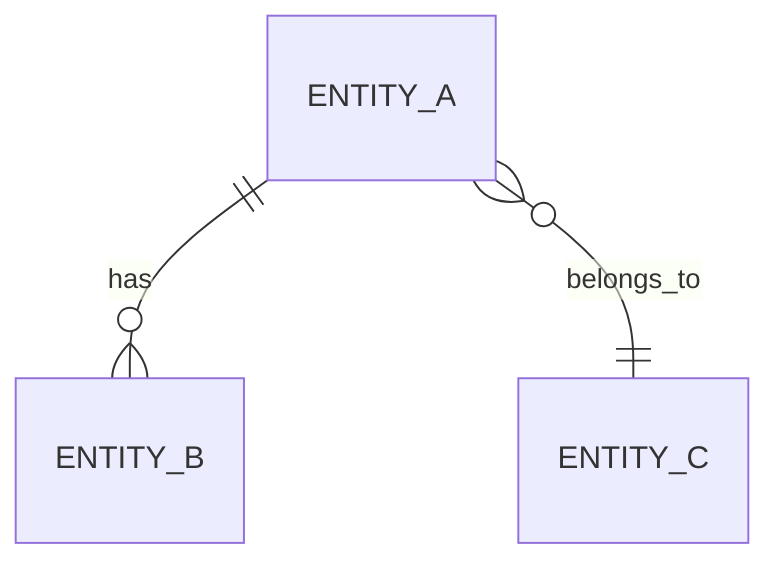
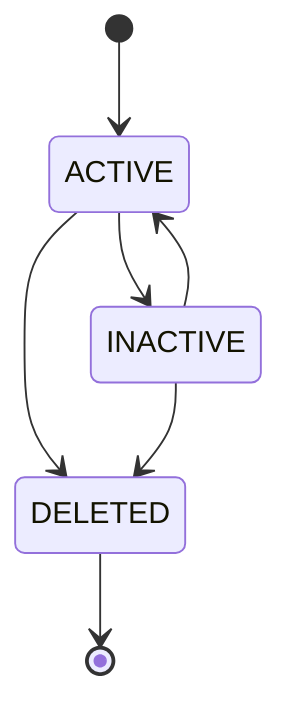

# Entity Specification

## 1. Entity Information

| Field         | Value                                    |
| ------------- | ---------------------------------------- |
| Entity ID     | `ENT-XXX`                                |
| Entity Name   | `[Entity Name]`                          |
| Business Name | `[Tên nghiệp vụ]`                        |
| Version       | `v1.0`                                   |
| Status        | `Draft / Review / Approved / Deprecated` |
| Owner         | `[Team / Person]`                        |
| Created Date  | `YYYY-MM-DD`                             |
| Updated Date  | `YYYY-MM-DD`                             |

---

# 2. Entity Overview

## 2.1 Description

`[Mô tả ngắn gọn entity này đại diện cho đối tượng gì trong hệ thống.]`

## 2.2 Business Purpose

`[Entity này được sử dụng để phục vụ nghiệp vụ nào?]`

## 2.3 Scope

**In Scope**

* `[Scope 1]`
* `[Scope 2]`

**Out of Scope**

* `[Out of scope 1]`

---

# 3. Business Meaning

## Definition

`[Định nghĩa nghiệp vụ chính xác của entity.]`

## Example

`[Ví dụ về entity trong thực tế.]`

## Terminology

* Related term: `[Term]`
* See glossary: `[Link]`

---

# 4. Identity & Keys

## 4.1 Primary Key

| Field | Type     | Description       |
| ----- | -------- | ----------------- |
| `id`  | `string` | Unique identifier |

### Rules

* Must be unique.
* Must not be null.
* Format: `[UUID / ULID / Custom ID]`

## 4.2 Candidate / Unique Keys

| Field     | Unique | Description                   |
| --------- | -----: | ----------------------------- |
| `vin`     |    Yes | Vehicle identification number |
| `[field]` |     No | `[Description]`               |

---

# 5. Attributes

| Field       | Type       | Required | Nullable | Default      | Description   | Constraints        |
| ----------- | ---------- | -------: | -------: | ------------ | ------------- | ------------------ |
| `id`        | `string`   |      Yes |       No | -            | Unique ID     | Unique             |
| `name`      | `string`   |      Yes |       No | -            | Name          | Max 255 chars      |
| `status`    | `enum`     |      Yes |       No | `ACTIVE`     | Current state | See Status section |
| `createdAt` | `datetime` |      Yes |       No | Current time | Creation time | UTC                |
| `updatedAt` | `datetime` |      Yes |       No | Current time | Last update   | UTC                |

---

# 6. Attribute Details

## `fieldName`

| Property   | Value       |
| ---------- | ----------- |
| Type       | `string`    |
| Required   | Yes         |
| Nullable   | No          |
| Format     | `[Format]`  |
| Default    | `[Default]` |
| Min Length | `[N]`       |
| Max Length | `[N]`       |

### Business Meaning

`[Field này có ý nghĩa gì?]`

### Constraints

* `[Constraint 1]`
* `[Constraint 2]`

---

# 7. Relationships

## 7.1 Relationship Overview



## 7.2 Relationship Details

| Related Entity | Relationship | Cardinality | Description               |
| -------------- | ------------ | ----------- | ------------------------- |
| `User`         | owns         | 1:N         | Một user có nhiều entity  |
| `Workshop`     | belongs to   | N:1         | Entity thuộc một workshop |

### Relationship Rules

* `[Relationship rule 1]`
* `[Relationship rule 2]`

---

# 8. Entity Lifecycle / State

## 8.1 States

| State      | Meaning                |
| ---------- | ---------------------- |
| `ACTIVE`   | Entity đang hoạt động  |
| `INACTIVE` | Entity tạm ngưng       |
| `DELETED`  | Entity đã bị xóa logic |

## 8.2 State Transition



## 8.3 Transition Rules

* `ACTIVE → INACTIVE`: `[Condition]`
* `INACTIVE → ACTIVE`: `[Condition]`
* `ACTIVE → DELETED`: `[Condition]`

---

# 9. Business Rules & Constraints

## BR-ENT-001

**Rule**

`[Business rule]`

**Condition**

`[Condition]`

**Expected Behavior**

`[Expected behavior]`

---

## BR-ENT-002

**Rule**

`[Business rule]`

---

# 10. Data Integrity

## Required Relationships

`[Mô tả các relationship bắt buộc.]`

## Referential Integrity

* `[Rule]`
* `[Rule]`

## Uniqueness

* `[Field]` must be unique.
* `[Composite fields]` must be unique.

## Validation

* `[Validation rule]`

---

# 11. Index & Query Requirements

> Mô tả nhu cầu truy vấn ở mức logical. Chi tiết database-specific index được triển khai trong technical design.

| Query          | Fields    | Frequency | Required Index |
| -------------- | --------- | --------- | -------------- |
| Find by owner  | `ownerId` | High      | Yes            |
| Find by status | `status`  | Medium    | Yes            |
| Find by ID     | `id`      | High      | Primary Key    |

### Important Query Patterns

```text
1. Find entity by ownerId
2. Find active entities
3. Find entity by unique identifier
```

---

# 12. Ownership & Authorization

| Actor / Role | Read | Create | Update | Delete |
| ------------ | ---: | -----: | -----: | -----: |
| `USER`       |    ✅ |      ✅ |      ✅ |      ❌ |
| `ADMIN`      |    ✅ |      ✅ |      ✅ |      ✅ |

## Ownership Rule

`[Mô tả entity thuộc user / organization / workshop nào.]`

## Authorization Rules

* `[Rule 1]`
* `[Rule 2]`

---

# 13. Audit Fields

| Field       | Type       | Description        |
| ----------- | ---------- | ------------------ |
| `createdAt` | `datetime` | Creation timestamp |
| `createdBy` | `string`   | Creator            |
| `updatedAt` | `datetime` | Last update        |
| `updatedBy` | `string`   | Last updater       |

---

# 14. Data Source & Ownership

| Data             | Source System | Owner              | Sync Type |
| ---------------- | ------------- | ------------------ | --------- |
| `[Field / Data]` | `[System]`    | `[Team / Partner]` | Real-time |
| `[Field / Data]` | `[System]`    | `[Team / Partner]` | Batch     |

## Source of Truth

`[System nào là source of truth cho entity này?]`

---

# 15. Data Sensitivity & Security

| Field   | Classification          | Notes    |
| ------- | ----------------------- | -------- |
| `phone` | Personal Data           | `[Rule]` |
| `email` | Personal Data           | `[Rule]` |
| `vin`   | Business / Vehicle Data | `[Rule]` |

## Security Rules

* `[Encryption requirement]`
* `[Access restriction]`
* `[Masking requirement]`

---

# 16. Retention & Deletion

## Retention

`[Dữ liệu được lưu trong bao lâu?]`

## Deletion Strategy

`Hard Delete / Soft Delete / Archive`

## Deletion Rules

* `[Rule]`
* `[Dependency handling]`

---

# 17. Example Data

```json
{
  "id": "vehicle_123",
  "ownerId": "user_001",
  "vin": "XXXXXXXXXXXXXXXXX",
  "model": "VF6",
  "version": "Plus",
  "status": "ACTIVE",
  "createdAt": "2026-09-23T06:35:08Z",
  "updatedAt": "2026-09-23T06:35:08Z"
}
```

---

# 18. API References

## Used By

* `GET /api/v1/vehicles/{vehicleId}`
* `POST /api/v1/vehicles`
* `PATCH /api/v1/vehicles/{vehicleId}`

## Related API Specification

* `[Link to API spec]`

---

# 19. Related Entities

| Entity        | Relationship  | Reference |
| ------------- | ------------- | --------- |
| `User`        | owns          | `[Link]`  |
| `Maintenance` | has           | `[Link]`  |
| `Appointment` | referenced by | `[Link]`  |

---

# 20. Related Functional Specifications

* `[Feature / Functional Spec]`

---

# 21. Open Questions

| ID      | Question     | Owner     | Status |
| ------- | ------------ | --------- | ------ |
| `Q-001` | `[Question]` | `[Owner]` | Open   |

---

# 22. Change Log

| Version | Date         | Author     | Changes         |
| ------- | ------------ | ---------- | --------------- |
| `v1.0`  | `YYYY-MM-DD` | `[Author]` | Initial version |

---

# 23. Approval

| Role               | Name     | Status  | Date         |
| ------------------ | -------- | ------- | ------------ |
| Product / Business | `[Name]` | Pending | `YYYY-MM-DD` |
| Technical Owner    | `[Name]` | Pending | `YYYY-MM-DD` |
| Data Owner         | `[Name]` | Pending | `YYYY-MM-DD` |
