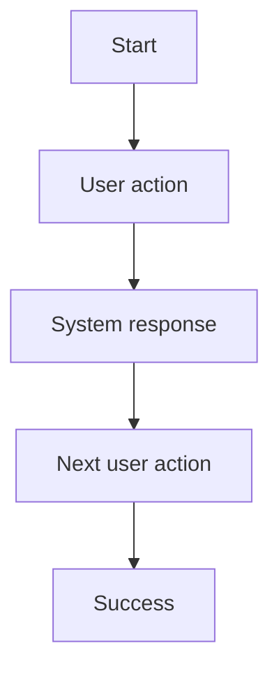
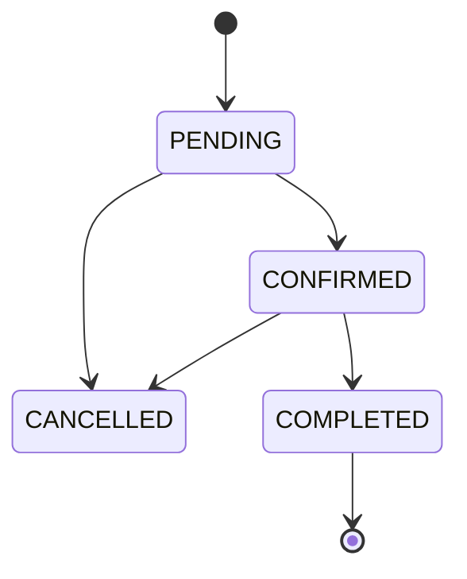

# Functional Specification

> Tài liệu đặc tả chức năng/nghiệp vụ cho một Feature hoặc Use Case cụ thể.
>
> **Mục đích:** tạo một nguồn thống nhất về nghiệp vụ giữa Product, Stakeholder, Designer, Frontend, Backend, AI và các bên đối tác.
>
> **Nguyên tắc:** tài liệu này mô tả **feature phải hoạt động như thế nào về mặt nghiệp vụ**. Không đi quá sâu vào implementation của frontend/backend. Chi tiết kỹ thuật được tham chiếu sang Frontend Specification và API Specification.

---

# 1. Document Information

| Field | Value |
|---|---|
| Feature ID | `FEAT-XXX` |
| Feature Name | `[Tên feature]` |
| Document Version | `v1.0` |
| Status | `Draft / Review / Approved / Deprecated` |
| Product / Project | `[Tên sản phẩm]` |
| Business Owner | `[Tên / Team]` |
| Author | `[Tên]` |
| Reviewer | `[Tên / Team]` |
| Stakeholders | `[Các bên liên quan]` |
| Created Date | `YYYY-MM-DD` |
| Updated Date | `YYYY-MM-DD` |
| Related PRD | `[Link]` |
| Related Frontend Spec | `[Link]` |
| Related API Spec | `[Link]` |
| Related Design / Figma | `[Link]` |
| Related GitHub Issue | `[Link]` |

---

# 2. Feature Overview

## 2.1 Feature Description

> Mô tả ngắn gọn feature là gì, người dùng làm được gì và hệ thống hỗ trợ gì.

`[Mô tả feature]`

## 2.2 Business Objective

> Feature này giải quyết vấn đề nghiệp vụ nào?

`[Business objective]`

## 2.3 User Objective

> Người dùng đạt được điều gì sau khi sử dụng feature?

`[User objective]`

## 2.4 Business Value

`[Giá trị mang lại cho người dùng / doanh nghiệp / đối tác]`

---

# 3. Scope

## 3.1 In Scope

- `[Scope item 1]`
- `[Scope item 2]`
- `[Scope item 3]`

## 3.2 Out of Scope

- `[Out of scope item 1]`
- `[Out of scope item 2]`

---

# 4. Actors & Stakeholders

## 4.1 Actors

| Actor | Type | Responsibility |
|---|---|---|
| `[Actor]` | User / System / Partner | `[Vai trò]` |
| `[Actor]` | User / System / Partner | `[Vai trò]` |

## 4.2 Stakeholders

| Stakeholder | Organization / Team | Interest / Responsibility |
|---|---|---|
| `[Stakeholder]` | `[Team / Partner]` | `[Vai trò]` |
| `[Stakeholder]` | `[Team / Partner]` | `[Vai trò]` |

---

# 5. User Story

## US-001

**As a** `[user / actor]`

**I want to** `[action / capability]`

**So that** `[benefit / outcome]`

### Additional User Stories

- `US-002`: `[User story]`
- `US-003`: `[User story]`

---

# 6. Use Case

## UC-001 — [Use Case Name]

### 6.1 Use Case Description

`[Mô tả use case]`

### 6.2 Primary Actor

`[Actor]`

### 6.3 Supporting Actors / Systems

- `[System 1]`
- `[System 2]`

### 6.4 Trigger

`[Sự kiện kích hoạt use case]`

### 6.5 Preconditions

- `[Điều kiện 1]`
- `[Điều kiện 2]`

### 6.6 Postconditions

- `[Kết quả sau khi thành công]`
- `[State / data thay đổi]`

---

# 7. User Flow

## 7.1 Main User Flow



## 7.2 Flow Description

| Step | Actor | Action / Event | System Response | Result |
|---|---|---|---|---|
| 1 | User | `[Action]` | `[System response]` | `[Result]` |
| 2 | System | `[Event]` | `[System response]` | `[Result]` |
| 3 | User | `[Action]` | `[System response]` | `[Result]` |

---

# 8. Screen / UI Flow

> UI trong tài liệu này dùng để giúp stakeholder hiểu **nghiệp vụ và hành vi của feature**. Không thay thế Frontend Specification.

## 8.1 Screen Flow

```text
[Screen A]
    |
    v
[Screen B]
    |
    +----> [Screen C]
    |
    +----> [Error State]
```

## 8.2 Screen List

| Screen ID | Screen Name | Purpose | Entry From | Exit To |
|---|---|---|---|---|
| `SCR-001` | `[Screen]` | `[Purpose]` | `[Entry]` | `[Exit]` |
| `SCR-002` | `[Screen]` | `[Purpose]` | `[Entry]` | `[Exit]` |

## 8.3 Screen / UI Reference

### SCR-001 — [Screen Name]

**Purpose**

`[Mục đích màn hình]`

**Main UI**

- `[Component / UI element]`
- `[Component / UI element]`

**Business Meaning**

`[UI này biểu diễn điều gì về mặt nghiệp vụ?]`

**User Action**

`[Người dùng có thể làm gì?]`

**System Behavior**

`[Hệ thống phản ứng thế nào?]`

**Design Reference**

`[Figma / Screenshot / Design link]`

---

# 9. Main Flow

## 9.1 Happy Path

1. `[Step 1]`
2. `[Step 2]`
3. `[Step 3]`
4. `[Step 4]`
5. `[Expected successful result]`

---

# 10. Alternative Flow

## AF-001 — [Alternative Scenario]

**Condition**

`[Điều kiện để đi vào alternative flow]`

**Flow**

1. `[Step]`
2. `[Step]`
3. `[Step]`

**Expected Result**

`[Kết quả]`

---

# 11. Exception Flow

## EF-001 — [Exception Scenario]

**Condition**

`[Điều kiện lỗi / exception]`

**System Behavior**

`[Hệ thống phải xử lý thế nào]`

**User Experience**

`[Người dùng nhìn thấy / có thể làm gì]`

**Recovery**

`[Retry / fallback / alternative action]`

---

# 12. Business Rules

> Business Rule là các quy tắc nghiệp vụ phải được mọi implementation tuân theo.

## BR-001 — [Rule Name]

**Rule**

`[Nội dung business rule]`

**Condition**

`[When / IF]`

**Expected Behavior**

`[THEN]`

**Priority**

`High / Medium / Low`

---

## BR-002 — [Rule Name]

**Rule**

`[Nội dung business rule]`

**Condition**

`[Condition]`

**Expected Behavior**

`[Expected behavior]`

---

# 13. State / Status

> Sử dụng phần này khi feature hoặc entity có vòng đời / trạng thái.

## 13.1 State List

| State | Meaning | Entry Condition | Exit Condition |
|---|---|---|---|
| `PENDING` | `[Meaning]` | `[Condition]` | `[Condition]` |
| `CONFIRMED` | `[Meaning]` | `[Condition]` | `[Condition]` |
| `CANCELLED` | `[Meaning]` | `[Condition]` | `[Condition]` |

## 13.2 State Transition



---

# 14. Data Requirements

> Chỉ mô tả dữ liệu cần cho nghiệp vụ. Không thay thế Database Design hoặc API Specification.

## 14.1 Required Data

| Data | Type | Required | Description | Source |
|---|---|---:|---|---|
| `[Data field]` | `string` | Yes | `[Meaning]` | `[System]` |
| `[Data field]` | `number` | No | `[Meaning]` | `[System]` |

## 14.2 Data Dependency

| Data / Entity | Why Needed | Read / Write | Owner |
|---|---|---|---|
| `[Entity]` | `[Purpose]` | Read | `[System]` |
| `[Entity]` | `[Purpose]` | Write | `[System]` |

---

# 15. Business Error & Edge Cases

> Mô tả hệ thống phải làm gì về mặt nghiệp vụ. HTTP status và API error code được định nghĩa trong API Specification.

| Case ID | Scenario | Expected Business Behavior | User Outcome |
|---|---|---|---|
| `EDGE-001` | `[Scenario]` | `[System behavior]` | `[User outcome]` |
| `EDGE-002` | `[Scenario]` | `[System behavior]` | `[User outcome]` |
| `EDGE-003` | `[Scenario]` | `[System behavior]` | `[User outcome]` |

---

# 16. Permissions & Access

## 16.1 Access Matrix

| Role / Actor | View | Create | Update | Delete | Notes |
|---|---:|---:|---:|---:|---|
| `USER` | ✅ | ✅ | ✅ | ❌ | `[Rule]` |
| `SERVICE_ADVISOR` | ✅ | ✅ | ✅ | ✅ | `[Rule]` |
| `ADMIN` | ✅ | ✅ | ✅ | ✅ | `[Rule]` |

## 16.2 Business Authorization Rules

- `[Authorization rule 1]`
- `[Authorization rule 2]`

> Chi tiết authentication mechanism, token, role claim, policy implementation... tham chiếu API Specification / Security Specification.

---

# 17. Acceptance Criteria

> Acceptance Criteria phải có thể kiểm thử được.

## AC-001 — [Acceptance Criteria Name]

**Given**

`[Initial condition]`

**When**

`[User / system action]`

**Then**

`[Expected result]`

---

## AC-002 — [Acceptance Criteria Name]

**Given**

`[Initial condition]`

**When**

`[Action]`

**Then**

`[Expected result]`

---

# 18. Non-functional Expectations

> Chỉ ghi những kỳ vọng nghiệp vụ / product ở đây. Chi tiết kỹ thuật nằm trong technical specifications.

| Requirement | Expected Behavior |
|---|---|
| Availability | `[Expected availability]` |
| Response Experience | `[Expected user experience]` |
| Notification Timing | `[Expected timing]` |
| Duplicate Handling | `[Expected behavior]` |

---

# 19. Dependencies

| Dependency | Purpose | Owner | Required | Related Document |
|---|---|---|---:|---|
| `[System / Partner]` | `[Purpose]` | `[Owner]` | Yes | `[Link]` |
| `[System / Partner]` | `[Purpose]` | `[Owner]` | No | `[Link]` |

---

# 20. Assumptions

> Các giả định đang được sử dụng để xây dựng đặc tả.

- `[Assumption 1]`
- `[Assumption 2]`
- `[Assumption 3]`

---

# 21. Business Constraints

> Các giới hạn / quy định mà feature bắt buộc phải tuân theo.

- `[Constraint 1]`
- `[Constraint 2]`
- `[Constraint 3]`

---

# 22. Terminology / Glossary

> Đây là business vocabulary dùng thống nhất giữa Product, Stakeholder, Partner, Design và Engineering.

| Term ID | Term | Vietnamese Name | Definition | Example / Notes |
|---|---|---|---|---|
| `TERM-001` | `[English term]` | `[Vietnamese term]` | `[Definition]` | `[Example]` |
| `TERM-002` | `[English term]` | `[Vietnamese term]` | `[Definition]` | `[Example]` |

### Important Terminology Rules

- `[Term]` luôn được sử dụng với ý nghĩa `[definition]`.
- Không sử dụng `[alternative term]` để thay thế `[standard term]`.
- `[Business-specific terminology rule]`.

---

# 23. Partner / Stakeholder Notes

> Dành cho những điểm cần thống nhất với đối tác hoặc stakeholder.

## 23.1 Confirmed

- `[Confirmed business decision]`
- `[Confirmed partner behavior]`

## 23.2 Pending Confirmation

- `[Question / pending decision]`
- `[Question / pending decision]`

---

# 24. Open Questions

| ID | Question | Owner | Status | Decision / Due Date |
|---|---|---|---|---|
| `Q-001` | `[Question]` | `[Owner]` | Open | `[Decision]` |
| `Q-002` | `[Question]` | `[Owner]` | Open | `[Decision]` |

---

# 25. Traceability

> Liên kết feature với requirement, business rule, implementation và test.

| Item | Reference |
|---|---|
| PRD | `[Link]` |
| User Story | `US-001` |
| Use Case | `UC-001` |
| Business Rules | `BR-001`, `BR-002` |
| Acceptance Criteria | `AC-001`, `AC-002` |
| Frontend Specification | `[Link]` |
| API Specification | `[Link]` |
| Test Cases | `[Link]` |
| GitHub Issue / Epic | `[Link]` |

---

# 26. Related Documents

- [PRD](`[Link]`)
- [Frontend Specification](`[Link]`)
- [API Specification](`[Link]`)
- [Design / Figma](`[Link]`)
- [Test Specification](`[Link]`)
- [Architecture / Technical Design](`[Link]`)

---

# 27. Change Log

| Version | Date | Author | Change |
|---|---|---|---|
| `v1.0` | `YYYY-MM-DD` | `[Author]` | Initial version |
| `v1.1` | `YYYY-MM-DD` | `[Author]` | `[Change description]` |

---

# 28. Approval

| Role | Name | Status | Date |
|---|---|---|---|
| Product Owner | `[Name]` | Pending / Approved | `YYYY-MM-DD` |
| Business Stakeholder | `[Name]` | Pending / Approved | `YYYY-MM-DD` |
| Technical Owner | `[Name]` | Pending / Approved | `YYYY-MM-DD` |

---

# Appendix A — Feature Example Structure

> Phần này chỉ để tham khảo cách điền tài liệu. Có thể xóa khi tạo tài liệu thực tế.

```text
Feature:
AI nhắc lịch bảo dưỡng

Business Objective:
Giúp chủ xe không bỏ lỡ mốc bảo dưỡng khuyến nghị.

Primary Actor:
Vehicle Owner

Trigger:
Hệ thống phát hiện xe sắp đạt mốc bảo dưỡng.

Main Flow:
1. Hệ thống kiểm tra dữ liệu xe.
2. Xác định xe sắp đến hạn.
3. Tạo maintenance reminder.
4. Gửi notification cho user.
5. User mở reminder.
6. User xem hạng mục và chi phí dự kiến.
7. User có thể chuyển sang đặt lịch.

Business Rules:
BR-001: Reminder được tạo khi xe nằm trong ngưỡng cảnh báo.
BR-002: Một milestone không tạo duplicate reminder trong cùng chu kỳ.
BR-003: Vehicle không active không được tạo reminder.

Acceptance Criteria:
AC-001: Khi vehicle đạt điều kiện cảnh báo, reminder phải được tạo.
AC-002: User nhìn thấy reminder trên màn hình phù hợp.
AC-003: User có thể chuyển từ reminder sang maintenance detail.
```

---

# Appendix B — Documentation Boundary

Tài liệu này **không nên chứa implementation detail** đã được mô tả ở tài liệu kỹ thuật.

```text
Functional Specification
    ├── Business meaning
    ├── User Story
    ├── Use Case
    ├── User Flow
    ├── UI representation
    ├── Business Rules
    ├── State
    ├── Acceptance Criteria
    └── Business terminology

Frontend Specification
    ├── Component
    ├── State management
    ├── UI behavior
    ├── Validation
    ├── Loading
    ├── Empty state
    ├── Error UI
    ├── Navigation
    └── API integration

API Specification
    ├── Endpoint
    ├── HTTP Method
    ├── Request
    ├── Validation
    ├── Authorization
    ├── Internal Processing
    ├── Database / Entity
    ├── Error handling
    └── Response
```

---

# Appendix C — Recommended GitHub File Structure

```text
docs/
├── prd/
│   └── product-requirements.md
│
├── functional/
│   ├── maintenance-reminder.md
│   ├── maintenance-cost-estimation.md
│   ├── appointment-booking.md
│   └── repair-progress.md
│
├── frontend/
│   ├── maintenance-reminder.md
│   ├── appointment-booking.md
│   └── repair-progress.md
│
└── api/
    ├── maintenance/
    │   ├── get-reminder.md
    │   └── get-cost-estimate.md
    └── appointment/
        ├── create-appointment.md
        ├── get-appointment.md
        └── cancel-appointment.md
```
